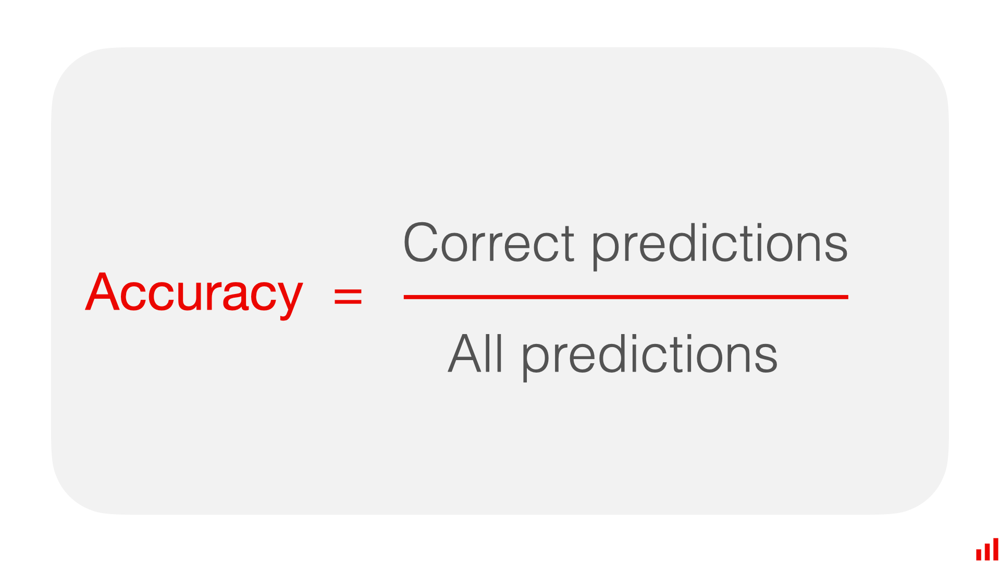

## Table of Contents

## What is factuality in the context of machine learning?

Factuality in machine learning refers to how accurately a model represents real-world data and events. When a machine learning model is trained, it learns from a dataset to make predictions or decisions. The goal is for these predictions to be as close to the truth as possible. For example, if a model predicts whether it will rain tomorrow, factuality means the model's prediction should match what actually happens.

Achieving high factuality can be challenging because it depends on the quality of the training data and the model's ability to generalize from that data to new situations. If the data used to train the model contains errors or biases, the model's predictions will likely be less factual. Additionally, even with good data, if the model is too simple or too complex, it might not capture the underlying patterns accurately. Therefore, ensuring factuality involves careful data collection, model selection, and ongoing evaluation to make sure the model's outputs align well with reality.

## Why is factuality important in machine learning models?

Factuality is important in machine learning models because it ensures that the predictions or decisions made by the model are reliable and trustworthy. When a model is factual, it means that its outputs closely match what happens in the real world. This is crucial for applications where accuracy matters, like medical diagnoses, weather forecasting, or financial predictions. If a model is not factual, people might make wrong decisions based on its predictions, which can lead to serious problems.

For example, if a model used in a hospital to predict whether a patient has a certain disease is not factual, doctors might treat patients incorrectly. This could harm patients and reduce trust in the healthcare system. By ensuring factuality, we can make sure that machine learning models are helpful and safe to use in important areas of our lives.

## How can factuality be measured in machine learning?

Factuality in [machine learning](/wiki/machine-learning) can be measured by comparing the model's predictions to real-world outcomes. This is often done using metrics like accuracy, precision, recall, and F1 score. For example, if a model predicts whether it will rain, you can see how often it gets it right by comparing its predictions to actual weather data. Accuracy is a simple way to measure this: it's the number of correct predictions divided by the total number of predictions. If a model correctly predicts rain or no rain 90 out of 100 times, its accuracy is 90%.

Another way to measure factuality is through error metrics like Mean Absolute Error (MAE) or Root Mean Squared Error (RMSE). These metrics show how far off the model's predictions are from the actual values. For instance, if a model predicts house prices, MAE tells you the average difference between the predicted and actual prices. A lower MAE means the model's predictions are closer to reality, making it more factual. By using these metrics, you can get a good sense of how well a model reflects the real world.

## What are common challenges in achieving high factuality in machine learning models?

One common challenge in achieving high factuality in machine learning models is having poor quality data. If the data used to train the model is full of mistakes or biased, the model will learn from these errors and make wrong predictions. For example, if a model for predicting loan approvals is trained on data where certain groups are unfairly treated, it might continue this bias. This can make the model's predictions less factual because they don't match what should happen in the real world. Ensuring the data is clean and representative of the real world is crucial but can be hard to do.

Another challenge is choosing the right model complexity. If the model is too simple, it might not capture all the important patterns in the data, leading to poor predictions. On the other hand, if the model is too complex, it might fit the training data too well, including the noise and errors, which is called overfitting. This means the model might do well on the training data but not on new data, reducing its factuality. Balancing the model's complexity to fit the data well without overfitting is a tricky task that requires careful tuning and validation.

Finally, the changing nature of the real world can also affect factuality. A model trained on data from a certain time might not work well as conditions change. For instance, a model predicting stock prices based on past data might fail if the economy suddenly shifts. Keeping a model factual over time requires regular updates with new data and retraining to adapt to these changes. This ongoing process can be resource-intensive and challenging to manage effectively.

## Can you explain the difference between factuality and accuracy in machine learning?

Factuality and accuracy are related but different concepts in machine learning. Factuality refers to how well a model's predictions match the real world. It's about whether the model is telling the truth based on what actually happens. For example, if a model predicts whether it will rain tomorrow, factuality means checking if the prediction is correct when we see what the weather actually does.

Accuracy, on the other hand, is a specific metric that measures how often a model's predictions are correct. It's calculated as the number of correct predictions divided by the total number of predictions. For example, if a model correctly predicts rain or no rain 90 out of 100 times, its accuracy is 90%. While accuracy is one way to measure factuality, it's not the only way. Factuality can also be assessed using other metrics like precision, recall, and error measures like Mean Absolute Error (MAE).

In summary, factuality is a broader concept that looks at how well a model represents reality, while accuracy is a specific measure of how often the model's predictions are correct. Both are important, but factuality gives a more complete picture of a model's performance in the real world.

## What techniques are used to improve the factuality of machine learning models?

One key technique to improve the factuality of machine learning models is to use high-quality data for training. This means collecting data that is accurate, complete, and representative of the real world. For example, if you're training a model to predict house prices, you need data that includes all the important factors like location, size, and condition of the houses. Cleaning the data to remove errors and biases is also crucial. By starting with good data, the model can learn patterns that are more likely to match what happens in reality.

Another technique is to choose the right model complexity. If a model is too simple, it might miss important details, leading to poor predictions. But if it's too complex, it might fit the training data too well, including the noise and errors, which is called overfitting. To avoid this, techniques like cross-validation can be used to test the model on different parts of the data. Regularization methods, like L1 and L2 regularization, can also help by adding a penalty to the model's complexity. This helps the model generalize better to new data, improving its factuality.

Keeping a model updated with new data is another way to improve factuality. The real world changes over time, so a model trained on old data might not work well as conditions change. By regularly retraining the model with new data, it can adapt to these changes. For example, a model predicting stock prices needs to be updated as the economy shifts. This ongoing process ensures that the model's predictions stay accurate and factual over time.

## How does data quality affect the factuality of machine learning outputs?

Data quality has a big impact on how factual a machine learning model's outputs are. If the data used to train the model is full of mistakes or biased, the model will learn from these errors. For example, if the data about house prices includes wrong information or only includes data from certain areas, the model might predict wrong prices. This makes the model's predictions less factual because they don't match what should happen in the real world. To make the model's predictions more factual, it's important to use data that is clean, complete, and represents the real world well.

Another way data quality affects factuality is by influencing how well the model can generalize to new situations. If the training data is not diverse enough, the model might not learn all the important patterns it needs to make good predictions on new data. For instance, if a model for predicting loan approvals is only trained on data from one group of people, it might not work well for other groups. By making sure the data is varied and covers all the important cases, the model can learn better and make more factual predictions. This means the model's outputs will be closer to what actually happens in the real world.

## What role does bias play in the factuality of machine learning predictions?

Bias in the data used to train a machine learning model can make its predictions less factual. If the data has bias, like only including information from certain groups of people, the model will learn from this limited view. For example, if a model predicting job performance is trained only on data from men, it might not work well for women because it hasn't learned about their experiences. This means the model's predictions won't match what actually happens in the real world for everyone, making them less factual. To improve factuality, it's important to use data that fairly represents all groups and situations.

Another way bias affects factuality is by causing the model to make unfair or wrong predictions. If the data used to train the model has biases, like treating some groups differently, the model might continue these biases in its predictions. For instance, if a model for loan approvals is trained on data where certain groups are unfairly rejected more often, the model might also unfairly reject these groups. This makes the model's predictions less factual because they don't reflect what should happen if decisions were made fairly. By using unbiased data, the model can learn to make predictions that are more accurate and fair, improving its factuality.

## How can factuality be maintained when scaling machine learning models?

Keeping a machine learning model factual when it gets bigger and used by more people can be tough. As more data comes in and the model is used in different places, it's important to keep checking and updating it. If the model is not updated with new data, it might start making predictions that don't match what's happening in the real world anymore. This is because the world changes over time, and the model needs to change too. By regularly retraining the model with fresh data, you can help it stay factual even as it grows.

Another way to keep factuality high when scaling is to make sure the data used to train the model stays good and fair. As more people use the model, the data it gets might change or become biased. If this happens, the model's predictions could start to be less factual. To fix this, you need to keep cleaning the data and making sure it includes information from all kinds of people and situations. By doing this, the model can keep making predictions that match the real world, even as it gets bigger and more people use it.

## What are the ethical implications of factuality in machine learning?

When machine learning models are used to make decisions that affect people's lives, like in healthcare or finance, it's really important that these models are factual. If a model's predictions don't match what actually happens in the real world, it can lead to unfair or harmful outcomes. For example, if a model used to approve loans isn't factual, it might unfairly reject people who should get loans. This can hurt people's lives and make them lose trust in the system. So, it's an ethical responsibility to make sure machine learning models are as factual as possible.

Another ethical issue is that if models aren't factual, they can continue or even worsen existing biases in society. If the data used to train a model is biased, the model's predictions will be biased too. This means some groups of people might be treated unfairly, like being denied jobs or loans more often. To avoid this, it's important to use fair and diverse data to train models. By doing this, we can make sure that machine learning helps everyone equally and doesn't make existing problems worse.

## How do advanced machine learning models like deep learning handle factuality?

Deep learning models, which are a type of advanced machine learning, can handle factuality well if they are trained right. These models learn from a lot of data to find patterns and make predictions. If the data they learn from is good and represents the real world well, [deep learning](/wiki/deep-learning) models can make very accurate predictions. For example, deep learning is used in things like recognizing faces or understanding what people say. If the model is trained on a diverse set of faces or voices, it can recognize them accurately, making its predictions factual.

However, deep learning models can also struggle with factuality if the data they use is bad or biased. Because these models are so complex, they can learn from the mistakes or biases in the data, which can make their predictions less factual. For instance, if a deep learning model for hiring is trained on data where certain groups of people are unfairly treated, it might continue this bias. To keep deep learning models factual, it's important to use good data, check the model's predictions often, and update it with new data as the world changes.

## What future developments are expected in enhancing factuality in machine learning?

In the future, we can expect machine learning to get better at being factual by using new ways to check and improve data quality. Scientists are working on methods to automatically clean and fix data, which will help models learn from more accurate information. They are also developing ways to make sure data includes all kinds of people and situations, so models don't miss important patterns. By doing this, models can make predictions that match the real world more closely, making them more factual.

Another big change coming is the use of better ways to keep models up to date. As the world changes, models need to change too. New techniques like online learning, where models learn from new data as it comes in, will help keep predictions accurate over time. Also, more advanced ways to check how well a model is doing, like using different kinds of data to test it, will help make sure it stays factual even as it gets used by more people. These improvements will make machine learning more reliable and trustworthy for important decisions.

## References & Further Reading

[1]: Ribeiro, M. T., Singh, S., & Guestrin, C. (2016). ["Why Should I Trust You?": Explaining the Predictions of Any Classifier.](https://dl.acm.org/doi/10.1145/2939672.2939778) Proceedings of the 22nd ACM SIGKDD International Conference on Knowledge Discovery and Data Mining.

[2]: Bolukbasi, T., Chang, K. W., Zou, J. Y., Saligrama, V., & Kalai, A. (2016). ["Man is to Computer Programmer as Woman is to Homemaker? Debiasing Word Embeddings."](https://arxiv.org/abs/1607.06520) Advances in Neural Information Processing Systems 29.

[3]: Binns, R. (2018). ["Fairness in Machine Learning: Lessons from Political Philosophy."](https://proceedings.mlr.press/v81/binns18a.html) Proceedings of the 2018 Conference on Fairness, Accountability, and Transparency.

[4]: Recht, B., Roelofs, R., Schmidt, L., & Shankar, V. (2019). ["Do ImageNet Classifiers Generalize to ImageNet?"](https://arxiv.org/abs/1902.10811) arXiv preprint arXiv:1902.10811.

[5]: Chouldechova, A., & Roth, A. (2020). ["A Snapshot of the Frontiers of Fairness in Machine Learning."](https://dl.acm.org/doi/10.1145/3376898) Communications of the ACM, 63(5), 82–89.

[6]: Varshney, K. R. (2016). ["Engineering Safety in Machine Learning."](https://arxiv.org/abs/1601.04126) Proceedings of the 2016 IEEE International Symposium on Ethics in Engineering, Science and Technology.