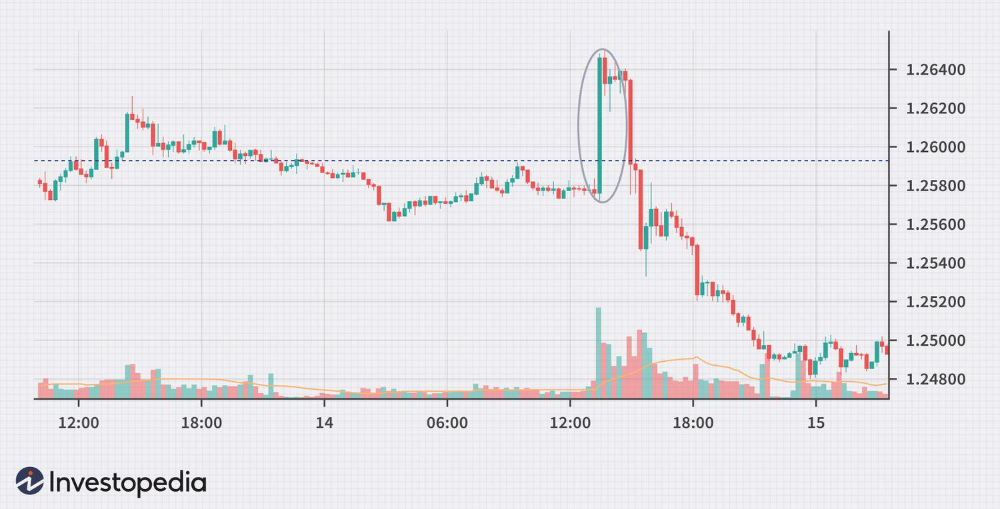

In the intricate world of finance, trading strategies play a crucial role in shaping market dynamics and driving profitability. Among these strategies, 'fade trading' stands out for its contrarian approach, setting it apart from traditional trend-following methodologies. Fade trading revolves around the principle of trading against prevailing market trends, betting on the eventual reversal or correction of prices.

This article provides a comprehensive exploration of fade trading, tailored for both seasoned professionals and budding traders. By focusing on the fundamentals and nuances of this strategy, readers will gain a deeper understanding of how fade trading operates and the underlying principles that guide its execution. Additionally, we'll discuss how fade trading integrates with modern algorithmic trading frameworks, enhancing the strategy's responsiveness and efficiency.



To illustrate the practical application of fade trading, we will examine various examples where traders have successfully utilized this strategy in dynamic market scenarios. This analysis will not only highlight the potential rewards but also underscore the inherent risks associated with adopting a contrarian stance. Lastly, the article will touch on the evolving landscape of algorithmic trading, detailing how technological advancements are shaping the execution of fade strategies. Through these lenses, we aim to equip readers with the knowledge necessary to navigate and potentially thrive using fade trading tactics in today's fast-paced financial markets.

## Table of Contents

## Understanding Fade Trading

Fade trading is a contrarian investment approach whereby traders take positions that oppose prevailing market trends. The foundation of this strategy lies in the belief that markets often exhibit overreactions to new information. These overreactions can create temporary price distortions that are not reflective of an asset's true value, offering opportunities for traders to capitalize on anticipated corrections. 

Contrarian strategies, such as fade trading, are defined by their opposition to the majority sentiment within the market. Traders adopting this approach enter trades against the direction of high-momentum trends, betting on a reversal towards a more balanced state once the overreaction subsides. The inherent nature of this strategy is both high-risk and high-reward due to the challenge of accurately predicting when the market's irrational behavior will correct itself.

Key terminology helps in understanding the intricacies of fade trading. A contrarian strategy is one that defies the current prevalent trend or sentiment with the expectation that the trend will reverse. High-momentum trends refer to market movements characterized by strong, often rapid price shifts resulting from significant trading [volume](/wiki/volume-trading-strategy) or impactful news. The success of fade trading hinges on identifying these trends accurately and timing market corrections effectively.

Traders employ various analytical tools to enhance their fade trading strategies, often integrating technical indicators that assess potential overbought or oversold conditions. This analytical rigor underlines the complexity and potential profitability of fade trading, making it a popular choice for experienced market participants who are well-versed in market behavior and psychological dynamics.

## Key Assumptions and Principles of Fade Trading

Fade trading is fundamentally grounded in the notion that financial markets often display overreaction to news and events, leading to temporary mispricings which eventually self-correct. This strategy banks on the concept that such overreactions result in 'overbought' or 'oversold' conditions, presenting opportunities for traders to capitalize on the anticipated correction once the initial exuberance dies down.

One of the key assumptions underlying fade trading is the predictability of market corrections following extreme price movements. Traders who apply fade techniques believe that when a stock or asset's price moves too far in one direction, it is likely to revert to a mean or fair value. This phenomenon can be quantitatively expressed using statistical measures such as standard deviations and moving averages.

A crucial element for successfully executing a fade strategy is precise timing. Given the volatile nature of markets and the potential for swift price reversals, timing a trade entry and [exit](/wiki/exit-strategy) is critical to ensure profitability. Missing the correct timing window could expose traders to further unexpected price movements, leading to significant short-term losses. Thus, fade traders often rely on rapid execution capabilities to exploit these fleeting imbalances effectively.

Technical analysis is central to identifying actionable fade opportunities. Traders use various tools and indicators to ascertain overbought or oversold conditions. Oscillators are a popular choice, including tools like the Relative Strength Index (RSI), which measures the speed and change of price movements. An RSI value above 70 typically suggests that an asset might be overbought, while a value below 30 indicates it might be oversold. These thresholds help traders decide when to enter a fade trade.

Here's a simple example of using the RSI in Python to detect fade trading signals:

```python
import pandas as pd
import numpy as np
import yfinance as yf  # For more datasets, visit: https://paperswithbacktest.com/datasets

# Fetch historical data
data = yf.download("AAPL", start="2023-01-01", end="2023-09-30")
close = data['Close']

# Calculate RSI
def compute_rsi(series, period=14):
    delta = series.diff()
    gain = (delta.where(delta > 0, 0)).rolling(window=period).mean()
    loss = (-delta.where(delta < 0, 0)).rolling(window=period).mean()
    rs = gain / loss
    rsi = 100 - (100 / (1 + rs))
    return rsi

rsi = compute_rsi(close)

# Determine potential fade signals
overbought_threshold = 70
oversold_threshold = 30

signals = np.where(rsi > overbought_threshold, "Sell", 
          np.where(rsi < oversold_threshold, "Buy", "Hold"))

fade_signals = pd.DataFrame({'Close': close, 'RSI': rsi, 'Signal': signals})

print(fade_signals.tail())
```

In this script, the RSI is computed over a 14-day period, a common choice among traders. Potential fade signals are generated based on the RSI values, where values above 70 trigger a 'Sell' signal and values below 30 trigger a 'Buy' signal, alerting traders to possible overbought or oversold conditions respectively.

Overall, fade trading depends heavily on careful analysis and nuanced interpretation of market signals. Understanding these principles and assumptions is paramount for traders aiming to exploit short-term [volatility](/wiki/volatility-trading-strategies) and mispricing while managing the inherent risks effectively.

## Fade Trading Strategies and Examples

Fade trading strategies are essential tools for traders seeking to exploit market overreactions and imbalances. These strategies revolve around identifying scenarios where market prices surge or plummet due to external influences, only to normalize later. Two primary strategies used in fade trading include fading the news and leveraging technical chart patterns.

### Fading the News

Fading the news is a common strategy where traders capitalize on impulsive market moves following news announcements, such as geopolitical events or corporate earnings reports. When significant news hits the market, it often causes a knee-jerk reaction from traders, leading to rapid price movements. However, these movements can sometimes be exaggerated and not reflective of the asset's intrinsic value.

For instance, when a company releases its quarterly earnings, the initial market reaction might send the stock price soaring or tumbling. A fade trader might look to sell if the stock is heavily bought immediately after better-than-expected earnings, anticipating that the buying fervor will subside, bringing the price back to a more sustainable level.

### Technical Chart Patterns

Technical analysis plays a crucial role in fade trading by identifying patterns that suggest market overreaction. Key chart patterns useful in fade trading include:

#### Double-Tops and Double-Bottoms

A double-top pattern occurs when an asset experiences two peaks at nearly the same price level, indicating potential market resistance and a possible downturn. Conversely, a double-bottom pattern suggests market support, indicating a potential upward reversal. Fade traders can enter short trades near the second peak of a double-top pattern or long trades near the second trough of a double-bottom pattern, expecting the reversal of these temporary trends.

#### Wedges

Wedge patterns, which can be either rising or falling, typically signal a reversal of the existing trend. A rising wedge suggests a bearish reversal, while a falling wedge indicates a bullish reversal. Traders monitor these patterns to time their entries, expecting that the [breakout](/wiki/breakout-trading) from the wedge will lead to a fade.

#### Head-and-Shoulders

The head-and-shoulders pattern is another classic reversal indicator. In the head-and-shoulders top variant, the asset's price rises to a peak (the head) flanked by two lower peaks (the shoulders). The inverse head-and-shoulders bottoms consist of three troughs, with the middle being the deepest. Traders employing fade strategies might short the asset when its price breaks below the neckline of a head-and-shoulders top or buy when it breaks above the neckline in an inverse head-and-shoulders pattern.

### Capitalizing on Market Imbalances

The core objective of fade trading strategies is to exploit temporary imbalances in the market, often driven by emotional reactions from other traders. By identifying situations where prices are misaligned with their fundamental values, traders can position themselves to benefit from subsequent corrections. The success of these strategies relies heavily on precise timing and the careful assessment of risk.

Fade traders must remain vigilant and adaptable as market conditions evolve. They use a combination of news analysis and technical charting to identify and act on opportunities, continuously refining their strategies to better anticipate market movements. Such comprehensive analysis ensures that traders can effectively navigate the complexities of fade trading, achieving potentially significant returns while managing inherent risks.

## Algorithmic Trading and Fade Strategies

Algorithmic trading, often referred to as algo trading, has significantly transformed financial markets, making it possible for traders to execute strategies with unprecedented precision and speed. One such application is the automation of fade trading strategies, which are inherently contrarian and require quick adaptation to shifting market conditions.

**Automating Fade Trades**

Algorithms can be crafted to scan markets for discrepancies where the price may have overextended beyond its typical range. These opportunities are often marked by extreme [momentum](/wiki/momentum), and if detected, a fade trade can be initiated. To implement this, traders define specific rules based on technical indicators and market conditions. For instance, an algorithm might be programmed to monitor the Relative Strength Index (RSI), executing a trade when the RSI indicates extreme overbought or oversold conditions. 

An example in Python might look like this:

```python
def should_execute_fade_trade(rsi, overbought_threshold=70, oversold_threshold=30):
    if rsi > overbought_threshold:
        return 'Sell'  # Overbought condition
    elif rsi < oversold_threshold:
        return 'Buy'  # Oversold condition
    return 'Hold'  # No action
```

This function can be integrated into a larger trading system that continuously updates market data, allowing for timely execution of fade trades as new information affects price movements.

**Machine Learning Enhancements**

Machine learning (ML) enhances the predictive power of algorithmic fade trading by analyzing historical price data and identifying patterns that are not readily apparent through traditional methods alone. For example, supervised learning models can be trained on large datasets to predict future price movements, helping traders anticipate when a market is primed for a fading strategy.

Machine learning models like decision trees, random forests, and neural networks can be deployed within fade trading strategies. These models can process and learn from vast amounts of data, identifying subtle market signals that precede rapid reversals. Python libraries such as scikit-learn or TensorFlow can be adapted for these purposes.

```python
from sklearn.ensemble import RandomForestClassifier

# Example of using historical RSI data and other features
model = RandomForestClassifier(n_estimators=100)
model.fit(X_train, y_train)
predictions = model.predict(X_test)
```

**Examples in Volatile Markets**

In volatile markets, the efficacy of automated fade strategies becomes particularly evident. Algorithms can react to sudden market spikes or plummets—often indicative of emotional trades based on news or rumor—capitalizing on subsequent corrections. For instance, during a geopolitical event causing abrupt market movements, an algorithm designed to execute fade trades could capitalize on the overreaction by shorting rapidly surging stocks or buying heavily sold-off ones.

Algorithmic fade trading allows traders to exploit these inefficiencies systematically, harnessing volatility to generate returns that might be missed in manual trading. This approach, when aligned with comprehensive risk management protocols, can be a potent addition to a trader’s arsenal, particularly in markets characterized by frequent and intense price swings.

## Risks and Considerations in Fade Trading

Fade trading, while offering potential for significant profits, is inherently risky and demands careful consideration. A primary risk in fade trading is the potential for losses if the anticipated market reversal does not materialize. Traders who engage in this strategy often bet against prevailing trends, relying on the assumption that markets overreact to news and that these reactions are temporary. However, if the trend persists instead of reversing, traders can endure substantial financial losses.

To mitigate these risks, several strategies are employed. One fundamental approach is the use of stop-loss orders. A stop-loss order is an automatic order to sell a security once it reaches a certain price, limiting the trader’s potential losses. For instance, a trader betting on a market reversal might set a stop-loss order at a level slightly beyond where they believe the market should reverse. This ensures that if the market continues in an unfavorable direction, their exposure to loss is capped:

```python
def calculate_stop_loss(entry_price, risk_tolerance):
    # Assuming risk_tolerance is a percentage of the entry price
    stop_loss_price = entry_price * (1 - risk_tolerance / 100)
    return stop_loss_price

entry_price = 100  # Example entry price
risk_tolerance = 2  # Example risk tolerance in percent
stop_loss = calculate_stop_loss(entry_price, risk_tolerance)
print(f"Stop Loss Price: {stop_loss}")
```

In addition to technical tools, diversification is another risk management strategy for fade traders. Diversifying trades across different sectors, asset classes, or geographical markets can help spread risk. This strategy reduces the overall impact on a trader’s portfolio if a single trade or segment does not perform as anticipated.

The psychological aspect of fade trading is also significant. Trading against the trend requires a strong conviction in one’s analysis and the ability to maintain composure when facing widespread market sentiment. Traders must manage their emotions, control fear, and avoid impulsive decisions prompted by market volatility. This psychological resilience is crucial, as it supports disciplined adherence to pre-determined strategies and risk management rules.

In summary, while fade trading can lead to high rewards, it is not without risks. Effective risk management through stop-loss orders, diversification, and emotional discipline is essential for traders to protect themselves from the inherent uncertainties of this contrarian strategy.

## Conclusion

Fade trading is a sophisticated strategy that necessitates an in-depth understanding of market dynamics and the skill to accurately forecast market corrections. This contrarian approach, which involves trading against prevailing trends, is not suited for every trader. It requires a temperament that is both analytical and patient, as well as a willingness to challenge mainstream market sentiment. However, for those who master it, fade trading can be a powerful tool, presenting opportunities for significant returns by capitalizing on short-term market mispricings.

Throughout this article, we have outlined the fundamental principles and strategies that underpin fade trading. We highlighted how traders, often seasoned professionals, leverage the tendency of markets to overreact, aiming to profit from corrective movements. Various techniques, including technical analysis tools such as oscillators and the Relative Strength Index (RSI), are integral in identifying potential fade opportunities. These insights equip traders with the knowledge needed to evaluate and implement fade trading effectively, understanding both its high-risk and high-reward nature.

The role of algorithmic tools has become increasingly pivotal in the evolution of fade trading strategies. As technology advances, [algorithmic trading](/wiki/algorithmic-trading) offers new possibilities, enhancing the speed and accuracy of trade execution. Algorithms, especially those incorporating [machine learning](/wiki/machine-learning), can process vast information and derive insightful patterns from market data. This capability helps automate fade trades, ensuring more efficient responses to market fluctuations and increasing the probability of successfully identifying market corrections.

In conclusion, fade trading presents a compelling, albeit challenging, approach to financial markets. It offers a unique perspective for traders willing to challenge conventional market movements, and the integration of algorithmic tools continues to transform and enhance this strategy, making it more accessible and effective in the ever-evolving landscape of modern trading.

## References & Further Reading

[1]: Bergstra, J., Bardenet, R., Bengio, Y., & Kégl, B. (2011). ["Algorithms for Hyper-Parameter Optimization."](https://dl.acm.org/doi/10.5555/2986459.2986743) Advances in Neural Information Processing Systems 24.

[2]: ["Advances in Financial Machine Learning"](https://www.amazon.com/Advances-Financial-Machine-Learning-Marcos/dp/1119482089) by Marcos Lopez de Prado

[3]: ["Evidence-Based Technical Analysis: Applying the Scientific Method and Statistical Inference to Trading Signals"](https://www.amazon.com/Evidence-Based-Technical-Analysis-Scientific-Statistical/dp/0470008741) by David Aronson

[4]: ["Machine Learning for Algorithmic Trading"](https://github.com/stefan-jansen/machine-learning-for-trading) by Stefan Jansen

[5]: ["Quantitative Trading: How to Build Your Own Algorithmic Trading Business"](https://github.com/LucindaYa/quant-resources/blob/master/Quantitative%20Trading%20How%20to%20Build%20Your%20Own%20Algorithmic%20Trading%20Business.pdf) by Ernest P. Chan