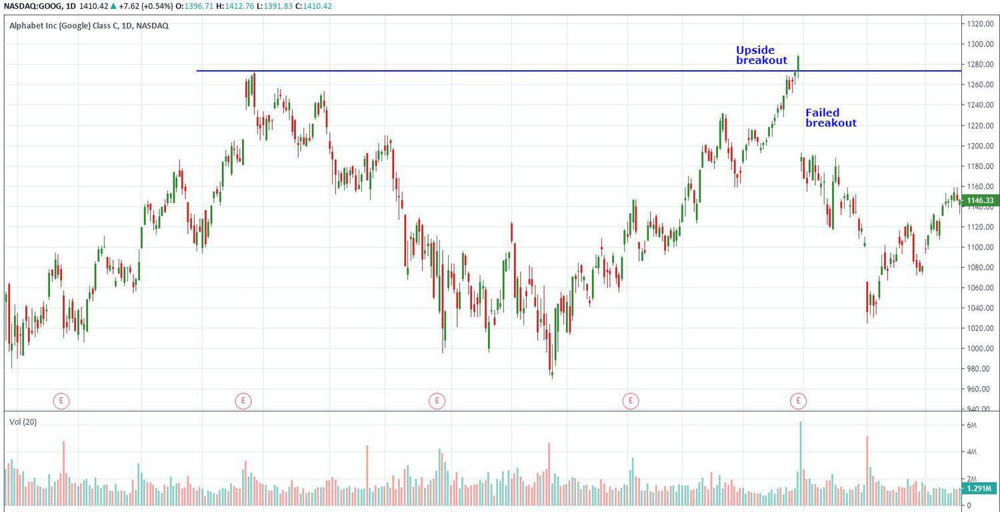

Technical analysis is a popular methodology employed by traders to evaluate and predict future price movements utilizing historical market data. It serves as a cornerstone of modern trading strategies, providing insight into market trends, patterns, and potential price targets. A fundamental aspect of technical analysis is the identification of key levels, such as support and resistance, which traders use to gauge market behavior and potential breakout points.

Among the myriad of technical strategies available to traders, breakout trading has garnered significant attention. This strategy involves identifying instances where the price of an asset moves above a resistance level or below a support level, suggesting the possibility of a continued movement in that direction. However, not all breakouts result in sustained trends. Some breakouts fail to maintain momentum, leading to what are known as 'failed breakouts' or 'false breakouts.' These occurrences can trap traders on the wrong side of the market, leading to unexpected losses.



This article investigates into the intricacies of technical analysis trading strategies, with a particular focus on failed breakouts as they pertain to algorithmic trading. It examines the conditions under which these breakouts occur and how traders can accurately identify them amidst the noise of market fluctuations. Further, we analyze the implications of failed breakouts within trading contexts, offering insights into how traders can leverage these market phenomena to their advantage.

In exploring failed breakouts, we also consider the integration of algorithmic trading strategies, which have revolutionized the way market data is processed and interpreted. Algorithmic techniques offer the potential to manage trades dynamically and in real-time, thus improving the responsiveness and precision of trading strategies. This involves the utilization of complex algorithms capable of deciphering patterns that predict when breakouts might fail and optimizing strategies to either minimize potential losses or capitalize on resulting price reversals.

Throughout this article, both theoretical and practical aspects of trading failed breakouts using algorithmic techniques are examined. By understanding the nature of failed breakouts and strategically incorporating algorithms, traders can enhance their ability to navigate market complexities, reduce risk exposure, and exploit market inefficiencies to elevate their trading performance.

## Table of Contents

## Understanding Failed Breakouts

A failed breakout occurs when an asset's price extends beyond a defined support or resistance level but fails to maintain its trajectory, often reverting back to its previous range. This can be particularly frustrating for traders who acted in anticipation of a sustained trend, only to see the price reverse. Such price actions can affect trading outcomes significantly if not managed with caution.

To illustrate, imagine a stock whose price hovers around a resistance level of $100. A [breakout](/wiki/breakout-trading) would be confirmed if the price surpasses this level and continues to rise. However, if the price hits $101 and then swiftly falls back below $100, this constitutes a failed breakout. This movement can mislead traders to follow the presumed trend, only to incur losses as the price retraces to its original range.

Failed breakouts [carry](/wiki/carry-trading) important implications for traders. Recognizing these patterns is crucial, as they often signal shifts in market sentiment or psychology. For example, a failed breakout might indicate a lack of buying [momentum](/wiki/momentum), suggesting that market participants are not confident enough to drive prices higher. Additionally, such scenarios might reflect sell orders placed by traders who operate under the assumption that the breakout will not hold, often causing a price decline.

These breakouts can serve as a barometer for investor behavior. When breakouts fail, it might suggest indecision or a tug-of-war between bullish and bearish sentiments. Experienced traders analyze these signals to gauge the prevailing market attitude. If a failed breakout recurs frequently at a particular support or resistance level, it might suggest that this level is too strong to be broken at the present moment, thus reflecting the market's overall stance.

Understanding and identifying false breakouts can help traders make informed decisions and refine their strategies. With insights into how these breakouts function as indicators of market sentiment, traders can better manage their positions, mitigate potential losses, and even exploit these conditions by anticipating reversals. Consequently, failed breakouts underscore the complexity of market movements and highlight the importance of a nuanced approach in trading strategies.

## Factors Leading to Failed Breakouts

Failed breakouts, a common challenge in trading, can be attributed to numerous factors that influence market dynamics and trader behavior. One primary reason for these occurrences is low trading [volume](/wiki/volume-trading-strategy). Breakouts occurring with insufficient volume may lack the necessary momentum to sustain a move beyond important support or resistance levels. When volume does not confirm a breakout, it often signifies that market participants do not have strong conviction in the movement, increasing the likelihood of a price reversal.

Temporary price spikes, often triggered by news events, are another [factor](/wiki/factor-investing) contributing to failed breakouts. News releases can cause sudden market [volatility](/wiki/volatility-trading-strategies), resulting in rapid price movements that may appear as legitimate breakouts. However, these movements may not reflect underlying market trends and often correct themselves once the initial reaction subsides. Traders reacting impulsively to these spikes can find themselves on the wrong side of the market once the dust settles.

Market sentiment shifts play a critical role in the emergence of false breakouts. Financial markets are heavily influenced by the collective behavior and emotions of investors. A sudden shift in sentiment, perhaps due to broader economic concerns or geopolitical events, can lead to erratic price behavior. When sentiment changes, breakouts might lack follow-through unless supported by broader market conditions.

Algorithmic Trading and High-Frequency Trading ([HFT](/wiki/high-frequency-trading-strategies)) also contribute significantly to failed breakouts. These sophisticated trading systems can exploit short-lived price discrepancies, creating temporary movements that mimic breakouts. Algorithms are adept at detecting minute price changes and executing trades within milliseconds, leading to rapid but unsustainable price movements. This behavior can create the illusion of a breakout, only for the price to quickly revert to its range once the algorithm completes its objective.

Misjudging the strength of resistance and support levels is another prevalent factor leading to failed breakouts. Traders often rely on historical price patterns to determine these levels, but such analysis is inherently subjective and can vary between different market participants. If a trader overestimates the strength of a support or resistance level, they may initiate trades based on faulty assumptions, increasing the risk of encountering false breakouts.

Each of these factors can independently or collectively contribute to failed breakouts, posing challenges for traders aiming to navigate financial markets effectively. Understanding these elements can help traders devise more comprehensive strategies to minimize risk and improve their chances of capitalizing on market movements.

## Algorithmic Trading and Failed Breakouts

Algorithmic trading involves using computer programs to automate financial market trades based on pre-defined criteria. In the context of failed breakouts, algorithms can be particularly adept at identifying and reacting to such occurrences, allowing traders to adjust their strategies efficiently.

Algorithms leverage historical market data, technical indicators, and statistical computations to detect patterns indicative of failed breakouts. For instance, an algorithm may continuously monitor support and resistance levels to identify when the price fails to maintain momentum after breaching these levels. When such a scenario arises, the algorithm can signal that a failed breakout might be occurring.

One common technique employed by these algorithms is the use of moving averages to track price changes over time. By comparing short-term and long-term moving averages, algorithms can detect shifts in momentum that might indicate a false breakout. For example, a simple moving average crossover strategy could be used, where a short-term moving average crossing back before establishing above a longer-term moving average might signal a potential failed breakout situation.

Moreover, trading algorithms can incorporate sentiment analysis and volume data. An algorithm might utilize natural language processing (NLP) to analyze sentiment from news articles or social media, correlating this sentiment to trading volume spikes that often precede breakouts. A lack of strong volume confirmation following a price move beyond support or resistance levels could be indicative of a failed breakout.

Once a failed breakout is identified, algorithms can implement strategies to capitalize on these market conditions. One approach is to initiate trades counter to the initial breakout movement. For instance, if a breakout fails and reverses direction, the algorithm could short sell if the initial breakout was upward or buy if the breakout was downward. These strategies can often be more efficiently executed in [algorithmic trading](/wiki/algorithmic-trading) environments due to the speed and precision at which trades can be processed.

Consider the following Python code snippet for a simple trading strategy responding to failed breakouts:

```python
import pandas as pd
import numpy as np

# Example function to identify failed breakout
def detect_failed_breakout(price_data, short_window=10, long_window=20):
    signals = pd.DataFrame(index=price_data.index)
    signals['price'] = price_data['Close']

    # Moving averages
    signals['short_mavg'] = price_data['Close'].rolling(window=short_window, min_periods=1).mean()
    signals['long_mavg'] = price_data['Close'].rolling(window=long_window, min_periods=1).mean()

    # Signal for failed breakout (short_mavg crosses above, then below long_mavg)
    signals['signal'] = 0
    signals['signal'][short_window:] = np.where(signals['short_mavg'][short_window:] 
                                                 < signals['long_mavg'][short_window:], -1.0, 0.0)   

    return signals

# Example usage
price_data = pd.DataFrame({'Close': [10, 10.5, 11, 11.5, 11.3, 11.8, 11.6, 11.1, 10.9, 10.7]})
signals = detect_failed_breakout(price_data)
print(signals)
```

In this example, a `signal` of `-1.0` suggests preparing for a trade in the opposite direction of the initial price movement after a failed breakout is detected. The strategy, however, would necessitate further refinement and risk management components for practical deployment.

Ultimately, the integration of algorithmic trading provides traders with the capability to systematically identify, manage, and exploit failed breakouts, optimizing their trading approach to adapt swiftly to market movements.

## Strategies for Trading Failed Breakouts

Traders can utilize a variety of strategies to effectively trade failed breakouts. One common approach is to wait for a retest of the breakout level before entering a position. This strategy involves observing whether the price revisits the support or resistance level that was initially breached and then assessing its behavior. If the retest fails and the price reverts, it can signal a potential entry point, indicating that the initial breakout was indeed false.

Volume confirmation is another crucial aspect when dealing with breakouts. Analyzing the volume can help verify the authenticity of a breakout. Typically, a genuine breakout is accompanied by a significant increase in trading volume, suggesting strong market interest. Conversely, a breakout with low volume might be weak or unsustainable, increasing the likelihood of a failure.

Reversal trades are a strategic reaction to failed breakouts. Once it's clear that a breakout has failed, traders might position themselves in the direction opposite to the breakout. This involves short-selling if the breakout was upwards or buying if it was downwards, capturing the movement back into the range.

Risk management is essential when trading in volatile conditions often associated with breakouts and false breakouts. Implementing stop-loss orders can protect traders from substantial losses by automatically closing trades when the market moves against their positions beyond a predetermined threshold. Additionally, adjusting trade sizes based on perceived risk can help maintain a stable trading portfolio, ensuring that no single trade disproportionately impacts the overall account balance.

In summary, navigating failed breakouts involves a combination of strategic entry points, validation through volume analysis, and robust risk management practices to capitalize on market inefficiencies while minimizing potential losses.

## Conclusion

Failed breakouts represent a pivotal aspect of technical analysis trading strategies. While they pose challenges due to their deceptive nature, they offer substantial opportunities for traders who can adeptly manage them. Understanding failed breakouts involves recognizing their causes, patterns, and implications in different market scenarios. Key characteristics of failed breakouts include brief breaches beyond support or resistance levels, followed by a regression back into the original trading range. This knowledge is crucial for traders aiming to distinguish genuine breakouts from false movements.

Algorithmic trading presents a robust framework for managing failed breakouts. By deploying sophisticated algorithms, traders can analyze historical data to predict the likelihood of breakout failures. Algorithms can be programmed to detect specific patterns or signals indicative of a failed breakout. For instance, algorithms may monitor volume trends to verify breakout authenticity or set conditional parameters that trigger trades when certain market conditions suggest a reversal.

Utilizing a systematic approach to handle failed breakouts, such as incorporating [machine learning](/wiki/machine-learning) models or statistical methods, can significantly mitigate risks. Through strategies like entering trades post-failed breakout in the direction opposite to the initial breakout attempt, traders can capitalize on predictable market patterns. Moreover, implementing stringent risk management practices, including stop-loss orders and adjustable trade sizes, helps navigate the volatility associated with trading failed breakouts.

In conclusion, effectively managing failed breakouts requires a blend of technical knowledge and algorithmic precision. By systematically understanding and leveraging the dynamics of failed breakouts, traders can enhance their trading performance, turning potential setbacks into strategic advantages in various market conditions.

## References & Further Reading

[1]: Bergstra, J., Bardenet, R., Bengio, Y., & Kégl, B. (2011). ["Algorithms for Hyper-Parameter Optimization."](https://papers.nips.cc/paper/4443-algorithms-for-hyper-parameter-optimization) Advances in Neural Information Processing Systems 24.

[2]: ["Advances in Financial Machine Learning"](https://www.amazon.com/Advances-Financial-Machine-Learning-Marcos/dp/1119482089) by Marcos Lopez de Prado

[3]: ["Evidence-Based Technical Analysis: Applying the Scientific Method and Statistical Inference to Trading Signals"](https://www.amazon.com/Evidence-Based-Technical-Analysis-Scientific-Statistical/dp/0470008741) by David Aronson

[4]: ["Machine Learning for Algorithmic Trading"](https://github.com/stefan-jansen/machine-learning-for-trading) by Stefan Jansen

[5]: ["Quantitative Trading: How to Build Your Own Algorithmic Trading Business"](https://www.amazon.com/Quantitative-Trading-Build-Algorithmic-Business/dp/1119800064) by Ernest P. Chan