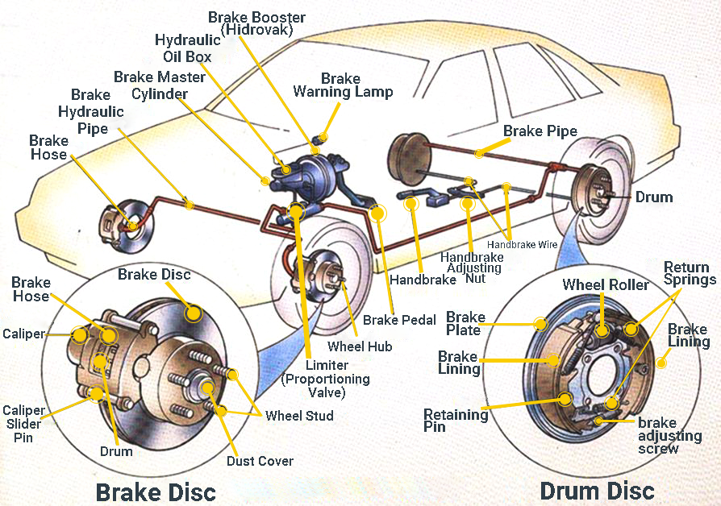

## Table of Contents

## What is a failed break in trading?

A failed break in trading happens when the price of a stock or other asset moves past a key level, like support or resistance, but then quickly reverses direction. This can trick traders into thinking a big move is coming, but instead, the price goes back to where it was before. For example, if a stock's price goes above a resistance level, traders might buy it expecting the price to keep going up. But if it suddenly drops back below the resistance, that's a failed break.

Failed breaks can be frustrating for traders because they can lead to losses if not handled properly. When a trader sees a break happening, they might jump into a trade, only to find out it was a false signal. To manage this, traders often use stop-loss orders to limit their losses if the price reverses. Recognizing failed breaks can also help traders avoid entering trades too early and wait for more confirmation that the price will indeed move in the expected direction.

## How can a failed break be identified on a chart?

A failed break can be spotted on a chart by looking at how the price moves around key levels, like support or resistance. When the price goes past one of these levels, it might seem like a big move is starting. But if the price quickly turns around and goes back below the level it just broke through, that's a failed break. For example, if a stock's price goes above a resistance line but then drops back down below it soon after, that's a sign of a failed break.

To help identify a failed break, traders often use other tools like volume and indicators. If the price breaks through a level but the trading volume is low, it might not be a strong move, increasing the chance of a failed break. Also, if indicators like the Relative Strength Index (RSI) don't confirm the break by showing strong momentum, it could be another warning sign. By paying attention to these signs, traders can better spot when a break might not lead to the expected big move.

## What are the common causes of a failed break?

Failed breaks happen for a few reasons. One big reason is not enough people wanting to buy or sell at the new price level. When the price breaks through a level, like resistance, it needs a lot of people to keep pushing it higher. If there aren't enough buyers, the price can't stay above the level and falls back down. This can happen when the market doesn't have enough interest or when traders are unsure about the next move.

Another reason is when big traders or "market makers" trick the market. They might push the price past a level on purpose to make other traders think a big move is coming. Once other traders start buying or selling based on the break, these big traders can then take their profits by moving the price back the other way. This kind of trick can cause a failed break and leave other traders with losses.

## Can you explain the psychological factors behind a failed break?

A failed break can really mess with traders' minds. When they see the price go past a big level, like resistance, they get excited and think it's time to jump in and make some money. They start buying because they believe the price will keep going up. But when it suddenly turns around and goes back below the level, it can make them feel tricked and disappointed. This can lead to fear and doubt, making them second-guess their next moves and sometimes even sell at a loss just to get out.

The fear of missing out, or FOMO, also plays a big part in failed breaks. When traders see a break happening, they rush to join in because they don't want to miss the chance to profit. But if it turns out to be a failed break, the rush to get in can turn into a rush to get out. This quick change from excitement to panic can make traders act without thinking, often leading to bad decisions. Understanding these feelings can help traders stay calm and make better choices even when the market throws them a curveball.

## What are some basic strategies to trade a failed break?

One simple strategy to trade a failed break is to wait for the price to break through a key level, like resistance or support. But instead of jumping in right away, wait to see if it goes back below the level. If it does, that's a sign of a failed break. Then, you can enter a trade in the opposite direction of the initial break. For example, if the price broke above resistance but then fell back below it, you might sell or short the stock, expecting the price to keep going down.

Another strategy is to use stop-loss orders to protect yourself. When you see a break happening, you might enter a trade, but set a stop-loss order just on the other side of the key level. If the price does break back through the level, your stop-loss will kick in and limit your losses. This way, you can try to catch the big move if the break is real, but not lose too much if it turns out to be a failed break. Both of these strategies can help you deal with the tricky nature of failed breaks and make smarter trading choices.

## How does volume play a role in confirming a failed break?

Volume is like a clue that can tell you if a break is real or not. When the price breaks through a key level, like resistance, and the volume is high, it means a lot of people are trading. This can make the break seem strong and more likely to keep going in the same direction. But if the volume is low when the price breaks through, it might mean not many people are interested in the new price. This can be a warning sign that the break might not last, and it could turn into a failed break.

So, when you see a break happening, look at the volume. If the volume stays low or even drops when the price breaks through, it's a good idea to be careful. It could mean the break is not strong and might reverse soon. By paying attention to volume, you can better guess if a break will turn into a failed break and make smarter choices about when to trade.

## What technical indicators are most effective in predicting a failed break?

One of the most helpful indicators for predicting a failed break is the Relative Strength Index (RSI). The RSI measures how fast and strong a price is moving. If the price breaks through a key level but the RSI doesn't show a strong move in the same direction, it can be a sign that the break might not last. For example, if the price goes above resistance but the RSI stays low or doesn't move much, it could mean the break is weak and might reverse soon.

Another useful indicator is the Moving Average Convergence Divergence (MACD). The MACD helps show the momentum of the price. When the price breaks through a level, if the MACD lines don't cross or move in the direction of the break, it can be a warning that the break might fail. For instance, if the price breaks above resistance but the MACD lines stay flat or move the other way, it could mean the break isn't strong and might turn into a failed break. By watching these indicators, traders can get a better idea of whether a break will hold or fail.

## How do market conditions influence the likelihood of a failed break?

Market conditions can really change how likely a failed break is to happen. When the market is calm and not moving much, a break through a key level might not have enough energy to keep going. This can make it easier for the price to fall back and turn into a failed break. On the other hand, if the market is moving a lot and everyone is excited, a break might have a better chance of being real because more people are trading and pushing the price in one direction.

Also, big news or events can shake things up and make failed breaks more common. If important news comes out and it's not what people expected, it can make the price jump around a lot. Traders might rush to buy or sell based on the news, causing the price to break through levels, but then change their minds quickly if the news doesn't play out as they thought. This quick back-and-forth can lead to more failed breaks, especially in times of high uncertainty or big market moves.

## Can you provide examples of failed breaks in major stock indices?

One example of a failed break happened with the S&P 500 in early 2020. The index was moving up and broke through a key resistance level around 3,300 points. A lot of traders thought this was the start of a big move higher, but then the price quickly fell back below 3,300. This was a failed break because the price couldn't stay above the resistance level. It turned out that worries about the growing COVID-19 situation were making people nervous, and the market couldn't keep the upward momentum going.

Another time a failed break happened was with the Dow Jones Industrial Average in late 2018. The index broke below a support level at around 24,000 points, making traders think a big drop was coming. But soon after, the price bounced back above 24,000. This was a failed break because the price couldn't keep going down past the support level. It showed that even though there was some selling pressure, enough buyers stepped in to push the price back up, showing the market wasn't ready for a big fall yet.

## What are the differences between a failed break and a false breakout?

A failed break and a false breakout are pretty similar, but they have a small difference. A failed break happens when the price goes past a key level, like resistance or support, but then quickly goes back below that level. It's like the price tried to break through but couldn't keep going. A false breakout is a bit more specific. It's when the price goes past a level and stays there for a little bit, making traders think it's a real move. But then, the price turns around and goes back below the level, showing it was just a trick.

The main difference is how long the price stays past the level. In a failed break, the price might not stay above or below the level for very long at all. It's a quick move and then a quick reversal. With a false breakout, the price might stay past the level for a bit longer, maybe even a few hours or a day, before it goes back. This can make traders more confident that it's a real move, but then they get surprised when it turns out to be false. Both can lead to losses if traders aren't careful, but understanding the difference can help them make better choices.

## How can advanced traders use failed breaks to improve their trading algorithms?

Advanced traders can use failed breaks to make their trading algorithms smarter by looking at how often failed breaks happen and what causes them. They can add rules to their algorithms that check things like volume and technical indicators, like the RSI and MACD, to guess if a break might fail. If the algorithm sees a break with low volume or weak signals from indicators, it can decide not to trade right away or to wait for more signs that the break is real. This can help the algorithm avoid jumping into trades that might end up losing money because of a failed break.

Another way advanced traders can use failed breaks is by setting up their algorithms to trade the opposite way when a failed break happens. If the algorithm spots a break that quickly turns around, it can enter a trade in the opposite direction, hoping to make money from the price moving back to where it started. By doing this, the algorithm can turn what might have been a loss into a gain. Using these strategies, advanced traders can make their algorithms better at dealing with the tricky nature of failed breaks and make smarter trading choices.

## What historical data analysis techniques can be used to study failed breaks?

To study failed breaks using historical data, traders can start by looking at price charts from the past. They can find times when the price went past important levels like resistance or support but then quickly went back below those levels. By marking these points on the chart, traders can see how often failed breaks happen and in what kinds of market situations. They can also check the trading volume during these breaks to see if low volume often goes along with failed breaks. This can help them understand what signs to look for in the future.

Another way to study failed breaks is by using technical indicators on historical data. Traders can add indicators like the RSI or MACD to their charts and see how these indicators acted during past failed breaks. If the indicators didn't show strong moves in the same direction as the price break, it could be a clue that the break was likely to fail. By studying these patterns over time, traders can build rules into their trading plans to spot failed breaks before they happen and make better trading choices.

## References & Further Reading

[1]: Bergstra, J., Bardenet, R., Bengio, Y., & Kégl, B. (2011). ["Algorithms for Hyper-Parameter Optimization."](https://papers.nips.cc/paper/4443-algorithms-for-hyper-parameter-optimization) Advances in Neural Information Processing Systems 24.

[2]: ["Advances in Financial Machine Learning"](https://www.amazon.com/Advances-Financial-Machine-Learning-Marcos/dp/1119482089) by Marcos Lopez de Prado

[3]: ["Evidence-Based Technical Analysis: Applying the Scientific Method and Statistical Inference to Trading Signals"](https://www.amazon.com/Evidence-Based-Technical-Analysis-Scientific-Statistical/dp/0470008741) by David Aronson

[4]: ["Machine Learning for Algorithmic Trading"](https://github.com/stefan-jansen/machine-learning-for-trading) by Stefan Jansen

[5]: ["Quantitative Trading: How to Build Your Own Algorithmic Trading Business"](https://www.amazon.com/Quantitative-Trading-Build-Algorithmic-Business/dp/1119800064) by Ernest P. Chan