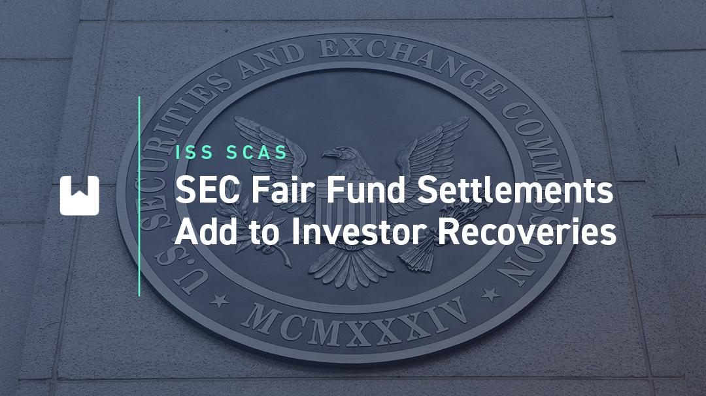

Investor protection and fair play are critical components in the financial markets. The enactment of the Sarbanes-Oxley Act in 2002 introduced Fair Funds as a significant measure to safeguard investors who are victims of securities fraud. These funds are an essential tool in offering restitution to investors who have incurred losses due to fraudulent activities in financial markets. By redirecting monetary penalties from financial wrongdoers to affected investors, Fair Funds provide a means of compensating the victims of securities violations more directly.

This article examines the integration of Fair Funds within the broader context of securities regulation and investigates the evolving role of algorithmic trading in modern investment landscapes. Algorithmic trading, characterized by the use of complex algorithms to execute trades at high speeds, has revolutionized trading activities. While it brings increased efficiency to the market, it also poses unique regulatory challenges. These challenges necessitate a closer look at how existing investor protection mechanisms, such as Fair Funds, adapt and function alongside the technological advancements in trading practices.

The focus will be on understanding how Fair Funds operate, their effectiveness, and their implications within the sphere of automated trading. By addressing these aspects, the discussion aims to provide insights into how regulatory frameworks must evolve to maintain investor confidence and market integrity amidst rapid technological changes.

## Table of Contents

## Understanding Fair Funds and Investor Compensation

Fair Funds are a key component of investor compensation within the securities market, introduced as part of the Sarbanes-Oxley Act of 2002. Their primary purpose is to return ill-gotten gains, penalties, and fines from securities law violations to defrauded investors. Prior to the establishment of Fair Funds, financial penalties collected by regulators like the U.S. Securities and Exchange Commission (SEC) were deposited into the U.S. Treasury, leaving defrauded investors without direct compensation.

Fair Funds function by aggregating collected penalties and fines into a specific pool from which eligible investors can be compensated. The SEC is tasked with the administration of these funds, and they determine the distribution to investors who have suffered from violations such as insider trading, accounting fraud, or other securities infractions. This mechanism, therefore, provides a direct financial remedial avenue for investors adversely affected by fraudulent market practices.

The effectiveness of Fair Funds in addressing securities fraud can be assessed by examining their operational structure and the outcomes they generate for investors. Typically, the SEC initiates a legal proceeding against an entity or individual suspected of securities violations. Upon a successful settlement or judgment, a Fair Fund is established from the monetary penalties collected. The SEC then devises a distribution plan which must be approved by a court. This plan outlines the criteria for investor eligibility and the proportion of funds each entitled investor will receive. 

One of the challenges in implementing Fair Funds is ensuring that the distribution process is both fair and efficient. The criteria for eligibility must be meticulously designed to include investors directly impacted by the fraud while ensuring the administrative costs of managing these funds do not consume a disproportionate share of the total recovery. Although significant strides have been made since the inception of Fair Funds, complexities arise in determining the true scope of affected investors and accurately quantifying their losses.

In conclusion, Fair Funds have transformed the landscape of investor compensation by providing a direct mechanism for the redressal of financial grievances in cases of securities fraud, offering a significant improvement over previous practices where penalties were absorbed into the general Treasury. As they evolve, Fair Funds continue to serve as a foundational element of investor protection in securities regulation.

## The Role of the SEC in Administering Fair Funds

The Securities and Exchange Commission (SEC) plays a central role in the administration of Fair Funds, which are established to return misappropriated funds to defrauded investors. The Fair Funds provision was introduced under the Sarbanes-Oxley Act of 2002 and is codified under Section 308(a) of the act. The purpose of this mechanism is to consolidate funds from civil penalties and disgorgements of ill-gotten gains for the benefit of investors who suffered losses due to securities violations.

The SEC's process for creating a Fair Fund begins with identifying violations of securities laws. When a company or individual is found to have violated these laws, the SEC may initiate enforcement actions which could result in financial sanctions. Once the penalties are assessed and collected, the SEC determines the feasibility of establishing a Fair Fund. This determination often involves assessing the number of affected investors, the total amount of funds available for distribution, and the administrative costs associated with the distribution process.

Once a Fair Fund is established, the SEC appoints a fund administrator who is responsible for the management of the fund and the distribution of funds to eligible investors. This process entails verifying claims from investors, calculating the appropriate distribution amounts, and disbursing funds. The complexity of this process can vary widely depending on the case specifics, such as the number of victims and the intricacy of the fraudulent activity.

Regulatory challenges in administering Fair Funds are manifold. One key challenge is ensuring that the distribution process is timely and cost-effective. The SEC must balance the thoroughness of its verification and distribution processes with the need to minimize administrative expenses, as excessive costs can significantly reduce the funds available to investors.

Another challenge is maintaining an up-to-date and accurate record of affected investors. Over time, contact information for eligible claimants could become outdated, and investors may move, change contact details, or even pass away. The SEC uses multiple strategies to tackle these challenges, including employing advanced data tracking systems and outsourcing fund administration tasks to specialized financial services firms.

In cases where overlapping legal actions or multiple enforcement agencies are involved, coordination becomes crucial. The SEC often collaborates with other agencies to avoid duplicating efforts and to align its fund administration strategies efficiently. This coordination can involve sharing information and joint case management, ensuring that investor compensation is handled smoothly across different jurisdictions.

Innovative technologies and evolving regulatory frameworks promise improvements in the administration of Fair Funds. By embracing advancements in fintech and data management systems, the SEC can increase the efficacy of its fund management processes, potentially leading to quicker and more equitable outcomes for investors. These enhancements are vital in keeping pace with the dynamic financial landscape and emerging complexities in securities fraud. 

Overall, the SEC's proactive management and distribution of Fair Funds underscore its commitment to protecting investors and upholding integrity within financial markets. Despite numerous challenges, the SEC's ongoing efforts and adaptations continue to reinforce the safeguard mechanisms established to protect investors against securities fraud.

## Algorithmic Trading and Securities Regulation

Algorithmic trading, defined as the use of computer algorithms to execute trading strategies at high speeds, has revolutionized financial markets by enhancing their efficiency and [liquidity](/wiki/liquidity-risk-premium). This technological evolution, however, introduces complex challenges to securities regulation, necessitating an adaptive legal framework to safeguard market integrity and investor protection.

The Securities and Exchange Commission (SEC) plays a critical role in overseeing [algorithmic trading](/wiki/algorithmic-trading) practices. As trading systems grow increasingly sophisticated, the SEC must ensure that these systems do not exploit regulatory gaps. Key areas of concern include market manipulation, systemic risk, and the potential for flash crashes. These risks arise from algorithms acting on real-time market data and executing trades in microseconds, thus requiring vigilant oversight and real-time monitoring tools.

Regulations such as the SEC's Market Access Rule (Rule 15c3-5) have been implemented to mitigate risks, requiring brokers to implement risk management controls and supervisory procedures. Moreover, advancements like the Consolidated Audit Trail (CAT) aim to improve the transparency of trading activities, allowing the SEC to trace orders across multiple platforms and identify abusive trading patterns.

Despite these measures, the rapid evolution of algorithmic trading presents ongoing challenges. The intersection of algorithmic trading and investor protection mechanisms, such as Fair Funds, highlights the need for regulations that not only penalize wrongdoing but also facilitate compensation for affected investors. Fair Funds, established under the Sarbanes-Oxley Act, aim to distribute penalties collected from violators back to defrauded investors, aligning punitive measures with investor restitution.

Collaboration between regulatory bodies, financial institutions, and technology developers is crucial to maintain a balance between innovation and market stability. The implementation of sophisticated surveillance systems and adaptive regulatory policies will be essential in navigating the complexities of algorithmic trading, ensuring that investor protection mechanisms like Fair Funds remain effective and relevant in a rapidly changing financial landscape.

## Legal Remedies and Private Litigation for Investor Compensation

Investors affected by securities fraud have access to various legal remedies beyond Fair Funds, such as private securities litigation, class action lawsuits, and arbitration. These avenues play a vital role in seeking compensation and holding wrongdoers accountable.

**Class Action Lawsuits**

Class action lawsuits provide a collective mechanism for investors to pursue compensation. When numerous investors face common legal issues due to securities fraud, a class action allows them to pool resources and litigate as a group. This is often beneficial for individual investors who might find individual litigation costly and inefficient. In the context of securities fraud, class actions can lead to settlements that advantage all members of the class. Moreover, the threat of a class action can serve as a deterrent against corporate misconduct. Notably, the Private Securities Litigation Reform Act (PSLRA) of 1995 aims to prevent frivolous class action suits by imposing stricter standards for evidence and transparency, ensuring that genuine claims receive due attention[^1^].

**Arbitration**

Arbitration is another avenue utilized often by institutional and individual investors alike. Many investment contracts require arbitration as the exclusive forum for dispute resolution, offering a private and potentially quicker alternative to traditional litigation. While arbitration can limit legal costs and facilitate a faster resolution, it does not come without its drawbacks. Critics argue that arbitration clauses can disproportionately favor companies, limiting investors' rights to a fair trial in more transparent court settings. Furthermore, arbitration outcomes are usually final, with limited scope for appeal, putting significant pressure on the arbitration process to be fair and unbiased.

**Comparative Evaluation**

The choice between pursuing Fair Funds, class action lawsuits, or arbitration largely depends on the specific context and objectives of the injured parties. Fair Funds, administered by the SEC, aim to compensate large groups of investors without them having to undertake the complexities and expenses of litigation. In instances where Fair Funds are inadequate or inapplicable, class actions and arbitration present viable alternatives. For example, a class action might be preferable when the SEC has not initiated a Fair Funds process, or when investors seek broader restitution, including punitive damages. On the other hand, arbitration might be chosen for its potential efficiency, especially if stipulated contractually and when issues are more straightforward.

The integration of Fair Funds with private litigation approaches can also be strategic. While Fair Funds streamline the recovery process facilitated by regulatory enforcement, class actions and arbitration can provide comprehensive remedies, including compensation for damages not covered by Fair Funds. Therefore, a combination of these methods might serve the best interests of defrauded investors, ensuring they receive fair and adequate restitution.

Given the complexities involved in securities fraud cases, investors often benefit from consulting legal professionals to navigate these options efficiently. As financial markets and regulatory landscapes continue to evolve, understanding and leveraging these legal remedies remain fundamental to protecting investor interests.

[^1^]: [Securities Class Action Litigation](https://www.sec.gov/fast-answers/answersclassactionhtm.html) - U.S. Securities and Exchange Commission

## Challenges and Opportunities in Safeguarding Investor Interests

Fair Funds are pivotal in offering a mechanism for compensating investors who have suffered from fraudulent practices in securities markets. However, despite their significance, there are inherent challenges in their implementation and administration. One primary issue is the complexity of determining and distributing compensation to affected investors. The process often involves intricate legal and financial evaluations to accurately assess losses and equitably distribute funds. This can lead to delays, reducing the immediate financial relief that defrauded investors might need.

Another challenge lies in the limited scope of funds available for distribution. In many cases, the penalties and recovered funds may not entirely cover the losses suffered by investors, resulting in partial compensation. The ability of Fair Funds to provide comprehensive relief is further constrained by legal and procedural hurdles, such as the accurate identification of eligible claimants and the allocation of funds among them.

Opportunities for improving investor compensation mechanisms exist through technological advancements and regulatory innovations. Enhancements in data analytics and [machine learning](/wiki/machine-learning) could optimize the assessment of investor claims and facilitate the efficient allocation of Fair Funds. For instance, algorithms can be designed to analyze trading patterns and identify fraudulent activities more rapidly, thereby aiding in swifter recovery and distribution processes.

Moreover, there is potential for international cooperation among securities regulators to enhance investor protection. Cross-border securities fraud is becoming more prevalent, necessitating collaborative efforts to establish and enforce regulations that address such issues globally. Establishing a centralized international fair fund mechanism could potentially offer a more cohesive approach to compensating defrauded investors across jurisdictions.

The future of Fair Funds and securities regulation must adapt to the rapidly changing landscape of financial markets, characterized by the rise of algorithmic trading and digital assets. Policymakers and regulatory bodies need to remain agile, continuously updating frameworks to address emerging challenges in investor protection. Furthermore, fostering a stronger partnership between regulatory entities and financial institutions can enhance oversight and bolster preventive measures against fraud, thereby maintaining market integrity and boosting investor confidence.

## Conclusion

Fair Funds serve as an essential mechanism for protecting investors against fraudulent activities in the financial markets. Established by the Sarbanes-Oxley Act of 2002, Fair Funds redistribute collected fines, penalties, and disgorged profits directly to harmed investors rather than channeling them to the U.S. Treasury. This marks a significant shift towards investor-centric recovery in the wake of securities fraud.

The integration of advanced technologies, such as algorithmic trading, has drastically reshaped trading environments. These technologies enhance trading speed and efficiency but simultaneously introduce complex regulatory challenges. The rapid execution of trades through pre-set algorithms necessitates robust oversight to prevent and mitigate market abuses that could harm investors.

In this context, the role of regulatory frameworks, like the Fair Funds provision, becomes even more critical. Ensuring these frameworks are equipped to handle the evolving intricacies of financial markets requires continuous updates and enhancements. Collaborative efforts among regulatory bodies, financial institutions, and technology firms are vital for adapting to new trading landscapes. Such partnerships can promote transparency, enforce compliance, and curb fraudulent practices more effectively.

The future of securities regulation and investor protection will rely heavily on remaining agile and proactive in response to technological progressions. By maintaining strong regulatory measures and fostering industry-wide collaboration, investor confidence can be bolstered, ultimately ensuring the integrity and stability of financial markets. Fair Funds, with their investor-focused approach, exemplify the shift towards a more inclusive and protective market environment.

## References & Further Reading

[1]: Sarbanes-Oxley Act of 2002. Public Law 107-204. [Access the full text.](https://www.congress.gov/107/plaws/publ204/PLAW-107publ204.pdf)

[2]: Madhavan, Ananth. (2000). ["Market Microstructure: A Survey."](https://www.sciencedirect.com/science/article/pii/S1386418100000070) The Review of Financial Studies, 13(2), 481-510.

[3]: U.S. Securities and Exchange Commission. ["Fair Funds and Disgorgement Penalties."](https://www.sec.gov/enforcement-litigation/rulesofpracticeshtml/sec-rules-fair-fund-disgorgement-plans)

[4]: Aldridge, Irene. (2013). ["High-Frequency Trading: A Practical Guide to Algorithmic Strategies and Trading Systems."](https://www.amazon.com/High-Frequency-Trading-Practical-Algorithmic-Strategies/dp/1118343506) John Wiley & Sons.

[5]: US Government Accountability Office. (2005). ["Securities and Exchange Commission: Steps Being Taken to Make Examination Program More Risk-Based and Transparent."](https://digital.library.unt.edu/ark:/67531/metadc295138/m1/5/) 

[6]: Biais, Bruno, Foucault, Thierry, & Moinas, Sophie. (2015). ["Equilibrium Fast Trading."](https://www.sciencedirect.com/science/article/pii/S0304405X15000288) Journal of Financial Economics, 116(2), 292-313.

[7]: Pirrong, Craig. (2012). ["The Economics of High-Frequency Trading."](https://www.annualreviews.org/content/journals/10.1146/annurev-financial-121415-033010) Journal of Financial Markets, 16(4), 823-837.  

[8]: U.S. Securities and Exchange Commission. ["Securities Class Action Litigation."](https://www.sec.gov/enforcement-litigation/litigation-releases)

[9]: Hendershott, Terrence, Jones, Charles M., & Menkveld, Albert J. (2011). ["Does Algorithmic Trading Improve Liquidity?"](https://onlinelibrary.wiley.com/doi/full/10.1111/j.1540-6261.2010.01624.x) The Journal of Finance, 66(1), 1-33.

[10]: Carpenter, Daniel. (2009). ["Confidence Games: How Does Regulation Constitute Markets?"](https://www.hbs.edu/faculty/Shared%20Documents/conferences/2014-business-beyond-the-private-sphere/Confidence%20Games%20-%20How%20Does%20Regulation%20Constitute%20Markets.pdf) Princeton University Press.