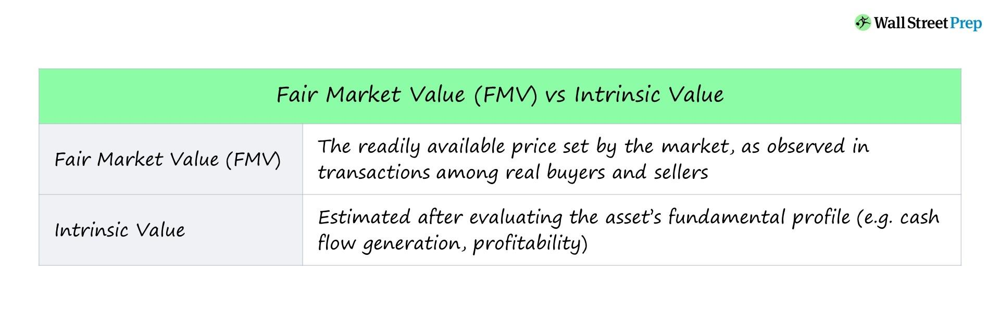

## Table of Contents

## What is fair market value?

Fair market value is the price that a willing buyer would pay a willing seller for an item or property, where both parties are knowledgeable about the item and neither is under any pressure to buy or sell. It's like the price you would see if you put an item up for sale and someone agreed to buy it at a price that seems fair to both of you.

This value is important because it helps set a standard price for things like houses, cars, or businesses. For example, if you want to sell your house, knowing its fair market value can help you set a good price that's not too high or too low. This way, you can attract buyers who are willing to pay what the house is really worth.

## Why is fair market value important?

Fair market value is important because it helps people know how much things are really worth. When you want to buy or sell something, like a house or a car, you need to know its fair market value. This way, you can make sure you're not paying too much or selling for too little. It's like having a fair price that everyone agrees on, so no one feels cheated.

Knowing the fair market value also helps in making good decisions. For example, if you're buying a house, you can compare its fair market value with the price the seller is asking. If the price is much higher than the fair market value, you might decide to look for a different house. This helps keep the buying and selling process fair and honest for everyone involved.

## How is fair market value different from other valuation methods?

Fair market value is different from other valuation methods because it focuses on what a buyer would willingly pay and what a seller would willingly accept, without any pressure or special circumstances. It's like a fair price that both sides agree on when they know all the important details about what they're buying or selling. Other methods, like replacement cost, look at how much it would cost to replace the item with a new one, which might be different from what someone is willing to pay for the used item.

Another method, called liquidation value, is what you might get if you had to sell something quickly, like in an emergency. This value is usually lower because you're not waiting for the best offer, you just need to sell fast. Fair market value, on the other hand, takes time and considers what the item is really worth to people who have time to think about it. So, fair market value gives a more balanced and fair price compared to these other methods.

## What are the common methods used to calculate fair market value?

One common method to calculate fair market value is the comparative market analysis. This method looks at recent sales of similar items or properties in the same area. For example, if you want to know the fair market value of your house, you would look at the prices of similar houses that sold nearby. This helps you see what buyers are willing to pay for homes like yours. It's like comparing apples to apples to find a fair price.

Another method is the income approach, which is often used for businesses or rental properties. This method calculates the fair market value based on the income the property or business can generate. For example, if you own a rental property, you would look at how much rent you can collect and use that to figure out its value. It's like saying the value of something is based on how much money it can make for you.

The cost approach is another way to find fair market value. This method looks at how much it would cost to replace the item or property with a new one. For example, if you want to know the value of a building, you would calculate the cost of building a similar one today. This approach can be useful for unique items where there are no similar sales to compare. It's like figuring out the price by thinking about what it would take to make a new version of the item.

## Can you explain the income approach to calculating fair market value?

The income approach to calculating fair market value is a method that looks at how much money something can make. It's often used for things like rental properties or businesses. For example, if you own an apartment building, you would figure out its value by looking at how much rent you can collect from the tenants. This approach says that the value of the property is based on the income it can generate. It's like saying the worth of your apartment building is tied to how much money it can bring in every month.

To use the income approach, you start by figuring out the net income of the property or business. Net income is the money left after you pay all the costs like maintenance, taxes, and other expenses. Once you know the net income, you apply a capitalization rate, which is like a percentage that shows how much return an investor would expect from this kind of property. By dividing the net income by the capitalization rate, you get the fair market value. It's a way to see how much someone should pay for the property based on the money it can make.

## How does the market approach work in determining fair market value?

The market approach to finding fair market value is like looking at what similar things have sold for recently. Imagine you want to know the value of your house. You would check the prices of other houses in your neighborhood that are similar to yours and have sold recently. This helps you see what buyers are willing to pay for homes like yours. It's a bit like comparing apples to apples to find a fair price.

This method works well because it shows what real people are actually paying for similar items. By looking at recent sales, you get a good idea of what the market thinks your house or item is worth. It's important to choose sales that are as similar as possible to your own situation, so you're comparing things that are really alike. This way, the fair market value you find is more accurate and fair for everyone involved.

## What role does the cost approach play in fair market value calculation?

The cost approach to finding fair market value is like figuring out how much it would cost to make a new version of something. Imagine you have a building and you want to know its value. You would calculate how much it would cost to build a similar building today, including the price of the land and the construction costs. This method is useful for unique things where you can't easily find similar sales to compare.

This approach can give you a good idea of value, but it might not always match what people are willing to pay. For example, if it would cost a lot to build a new building like yours, but nobody wants to buy it for that price, the cost approach might give you a higher value than the market approach. Still, it's a helpful way to think about value, especially when you're dealing with special or one-of-a-kind items.

## What factors can influence the fair market value of an asset?

Many things can change the fair market value of an asset. One big [factor](/wiki/factor-investing) is the economy. If the economy is doing well, people might be willing to pay more for things like houses or cars because they feel more confident about their money. But if the economy is struggling, people might not want to spend as much, so the value of things can go down. Another factor is where the asset is located. For example, a house in a popular city might be worth more than a similar house in a small town because more people want to live in the city.

Other things that can affect fair market value include how old the asset is and how well it has been taken care of. A newer car in good condition will usually be worth more than an older car that needs a lot of repairs. Also, changes in the law or new technology can change what people are willing to pay. For example, if new rules make it harder to build houses in a certain area, the value of the houses already there might go up because there are fewer new houses being built. All these factors together help decide what someone might be willing to pay for an asset.

## How do appraisers determine fair market value for real estate?

Appraisers use different methods to figure out the fair market value of real estate. One common way is the market approach, where they look at recent sales of similar houses in the same area. They compare these sales to the house they are appraising, considering things like the size, age, and condition of the houses. This helps them see what buyers are willing to pay for homes like the one they are looking at. It's like finding out the price of your house by seeing what similar houses nearby sold for.

Another method is the cost approach, where appraisers calculate how much it would cost to build a new house just like the one they are appraising, including the price of the land. This method is useful for unique houses where there are no similar sales to compare. They also subtract any wear and tear or damage to get a more accurate value. It's like figuring out the value of your house by thinking about what it would cost to make a new one just like it.

Sometimes, appraisers also use the income approach, especially for rental properties. They look at how much rent the property can bring in and use that to figure out its value. They calculate the net income, which is the rent money left after paying for things like maintenance and taxes. Then, they apply a capitalization rate, which is like a percentage that shows what return an investor would expect. By dividing the net income by this rate, they get the fair market value. It's a way to see how much someone should pay for the property based on the money it can make.

## What are the challenges in calculating fair market value for intangible assets?

Calculating fair market value for intangible assets like patents, trademarks, or brand names can be tricky. Unlike houses or cars, you can't just look at recent sales of similar items because intangible assets are often unique. This makes it hard to use the market approach, which relies on comparing sales of similar things. Also, the value of intangible assets can change a lot over time. For example, a brand might become more valuable if it gets popular, or less valuable if people start to like it less. This means appraisers need to keep up with how people feel about the asset and how the market is doing.

Another challenge is that intangible assets don't have a clear cost to replace them, which makes the cost approach difficult. You can't just build a new version of a brand or a patent like you can with a building. Instead, appraisers might look at how much money the intangible asset can make, using the income approach. But even this can be hard because predicting future income from something like a patent can be a guess. It depends on things like how well the product sells or if new technology comes along that makes the patent less important. So, figuring out the fair market value of intangible assets takes a lot of careful thinking and often a mix of different methods.

## How can fair market value be used in tax assessments and legal disputes?

Fair market value is really important when it comes to figuring out taxes. When you own things like a house or a business, the government might use the fair market value to decide how much tax you need to pay. For example, if you want to sell your house, you might have to pay a tax based on its fair market value. This helps make sure everyone pays a fair amount of tax, based on what their things are really worth. If the fair market value is wrong, you might end up paying too much or too little tax, so it's important to get it right.

Fair market value also plays a big role in legal disputes. Imagine two people are arguing over how much something is worth, like in a divorce or a business split. The court might need to know the fair market value to help decide who gets what. It's like having a fair price that everyone can agree on, so no one feels cheated. If the fair market value is not clear, it can make the dispute harder to solve. That's why both sides might hire experts to figure out the fair market value and help the court make a fair decision.

## What advanced techniques can be applied to refine fair market value calculations?

To make fair market value calculations more accurate, appraisers can use advanced techniques like regression analysis. This is a fancy way of looking at a lot of data to find patterns. For example, if you want to know the value of your house, regression analysis can help by looking at things like the size of the house, how old it is, and what similar houses nearby sold for. By studying all these factors together, appraisers can come up with a more precise value that takes into account all the little details that might affect the price.

Another advanced technique is using discounted cash flow (DCF) analysis, which is especially helpful for figuring out the value of businesses or income-generating properties. This method looks at how much money the business or property is expected to make in the future and then adjusts that amount to today's dollars. It's like saying, "If this business is going to make a certain amount of money over the next few years, what is that worth to me right now?" By carefully predicting future income and adjusting for things like risk and inflation, DCF analysis can give a more detailed and accurate picture of fair market value.

## What are FMV Valuation Methods?

Valuation methods for determining Fair Market Value (FMV) are fundamentally categorized into three approaches: the market approach, the income approach, and the cost approach. Each method offers distinct perspectives and utilizes different data inputs and assumptions to derive the most accurate valuation possible.

The **market approach** is based on the principle of comparability, where the value of an asset is determined by comparing it to similar assets that have been recently sold under comparable conditions. This method is frequently used in the valuation of real estate, businesses, and securities. It operates under the assumption that the market will dictate an asset's price based on recent sales data of similar assets. For instance, if a house in a particular neighborhood sells for $500,000, similar houses are likely appraised around that price, adjusting for differences like size or condition. The core formula in this approach can be expressed as:

$$
\text{FMV} = \text{Average Price of Comparable Assets}
$$

The **income approach** estimates an asset's value by considering the present value of the future income streams it is expected to generate. This approach is commonly applied to investments, rental properties, and businesses. It involves forecasting an asset’s future cash flows and applying a discount rate to account for risk and time value of money. The formula used is:

$$
\text{FMV} = \frac{\sum \left(\frac{\text{Future Income}_t}{(1 + r)^t}\right)}{n}
$$

where $t$ is the time period, $r$ is the discount rate, and $n$ represents the number of periods.

The **cost approach** assesses value based on the cost of reproducing or replacing the asset with one of similar utility. This method is particularly useful for valuing assets with unique features, such as specialized buildings or equipment. It starts with the current replacement cost and then subtracts depreciation to account for age and condition. This can be formalized as:

$$
\text{FMV} = \text{Replacement Cost} - \text{Depreciation}
$$

These valuation methods take into account economic variables such as market trends, interest rates, and asset-specific factors. By weighing each of these factors, analysts can provide a more balanced and informed assessment of an asset’s Fair Market Value, crucial for financial reporting, investment analysis, and strategic decision-making.

## How do you calculate fair market value?

Calculating Fair Market Value (FMV) involves a comprehensive analysis of various factors including asset specifics, current market conditions, and broader economic influences. The process often relies on evaluating comparable sales, considering replacement costs, and analyzing projected earnings to derive an accurate valuation. This multifaceted approach ensures that the assessed value reflects the true worth of the asset in an open market environment.

### Comparable Sales Approach

This method is particularly prevalent in real estate and is also used for other assets where market comparisons are available. Appraisers compare the subject asset with recently sold, similar assets to determine a fair value. This comparison accounts for differences in asset features, location, and condition. Tools such as real estate market comparables and databases like the Multiple Listing Service (MLS) are integral in obtaining relevant data on recent sales.

### Replacement Cost Approach

The replacement cost approach evaluates what it would cost to replace the asset with another of equivalent utility, factoring in depreciation. This method is particularly useful for assets that are unique or for which market transactions are sparse. Depreciation is calculated based on the asset's age, condition, and remaining useful life. For example:

$$
\text{Replacement Cost} = \text{New Asset Cost} - \text{Depreciation}\]

Where Depreciation might be estimated using a straight-line method:

$$
\text{Depreciation} = \left( \frac{\text{Purchase Cost} - \text{Salvage Value}}{\text{Useful Life}} \right) \times \text{Age}
$$

### Income Approach

The income approach is often used for income-generating properties or businesses. It involves estimating the present value of future income streams the asset is expected to generate. Discounting future earnings to the present value is a key component, typically using a discount rate that reflects the risk associated with the asset. The formula for calculating present value (PV) of future cash flows $(CF)$ is:

$$
\text{PV} = \sum \left( \frac{CF_t}{(1 + r)^t} \right)
$$

Where $CF_t$ is the cash flow in year $t$, and $r$ is the discount rate.

### Tools and Expertise

Professionals often rely on established tools like the Kelley Blue Book for vehicles, which provides market-based valuations taking into account different factors like make, model, mileage, and condition. In real estate, detailed appraisals and local market analytics play a crucial role. Effective calculation of FMV requires not only the use of these tools but also significant expertise to interpret data and adjust valuations appropriately based on subtle market nuances. This intersection of quantitative analysis and expert judgment underscores the complexity of accurately determining an asset's FMV.

## References & Further Reading

[1]: Bergstra, J., Bardenet, R., Bengio, Y., & Kégl, B. (2011). ["Algorithms for Hyper-Parameter Optimization."](https://dl.acm.org/doi/10.5555/2986459.2986743) Advances in Neural Information Processing Systems 24.

[2]: ["Advances in Financial Machine Learning"](https://www.amazon.com/Advances-Financial-Machine-Learning-Marcos/dp/1119482089) by Marcos Lopez de Prado

[3]: ["Evidence-Based Technical Analysis: Applying the Scientific Method and Statistical Inference to Trading Signals"](https://www.amazon.com/Evidence-Based-Technical-Analysis-Scientific-Statistical/dp/0470008741) by David Aronson

[4]: ["Machine Learning for Algorithmic Trading"](https://github.com/stefan-jansen/machine-learning-for-trading) by Stefan Jansen

[5]: ["Quantitative Trading: How to Build Your Own Algorithmic Trading Business"](https://www.amazon.com/Quantitative-Trading-Build-Algorithmic-Business/dp/1119800064) by Ernest P. Chan