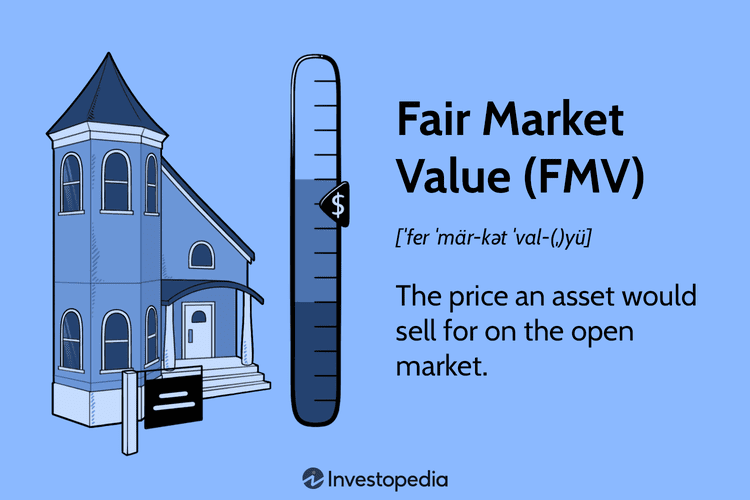

Understanding fair market value (FMV) is critical for accurately appraising assets across various fields such as taxation, real estate, and financial reporting. FMV represents the price an asset would command in a competitive and open market, reflecting both the motivation of buyers and sellers and their knowledge of pertinent facts. This article examines several methodologies for determining FMV, utilizing these insights specifically in algorithmic trading.

Algorithmic trading involves the use of computer algorithms to execute trades based on pre-defined criteria, often leveraging FMV to optimize decision-making. In this high-speed trading environment, understanding FMV can uncover arbitrage opportunities where an asset's trading price deviates from its perceived fair value. Accurate FMV calculations enhance the precision of asset pricing models, crucial for predicting market movements and driving trading strategies.



We will explore the main valuation methods: the market approach, income approach, and cost approach. Each method incorporates different economic assumptions and market conditions. For instance, the market approach involves comparing similar asset sales, while the income approach focuses on future cash flow potential discounted to present value. The cost approach assesses the acquisition cost minus depreciation. These methodologies are essential for constructing robust FMV calculations that can impact an algorithm's performance in trading scenarios.

This guide aims to clarify these complex financial concepts for varied applications amid evolving market conditions. By understanding FMV's calculation and implementation, financial professionals, traders, and policymakers can better navigate and leverage contemporary market dynamics. This knowledge is not only essential for ensuring compliance and optimizing asset management but also crucial for competitive success in today's financial landscape.

## Table of Contents

## What is Fair Market Value?

Fair Market Value (FMV) is defined as the most accurate estimate of the price at which an asset would transfer ownership from a willing seller to a willing buyer, both having adequate knowledge of all relevant facts and neither being under any compulsion to buy or sell. This valuation standard provides an objective assessment of an asset's worth, often transcending its observed market price in various situations.

In a legal context, FMV serves as a critical tool for providing an equitable measure of value, crucial in circumstances like taxation, divorce settlements, or eminent domain cases. For instance, when determining the appropriate compensation in eminent domain cases, FMV helps ensure that property owners receive fair recompense for assets appropriated by the government.

The distinction between FMV, market value, and appraised value lies in their usage and application nuances. Market value refers to the price an asset would fetch in the marketplace under current conditions, while appraised value is an expert's opinion typically obtained for specific purposes, such as securing a loan. While these values might appear similar, FMV is unique in its comprehensive nature, often required to account for more than just the asset's current selling price by incorporating a detailed analysis of all pertinent factors.

An accurate grasp of FMV is vital for various financial assessments, particularly in accounting, where it impacts balance sheets and income statements. In taxation, FMV influences how assets are assessed for tax liabilities, deductions, and credits. For instance, FMV is employed to determine the taxable estate value in inheritance scenarios or evaluate assets given as in-kind donations to charitable organizations, affecting allowable tax deductions.

Understanding FMV requires consideration of multiple variables and conditions associated with the asset in question, including market dynamics, physical characteristics, and economic factors. This assessment often involves a combination of tangible data and market insights, making expert judgment an essential component of determining fair market value accurately. Consequently, financial professionals specialize in appraising FMV to guide transactions and compliance with legal and financial reporting standards.

## FMV Valuation Methods

Valuation methods for determining Fair Market Value (FMV) are fundamentally categorized into three approaches: the market approach, the income approach, and the cost approach. Each method offers distinct perspectives and utilizes different data inputs and assumptions to derive the most accurate valuation possible.

The **market approach** is based on the principle of comparability, where the value of an asset is determined by comparing it to similar assets that have been recently sold under comparable conditions. This method is frequently used in the valuation of real estate, businesses, and securities. It operates under the assumption that the market will dictate an asset's price based on recent sales data of similar assets. For instance, if a house in a particular neighborhood sells for $500,000, similar houses are likely appraised around that price, adjusting for differences like size or condition. The core formula in this approach can be expressed as:

$$
\text{FMV} = \text{Average Price of Comparable Assets}
$$

The **income approach** estimates an asset's value by considering the present value of the future income streams it is expected to generate. This approach is commonly applied to investments, rental properties, and businesses. It involves forecasting an asset’s future cash flows and applying a discount rate to account for risk and time value of money. The formula used is:

$$
\text{FMV} = \frac{\sum \left(\frac{\text{Future Income}_t}{(1 + r)^t}\right)}{n}
$$

where $t$ is the time period, $r$ is the discount rate, and $n$ represents the number of periods.

The **cost approach** assesses value based on the cost of reproducing or replacing the asset with one of similar utility. This method is particularly useful for valuing assets with unique features, such as specialized buildings or equipment. It starts with the current replacement cost and then subtracts depreciation to account for age and condition. This can be formalized as:

$$
\text{FMV} = \text{Replacement Cost} - \text{Depreciation}
$$

These valuation methods take into account economic variables such as market trends, interest rates, and asset-specific factors. By weighing each of these factors, analysts can provide a more balanced and informed assessment of an asset’s Fair Market Value, crucial for financial reporting, investment analysis, and strategic decision-making.

## FMV and Algo Trading

Fair Market Value (FMV) is instrumental in shaping [algorithmic trading](/wiki/algorithmic-trading) strategies by providing a reliable measure of an asset's value. In algorithmic trading, or algo trading, the integration of FMV allows for the identification of [arbitrage](/wiki/arbitrage) opportunities and the precise setting of thresholds for automated buying and selling decisions. Traders leverage FMV to exploit discrepancies between an asset’s fair value and its current market price, which may arise due to market inefficiencies.

To effectively utilize FMV in algo trading, traders typically rely on models that incorporate historical data and leverage statistical analyses to forecast asset price movements. These models often involve calculating expected returns and [volatility](/wiki/volatility-trading-strategies), and they might use linear regression, moving averages, or more complex techniques such as [machine learning](/wiki/machine-learning) algorithms to adjust for fluctuating market conditions.

For example, a simple Python code snippet using pandas and sklearn might be employed to model FMV-based decisions:

```python
import pandas as pd
from sklearn.linear_model import LinearRegression

# Example historical data
data = pd.DataFrame({
    'asset_price': [100, 102, 104, 103, 105],
    'market_conditions': [1, 0.9, 1.1, 1.05, 1]
})

# Target variable representing FMV
targets = data['asset_price'] * data['market_conditions']

# Linear regression to predict FMV
model = LinearRegression()
model.fit(data[['market_conditions']], targets)
predicted_fmv = model.predict(data[['market_conditions']])

# Decision process based on FMV
buy_signal = predicted_fmv > data['asset_price']
sell_signal = predicted_fmv < data['asset_price']

print("Buy Signals:", buy_signal)
print("Sell Signals:", sell_signal)
```

This script estimates FMV and generates buy or sell signals based on the comparison of predicted FMV with the actual asset price. Such computational approaches help traders to capitalize on arbitrage opportunities by automatically executing trades when there are significant divergences from FMV.

The incorporation of FMV into algorithmic trading systems enhances the efficiency of financial operations by ensuring decisions are informed by an asset's true value, mitigating risks associated with emotional or speculative trading. This integration supports greater precision in trade execution and allows for the optimal automation of trading activities, aligning with strategic financial goals and maximizing potential yields.

## Practical Uses of Fair Market Value

Fair Market Value (FMV) is essential in multiple practical applications across different sectors, notably in taxation, insurance, real estate, and charitable donations. 

### Taxation

In taxation, FMV ensures that transactions are taxed based on the true value of assets, which in turn affects various components of tax management such as deductions, credits, and inheritance taxes. For instance, when an asset is inherited, its FMV at the time of inheritance establishes the base for any future capital gains tax. Similarly, FMV is used to determine the proper depreciation deduction for business property.

### Insurance

Insurance companies use FMV to compensate insured parties for their losses by determining the fair value of a damaged or lost asset. This is crucial for indemnity purposes, ensuring that the compensation reflects the current market value of the asset at the time the insurance claim is made. For example, auto insurers rely on FMV to decide the payout amount for a totaled vehicle.

### Real Estate

In real estate, FMV is a key [factor](/wiki/factor-investing) in determining property taxes and during property transactions. When property is assessed for tax purposes, its FMV is used to calculate the amount of annual property taxes owed. Moreover, during the sale or purchase of real estate, FMV helps set a fair transaction price that reflects current market conditions. Comparative Market Analysis (CMA) is often employed in real estate to estimate FMV by comparing the property in question to similar properties sold recently in the area.

### Charitable Donations

For charitable giving, FMV assists in determining the value of donated assets. This valuation is important to ensure that donors receive the correct tax deductions. When a person donates property to a charitable organization, the FMV of the donated items often sets the amount that can be claimed as a deduction on the donor's tax return. Proper assessments and documentation of FMV support compliance with tax regulations for both the donor and the receiving charity.

Fair Market Value's role in these sectors emphasizes its importance in maintaining fairness, compliance, and accuracy in financial evaluations and transactions across industries.

## Calculating Fair Market Value

Calculating Fair Market Value (FMV) involves a comprehensive analysis of various factors including asset specifics, current market conditions, and broader economic influences. The process often relies on evaluating comparable sales, considering replacement costs, and analyzing projected earnings to derive an accurate valuation. This multifaceted approach ensures that the assessed value reflects the true worth of the asset in an open market environment.

### Comparable Sales Approach

This method is particularly prevalent in real estate and is also used for other assets where market comparisons are available. Appraisers compare the subject asset with recently sold, similar assets to determine a fair value. This comparison accounts for differences in asset features, location, and condition. Tools such as real estate market comparables and databases like the Multiple Listing Service (MLS) are integral in obtaining relevant data on recent sales.

### Replacement Cost Approach

The replacement cost approach evaluates what it would cost to replace the asset with another of equivalent utility, factoring in depreciation. This method is particularly useful for assets that are unique or for which market transactions are sparse. Depreciation is calculated based on the asset's age, condition, and remaining useful life. For example:

$$
\text{Replacement Cost} = \text{New Asset Cost} - \text{Depreciation}\]

Where Depreciation might be estimated using a straight-line method:

$$
\text{Depreciation} = \left( \frac{\text{Purchase Cost} - \text{Salvage Value}}{\text{Useful Life}} \right) \times \text{Age}
$$

### Income Approach

The income approach is often used for income-generating properties or businesses. It involves estimating the present value of future income streams the asset is expected to generate. Discounting future earnings to the present value is a key component, typically using a discount rate that reflects the risk associated with the asset. The formula for calculating present value (PV) of future cash flows $(CF)$ is:

$$
\text{PV} = \sum \left( \frac{CF_t}{(1 + r)^t} \right)
$$

Where $CF_t$ is the cash flow in year $t$, and $r$ is the discount rate.

### Tools and Expertise

Professionals often rely on established tools like the Kelley Blue Book for vehicles, which provides market-based valuations taking into account different factors like make, model, mileage, and condition. In real estate, detailed appraisals and local market analytics play a crucial role. Effective calculation of FMV requires not only the use of these tools but also significant expertise to interpret data and adjust valuations appropriately based on subtle market nuances. This intersection of quantitative analysis and expert judgment underscores the complexity of accurately determining an asset's FMV.

## The Bottom Line

Fair Market Value (FMV) serves as a comprehensive gauge of an asset's value within an open market setting, significantly shaped by both legal and market parameters. This valuation metric facilitates various professional practices, forming an essential element for accountants, traders, and policymakers. FMV contributes to more accurate accounting practices by aligning the recorded asset values with their true market worth, which is vital for financial reporting and compliance standards.

For traders, particularly those engaged in algorithmic trading, FMV assists in enhancing the efficacy and precision of trading strategies. By incorporating FMV, traders can establish more effective thresholds for the automated buying and selling of assets. FMV estimation helps in identifying discrepancies between perceived and actual asset values, leading to potentially profitable arbitrage opportunities. This underlines the importance of FMV in managing both risk and return by offering a framework for creating models that can anticipate market movements.

As the financial markets continue to develop, methodologies for calculating and utilizing FMV have also evolved. This evolution is driven by innovations in data analysis and computational technology, necessitating continual adaptation and learning among professionals involved in asset valuation. Mathematical models and sophisticated algorithms play a pivotal role in refining FMV calculations, allowing for more accurate and dynamic market assessments. Understanding updates and advances in FMV practices is crucial for maintaining competitiveness and ensuring sound financial decision-making.

## Conclusion

Understanding Fair Market Value (FMV) methodologies provides a significant advantage in the fields of financial analysis and trading. Its application across various domains—such as tax calculations, insurance settlements, and automated trading—solidifies its standing as a fundamental component of asset valuation. In taxation, the accurate determination of FMV ensures a fair assessment of properties and contributes to both tax liability and deduction decisions. Insurance companies depend on FMV for evaluating the appropriate compensations in claims, ensuring equitable settlement processes.

Furthermore, in the context of automated trading, FMV serves as a critical metric for constructing algorithmic strategies. These strategies often rely on historical data and market trends, where FMV helps in identifying arbitrage opportunities and setting precise buy or sell thresholds, thereby optimizing trading outcomes.

As financial markets evolve, so too do the methods of calculating FMV. The continuous developments in market dynamics and valuation technologies present both challenges and opportunities for industry professionals. Staying informed about the latest practices and technological advancements in FMV calculations is essential for maintaining a competitive edge. This continuous learning process remains imperative as it directly impacts decision-making, profitability, and risk management in ever-changing financial environments.

## References & Further Reading

[1]: Bergstra, J., Bardenet, R., Bengio, Y., & Kégl, B. (2011). ["Algorithms for Hyper-Parameter Optimization."](https://dl.acm.org/doi/10.5555/2986459.2986743) Advances in Neural Information Processing Systems 24.

[2]: ["Advances in Financial Machine Learning"](https://www.amazon.com/Advances-Financial-Machine-Learning-Marcos/dp/1119482089) by Marcos Lopez de Prado

[3]: ["Evidence-Based Technical Analysis: Applying the Scientific Method and Statistical Inference to Trading Signals"](https://www.amazon.com/Evidence-Based-Technical-Analysis-Scientific-Statistical/dp/0470008741) by David Aronson

[4]: ["Machine Learning for Algorithmic Trading"](https://github.com/stefan-jansen/machine-learning-for-trading) by Stefan Jansen

[5]: ["Quantitative Trading: How to Build Your Own Algorithmic Trading Business"](https://www.amazon.com/Quantitative-Trading-Build-Algorithmic-Business/dp/1119800064) by Ernest P. Chan