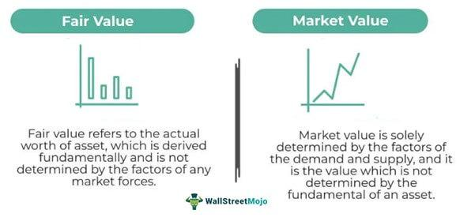

## Table of Contents

## What is fair market value?

Fair market value is the price that a buyer and seller would agree on for an item or property if both knew all the important facts and neither was forced to buy or sell. It's like the price you would see if you put something up for sale and lots of people could see it and make offers. This value is used to make sure things are sold or bought at a fair price, without anyone taking advantage of the other person.

This idea is used in many places, like when selling a house, valuing a business, or even figuring out taxes. For example, if you want to sell your house, an expert might look at what similar houses in your area have sold for recently to find the fair market value. This helps make sure you don't ask for too much or too little money. It's all about finding a price that's fair for everyone involved.

## What is investment value?

Investment value is the worth of an asset or property to a specific investor based on their own goals and needs. It's different from fair market value because it takes into account what the investor plans to do with the asset. For example, if someone wants to buy a building to turn it into apartments, the investment value would consider how much money they could make from renting out the apartments, not just what other people might pay for the building.

This value can change from one investor to another because everyone has different reasons for investing. One person might see a piece of land as valuable because they plan to build a factory there, while another might not see it as valuable because they have different plans. Investment value helps investors decide if buying something is a good idea for them personally, based on how it fits into their overall investment strategy and what they hope to gain from it.

## How is fair market value determined?

Fair market value is figured out by looking at what similar things have sold for recently. For example, if you want to know the fair market value of a house, you would look at the prices of other houses in the same area that are about the same size and have similar features. This helps to find a price that most people would agree is fair, without anyone being forced to buy or sell.

Sometimes, experts like appraisers are hired to help find the fair market value. They use special methods and look at lots of information to make sure the price is right. They might consider things like the condition of the property, what's happening in the local economy, and any special features that could make the property more or less valuable. This way, they can come up with a number that reflects what a typical buyer and seller would agree on.

## How is investment value calculated?

Investment value is figured out by thinking about what the asset or property means to a specific investor. It's not just about what other people might pay, but about what the investor plans to do with it. For example, if an investor wants to buy a building to turn it into a shopping center, they would look at how much money they could make from renting out the shops. They would also consider the costs of fixing up the building and any risks that might come up. All these things help the investor decide if the building is worth the price they would have to pay.

To calculate investment value, the investor often uses special methods like discounted cash flow analysis. This means they guess how much money the asset will make in the future and then figure out what that money is worth today. They might also look at how much other similar investments are worth and think about their own goals and how long they plan to keep the asset. By putting all this together, the investor can come up with a number that shows how valuable the asset is to them, even if it's different from what other people might think.

## What are the key differences between fair market value and investment value?

Fair market value and investment value are two different ways to figure out how much something is worth, and they can give you different numbers. Fair market value is the price that most people would agree on if they knew all the facts and weren't forced to buy or sell. It's like the price you would see if you put something up for sale and lots of people could see it and make offers. For example, if you want to know the fair market value of a house, you would look at what other houses in the same area have sold for recently.

Investment value, on the other hand, is how much something is worth to a specific investor based on their own goals and plans. It's not about what everyone else would pay, but about what the investor thinks they can do with the asset. For instance, if someone wants to buy a building to turn it into a shopping center, they would think about how much money they could make from renting out the shops and what it would cost to fix up the building. This value can be different for each investor because everyone has different reasons for investing.

In short, fair market value is about finding a price that's fair for everyone, while investment value is about what an asset is worth to one particular investor. Both are important, but they look at value in different ways.

## In what scenarios is fair market value used?

Fair market value is used in many situations where people need to find a fair price for something. For example, when people are selling their homes, they often need to know the fair market value to make sure they are asking a good price. Real estate [agents](/wiki/agents) and appraisers help figure this out by looking at what similar homes in the area have sold for recently. This value is also important for tax purposes. When someone gives a gift or leaves property to someone else after they die, the government might use fair market value to figure out how much tax to charge.

Another common use of fair market value is in business. When a company wants to sell its assets or the whole business, they need to know what a fair price would be. This helps them get a good deal and makes sure they are not selling for too little or asking too much. Fair market value is also used in legal situations, like when property is being divided in a divorce or when someone is claiming damages for a loss. In these cases, knowing the fair market value helps everyone agree on a fair outcome.

## In what scenarios is investment value more relevant?

Investment value is important when someone is thinking about buying something as an investment. For example, if an investor wants to buy a piece of land to build a factory, they would care more about what they can do with the land than what other people might pay for it. They would think about how much money they could make from the factory and what it would cost to build it. This helps them decide if buying the land is a good idea for them, even if the price is different from what others might think it's worth.

Investment value also matters a lot when someone is looking at different ways to invest their money. If an investor is choosing between buying stocks, real estate, or starting a business, they would look at the investment value of each option. They would consider their own goals, like how much risk they are willing to take and how long they want to keep the investment. This helps them pick the option that fits best with what they want to achieve, even if the fair market value of these options is the same.

## How do market conditions affect fair market value and investment value?

Market conditions can change the fair market value a lot. If the economy is doing well, people might have more money to spend, so they might be willing to pay more for things like houses or cars. This can make the fair market value go up. But if the economy is not doing well, people might not want to spend as much, so the fair market value could go down. For example, if a lot of people are losing their jobs, they might not be able to buy houses, so the prices of houses could drop. Fair market value is all about what most people would agree to pay, so it goes up and down with what's happening in the economy.

Market conditions also affect investment value, but in a different way. Investment value is about what something is worth to a specific investor, so it depends on what they think they can do with it. If the economy is good, an investor might think they can make more money from a piece of land or a business, so the investment value could go up. But if the economy is bad, they might think it's riskier to invest, so the investment value could go down. For example, if an investor wants to buy a building to turn it into apartments, they might think it's a good idea when the economy is strong because more people will want to rent. But if the economy is weak, they might worry that fewer people will be able to afford rent, so the investment value would be lower.

## What role do appraisals play in determining fair market value?

Appraisals help a lot when figuring out the fair market value of something. An appraiser is a special kind of expert who looks at lots of information to find out what a fair price would be. They might look at what similar things have sold for recently, the condition of the item, and what's happening in the economy. For example, if someone wants to know the fair market value of their house, an appraiser would check what other houses in the same area have sold for and think about any special features the house has. This helps make sure the price is fair for everyone involved.

Appraisals are important in many situations, like when someone is selling their home, figuring out taxes, or dealing with insurance claims. When a house is being sold, the buyer and seller might hire an appraiser to make sure they agree on a fair price. For taxes, the government might use an appraisal to figure out how much to charge when someone gives a gift or leaves property to someone else. And in insurance, an appraisal can help decide how much money someone should get if their property is damaged or lost. By using an appraiser, people can be more sure that the fair market value they come up with is accurate and fair.

## How can an investor use both fair market value and investment value in decision making?

An investor can use fair market value to understand what most people would pay for something. This helps them see if the price they are thinking about paying is fair compared to what others have paid. For example, if an investor wants to buy a house, they would look at the fair market value to make sure they are not paying too much. It's like a guide to help them know if the price is good or not. By knowing the fair market value, the investor can feel more confident that they are making a smart decision.

Investment value is different because it's about what the thing is worth to that specific investor. They would think about their own plans and goals, like how much money they could make from the investment. For instance, if the investor wants to buy the house to turn it into a rental property, they would look at how much they could charge for rent and what it would cost to fix up the house. This helps them decide if buying the house is a good idea for them, even if the fair market value is different. By using both fair market value and investment value, the investor can make a decision that is both fair and good for their own goals.

## What advanced methods exist for calculating investment value?

One advanced method for calculating investment value is called discounted cash flow (DCF) analysis. This method looks at how much money an investment is expected to make in the future and then figures out what that money is worth today. The investor guesses how much money the investment will bring in each year and then uses a special math formula to "discount" those future amounts back to today's dollars. This helps the investor see if the investment is worth the price they would have to pay, based on what they think they will earn from it.

Another method is called real options valuation. This is a bit like playing a game where you have choices to make. The investor looks at different things they could do with the investment and tries to figure out which choice would be best. For example, if they buy a piece of land, they might have the option to build a factory, sell it later, or keep it for a long time. By thinking about all these options and what they could be worth, the investor can get a better idea of the investment's value to them. Both these methods help investors make smarter choices by looking at the investment in more detail and considering their own plans and goals.

## How do regulatory frameworks influence the application of fair market value and investment value?

Regulatory frameworks can really affect how fair market value is used. For example, when people are selling their homes or businesses, the government might have rules about how to find the fair market value. These rules can say what kind of experts to use, like appraisers, and what information they need to look at. This is important for things like taxes, where the government uses fair market value to figure out how much to charge. If the rules change, it can make the fair market value go up or down, depending on what the new rules say. So, when someone is trying to find the fair market value, they have to follow these rules to make sure everything is fair and legal.

Regulatory frameworks also play a big role in how investment value is used. For example, when investors are thinking about buying something, they have to follow rules about what they can and can't do with their investment. These rules can affect how much money they think they can make from it, which changes the investment value. For instance, if there are new laws about building on a piece of land, it can make the land more or less valuable to an investor. So, when investors are figuring out the investment value, they have to think about these rules and how they might change their plans. This helps them make sure their investment is a good idea and follows all the laws.

## What are Financial Valuation Techniques?

Financial valuation is a fundamental aspect of assessing the worth of an asset or a company using various financial metrics. The choice of valuation technique is influenced by the nature of the asset, the availability of data, and the purpose of the valuation. Several valuation methods, each with its own merits and limitations, are commonly employed in financial analysis.

**Discounted Cash Flow (DCF) Analysis**  
DCF is a robust valuation method based on the present value of expected future cash flows. The DCF model estimates the value of an investment by predicting the future free cash flows and discounting them back to the present using a discount rate, typically the weighted average cost of capital (WACC). The formula for DCF is:

$$

DCF = \sum_{t=1}^{n} \frac{CF_t}{(1 + r)^t} 
$$

where $CF_t$ is the cash flow in year $t$, $r$ is the discount rate, and $n$ is the total number of periods.

The main advantage of DCF analysis is its focus on fundamental cash flow generation, making it highly relevant for long-term investment evaluation. However, it requires accurate projections of future cash flows and an appropriate discount rate, making it sensitive to assumptions and input data.

**Price-to-Earnings (P/E) Ratio**  
The P/E ratio is a simpler relative valuation tool used to determine a company's value by comparing its current share price to its earnings per share (EPS). It is calculated as:

$$

P/E \, Ratio = \frac{Market \, Price \, per \, Share}{Earnings \, per \, Share} 
$$

This ratio provides insights into how much investors are willing to pay for a company’s earnings, making it useful for comparing companies within the same industry. While the P/E ratio is easy to compute and understand, it does not account for growth rates or risk factors, which can be misleading if analyzed in isolation.

**Comparable Company Analysis (CCA)**  
CCA involves valuing a company based on the valuation metrics of similar businesses in the same industry. Key ratios, such as Enterprise Value-to-EBITDA, are used for comparison. The main benefit of CCA is that it relies on real market data, providing a market-based reference point for valuation. However, its accuracy is contingent upon the selection of truly comparable companies, and it may not reflect intrinsic value if market conditions are distorted.

In choosing a valuation technique, analysts must consider the asset type, the context of the valuation, and the availability of reliable data. For instance, DCF analysis might be more suitable for valuing stable, cash-generating companies, whereas CCA could provide more insight into market perceptions in a dynamic industry landscape. A comprehensive approach often involves using multiple methods to triangulate and validate results, leading to a more informed valuation decision. Understanding these techniques is crucial for making informed financial decisions that align with strategic objectives.

## What is the Investment Value Assessment?

Investment value is a key concept in finance that reflects the specific worth of an asset to an individual investor. Unlike fair market value (FMV), which represents the consensus valuation of an asset under open market conditions, investment value is inherently subjective. It varies according to the personal objectives, investment goals, and risk tolerance of the investor.

### Factors Influencing Investment Value

Several factors contribute to the determination of investment value:

1. **Forecasted Cash Flow:** The expected future cash flows from an asset significantly impact its investment value. Investors typically employ models like discounted cash flow (DCF) analysis to project these cash flows and assess their present worth. The formula for DCF is given by:
$$
   DCF = \sum_{t=1}^{n} \frac{CF_t}{(1 + r)^t}

$$

   where $CF_t$ is the cash flow at time $t$, $r$ is the discount rate, and $n$ is the total number of periods.

2. **Strategic Benefits:** These are the additional advantages an asset provides to the investor that may not be fully captured in the financial metrics. This could include the potential for vertical integration, entry into new markets, or enhancement of competitive positioning.

3. **Synergies with Current Holdings:** The investment value is affected by how well an asset complements an investor's existing portfolio. Synergies can lead to cost reductions or revenue improvements that elevate the overall value of the investment.

### Tools and Models for Assessing Investment Value

Investors use a variety of tools to assess investment value, among which are:

- **Net Present Value (NPV):** NPV is a central tool for evaluating investments. It calculates the difference between the present value of cash inflows and outflows over the investment period. The formula is:
$$
  NPV = \sum_{t=0}^{n} \frac{CF_t}{(1 + r)^t} - C_0

$$

  where $C_0$ is the initial investment cost.

- **Internal Rate of Return (IRR):** IRR is the discount rate that makes the NPV of an investment zero. It provides a single-number metric to assess the profitability of potential investments.

  In Python, this can be calculated using:

  ```python
  import numpy as np

  cash_flows = [-initial_investment, cash_flow1, cash_flow2, ..., cash_flown]
  irr = np.irr(cash_flows)
  ```

### Implications for Portfolio Management

Investment value plays a critical role in portfolio management. By understanding the specific value an asset holds for individual objectives and risk profiles, investors can tailor their portfolios for optimal performance. It helps in aligning investment choices with personal financial goals, ensuring that the portfolio reflects the investor’s risk-reward preferences. Furthermore, acknowledging the subjective nature of investment value can foster diversified investment strategies, as different assessments may uncover opportunities otherwise overlooked by more standardized valuation metrics.

## What are the interconnections between valuation, investment, and algo trading?

In modern finance, the interconnections between fair market value (FMV), financial valuation, investment value, and [algorithmic trading](/wiki/algorithmic-trading) are pivotal in shaping investment strategies and market operations. 

Valuation is the cornerstone for both fair market value and investment value, providing a quantitative foundation for assessing the worth of assets. Valuation models such as discounted cash flow (DCF) analysis and comparable company analysis serve as the basis for estimating FMV. These models incorporate various financial metrics and projections to arrive at what the market agrees is a fair price in a competitive and open environment. For instance, the formula for DCF is:

$$

DCF = \sum \frac{CF_t}{(1 + r)^t} 
$$

where $CF_t$ represents the cash flow in year $t$ and $r$ is the discount rate. This formula underscores how expected future cash flows are discounted back to their present value, which is critical in determining FMV.

Investment value, on the other hand, is more subjective and depends on the specific goals and risk tolerance of an individual investor. Tools like net present value (NPV) and internal rate of return (IRR) are utilized to assess this value. For instance, NPV is calculated as:

$$

NPV = \sum \frac{CF_t}{(1 + r)^t} - Initial\ Investment 
$$

This formula helps investors ascertain whether a particular investment aligns with their financial objectives and personal valuation thresholds.

Algorithmic trading further integrates these valuation concepts by using computer algorithms to exploit market inefficiencies and execution opportunities. Algorithms leverage valuation models to assess real-time data quickly and optimize trading decisions. Python, for example, can be used to implement a basic algorithmic trading strategy that incorporates valuation data:

```python
def trading_strategy(stock_data, valuation_threshold):
    for stock in stock_data:
        if stock['valuation'] < valuation_threshold:
            execute_trade('buy', stock)
        else:
            execute_trade('sell', stock)
```

In this code, each stock is evaluated against a predefined valuation threshold, and trades are executed based on whether the stock is undervalued or overvalued, aligning trading decisions with valuation insights.

Thus, the interconnectedness of these financial concepts allows for enhanced investment strategies. Valuation provides the quantitative tools necessary for establishing FMV and determining subjective investment value, which in turn guide trading strategies including algorithmic trading. Understanding and leveraging these interconnections enable financial professionals to gain a competitive advantage by precisely aligning investment activities with market dynamics and individual investor needs.

## References & Further Reading

[1]: Damodaran, A. (2012). ["Investment Valuation: Tools and Techniques for Determining the Value of Any Asset, University Edition"](https://books.google.com/books/about/Investment_Valuation.html?id=5SRHAAAAQBAJ). Wiley.

[2]: Lopez de Prado, M. (2018). ["Advances in Financial Machine Learning."](https://books.google.com/books/about/Advances_in_Financial_Machine_Learning.html?id=oU9KDwAAQBAJ) Wiley.

[3]: Chan, E. P. (2009). ["Quantitative Trading: How to Build Your Own Algorithmic Trading Business."](https://github.com/ftvision/quant_trading_echan_book) Wiley.

[4]: Jansen, S. (2020). ["Machine Learning for Algorithmic Trading: Predictive models to extract signals from market and alternative data for systematic trading strategies with Python, 2nd Edition."](https://www.amazon.com/Machine-Learning-Algorithmic-Trading-alternative/dp/1839217715) Packt Publishing.

[5]: Fabozzi, F. J., & Markowitz, H. M. (2011). ["Theory and Practice of Investment Management: Asset Allocation, Valuation, Portfolio Construction, and Strategies, 2nd Edition."](https://books.google.com/books/about/The_Theory_and_Practice_of_Investment_Ma.html?id=PFZhVW1W0k8C) Wiley.

[6]: Abarbanell, J. S., & Bushee, B. J. (1997). ["Fundamental Analysis, Future Earnings, and Stock Prices."](https://www.jstor.org/stable/2491464) Journal of Accounting Research, 35(1), 1-24.