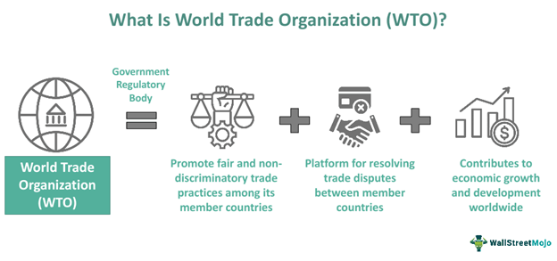

Algorithmic trading, often referred to as algo trading, has revolutionized the financial markets by allowing for the execution of trades at unprecedented speeds and volumes. This method relies on complex algorithms and high-powered computing to make decisions about buying and selling securities in fractions of a second. As a result, it has become a dominant force in the world of trading, capable of maximizing efficiency and enhancing liquidity.

However, the rapid advancement and widespread adoption of algorithmic trading come with significant regulatory challenges. The primary concern lies in ensuring that trades conducted through these algorithms adhere to fair practice standards, thus maintaining the integrity of financial markets. Regulators worldwide are tasked with the responsibility of balancing the technological benefits and the potential risks associated with this trading method.

Understanding the framework of prohibited conduct in algorithmic trading is essential. This encompasses recognizing activities that are deemed unethical or illegal, such as market manipulation or the misuse of insider information. Moreover, knowledge of fair practice guidelines is pivotal, as these rules are designed to prevent misbehavior and protect investors from potential exploitation.

The regulatory environment surrounding algorithmic trading is continuously evolving to address these challenges. In some instances, violations of fair practice rules can result in severe penalties from regulatory bodies such as the Financial Industry Regulatory Authority (FINRA) and other global organizations. These penalties aim to deter misconduct and maintain the stability and trust of financial markets.

This article discusses these key issues, focusing on how regulatory measures are put in place to safeguard market integrity and protect the interests of investors. By navigating the complexities and ethical considerations of algorithmic trading, stakeholders can contribute to a more transparent and secure financial ecosystem.

## Table of Contents

## The Importance of Fair Practice in Algo Trading

Fair practice in trading is essential for ensuring a level playing field and preventing market manipulation, thereby fostering trust in financial markets. Algorithmic trading, with its ability to execute a high [volume](/wiki/volume-trading-strategy) of trades at remarkable speed, amplifies the importance of maintaining such standards. As these systems can process thousands of transactions per second, any lapse in ethical conduct can lead to significant market distortions. Thus, adhering to fair practice guidelines is crucial to counteract vulnerabilities and reinforce market integrity.

Regulatory bodies worldwide prioritize fair market practices to mitigate risks associated with [algorithmic trading](/wiki/algorithmic-trading). By setting and enforcing rules, they aim to curb unethical behaviors, such as market manipulation or exploiting pricing errors, that may arise from high-speed trading environments. These regulations ensure that no market participant gains an unfair advantage over others, thus maintaining the transparent and orderly functioning of financial markets.

Algorithmic systems rely heavily on complex mathematical models and high-frequency data streams to make trading decisions. These models must be designed with a deep understanding of market dynamics and regulatory obligations to avoid inadvertently engaging in unfair practices. Ensuring that algorithms operate within ethical and regulatory parameters not only preserves market fairness but also prevents potential legal and financial repercussions for trading firms.

Incorporating ethical standards in algorithmic trading practices involves continuous monitoring and adaptation of trading algorithms to conform to the evolving regulatory landscape. Robust compliance frameworks and regular assessments of trading strategies are necessary to identify and rectify any misconduct at an early stage. By prioritizing transparency and accountability, stakeholders can enhance their market standing and contribute to a more robust financial ecosystem.

## Prohibited Conduct in Algorithmic Trading

Prohibited conduct in algorithmic trading encompasses various unethical practices that compromise the integrity of financial markets. One such conduct is front-running, where traders execute orders on a security for their benefit, based on advance knowledge of pending orders from others. This activity undermines market fairness and is strictly prohibited.

Insider trading is another illegal practice in algorithmic trading, involving the use of non-public, material information to execute trades. This breaches the principle of equality among market participants, as it grants an unfair advantage to those with privileged information.

Market manipulation, a broader category of prohibited conduct, involves efforts to deceive or artificially affect the markets. This can include spoofing, where traders place large orders they do not intend to execute, creating a misleading impression of demand or supply. This artificial influence on market prices can lead to significant distortions in trading fairness.

Specific unethical behaviors such as 'trading ahead' are also banned. 'Trading ahead' occurs when brokers prioritize their trades ahead of clients' orders, exploiting their knowledge of pending trades to benefit their accounts. This behavior breaches the fiduciary duty brokers owe to their clients and is a significant ethical violation.

Additionally, using algorithms to mislead the market or artificially inflate trade volumes is considered prohibited conduct. For instance, deploying algo strategies that create false [liquidity](/wiki/liquidity-risk-premium) or misleading signals to manipulate other traders' perceptions is against regulatory guidelines. Such strategies can include layering or the use of wash trades, which serve no economic purpose other than to mislead the market by fabricating trading activity.

Regulatory bodies are vigilant in identifying and penalizing these practices to maintain fair and transparent financial markets. They actively monitor trading patterns, employing sophisticated algorithms to detect anomalies that suggest misconduct, thereby upholding the rules that govern ethical trading.

## Penalties for Violating Fair Practice in Algo Trading

Violating fair practice rules in algorithmic trading can incur significant penalties from regulatory organizations such as the Financial Industry Regulatory Authority (FINRA). These penalties are integral in maintaining a fair and transparent market environment and may be implemented in various forms. Commonly, they involve monetary fines, where firms or individuals found guilty of violations are required to pay substantial amounts as compensation for their misconduct. 

Moreover, beyond financial repercussions, sanctions may be imposed, ranging from temporary suspensions to the permanent revocation of trading licenses. These actions underscore the seriousness of adhering to established guidelines, as non-compliance can result in losing the ability to participate in trading activities altogether. 

Regulatory bodies also impose restrictions on trading activities as a preventive measure, ensuring that those penalized are unable to engage in further unethical practices. These restrictions can limit the scope of trading operations for guilty parties, thereby curtailing their influence in financial markets.

Additionally, regulatory entities such as FINRA regularly publish lists of disciplinary actions. These publications serve as both a deterrent to potential violators and a tool for transparency, demonstrating the consequences of unfair trading practices and reinforcing the importance of compliance. By publicly documenting disciplinary measures, regulatory bodies aim to promote a culture of accountability and ensure that market participants are aware of the potential ramifications of unethical conduct in algorithmic trading.

## The Role of FINRA and Other Regulatory Bodies

The Financial Industry Regulatory Authority (FINRA) plays a substantial role in establishing and enforcing ethical standards within algorithmic trading, ensuring a robust framework for fair trading practices. FINRA's mandate includes creating detailed guidelines for broker-dealers aimed at promoting loyalty and equitable dealings with clients. These guidelines serve as a deterrent against unfair trading activities by defining clear ethical benchmarks and procedures that market participants are required to follow.

FINRA's regulatory approach encompasses monitoring trading activities to detect irregular practices, imposing sanctions on violators, and fostering a transparent trading environment. The ethical standards set by FINRA are integral in aligning the operational processes of broker-dealers with the overarching goal of preserving market integrity.

In addition to FINRA, other global regulatory bodies also play a crucial role in overseeing algorithmic trading. The Securities and Exchange Commission (SEC) in the United States is one such entity that collaborates with FINRA to provide comprehensive regulation and oversight. The SEC's efforts are directed towards preventing market manipulation and ensuring that trading systems operate within the bounds of fairness, thereby safeguarding investor interests.

The collaboration between FINRA, the SEC, and other international regulatory agencies results in a cohesive regulatory infrastructure that supports the continuous monitoring and evaluation of trading practices. This cooperative effort is vital in addressing the complexities introduced by algorithmic trading, as it helps maintain fair market conditions and enhances the reliability of financial systems globally.

Through these concerted efforts, regulatory bodies collectively ensure that both domestic and international trading activities adhere to established ethical standards, fostering a stable and trustworthy marketplace for investors.

## Ensuring Compliance and Best Practices

To ensure compliance and adherence to best practices in algorithmic trading, firms and individuals must maintain a continuous awareness of the evolving regulatory landscape. Staying informed about regulatory changes and updates is a critical component of this process. In countries like the United States, regulatory bodies such as the Securities and Exchange Commission (SEC) and the Financial Industry Regulatory Authority (FINRA) periodically release new guidelines and rules that directly impact algorithmic trading practices. These regulatory updates aim to curtail unfair practices and enhance transparency within financial markets.

Implementing robust compliance frameworks is essential for firms engaged in algorithmic trading. A successful compliance strategy often involves the integration of automated systems capable of monitoring trading activities and detecting potential violations of fair practice rules. These systems should be capable of analyzing large volumes of data in real-time, ensuring all trades adhere to regulatory standards. Furthermore, developing a strong internal culture of compliance requires ongoing training and education for all staff members involved in the trading process. Regular workshops and training sessions can help traders and other stakeholders understand the nuances of regulatory requirements and foster a commitment to ethical trading practices.

Proactive measures are necessary to prevent prohibited conduct and promote a transparent trading environment. Firms should establish clear protocols for identifying and rectifying unethical behavior before it results in regulatory infractions. This might include setting up whistleblowing channels, conducting regular audits, and fostering a culture of openness and accountability. Additionally, leveraging technology to increase the transparency of trading processes can significantly reduce the possibility of misconduct. This transparency not only aids in compliance but also builds trust among clients and the broader financial community.

In conclusion, as algorithmic trading continues to dominate the financial markets, maintaining compliance and enforcing best practices are more important than ever. By staying informed of regulatory developments, implementing robust frameworks, and fostering a culture of ethical behavior, stakeholders can efficiently navigate the complex landscape of algorithmic trading.

## Conclusion

The evolution of trading technologies necessitates an ongoing review of ethical standards and regulatory measures. The integration of advanced algorithms in trading practices has transformed the speed and complexity of market transactions. As a result, maintaining fair practices is more crucial than ever. Compliance with these standards serves to protect investors by ensuring market integrity and reducing the opportunity for fraudulent activities.

Algorithmic trading's dominance in the financial markets underscores the importance of regulatory adherence. These regulations safeguard the market's credibility and operational efficiency, establishing a foundation for trust among market participants. As the landscape of trading continues to evolve, stakeholders must remain vigilant, fostering a transparent and fair trading environment that promotes sustainable growth. 

Consistent awareness and compliance with these regulations not only ensure the protection of investors but also enhance the reliability and effectiveness of financial markets as a whole. This commitment to ethical standards is essential for nurturing lasting trust and confidence within the marketplace, facilitating a stable and efficient trading ecosystem.

## References & Further Reading

[1]: Marcos Lopez de Prado. ["Advances in Financial Machine Learning"](https://www.amazon.com/Advances-Financial-Machine-Learning-Marcos/dp/1119482089). Wiley, 2018.

[2]: Stefan Jansen. ["Machine Learning for Algorithmic Trading"](https://github.com/stefan-jansen/machine-learning-for-trading). Packt Publishing, 2020.

[3]: Ernest P. Chan. ["Quantitative Trading: How to Build Your Own Algorithmic Trading Business"](https://www.amazon.com/Quantitative-Trading-Build-Algorithmic-Business/dp/0470284889). Wiley, 2008.

[4]: David Aronson. ["Evidence-Based Technical Analysis: Applying the Scientific Method and Statistical Inference to Trading Signals"](https://www.amazon.com/Evidence-Based-Technical-Analysis-Scientific-Statistical/dp/0470008741). Wiley, 2007.

[5]: U.S. Securities and Exchange Commission (SEC). ["Regulation of NMS Stocks"](https://www.sec.gov/rules-regulations/statutes-regulations). Final Rule, 2005.

[6]: Financial Industry Regulatory Authority (FINRA). ["Guidance on Effective Supervision and Control Practices for Algorithmic Trading"](https://www.federalregister.gov/documents/2024/12/30/2024-30907/self-regulatory-organizations-financial-industry-regulatory-authority-inc-notice-of-filing-of-a)