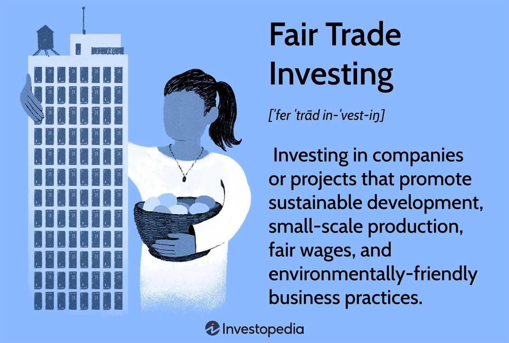

## Table of Contents

## What is fair trade investing?

Fair trade investing is when people choose to invest their money in companies that treat workers fairly and help the environment. It's about making sure that the companies you invest in follow good practices, like paying workers a fair wage and not harming the planet. This type of investing is popular among people who want their money to make a positive difference in the world.

When you invest in fair trade, you look at more than just how much money a company can make. You also consider how the company treats its employees, how it affects the community, and how it takes care of the environment. By choosing fair trade investments, you support businesses that are trying to do the right thing, even if it means they might not make as much profit as other companies. This way, your money helps create a better world for everyone.

## How does fair trade investing differ from traditional investing?

Fair trade investing is different from traditional investing because it focuses on more than just making money. When you invest traditionally, you mainly look at how much profit a company can make. You want your investment to grow as much as possible. But with fair trade investing, you also care about how the company treats its workers, the environment, and the community. You want to put your money into businesses that do good things, even if they might not make as much profit.

In traditional investing, the main goal is to get the highest return on your investment. This means you might invest in companies that pay low wages or harm the environment if they are making a lot of money. But fair trade investing is about balancing profit with doing the right thing. You might earn a bit less, but you feel good knowing your money is helping to make the world a better place. So, while traditional investing is all about financial gain, fair trade investing is about making a positive impact too.

## What are the main principles of fair trade investing?

The main principles of fair trade investing focus on making sure companies treat their workers fairly and take care of the environment. When you invest in fair trade, you want to support businesses that pay their workers a good wage, provide safe working conditions, and respect workers' rights. This means you look for companies that do not exploit their employees and that help them have a better life.

Another big part of fair trade investing is being kind to the environment. You want to invest in companies that try to reduce pollution, use renewable energy, and protect natural resources. These companies care about the planet and work to make sure their business does not harm the environment. By choosing these kinds of investments, you help support a healthier world for everyone.

Lastly, fair trade investing also cares about the community and society. You look for companies that give back to the places where they work, support local economies, and promote fairness and equality. This means your investment can help make communities stronger and more inclusive. So, fair trade investing is about balancing making money with doing good for people and the planet.

## What are the benefits of fair trade investing for investors?

Fair trade investing can make investors feel good about where they put their money. When you invest in fair trade, you know your money is helping companies that treat workers well and care about the environment. This can give you a sense of pride and satisfaction because you are making a positive difference in the world. Knowing that your investments support good causes can make you feel more connected to your money and more aware of the impact it has.

Another benefit is that fair trade investing can help build a better future. By supporting companies that focus on sustainability and fair practices, you are helping to create a world that is healthier and more just. Over time, this can lead to stronger communities and a more stable economy. Even though fair trade investments might not always grow as fast as traditional ones, the long-term benefits for society and the planet can be very rewarding for investors who care about these issues.

## How can fair trade investing impact local communities and economies?

Fair trade investing can help local communities by supporting businesses that pay workers a fair wage. When companies pay their employees well, those workers can spend more money in their own neighborhoods. This helps local shops and services grow because more people can afford to buy things. It also means that workers and their families can live better lives, with enough money for food, education, and healthcare. So, fair trade investing can make a big difference in making communities stronger and happier.

Fair trade investing also helps local economies by encouraging companies to use resources wisely and take care of the environment. When businesses focus on sustainability, they often use local materials and support local suppliers. This keeps money circulating within the community, which can lead to more jobs and a stronger economy. Plus, by protecting the environment, these companies help ensure that the area stays a good place to live and work for future generations. Overall, fair trade investing can create a cycle of growth and improvement in local economies.

## What are the common mechanisms used in fair trade investing?

One common way to do fair trade investing is by looking at a company's practices before you invest. You check if they pay their workers well, treat them fairly, and care about the environment. Some people use special ratings or reports that show how good a company is at these things. If a company does well in these areas, you might decide to invest in them because you want to support their good work.

Another way is by investing in funds or groups that focus on fair trade. These funds pick companies that follow fair trade rules and put your money into them. This makes it easier for you because you don't have to check each company yourself. The fund does the work for you, making sure your money goes to businesses that do good things for people and the planet.

Sometimes, investors also use their power to make companies better. They might talk to the company's leaders or vote at meetings to push for better worker rights or environmental practices. This is called shareholder activism. By doing this, investors can help make sure the companies they invest in keep improving and stay true to fair trade values.

## How do fair trade certification and standards play a role in fair trade investing?

Fair trade certification and standards are important tools for fair trade investing. They help investors know which companies are doing the right things for their workers and the environment. When a company gets fair trade certified, it means they have been checked and approved for following fair trade rules. These rules include paying workers a fair wage, providing safe working conditions, and using eco-friendly practices. Investors can look for these certifications to make sure their money is going to good companies.

These standards also make it easier for investors to compare different companies. If two companies are both certified, you know they are both trying to do good things. This can help you feel more confident about where to put your money. Plus, fair trade standards keep getting better over time, so companies have to keep improving to stay certified. This means that by investing in certified companies, you are supporting businesses that are committed to making the world a better place.

## What are some examples of successful fair trade investment projects?

One example of a successful fair trade investment project is the investment in Divine Chocolate. Divine Chocolate is a company that makes sure cocoa farmers in Ghana get a fair price for their beans. The company is partly owned by the farmers themselves, which means they share in the profits. Investors who put money into Divine Chocolate are helping to support these farmers and their communities. The company also focuses on using sustainable farming methods, which is good for the environment.

Another example is the investment in Patagonia, a clothing company that cares a lot about the environment. Patagonia uses materials that are better for the planet and makes sure their workers are treated well. They also give money back to environmental causes. When people invest in Patagonia, they are supporting a business that tries to make the world a better place. This shows how fair trade investing can help both people and the planet.

## How can an investor start engaging in fair trade investing?

To start engaging in fair trade investing, an investor should first learn about what fair trade means. This involves understanding that fair trade is about supporting companies that treat their workers well, care for the environment, and help their communities. You can find lots of information online or in [books](/wiki/algo-trading-books) about fair trade. Once you know what to look for, you can start looking at different companies and see if they follow fair trade rules. You might want to check if they have fair trade certifications, which show that they have been checked and approved for following these rules.

Next, you can decide how you want to invest. One way is to invest directly in companies that you think are doing a good job with fair trade. You can do this by buying their stocks. Another way is to invest in special funds that focus on fair trade. These funds pick companies that follow fair trade standards and put your money into them. This can make it easier because you don't have to check each company yourself. The fund does the work for you. As you start investing, you might also want to keep learning and staying updated on fair trade news and changes, so you can make the best choices with your money.

## What are the challenges and risks associated with fair trade investing?

Fair trade investing can be tricky because it might not always make as much money as other kinds of investing. When you choose companies that pay their workers well and care about the environment, they might not make as much profit as companies that don't follow these rules. This means your investment might grow slower, and you could miss out on bigger gains from other investments. Also, finding good fair trade investments can take more time and work. You need to check if companies really follow fair trade rules, which can be hard and might need special reports or ratings to help you decide.

Another challenge is that fair trade standards can change over time. What is considered fair today might not be enough tomorrow, so companies need to keep improving. This means you have to keep an eye on your investments and make sure the companies you've chosen are still doing the right things. If a company stops following fair trade rules, you might need to sell your investment, which can be a hassle. Plus, not all companies that say they are fair trade actually follow through, so there's a risk of being tricked. It's important to do your homework and stay informed to make the best choices.

## How does fair trade investing contribute to sustainable development goals?

Fair trade investing helps with sustainable development goals by supporting companies that care about people and the planet. When you invest in fair trade, you put money into businesses that pay workers fairly, provide safe working conditions, and respect their rights. This helps meet goals like ending poverty and reducing inequality because workers can earn enough to live well. It also supports goals about good health and education because workers with fair wages can afford better healthcare and schooling for their families.

Fair trade investing also helps the environment, which is important for sustainable development. Companies that follow fair trade rules often use eco-friendly practices, like reducing pollution and using renewable energy. This helps with goals like protecting life on land and in water, and fighting against climate change. By investing in these companies, you help create a healthier planet for everyone, now and in the future. So, fair trade investing is a way to make money while also helping to build a better world.

## What are advanced strategies for maximizing the impact of fair trade investments?

To maximize the impact of fair trade investments, an investor can focus on diversifying their portfolio across different sectors that align with fair trade principles. This means putting money into various industries like food, clothing, and energy, as long as the companies follow fair trade rules. By spreading investments across different areas, you can support a wider range of workers and communities, making a bigger difference. Also, you can look for companies that not only meet fair trade standards but also go beyond them, like those that invest in community projects or use cutting-edge sustainable technologies. This way, your investments can help push companies to do even more good.

Another advanced strategy is to get involved in shareholder activism. This means using your power as an investor to influence the companies you invest in. You can vote at shareholder meetings or talk to company leaders to push for even better fair trade practices. For example, you might ask a company to pay workers more or to use more eco-friendly materials. By being active, you can help make sure the companies you invest in keep improving and stay true to fair trade values. This not only helps the workers and the environment but also makes your investments more meaningful because you're helping to create change.

## References & Further Reading

[1]: Dunn, M., & Baker, J. (2019). ["Introduction to Sustainable Finance and Investments."](https://www.bakermckenzie.com/-/media/files/insight/publications/2020/03/sustainable-finance_from-niche-to-new-normal.pdf?la=en) Springer.

[2]: Williams, G. (2021). ["Fair Trade and Social Justice: Global Ethnographies."](https://www.jstor.org/stable/j.ctt9qg61z) Princeton University Press.

[3]: Friede, G., Busch, T., & Bassen, A. (2015). ["ESG and Financial Performance: Aggregated Evidence from More than 2000 Empirical Studies."](https://www.tandfonline.com/doi/full/10.1080/20430795.2015.1118917) Journal of Sustainable Finance & Investment, 5(4), 210-233.

[4]: Narang, R. (2013). ["Inside the Black Box: A Simple Guide to Quantitative and High Frequency Trading."](https://onlinelibrary.wiley.com/doi/book/10.1002/9781118662717) Wiley.

[5]: Smith, J. A., & White, K. (2012). ["From Principles to Practice: Ethical and Sustainable Investment."](https://www.researchgate.net/publication/377349999_Sustainable_Business_Practices_Integrating_Environmental_and_Social_Responsibility_into_Management_Strategies) Routledge.