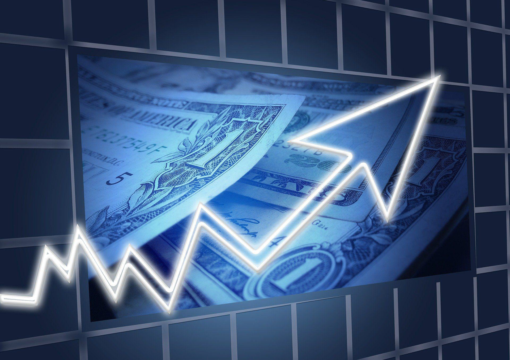

## Table of Contents

## What is fair value in the context of futures markets?

Fair value in futures markets is the theoretical price at which a futures contract should trade. It is calculated based on the current spot price of the underlying asset, plus the costs associated with holding that asset until the futures contract expires, like interest rates or storage costs. For example, if you are looking at a futures contract for oil, the fair value would consider the current price of oil, plus the costs to store that oil until the contract's expiration date.

This concept is important because it helps traders determine if a futures contract is overpriced or underpriced. If the market price of a futures contract is higher than its fair value, it might be a signal to sell, as the contract could be considered overpriced. Conversely, if the market price is lower than the fair value, it might be a good time to buy, suggesting the contract is undervalued. By understanding fair value, traders can make more informed decisions and potentially profit from price discrepancies in the market.

## How does fair value differ from market price in futures trading?

Fair value and market price in futures trading are two different concepts. Fair value is a theoretical price that a futures contract should have, based on the current price of the underlying asset and the costs to hold that asset until the contract expires. It's like a calculated guess of what the futures contract should be worth. On the other hand, the market price is the actual price at which the futures contract is trading in the market at any given time. This price is determined by the supply and demand of the contract among traders.

The difference between fair value and market price can tell traders if a futures contract is a good deal or not. If the market price is higher than the fair value, it suggests that the contract might be overpriced, and it could be a good time to sell. If the market price is lower than the fair value, it suggests the contract might be undervalued, and it could be a good time to buy. Traders use this information to make decisions about buying or selling futures contracts, aiming to profit from any price differences they spot.

## What are the basic components needed to calculate the fair value of a futures contract?

To calculate the fair value of a futures contract, you need to start with the current price of the asset that the contract is based on. This is called the spot price. For example, if you're looking at a futures contract for gold, you would start with the current price of gold. Then, you need to think about the costs of holding that asset until the futures contract expires. These costs can include things like interest rates if you borrowed money to buy the asset, storage costs if the asset needs to be kept somewhere, and any other expenses you might have while holding onto it.

Once you have the spot price and the costs figured out, you add them together to get the fair value. So, if the spot price of gold is $1,800 per ounce and it costs you $20 to hold that gold until the futures contract expires, the fair value of the futures contract would be $1,820. This fair value helps traders see if the futures contract is a good deal. If the market price of the futures contract is more than $1,820, traders might think it's overpriced and decide to sell. If it's less than $1,820, they might think it's a good buy.

## Can you explain the role of the cost of carry in determining fair value?

The cost of carry is really important when figuring out the fair value of a futures contract. It's all about the extra costs you have to pay to keep the asset until the futures contract ends. These costs can include things like interest if you borrowed money to buy the asset, storage fees if you need to keep it somewhere, and any other expenses you might have while holding onto it. For example, if you're looking at a futures contract for oil, you'd need to think about how much it costs to store that oil until the contract expires.

When you add up the spot price of the asset (what it costs right now) and the cost of carry, you get the fair value of the futures contract. So, if the spot price of oil is $70 per barrel and it costs you $5 to store that oil until the contract ends, the fair value would be $75. This helps traders decide if the futures contract is a good deal. If the market price of the futures contract is more than $75, traders might think it's overpriced and decide to sell. If it's less than $75, they might see it as a good buy.

## How do interest rates affect the fair value calculation of futures?

Interest rates play a big role in figuring out the fair value of futures contracts. When you're calculating the fair value, you need to think about the cost of carry, which includes the interest you'd pay if you borrowed money to buy the asset. If interest rates are high, it costs more to borrow money, so the cost of carry goes up. This means the fair value of the futures contract will be higher because you're adding more costs to the spot price of the asset.

For example, let's say you're looking at a futures contract for gold. The spot price of gold is $1,800 per ounce, but you need to borrow money to buy it and hold it until the contract expires. If the [interest rate](/wiki/interest-rate-trading-strategies) is 5%, you'll have to pay $90 in interest (5% of $1,800) to hold that gold until the contract ends. So, the fair value of the futures contract would be $1,890 ($1,800 + $90). If interest rates were lower, say 2%, you'd only pay $36 in interest, making the fair value $1,836. This shows how changes in interest rates can affect the fair value of futures contracts.

## What is the impact of dividends on the fair value of futures contracts?

Dividends can affect the fair value of futures contracts, especially if the underlying asset is a stock or an index that pays dividends. When a company pays a dividend, the value of its stock usually goes down by the amount of the dividend on the ex-dividend date. This means that if you own a futures contract on that stock, you won't get the dividend, but the price of the stock will be lower. So, to figure out the fair value of the futures contract, you need to take away the value of any dividends that will be paid before the contract expires.

For example, let's say you're looking at a futures contract for a stock that's currently worth $100 per share, and it's going to pay a $2 dividend before the futures contract expires. The fair value of the futures contract would be less than $100 because the stock price will drop by $2 when the dividend is paid. If there are no other costs like interest or storage, the fair value would be $98. This shows how dividends can lower the fair value of futures contracts, and it's something traders need to think about when they're figuring out if a futures contract is a good deal.

## How can one use arbitrage to ensure the fair value of futures?

Arbitrage is a way traders can make sure the fair value of futures stays correct. They do this by taking advantage of price differences between the futures contract and the underlying asset. If the market price of a futures contract is higher than its fair value, a trader can buy the underlying asset, hold it until the contract expires, and then sell it at the higher futures price. This action helps bring the futures price back down to its fair value because more people will start doing the same thing, increasing the supply of the futures contract.

On the other hand, if the market price of a futures contract is lower than its fair value, a trader can sell the futures contract and buy the underlying asset. When the contract expires, they can deliver the asset and make a profit from the difference. This action pushes the futures price back up to its fair value because more traders will do the same, increasing demand for the futures contract. By constantly looking for these opportunities, traders help keep the futures market in line with the fair value.

## What mathematical models are commonly used to calculate the fair value of futures?

One common way to calculate the fair value of futures is by using the cost of carry model. This model is pretty simple. You start with the current price of the asset, which is called the spot price. Then, you add the costs of holding that asset until the futures contract expires. These costs can include things like interest if you borrowed money to buy the asset, storage fees if you need to keep it somewhere, and any dividends the asset might pay if it's a stock. By adding the spot price and the cost of carry together, you get the fair value of the futures contract.

Another model that's often used is the Black-Scholes model, which is more complicated but can be useful for certain types of futures. This model was originally made for options, but it can be adjusted for futures. It takes into account things like the current price of the asset, the time until the contract expires, the expected [volatility](/wiki/volatility-trading-strategies) of the asset's price, and the risk-free interest rate. By using all these factors, the Black-Scholes model can give a more detailed estimate of the fair value of a futures contract.

## How do market expectations and volatility influence the fair value of futures?

Market expectations play a big role in the fair value of futures contracts. When people think the price of an asset will go up in the future, they're more likely to buy futures contracts now, which can push the market price higher than the fair value. On the other hand, if people expect the price to go down, they might sell futures contracts, which can make the market price lower than the fair value. These expectations are based on things like news, economic reports, and other information that traders think will affect the asset's price in the future.

Volatility also affects the fair value of futures contracts. If an asset's price is expected to move a lot in the future, it can make the futures contract more valuable because there's more chance for big gains or losses. This is because traders might be willing to pay more for a futures contract if they think the price of the asset could change a lot. Models like the Black-Scholes model take volatility into account when calculating fair value, showing how important it is in determining what a futures contract should be worth.

## What are the challenges in accurately calculating the fair value of commodity futures?

Calculating the fair value of commodity futures can be tricky because there are a lot of things to think about. One big challenge is figuring out all the costs of holding the commodity until the futures contract expires. For things like oil or grain, you need to consider storage costs, which can change a lot depending on where you are and how much space you need. Also, interest rates can affect the cost of carry if you borrowed money to buy the commodity. These costs can be hard to predict accurately because they can change over time.

Another challenge is dealing with market expectations and how they can affect the price of the commodity. If people think the price of a commodity will go up or down in the future, it can make the futures contract's market price different from its fair value. This makes it hard to know what the fair value should be because it's based on what people think will happen, not just what's happening now. Plus, things like weather, political events, and economic reports can change these expectations quickly, making it even harder to get the fair value right.

## How does the fair value calculation differ for financial futures versus commodity futures?

The fair value calculation for financial futures, like those based on stocks or indices, takes into account the current price of the underlying asset, known as the spot price, and the costs of holding that asset until the futures contract expires. A key part of this cost is the interest rate, which can be significant if you borrowed money to buy the asset. Another important [factor](/wiki/factor-investing) for financial futures is dividends. If the underlying asset pays dividends before the futures contract expires, you need to subtract the value of those dividends from the fair value because the stock price usually drops by the dividend amount on the ex-dividend date. This makes the calculation a bit more complex because you need to predict future dividends and interest rates.

For commodity futures, like those for oil or grain, the fair value calculation also starts with the spot price of the commodity. However, the costs of holding the commodity until the contract expires can be very different. Instead of interest rates, you might need to consider storage costs, which can vary a lot depending on the type of commodity and where it's stored. Other costs might include insurance and transportation. These costs can be hard to predict and can change over time, making the fair value calculation more challenging. Also, commodity prices can be affected by things like weather, political events, and supply and demand changes, which adds another layer of complexity to figuring out the fair value.

## What advanced techniques can be applied to refine the fair value calculation in highly volatile markets?

In highly volatile markets, one advanced technique to refine the fair value calculation is using more sophisticated models like the Black-Scholes model, but adjusted for futures. This model takes into account not just the current price of the asset and the costs of holding it, but also the expected volatility of the asset's price. By including volatility, the model can better predict how much the price might change before the futures contract expires. This helps traders get a more accurate fair value, especially when prices are swinging a lot.

Another technique is to use real-time data and machine learning algorithms to constantly update the fair value. In volatile markets, prices can change quickly, so having up-to-date information is crucial. Machine learning can analyze lots of data, like past price movements, news, and economic reports, to find patterns and make better predictions about future prices. This way, traders can adjust the fair value of futures contracts more frequently and accurately, helping them make smarter trading decisions even when the market is unpredictable.

## What is Fair Value in Futures Markets?

Fair value in futures markets is the estimated price at which a futures contract is expected to trade, based on the equilibrium between willing buyers and sellers. It is a theoretical price that incorporates various factors including the current index value, expected dividends, the number of days to expiration, and prevailing interest rates. This price is distinct from the actual trading price of futures, providing a critical reference point for traders.

The theoretical nature of fair value stems from its reliance on underlying financial principles and market expectations rather than real-time market transactions. The calculation starts with the current market index value, often referred to as the spot price. To this, adjustments are made to account for dividends expected over the life of the contract, which represent a cash flow difference between holding the underlying asset and entering into a futures contract. The formula typically used for equity futures is:

$$
\text{Fair Value} = \text{Cash Price} \times \left[1 + \frac{r \times x}{360}\right] - \text{Dividends}
$$

where:
- Cash Price is the spot price of the underlying asset,
- $r$ is the risk-free interest rate,
- $x$ is the number of days to expiration,
- Dividends is the expected dividend yield over the period of the contract.

Interest rates play a crucial role in this calculation, particularly the risk-free rate, as it represents the opportunity cost of capital. Higher interest rates increase the fair value of futures compared to the spot price, given that the future delivery of the asset allows the investor to earn interest in the meantime.

Expiration days are essential because they define the contract's timeline and influence the accrued interest and dividend yield considerations. A longer duration until expiration increases the impact of interest and potentially accumulated dividends on the fair value computation.

The concept of fair value is vital for distinguishing the difference between the futures price and the market price. Futures prices can deviate from this theoretical fair value due to external factors such as market sentiment, [liquidity](/wiki/liquidity-risk-premium) conditions, and immediate supply and demand imbalances. Understanding these discrepancies allows traders to anticipate market movements and seek profitability through various trading strategies, such as arbitraging these differences. 

Thus, fair value is not just an abstract calculation but a critical tool for analyzing and predicting futures market behavior.

## How do you calculate the fair value for futures?

The calculation of fair value for futures contracts is fundamental for traders looking to understand the relationship between current market conditions and future pricing. The fair value is an equilibrium price that accounts for multiple financial factors, allowing traders to discern the theoretical value of a futures contract. 

For equity futures, the formula to calculate fair value is expressed as:

$$
\text{Fair Value} = \text{Cash Price} \times \left(1 + \frac{r \times x}{360}\right) - \text{Dividends}
$$

Where:

- **Cash Price** is the current price of the underlying asset.
- **r** is the annual risk-free interest rate.
- **x** represents the number of days to expiration.
- **Dividends** are expected payouts during the holding period.

This formula captures the cost of [carry](/wiki/carry-trading), which combines the opportunity cost of holding a position in terms of foregone interest earnings, offset by any income in dividends.

In contrast, commodity futures necessitate additional considerations due to physical characteristics and logistical expenses associated with the assets. The fair value calculation for commodities may encompass costs such as:

1. **Storage Costs:** These are expenses incurred for physically storing the commodity until the contract's expiration.
2. **Insurance Costs:** This covers risk mitigation for potential losses during transport or storage.

The inclusion of these additional costs modifies the formula for commodities, ensuring it reflects the total anticipated expenditure associated with holding the commodity:

$$
\text{Fair Value}_{\text{Commodity}} = \text{Cash Price} \times \left(1 + \frac{r \times x}{360}\right) + \text{Storage Costs} + \text{Insurance Costs} - \text{Dividends (if any)}
$$

For traders programming calculations in Python, a basic script to calculate the fair value for equity futures might look like this:

```python
def calculate_equity_futures_fair_value(cash_price, interest_rate, days_to_expiration, dividends):
    return cash_price * (1 + (interest_rate * days_to_expiration / 360)) - dividends

# Example usage
cash_price = 1000
interest_rate = 0.05  # 5%
days_to_expiration = 30
dividends = 10

fair_value = calculate_equity_futures_fair_value(cash_price, interest_rate, days_to_expiration, dividends)
print(f"Fair Value for Equity Futures: {fair_value}")
```

By understanding and applying these calculations, traders can gain an insight into the theoretical pricing of futures contracts, thereby informing their trading decisions and strategies effectively.

## What is the relationship between Algorithmic Trading and Fair Value?

Algorithmic trading, or algo trading, refers to the use of automated trading systems designed to execute trades at speeds and frequencies that are impossible for human traders. These systems leverage sophisticated algorithms to analyze market conditions, identify profitable trading opportunities, and execute trades based on pre-set criteria. A critical aspect of [algorithmic trading](/wiki/algorithmic-trading) involves calculating and reacting to price differences, particularly through fair value calculations.

Fair value serves as a theoretical benchmark, representing the appropriate price for a given futures contract based on current market conditions. Automated systems can utilize these calculations to exploit any discrepancies between the fair value and the actual futures price. By monitoring these differences, algo trading systems can engage in [arbitrage](/wiki/arbitrage) strategies, capturing profit opportunities that arise from temporary market inefficiencies.

The speed and efficiency of algo trading are largely due to the advanced programming and computational capabilities that allow these systems to swiftly analyze large volumes of market data. A typical algorithm might use [machine learning](/wiki/machine-learning) models or statistical techniques to predict price movements, gauging when discrepancies suggest a potential trading opportunity.

To program an algorithm capable of calculating fair value discrepancies, a trader might follow these steps:

1. **Data Input**: Continuously stream real-time market data, including current index values, interest rates, and dividends.

2. **Fair Value Calculation**: Implement mathematical models to compute the fair value based on the formula:  
$$
   \text{Fair Value} = \text{Cash Price} \times \left(1 + \frac{r \times x}{360}\right) - \text{Dividends}

$$
   where $r$ represents the risk-free interest rate and $x$ is the number of days until expiration.

3. **Comparison**: Continuously compare the fair value to the actual futures price.

4. **Trading Decision**: Program the system to execute trades automatically when the difference between the fair value and the futures price exceeds a certain threshold, suggesting an arbitrage opportunity.

5. **Risk Management**: Incorporate risk management protocols to limit potential losses, such as setting stop-loss orders or maximum trade sizes.

Programming these algorithms requires a keen understanding of both programming languages (like Python) and market dynamics. A basic implementation might look as follows in Python:

```python
def calculate_fair_value(cash_price, interest_rate, days_to_expiration, dividends):
    return cash_price * (1 + (interest_rate * days_to_expiration / 360)) - dividends

def identify_arbitrage_opportunity(fair_value, futures_price, threshold):
    difference = futures_price - fair_value
    if abs(difference) > threshold:
        return True, difference
    return False, difference

# Example values
cash_price = 100
interest_rate = 0.05
days_to_expiration = 30
dividends = 0.5
futures_price = 105
threshold = 0.5

fair_value = calculate_fair_value(cash_price, interest_rate, days_to_expiration, dividends)
opportunity, diff = identify_arbitrage_opportunity(fair_value, futures_price, threshold)

if opportunity:
    if diff > 0:
        print("Sell futures and buy underlying asset")
    else:
        print("Buy futures and sell underlying asset")
```

Understanding and accurately programming algorithms to detect and act on fair value discrepancies is crucial for successful algorithmic trading. These systems’ ability to make split-second decisions allows them to seamlessly capitalize on market inefficiencies, often resulting in substantial profits for traders employing this technology.

## References & Further Reading

[1]: Hull, J. C. (2021). ["Options, Futures, and Other Derivatives"](https://elibrary.pearson.de/book/99.150005/9781292410623). Pearson.

[2]: Black, F., & Scholes, M. (1973). ["The Pricing of Options and Corporate Liabilities."](https://www.cs.princeton.edu/courses/archive/fall09/cos323/papers/black_scholes73.pdf) Journal of Political Economy, 81(3), 637-654.

[3]: Lopez de Prado, M. (2018). ["Advances in Financial Machine Learning."](https://www.amazon.com/Advances-Financial-Machine-Learning-Marcos/dp/1119482089) Wiley.

[4]: Chan, E. P. (2009). ["Quantitative Trading: How to Build Your Own Algorithmic Trading Business."](https://github.com/egorpe/EPChan-QuantitativeTrading/blob/master/example7_6.m) Wiley.

[5]: Jansen, S. (2020). ["Machine Learning for Algorithmic Trading."](https://github.com/stefan-jansen/machine-learning-for-trading) Packt Publishing.

[6]: Bodie, Z., Kane, A., & Marcus, A. J. (2020). ["Investments."](https://www.mheducation.com/highered/product/Investments-Bodie.html) McGraw-Hill Education.

[7]: Custódio, R., & Castro, F. (2021). ["Algorithmic Trading Strategies: Theoretical and Practical Applications."](https://pmc.ncbi.nlm.nih.gov/articles/PMC10575355/) Available at SSRN.