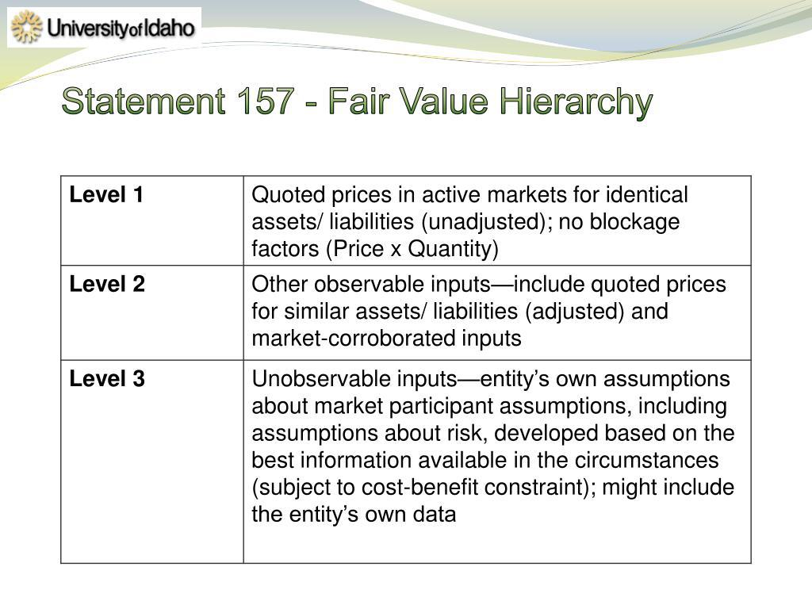

In the constantly evolving world of finance, determining the fair value of assets has become crucial for making informed decisions. The fair value of an asset represents an estimate of its true worth based on current market conditions, independent of the asset's current trading price. Mastering this concept can significantly influence investment outcomes.

Algorithmic trading has revolutionized financial markets by allowing for rapid and frequent trades that capitalize on discrepancies in asset pricing. This approach leverages algorithms to execute trades at speeds and frequencies impossible for human traders, effectively exploiting small price inefficiencies that may exist only briefly. By utilizing precise valuation techniques, traders can optimize their strategies to maximize profitability across various market conditions.



This article will explore the role of fair value estimation in algorithmic trading and its significance in identifying market opportunities. Accurate valuation is essential for identifying when assets are mispriced, providing algorithmic trading systems with actionable signals to buy undervalued assets or sell overvalued ones. Successful traders rely on these signals to navigate the complexities of financial markets and generate consistent returns.

We will discuss various valuation methods and how they are integrated into algorithmic models to optimize trading strategies. Key techniques include fundamental analysis, which evaluates an asset's intrinsic value based on economic factors, and quantitative approaches that utilize statistical methods to model price movements. These methods, applied in tandem, can enhance the accuracy and reliability of fair value estimates.

The goal is to equip readers with a comprehensive understanding of fair value estimation in the context of algo trading. By doing so, traders can effectively harness available data, implement robust trading strategies, and ultimately gain a competitive edge in a highly dynamic financial landscape.

## Table of Contents

## Understanding Valuation Formulas

Valuation formulas are foundational tools used to calculate the intrinsic value of assets, providing clarity amidst the inherent noise of financial markets. These formulas help traders and investors understand whether an asset is overvalued, undervalued, or fairly priced, thus guiding sound financial decisions. The principal methodologies for asset valuation encompass [fundamental analysis](/wiki/fundamental-analysis), technical analysis, and quantitative approaches.

Fundamental analysis is concerned with assessing an asset’s intrinsic value by examining economic indicators and financial statements. This method typically employs models like Discounted Cash Flow (DCF), which involves estimating future cash flows generated by the asset and discounting them to their present value. The formula for DCF is:

$$

DCF = \sum_{t=1}^{n} \frac{CF_t}{(1 + r)^t} 
$$

where $CF_t$ is the cash flow in year $t$, $r$ is the discount rate, and $n$ is the total number of periods. This approach requires a deep understanding of a company’s earnings, growth projections, and market conditions, making it a favored tool for long-term investors.

Technical analysis, on the other hand, focuses on price patterns and trading volumes to forecast future asset price movements. It relies extensively on historical data, utilizing various chart patterns and technical indicators, such as moving averages and relative strength indices. These tools help analysts determine entry and [exit](/wiki/exit-strategy) points for trades, often without reference to underlying economic data.

Quantitative methods employ mathematical models and statistical techniques to evaluate market trends and asset values. These models can range from simple regression analyses to complex algorithms that weigh numerous variables simultaneously. Machine learning and advanced statistical methods are increasingly applied in this domain to enhance prediction accuracy and adapt to real-time data fluctuations. Quantitative approaches are particularly valuable in high-frequency trading environments where speed and precision are crucial.

Overall, each valuation method plays a critical role in identifying asset value and market opportunities, equipping traders and investors with the insights needed to navigate financial markets effectively.

## Financial Examples of Valuation

Discounted Cash Flow (DCF) analysis is a pivotal method in financial valuation, employed to determine an asset's present value by estimating its future cash flows. The fundamental premise of DCF is the concept of the time value of money, which asserts that a dollar today holds more value than a dollar in the future due to its potential [earning](/wiki/earning-announcement) capacity. In DCF, future cash flows are projected over a period and then discounted back to present value using a discount rate, typically the weighted average cost of capital (WACC). The formula for DCF is as follows:

$$

DCF = \sum_{t=1}^{n} \frac{CF_t}{(1 + r)^t}
$$

where $CF_t$ represents the cash flow at a specific time period $t$, $r$ is the discount rate, and $n$ is the total number of periods.

Comparable Company Analysis (CCA) offers another vital approach, providing insight by comparing a company against its industry peers. CCA utilizes various metrics, with Enterprise Value-to-EBITDA (Earnings Before Interest, Taxes, Depreciation, and Amortization) being a popular choice due to its focus on core operating profitability, excluding the impact of different capital structures across companies. This metric is useful as it normalizes earnings, facilitating a more apples-to-apples comparison.

The Price-to-Earnings (P/E) ratio is a widely recognized evaluation metric, reflecting market expectations about a company's future potential. It is calculated by dividing the market price per share by the earnings per share (EPS). A high P/E ratio may indicate that a stock is overvalued, or investors are expecting high growth rates in the future. Conversely, a low P/E might suggest undervaluation or pessimistic market sentiment regarding a company's future.

Successful case studies in the application of these valuation methods highlight their practicality in real-world scenarios. For example, companies like Apple and Microsoft have been valued using these methodologies, showcasing their effectiveness in assessing tech sector giants. These companies have leveraged their robust financial performance and strategic market positioning, often quantified through DCF, CCA, and P/E ratios, to substantiate their market valuations.

Valuation techniques must be tailored to the specific dynamics of different sectors. For instance, tech companies often emphasize growth metrics due to higher expectation of future earnings, while utility companies might focus more on stable cash flows and dividend yields. The diversity of industry-specific factors necessitates a nuanced approach to valuation, ensuring that the selected method aligns with the intrinsic characteristics of the sector under analysis.

## Fair Value and Its Role in Algo Trading

Fair value is a fundamental concept in finance, representing the theoretical market equilibrium price of an asset under balanced conditions. In [algorithmic trading](/wiki/algorithmic-trading), fair value plays a critical role in identifying and exploiting opportunities arising from price discrepancies. By assessing fair value, algorithmic traders can capitalize on assets being bought or sold at prices that deviate from their theoretical value, thus providing [arbitrage](/wiki/arbitrage) opportunities.

Algorithmic traders employ fair value assessments to detect mispriced assets quickly. These assessments are particularly valuable in [statistical arbitrage](/wiki/statistical-arbitrage) strategies, which utilize advanced algorithms to identify and exploit temporary pricing inefficiencies. In statistical arbitrage, pairs trading is a common approach where traders seek to profit from relative price movements of correlated assets. For instance, if two historically correlated stocks suddenly diverge in price, an algorithm can execute trades that bet on the reversion of prices to their fair value relation.

High-frequency trading ([HFT](/wiki/high-frequency-trading-strategies)) heavily relies on fair value calculations for executing trades with remarkable speed and precision. The rapid nature of HFT necessitates the ability to swiftly identify small deviations from fair value across various assets. During trading sessions, minor price anomalies present opportunities for profit, and real-time fair value estimation becomes crucial. Algorithms executing trades within microseconds maximize profit from these inefficiencies before they disappear.

The integration of fair value estimations into algorithmic trading enhances overall market efficiency and [liquidity](/wiki/liquidity-risk-premium). Efficient markets are characterized by assets trading close to their intrinsic value, minimizing the potential for arbitrage. As algorithms continually assess fair value to inform trading decisions, they contribute to the equilibrium of asset prices, ensuring that any discrepancies are quickly corrected. This continuous correction process enhances the depth and liquidity of financial markets, benefiting traders and long-term investors alike.

In summary, fair value is a pivotal element in algorithmic trading, underpinning the identification and exploitation of mispriced assets. Its application in statistical arbitrage and HFT underscores its significance in facilitating precise and rapid trading activities. By contributing to market efficiency and liquidity, fair value estimation supports the robustness of modern financial markets.

## Algorithmic Trading and Valuation Integration

Algorithmic trading employs automated strategies to execute trades with high speed and precision, relying heavily on accurate asset valuation to optimize these strategies. At the core of algorithmic trading lies the integration of valuation formulas, which are essential in determining the inherent worth of assets. These valuation models guide the decision-making process, enabling algorithms to capitalize on discrepancies in asset pricing.

The use of valuation methods such as Discounted Cash Flow (DCF) analysis and Price-to-Earnings (P/E) ratios allows algorithms to assess fair value and identify mispriced assets. Incorporating these formulas into trading algorithms ensures that trades are based on a rigorous analysis of asset worth rather than speculative market trends.

Algorithmic trading faces several challenges, including the rapid adaptation to volatile market conditions and the integration of real-time data streams. To address these challenges, algorithms must be capable of processing and analyzing large volumes of data swiftly. This necessitates robust systems that can handle the dynamism of financial markets and adjust trading strategies accordingly.

Machine learning and AI technologies play a pivotal role in enhancing the valuation process within algorithmic trading. These technologies improve predictive models by learning from historical data and identifying patterns that may not be apparent through traditional valuation methods. For instance, [machine learning](/wiki/machine-learning) algorithms can be trained to recognize complex market signals, thereby refining asset valuation and trading strategies.

```python
from sklearn.ensemble import RandomForestRegressor
import numpy as np

# Sample data for training (features: historical prices, volume; target: future price)
features = np.array([[100, 200], [105, 230], [102, 210]])
target = np.array([106, 104, 108])

# Initialize and train the model
model = RandomForestRegressor(n_estimators=100)
model.fit(features, target)

# Predict future price using the trained model
future_features = np.array([[103, 220]])
predicted_price = model.predict(future_features)
print(f"Predicted future price: {predicted_price[0]}")
```

The future of algorithmic trading is tightly intertwined with advancements in data analytics and machine learning. As financial markets become increasingly complex, the ability to extract actionable insights from vast datasets becomes more crucial. Continuous improvements in AI and data analytics are expected to further enhance valuation methodologies, enabling algorithms to perform with increased efficiency and accuracy.

In conclusion, the synchronization of valuation techniques with algorithmic trading strategies is fundamental to achieving superior trading outcomes. By leveraging technological innovations, traders can efficiently navigate market complexities and maintain a competitive edge.

## Conclusion

Valuation is a fundamental aspect of financial decision-making, providing the basis for effective trading strategies. The integration of advanced valuation methodologies within algorithmic trading has allowed traders to exploit asset pricing discrepancies more efficiently. By leveraging these methods, algorithmic traders can quickly identify mispriced assets and make informed trading decisions, thereby obtaining a competitive advantage in financial markets.

To maintain this edge, continuous learning and adaptation to market developments are essential. Markets are inherently dynamic, influenced by numerous variables, including economic indicators, geopolitical events, and technological advancements. Algorithmic trading systems must be agile, updating their models and algorithms to reflect the latest market conditions and data. This adaptability ensures that traders can respond promptly to market shifts, thereby optimizing their trading outcomes.

Emerging technologies such as machine learning and [artificial intelligence](/wiki/ai-artificial-intelligence) are revolutionizing valuation practices within algorithmic trading. These technologies enable the processing of vast amounts of data to uncover patterns and trends that were previously undetectable. As a result, predictive models become more robust, enhancing the accuracy of valuation assessments. Moreover, the advent of new data sources, including [alternative data](/wiki/best-alternative-data), offers additional insights into market dynamics, providing traders with a more comprehensive view of asset valuation.

Readers are encouraged to further explore advancements in valuation techniques and trading algorithms. Keeping abreast of these developments not only enhances understanding but also equips traders with the tools needed to navigate and succeed in today's complex financial markets. Such exploration will involve staying informed about computational advancements, regulatory changes, and the latest research findings in quantitative finance. Through continual learning and adaptation, traders can perpetually refine their strategies to uphold competitiveness in the evolving landscape of algorithmic trading.

## References & Further Reading

Bergstra, J., et al. (2011). Algorithms for Hyper-Parameter Optimization. This foundational paper discusses methods for optimizing hyper-parameters in machine learning models, an essential process that boosts the performance of algorithmic trading systems by enhancing the predictive capability of models used in valuation and trading strategies.

Lopez de Prado, M. Advances in Financial Machine Learning. This work by Lopez de Prado offers comprehensive insights into the application of machine learning techniques in financial markets. It provides approaches to extract meaningful patterns from complex datasets, enabling traders to refine valuation models and execute strategies with improved accuracy.

Aronson, D. Evidence-Based Technical Analysis. Aronson's book critiques traditional technical analysis methods, advocating for evidence-based approaches that utilize statistical rigor and quantitative methods. This perspective is vital for developing robust algorithmic trading systems that can adapt to market inefficiencies.

Jansen, S. Machine Learning for Algorithmic Trading. Jansen's guide covers the practical application of machine learning in developing algorithmic trading strategies. It includes examples and code that demonstrate the integration of valuation methods into automated trading algorithms, offering traders tools to refine their systems with machine learning enhancements.

Chan, E. P. Quantitative Trading: How to Build Your Own Algorithmic Trading Business. Chan provides a detailed roadmap for establishing a [quantitative trading](/wiki/quantitative-trading) business, focusing on the design and implementation of trading algorithms. It covers the essential elements of integrating valuation techniques into algorithmic models, emphasizing strategy formulation and risk management.