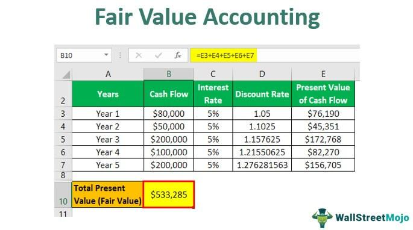

Valuation is a cornerstone of financial markets, providing the basis for making informed investment and trading decisions. It involves determining the intrinsic value of an asset, whether it's a stock, bond, or any other finance-related instrument. Accurate valuation is crucial as it allows investors to identify underpriced or overpriced assets, guiding them towards profitable trading and investment strategies. Misvaluation, on the other hand, can lead to suboptimal portfolio performance and increased financial risk.

In recent years, algorithmic trading has gained prominence within financial markets, revolutionizing the way assets are traded. This approach leverages advanced computational algorithms to execute trading strategies at speeds and frequencies far beyond human capability. Central to these strategies is the fair value assessment of assets, which helps traders identify price discrepancies and capitalize on short-lived market opportunities. Algorithmic trading relies heavily on accurate valuation to create models that can predict market movements and execute trades with precision.



The purpose of this article is to explore the various valuation formulas used within the financial sector and their integration into algorithmic trading strategies. We will examine how these formulas aid traders and investors in assessing intrinsic value and discuss the limitations they face due to market volatility. The article will outline key valuation methods including fundamental analysis, technical analysis, and quantitative approaches, providing a comprehensive understanding of how these techniques function in the valuation process.

Furthermore, the article will discuss practical applications of valuation formulas, such as Discounted Cash Flow (DCF) analysis and Price-to-Earnings (P/E) ratios, showcasing their effectiveness through real-world financial examples. We will also delve into the concept of fair value and its significance in forming trading strategies, as well as the integration of valuation formulas in algorithmic models. Readers will gain insights into the challenges and advancements in this area, particularly in the context of high-frequency trading.

In conclusion, this article aims to equip readers with knowledge about the evolving landscape of valuation and algorithmic trading, emphasizing the necessity of accurate valuation in financial markets. The goal is to encourage further exploration and adaptation to ongoing developments in this dynamic field, ultimately fostering more effective trading strategies.

## Table of Contents

## Understanding Valuation Formulas

Valuation formulas are integral tools in finance, designed to determine the intrinsic value of assets, allowing investors, traders, and financial analysts to make informed decisions. These formulas serve to quantify the true worth of an asset, separated from market noise and speculation, and are essential for assessing investment opportunities and risk.

**Key Valuation Methods**

Three primary methods underpin valuation practices: [fundamental analysis](/wiki/fundamental-analysis), technical analysis, and quantitative methods.

1. **Fundamental Analysis**: This method focuses on evaluating an asset's intrinsic value based on economic and financial factors. It involves examining financial statements, management quality, industry conditions, and economic indicators. For instance, the Discounted Cash Flow (DCF) model, used to estimate the value of an investment based on its expected future cash flows, is a staple in fundamental analysis.
$$
    \text{DCF} = \sum \frac{CF_t}{(1 + r)^t}

$$

    where $CF_t$ is the cash flow at time $t$ and $r$ is the discount rate.

2. **Technical Analysis**: This approach studies price patterns and trading volumes to forecast future price movements. Unlike fundamental analysis that looks at intrinsic values, technical analysis assesses historical market data. Common tools include moving averages and the Relative Strength Index (RSI).

3. **Quantitative Methods**: These involve applying mathematical models and statistical techniques to assess asset value. Quantitative analysis relies heavily on numerical data and computer algorithms to evaluate market trends and price movements.

**Assessing Intrinsic Value**

Valuation formulas help investors determine an asset's intrinsic value by integrating financial metrics and market expectations. This assessment supports decisions around buying, holding, or selling securities. By distinguishing between an asset's market price and its intrinsic value, investors can identify undervalued or overvalued assets, allowing for strategic investment tactics.

**Importance of Historical Data and Market Trends**

Historical data and market trends are foundational in formulating valuation assessments. Historical prices, earnings, and economic indicators provide a backdrop for predicting future market behavior. A robust valuation analysis often incorporates patterns from past cycles to estimate future performance, improving the reliability of forecasts.

**Challenges and Limitations**

Valuation formulas face various challenges, primarily arising from market [volatility](/wiki/volatility-trading-strategies) and unpredictability. Economic shifts, geopolitical events, and sudden market sentiment changes can adversely affect valuation accuracy. Additionally, the reliance on historical data may not always capture future potential, particularly in rapidly changing sectors. Therefore, while critical, valuation formulas should be utilized alongside other data points and market insights for comprehensive analysis.

In conclusion, understanding and applying valuation formulas is crucial for evaluating asset worth and developing effective trading strategies, despite the inherent challenges posed by market dynamics.

## Financial Examples of Valuation

Discounted Cash Flow (DCF) analysis is a cornerstone method for valuing companies by estimating future cash flows and discounting them to their present value. This approach involves forecasting the expected cash flows of a company and applying a discount rate that reflects the company's cost of capital and risk profile. The formula used in DCF analysis is:

$$

\text{DCF} = \sum_{t=1}^{n} \frac{CF_t}{(1+r)^t} 
$$

where $CF_t$ represents the cash flow for year $t$, $r$ is the discount rate, and $n$ is the number of periods. This method is particularly beneficial for understanding the intrinsic value of a company independent of current market conditions.

Comparable Company Analysis (CCA) offers another avenue for stock evaluation by comparing a company to similar firms in the same industry. This method assumes that companies with similar characteristics will have similar valuation multiples. Analysts use metrics such as the Enterprise Value-to-EBITDA ratio to draw comparisons. This approach is especially useful for gaining quick insights into a company’s relative position within its sector.

The Price-to-Earnings (P/E) ratio is a widely used tool for stock valuation, reflecting the market's expectations about a company's future growth prospects. The P/E ratio is calculated by dividing the market value per share by the earnings per share (EPS). This ratio helps investors determine whether a stock is overvalued or undervalued compared to its earnings.

Successful valuation case studies often highlight the application of these methods in real-world scenarios. For instance, the accurate DCF analysis of tech companies like Apple or Microsoft involved understanding their future cash flow potential in rapidly evolving markets. The use of CCA and P/E ratios proved fundamental in assessing these companies’ market positions relative to their peers.

Valuation methods can differ substantially across various sectors. In asset-heavy industries such as utilities and manufacturing, where cash flow predictability is higher, DCF analysis is prevalent. In contrast, technology and biotech sectors often rely more on CCA due to the rapid changes and uncertainties inherent in these industries. The choice of valuation technique must, therefore, be aligned with sector-specific dynamics and the company's unique business model.

## Fair Value and Its Role in Algo Trading

Fair value is a financial concept that represents the estimated theoretical price at which an asset would change hands between a buyer and seller, each having reasonable knowledge of the relevant facts and neither being under any compulsion to buy or sell. Fair value provides a benchmark for evaluating the pricing of assets in financial markets and plays a crucial role in trading strategies, particularly [algorithmic trading](/wiki/algorithmic-trading).

Algorithmic traders employ fair value assessments to identify assets that are mispriced relative to their theoretical fair value. This mispricing occurs when the market price deviates from the intrinsic value indicated by financial models. By systematically buying undervalued assets and selling overvalued ones, algo traders strive to capitalize on price corrections as the market gravitates toward efficiency. This approach is rooted in the Efficient Market Hypothesis (EMH), which posits that asset prices reflect all available information. However, temporary deviations present opportunities for traders who can swiftly recognize and correct these anomalies.

Fair value assessment is fundamental to achieving market efficiency. It aids in reducing price discrepancies by guiding market participants towards transactions that align prices with their intrinsic values. In practice, algorithmic models are leveraged to integrate fair value calculations. For example, statistical [arbitrage](/wiki/arbitrage) strategies utilize complex algorithms to assess fair values and execute trades by exploiting temporary pricing inefficiencies among related financial instruments.

A key example of an algorithmic model that incorporates fair value calculations is the mean reversion strategy. This approach assumes that asset prices will, on average, revert to their historical mean over time. By identifying when prices deviate significantly from their historical average, algos can predict potential price corrections. The Python snippet below provides a basic implementation of a mean reversion strategy:

```python
import numpy as np
import pandas as pd

# Example asset price data
prices = pd.Series([100, 101, 102, 103, 102, 101, 100, 99, 98, 97])

# Calculate rolling mean and standard deviation
rolling_mean = prices.rolling(window=3).mean()
rolling_std = prices.rolling(window=3).std()

# Define buy/sell signals based on statistical thresholds
buy_signal = (prices < (rolling_mean - rolling_std))
sell_signal = (prices > (rolling_mean + rolling_std))

print("Buy Signals:\n", buy_signal)
print("Sell Signals:\n", sell_signal)
```

Furthermore, high-frequency trading ([HFT](/wiki/high-frequency-trading-strategies)), a subset of algorithmic trading, heavily relies on precise fair value assessments. In HFT, trades are executed within milliseconds, necessitating algorithms capable of rapidly calculating fair values and identifying minute pricing discrepancies across various markets. The instantaneous nature of HFT amplifies the impact of fair value assessments, contributing to enhanced market [liquidity](/wiki/liquidity-risk-premium) and tighter bid-ask spreads.

In summary, fair value is pivotal in guiding algorithmic trading strategies by identifying mispriced assets, supporting market efficiency, and driving successful algorithmic models. Its integration within high-frequency trading underscores its critical role in enabling rapid, informed trading decisions.

## Algorithmic Trading and Valuation Integration

Algorithmic trading, also known as algo trading, is a method of executing orders using automated pre-programmed trading instructions. This allows for orders to be executed at speeds and frequencies that are impossible for human traders. Algometric execution aims to achieve the best possible price by precise timing and execution of trades over milliseconds or microseconds, capitalizing on specific market conditions and inefficiencies.

Valuation formulas are crucial in the construction and optimization of trading algorithms. They provide a quantitative basis for making trading decisions by assessing the potential profitability of trades and can be integrated in algorithmic models to evaluate the intrinsic value of securities. These formulas—ranging from Discounted Cash Flow (DCF) to more sophisticated quantitative methods—support algorithms in identifying mispriced assets, thus forming the core of effective trading strategies.

Despite their usefulness, the integration of these valuation models within trading algorithms presents challenges. Market conditions can be volatile, and inputs for these models may change rapidly, leading to discrepancies between predicted and actual asset values. Another challenge is the adaptability of these models to incorporate new information in real-time, which is crucial for maintaining their accuracy and relevance in fast-paced trading environments.

Machine learning and Artificial Intelligence (AI) are significantly enhancing valuation processes within algorithmic trading. These technologies facilitate the analysis of vast amounts of data, spotting patterns that would be indiscernible to the human eye, and therefore improve the predictive power of valuation models. By employing techniques like neural networks and natural language processing, algorithms can refine their strategies based on historical data, market sentiment, and even real-time news analytics.

Looking forward, the landscape of valuation-integrated algorithmic trading is set to transform continually. Future trends point towards the increased use of [machine learning](/wiki/machine-learning) models that can self-optimize, further advancing the capabilities of algo trading systems. Additionally, the incorporation of [alternative data](/wiki/best-alternative-data) sources—such as social media metrics and consumer behavior data—into valuation models is anticipated to provide even more nuanced insights, presenting new opportunities and challenges in leveraging these advanced trading systems. As technologies and data sources develop, so too will the sophistication and accuracy of the underlying valuation models driving algorithmic trading strategies.

## Conclusion

Valuation remains a cornerstone in financial decision-making, underpinning both investment choices and risk management. By determining the intrinsic value of assets, valuation techniques equip investors and traders with critical insights, enabling informed decisions. This is crucial in market environments characterized by complexity and uncertainty.

The rapid evolution of algorithmic trading has transformed the financial markets, integrating advanced valuation techniques into trading models. These algorithms capitalize on speed and data analysis, assessing asset values in real-time to identify profitable trading opportunities. This integration not only enhances market efficiency but also promotes the discovery of asset mispricing. As algorithmic trading continues to evolve, so too will the methods used to evaluate fair value, facilitated by advances in machine learning and [artificial intelligence](/wiki/ai-artificial-intelligence).

Leveraging valuation formulas effectively can significantly improve trading strategies. By quantitatively breaking down market data, these formulas help traders discern price movements and trends that may not be immediately apparent. This computational approach serves as a robust foundation on which to build and optimize trading algorithms.

The financial markets are in a constant state of flux, making continuous learning and adaptation essential. Innovations in valuation techniques and their application in trading algorithms demand that professionals stay abreast of the latest developments. As the data landscape expands and technology advances, new opportunities and challenges will arise, highlighting the importance of ongoing education and adaptation within the industry.

Readers are encouraged to delve deeper into this dynamic field, exploring how emerging technologies and methodologies are shaping the future of finance. By doing so, they can better equip themselves to navigate the intricacies of financial markets and stay ahead in a rapidly changing environment.

## References & Further Reading

[1]: Bergstra, J., Bardenet, R., Bengio, Y., & Kégl, B. (2011). ["Algorithms for Hyper-Parameter Optimization."](https://dl.acm.org/doi/10.5555/2986459.2986743) Advances in Neural Information Processing Systems 24.

[2]: ["Advances in Financial Machine Learning"](https://www.amazon.com/Advances-Financial-Machine-Learning-Marcos/dp/1119482089) by Marcos Lopez de Prado

[3]: ["Evidence-Based Technical Analysis: Applying the Scientific Method and Statistical Inference to Trading Signals"](https://www.amazon.com/Evidence-Based-Technical-Analysis-Scientific-Statistical/dp/0470008741) by David Aronson

[4]: ["Machine Learning for Algorithmic Trading"](https://github.com/PacktPublishing/Machine-Learning-for-Algorithmic-Trading-Second-Edition) by Stefan Jansen

[5]: ["Quantitative Trading: How to Build Your Own Algorithmic Trading Business"](https://books.google.com/books/about/Quantitative_Trading.html?id=j70yEAAAQBAJ) by Ernest P. Chan