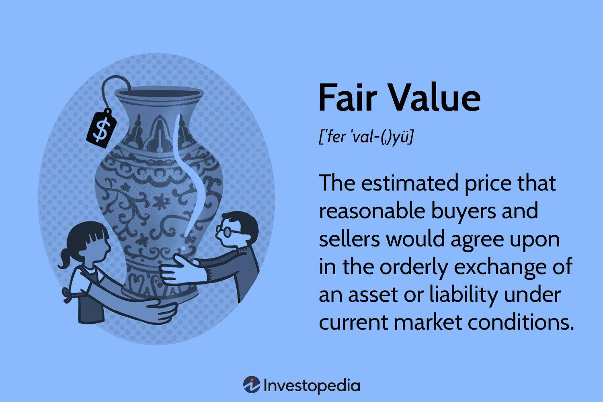

## Table of Contents

## What is fair value?

Fair value is a term used to describe the price at which an asset would be sold or a liability settled between willing parties in an open market. It's an important concept in accounting and finance because it helps to show the true value of an asset or liability, rather than just what was paid for it originally. This is useful for making sure financial statements reflect the current market conditions accurately.

To find the fair value, people often look at what similar assets or liabilities have been sold for recently. This is called the market approach. If there aren't enough similar transactions to compare, they might use other methods like calculating the present value of future cash flows the asset is expected to generate. This is known as the income approach. Both methods aim to estimate what the asset or liability would be worth in a fair and open market.

## How is fair value different from market value?

Fair value and market value are similar but not exactly the same. Fair value is the price that would be received to sell an asset or paid to transfer a liability in an orderly transaction between market participants at the measurement date. It's a theoretical value that considers what willing buyers and sellers would agree upon in a hypothetical transaction. This means fair value takes into account the highest and best use of the asset, even if that use is not currently being realized.

On the other hand, market value is the price at which an asset would trade in a competitive auction setting. It's more about what the asset is actually selling for in the market at a specific time. Market value is often based on recent transactions of similar assets and can be influenced by current market conditions, like supply and demand. While fair value aims to reflect an ideal market scenario, market value reflects the real-world price at a given moment.

## Why is fair value important in accounting and finance?

Fair value is important in accounting and finance because it helps show how much assets and liabilities are really worth right now. This is different from what they might have cost when they were bought. By using fair value, businesses can make sure their financial statements are more accurate and up-to-date. This is helpful for everyone who looks at these statements, like investors and creditors, because they can see a clearer picture of the company's financial health.

Using fair value also helps companies follow accounting rules and standards. Many of these rules, like those set by the International Financial Reporting Standards (IFRS) and the Generally Accepted Accounting Principles (GAAP), require or recommend using fair value for certain assets and liabilities. This makes it easier to compare financial statements from different companies because everyone is using the same method to value their assets and liabilities. In the end, fair value helps make financial reporting more transparent and reliable.

## What are the main methods used to determine fair value?

There are three main methods used to figure out fair value: the market approach, the income approach, and the cost approach. The market approach looks at what similar assets or liabilities have been sold for recently. It's like comparing the price of your house to what other houses in your neighborhood sold for. This method works well when there are lots of similar transactions to compare, but it can be hard to use if there aren't many recent sales.

The income approach is used when you want to figure out the value of an asset based on the money it's expected to make in the future. This method calculates the present value of those future cash flows. It's like trying to guess how much money a business will make and then figuring out what that's worth today. This method is often used for things like businesses or investments where future earnings are important.

The cost approach looks at how much it would cost to replace the asset with a new one. It's like figuring out how much it would cost to rebuild your house if it burned down. This method is useful for things like buildings or equipment, where the value is closely tied to what it would cost to replace them. Each of these methods helps to estimate what an asset or liability would be worth in a fair and open market.

## How does the concept of fair value apply to financial reporting?

Fair value is really important for financial reporting because it helps show how much things are worth right now. In financial statements, companies need to list the value of their assets and liabilities. Using fair value means they can show the current market price instead of the price they paid a long time ago. This makes the financial statements more accurate and helps investors and other people understand the company's real financial situation better.

When companies report using fair value, they follow specific rules set by accounting standards like IFRS and GAAP. These rules tell companies which assets and liabilities should be reported at fair value and how to figure out that value. By using fair value, everyone can compare financial statements from different companies more easily because they're all using the same way to value their assets and liabilities. This makes financial reporting clearer and more reliable for everyone who looks at these statements.

## What are the challenges in measuring fair value?

Measuring fair value can be tricky because it's based on what people think something is worth in a perfect market. The main challenge is finding good information to use for the calculation. If there aren't many recent sales of similar assets, it's hard to use the market approach. And if the future cash flows from an asset are hard to predict, the income approach becomes difficult too. Sometimes, the cost approach isn't helpful if the asset is unique and hard to replace.

Another challenge is that fair value can change a lot over time. Market conditions, like supply and demand, can make the value go up or down quickly. This means companies have to keep updating their fair value estimates, which can be a lot of work. Also, different people might come up with different fair value estimates for the same asset because they use different information or make different guesses about the future. This can make financial reporting less clear and harder to compare between companies.

## How do international accounting standards address fair value?

International accounting standards, like those set by the International Financial Reporting Standards (IFRS), have specific rules about using fair value. These rules help companies decide when to use fair value and how to figure it out. For example, IFRS 13 gives a detailed guide on how to measure fair value. It says companies should use the market approach, income approach, or cost approach depending on what makes the most sense for the asset or liability they're valuing. This helps make sure that financial statements from different countries can be compared more easily because everyone is using the same methods.

Even though IFRS provides clear rules, measuring fair value can still be challenging. The standards recognize that sometimes it's hard to find good information to use for the calculation. For instance, if there aren't many recent sales of similar assets, it's tough to use the market approach. And if future cash flows are hard to predict, the income approach becomes tricky. IFRS tries to help by giving companies options and flexibility, but it also means that different companies might come up with different fair value estimates for the same asset, which can make financial reporting less clear and harder to compare.

## What role does fair value play in investment decisions?

Fair value helps people make smart investment choices. When investors look at a company's financial statements, they want to know how much the company's assets and liabilities are really worth right now. Fair value gives them that information. If an asset's fair value is higher than what the company paid for it, that's good news because it means the asset has gone up in value. On the other hand, if an asset's fair value is lower, it might be a warning sign that the company's investments aren't doing well.

Using fair value can also help investors compare different companies. Since fair value follows the same rules everywhere, it's easier to look at financial statements from different companies and see which ones are doing better. Investors can see which companies have assets that are worth more and which ones might be overvalued. This helps them decide where to put their money to get the best return.

## How can fair value impact financial statements?

Fair value can change the numbers on a company's financial statements. When a company uses fair value, it shows the current market price of its assets and liabilities instead of what they paid for them a long time ago. If the fair value of an asset goes up, the company can show a higher value on its balance sheet, which makes it look more valuable. But if the fair value goes down, the company has to show a lower value, which can make it look less healthy. This can affect how much profit or loss the company reports because the changes in fair value are often included in the income statement.

Using fair value also makes financial statements more useful for people who look at them, like investors and creditors. When everyone uses the same rules to figure out fair value, it's easier to compare financial statements from different companies. This helps people make better decisions about where to invest their money or whether to lend to a company. But it can also make financial statements more complicated because fair value can change a lot over time, and different people might come up with different estimates for the same asset.

## What are the criticisms of using fair value measurements?

Some people don't like using fair value because it can be hard to figure out the right number. Fair value depends on what people think something is worth in a perfect market, but it's not always easy to find good information to help make that guess. For example, if there aren't many recent sales of similar things, it's tough to use the market approach. And if it's hard to predict how much money an asset will make in the future, the income approach gets tricky too. This means different people might come up with different fair value numbers for the same thing, which can make financial reports confusing and hard to compare.

Another problem with fair value is that it can change a lot over time. Market conditions, like supply and demand, can make the value go up or down quickly. This means companies have to keep updating their fair value estimates, which can be a lot of work. It also makes financial statements less stable because the numbers can jump around a lot. Some people worry that this can make companies look more or less healthy than they really are, just because of changes in the market. This can make it harder for investors and others to trust the financial reports.

## How does fair value affect mergers and acquisitions?

Fair value plays a big role in mergers and acquisitions because it helps figure out how much a company is worth. When one company wants to buy another, they need to know the fair value of the other company's assets and liabilities. This helps them decide how much to pay for the company. If the fair value of the assets is higher than the liabilities, the company might be worth more than what's shown on its old financial statements. This can make the buyer willing to pay more for the company.

But figuring out fair value for mergers and acquisitions can be tricky. Sometimes, it's hard to find good information to use for the calculation. If there aren't many recent sales of similar companies, it's tough to use the market approach. And if it's hard to predict how much money the company will make in the future, the income approach gets tricky too. This means different people might come up with different fair value numbers for the same company, which can make it hard to agree on a price for the merger or acquisition.

## What advanced techniques can be used to enhance the accuracy of fair value estimates?

To make fair value estimates more accurate, companies can use advanced techniques like Monte Carlo simulations. This method helps figure out the value of an asset by running many different scenarios to see what might happen in the future. It's like playing out a lot of different stories to see which ones are most likely. This can be really helpful when it's hard to predict future cash flows or when the market is changing a lot. By using a computer to run these simulations, companies can get a better idea of what the asset might be worth.

Another technique is using real options analysis. This looks at the value of choices a company can make in the future, like whether to expand a business or sell it. It's like figuring out the value of a "maybe" or a "what if." This method can be useful for things like natural resources or new technology, where the future is really uncertain. By thinking about these options, companies can get a more complete picture of what an asset is worth. Both of these methods help make fair value estimates more accurate by considering more possibilities and uncertainties.

## What is Understanding Financial Valuation?

Financial valuation plays a pivotal role in the finance domain as it involves determining the present or future worth of an asset or company. Among the various techniques utilized for financial valuation, the discounted cash flow (DCF) model and the capital asset pricing model (CAPM) are prominent.

The discounted cash flow model evaluates an asset based on its expected future cash flows. These cash flows are projected and then discounted back to the present value using a specific discount rate. Mathematically, this can be represented as:

$$

PV = \sum_{t=1}^{n} \frac{CF_t}{(1 + r)^t} 
$$

where $PV$ is the present value of the asset, $CF_t$ is the cash flow in period $t$, $r$ is the discount rate, and $n$ is the number of periods.

The capital asset pricing model, on the other hand, provides a framework to determine the expected return of an asset based on its systematic risk. The formula for CAPM is:

$$

E(R_i) = R_f + \beta_i (E(R_m) - R_f) 
$$

where $E(R_i)$ is the expected return on the investment, $R_f$ is the risk-free rate, $\beta_i$ is the beta of the investment, and $E(R_m)$ is the expected return of the market.

Valuation is critical as it allows investors to determine whether an asset is overvalued, undervalued, or fairly priced based on intrinsic value calculations. By comparing the market price of an asset to its intrinsic value, investors and analysts can make informed decisions. For example, if an asset's intrinsic value is higher than its market price, it may be considered undervalued and a potential buy opportunity. Conversely, if the market price exceeds intrinsic value, the asset might be seen as overvalued, suggesting a potential sell opportunity.

Effective valuation helps analysts and investors by providing a benchmark or reference point to guide their investment decisions. It enables them to evaluate assets more accurately and strategically, ensuring that their investment portfolios align with their risk tolerance and financial goals.

In summary, understanding financial valuation is essential for making informed and strategic investment decisions. By applying models such as DCF and CAPM, investors can assess the worth of assets more effectively and optimize their portfolios for better financial outcomes.

## What are Asset Pricing Theories?

Asset pricing theories are essential for comprehending how securities are valued within financial markets. These theories provide frameworks to evaluate expected returns and understand the associated risks of various investments, thus contributing to informed decision-making. Two of the most prominent asset pricing models are the Capital Asset Pricing Model (CAPM) and the Arbitrage Pricing Theory (APT).

The Capital Asset Pricing Model (CAPM) is a cornerstone of modern financial theory, formulated by William F. Sharpe, among others. It describes the relationship between the expected return of an asset and its risk, measured by beta ($\beta$). The CAPM is expressed by the formula:

$$
E(R_i) = R_f + \beta_i(E(R_m) - R_f)
$$

where:
- $E(R_i)$ is the expected return of the investment,
- $R_f$ is the risk-free rate,
- $\beta_i$ is the sensitivity of the asset's returns to the market returns,
- $E(R_m)$ is the expected return of the market.

By using the CAPM, investors can estimate an asset's expected return based on its systematic risk relative to the overall market, assisting them in constructing diversified portfolios that aim to maximize returns for a given level of risk.

The Arbitrage Pricing Theory (APT), developed by Stephen Ross, provides an alternative approach to asset pricing. Unlike CAPM, which relies on a single-[factor](/wiki/factor-investing) model, the APT is a multi-factor model. It posits that the expected return of an asset can be modeled as a linear function of various macroeconomic factors or theoretical market indices. The structure of the APT is represented as:

$$
E(R_i) = R_f + b_{i1}F_1 + b_{i2}F_2 + \ldots + b_{in}F_n
$$

where:
- $E(R_i)$ is the expected return of the asset,
- $R_f$ is the risk-free rate,
- $b_{ij}$ is the sensitivity of the asset to factor $j$,
- $F_j$ is the risk premium associated with factor $j$.

APT allows investors to use any number of economic factors that might explain asset returns, which can provide a more comprehensive assessment compared to CAPM's single-factor model. This flexibility of incorporating multiple risk factors makes APT particularly useful when analyzing returns in a dynamic environment.

Both CAPM and APT are crucial for traders and investors when it comes to asset pricing. Understanding these theories enables the accurate valuation of securities and aids in the formulation of strategies to optimize the return-risk balance. This knowledge forms the basis for effectively placing valuations on a wide array of financial instruments, supporting informed investment decisions.

## What is the Concept of Fair Value?

Fair value is a critical concept in finance that denotes an estimate of an asset's intrinsic worth, taking into account its potential future earnings and prevailing market conditions. This valuation metric is pivotal for investors and analysts to ascertain whether an asset is accurately priced, overvalued, or undervalued in the marketplace.

To determine fair value, several methodologies are employed, with the most prominent being the market approach and the income approach. The market approach involves evaluating comparable assets in the market to derive a valuation, often utilizing metrics such as the price-to-earnings (P/E) ratio or the price-to-book (P/B) ratio. This approach assumes that market participants are rational and that similar assets should trade at comparable prices.

On the other hand, the income approach focuses on the present value of expected future cash flows generated by the asset. This method typically involves discounted cash flow (DCF) analysis, where the future cash flows are estimated and then discounted back to their present value using an appropriate discount rate. The formula for the discounted cash flow model is given by:

$$

PV = \sum_{t=1}^{n} \frac{CF_t}{(1 + r)^t} 
$$

where $PV$ is the present value of cash flows, $CF_t$ is the cash flow in period $t$, $r$ is the discount rate, and $n$ is the number of periods.

Accurate assessment of an asset's fair value is essential for guiding investors in making decisions aligned with their financial objectives. By understanding the fair value, investors can strategically allocate their resources, balancing the pursuit of returns with risk considerations. For instance, if an asset's market price is below its fair value, it may present a buying opportunity, whereas an asset priced above its fair value might be a candidate for selling.

In different asset classes, fair value assessments influence trading decisions significantly. For equities, fair value can assist in identifying undervalued stocks that have the potential for price appreciation. In fixed income markets, investors may use fair value to assess bond pricing relative to [interest rate](/wiki/interest-rate-trading-strategies) expectations and credit risk. Commodity traders often rely on fair value evaluations to navigate price [volatility](/wiki/volatility-trading-strategies) and supply-demand dynamics.

Overall, the concept of fair value serves as a foundational element in sound investment practices and strategic trading. As market conditions evolve and new information becomes available, continuous fair value reassessment ensures that investment strategies remain aligned with current market realities, optimizing financial outcomes.

## References & Further Reading

[1]: Sharpe, W. F. (1964). "Capital Asset Prices: A Theory of Market Equilibrium under Conditions of Risk." The Journal of Finance, 19(3), 425-442.

[2]: Ross, S. A. (1976). "The Arbitrage Theory of Capital Asset Pricing." Journal of Economic Theory, 13(3), 341-360.

[3]: Graham, B., & Dodd, D. (1934). ["Security Analysis."](https://books.google.com/books/about/Security_Analysis_The_Classic_1934_Editi.html?id=wXlrnZ1uqK0C) McGraw-Hill Education.

[4]: Hull, J. C. (2015). ["Options, Futures, and Other Derivatives."](https://www.semanticscholar.org/paper/Options%2C-Futures%2C-and-Other-Derivatives-Hull/89bdee500c8623864fc9eb7a471546aa713acc44) Pearson.

[5]: Lopez de Prado, M. (2018). ["Advances in Financial Machine Learning."](https://books.google.com/books/about/Advances_in_Financial_Machine_Learning.html?id=oU9KDwAAQBAJ) Wiley.

[6]: Jorion, P. (2007). ["Value at Risk: The New Benchmark for Managing Financial Risk."](https://link.springer.com/article/10.1007/s11408-007-0057-3) McGraw-Hill.

[7]: Chan, E. P. (2009). ["Quantitative Trading: How to Build Your Own Algorithmic Trading Business."](https://github.com/ftvision/quant_trading_echan_book) Wiley.