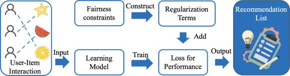

## Table of Contents

## What is a fairness constraint in machine learning?

A fairness constraint in machine learning is a rule that helps make sure a computer model treats everyone fairly. When we train a model, we want it to make good predictions without being biased against certain groups of people. For example, a fairness constraint might make sure that a model used for hiring doesn't favor men over women or one race over another. By adding these constraints, we can guide the model to be more fair and just in its decisions.

To use a fairness constraint, we often change the way we train our model. We add a special part to our training process that checks if the model is being fair. If it's not, the training adjusts the model to make it fairer. This can be done using different methods, like setting up a penalty for unfair predictions or using a special fairness formula. For example, one common fairness measure is demographic parity, which can be expressed as $$P(\hat{Y} = 1 | A = a) = P(\hat{Y} = 1 | A = b)$$, where $$\hat{Y}$$ is the model's prediction, and $$A$$ is the sensitive attribute like gender or race. By making sure this equation holds true, we can help the model treat different groups more equally.

## Why are fairness constraints important in machine learning models?

Fairness constraints are important in machine learning models because they help make sure the models treat everyone equally. Without fairness constraints, a model might make decisions that unfairly affect certain groups of people. For example, if a model is used to decide who gets a loan, it should not favor one race or gender over another. By using fairness constraints, we can guide the model to be more just and fair in its decisions, which is important for building trust and ensuring that technology benefits everyone equally.

Adding fairness constraints to machine learning models also helps prevent bias that can come from the data used to train the models. Data can sometimes reflect historical biases or societal inequalities, and if a model learns from this data without any fairness checks, it might continue these biases. For instance, if past loan data shows fewer loans given to a certain group, a model might learn to do the same unless we use fairness constraints. These constraints help adjust the model's learning process to reduce or eliminate these biases, making the model's predictions more fair and equitable.

## What are some common types of fairness constraints used in machine learning?

There are several common types of fairness constraints used in [machine learning](/wiki/machine-learning), and they aim to make sure models treat everyone fairly. One type is called demographic parity, which means the model's positive outcomes should be the same for different groups of people. For example, if the model is deciding who gets a loan, the percentage of people getting loans should be the same for all groups. This can be written as $$P(\hat{Y} = 1 | A = a) = P(\hat{Y} = 1 | A = b)$$, where $$\hat{Y}$$ is the model's prediction and $$A$$ is the group the person belongs to, like gender or race.

Another type of fairness constraint is equalized odds, which makes sure the model's predictions are equally accurate for different groups. This means that the model's true positive rate and false positive rate should be the same for all groups. For example, if the model is used to predict if someone will repay a loan, it should be equally good at predicting this for all groups. Equalized odds can be expressed as $$P(\hat{Y} = 1 | Y = y, A = a) = P(\hat{Y} = 1 | Y = y, A = b)$$, where $$Y$$ is the actual outcome, like whether the loan was repaid or not.

A third type is called fairness through unawareness, which means the model doesn't use sensitive information like race or gender when making predictions. This is simpler to implement but might not solve all fairness issues because other data might still be related to these sensitive attributes. For example, if the model doesn't use race directly but uses zip codes, which are related to race, it might still be unfair. These different types of fairness constraints help make sure machine learning models treat everyone fairly and don't continue or worsen existing biases.

## How do fairness constraints differ from other types of constraints in machine learning?

Fairness constraints are special rules in machine learning that focus on making sure models treat everyone fairly. Unlike other constraints, which might focus on improving accuracy or reducing the model's complexity, fairness constraints aim to prevent the model from being biased against certain groups of people. For example, while a model might be very accurate overall, it could still unfairly favor one group over another. Fairness constraints help fix this by making sure the model's decisions are just and equal for everyone.

Other types of constraints in machine learning, like regularization constraints, are used to prevent overfitting and improve the model's general performance. Regularization might add a penalty to the model's complexity, encouraging it to be simpler and more generalizable. For example, a common regularization technique is L2 regularization, which adds a term to the loss function to penalize large weights: $$L = L_{original} + \lambda \sum_{i} w_i^2$$. In contrast, fairness constraints don't focus on the model's overall performance but on ensuring that the model's predictions are fair across different groups. This might mean adjusting the model's decisions to meet fairness criteria like demographic parity, $$P(\hat{Y} = 1 | A = a) = P(\hat{Y} = 1 | A = b)$$, where $$\hat{Y}$$ is the model's prediction and $$A$$ is the group attribute.

## Can you explain the concept of disparate impact and how fairness constraints address it?

Disparate impact happens when a rule or a system ends up treating some groups of people unfairly, even if that wasn't the goal. For example, if a bank uses a computer model to decide who gets a loan, and it turns out that fewer people from one group get loans, that's disparate impact. The model might not be using race or gender directly, but the decisions still end up being unfair to certain groups. This can happen because the data the model learned from might have old biases or because the model finds patterns that accidentally hurt some groups more than others.

Fairness constraints help fix disparate impact by making sure the model treats everyone the same. They do this by adding special rules to the model's training process. For example, one fairness rule is called demographic parity, which means the model should give the same percentage of positive outcomes to different groups. This can be written as $$P(\hat{Y} = 1 | A = a) = P(\hat{Y} = 1 | A = b)$$, where $$\hat{Y}$$ is what the model predicts and $$A$$ is the group the person belongs to, like race or gender. By following this rule, the model can help make sure it doesn't unfairly affect any group, reducing the chance of disparate impact.

## What are the challenges in implementing fairness constraints in machine learning algorithms?

Implementing fairness constraints in machine learning algorithms can be tricky. One big challenge is figuring out what fairness means. Different people might have different ideas about what's fair, and there are many ways to measure fairness, like demographic parity or equalized odds. For example, demographic parity says that the model should give the same percentage of positive outcomes to different groups, which can be written as $$P(\hat{Y} = 1 | A = a) = P(\hat{Y} = 1 | A = b)$$. But choosing the right fairness measure can be hard because each one might help some groups but hurt others. Also, the data used to train the model might already have biases from the past, making it tough to create a fair model.

Another challenge is that adding fairness constraints can sometimes make the model less accurate. When we make the model focus on being fair, it might not be able to predict as well as it could without the fairness rules. This trade-off between fairness and accuracy can be a big problem, especially in important decisions like hiring or lending. For example, if we change the model to meet the fairness constraint $$P(\hat{Y} = 1 | Y = y, A = a) = P(\hat{Y} = 1 | Y = y, A = b)$$ for equalized odds, the model might start making more mistakes overall. Balancing fairness with the model's performance is a key challenge that needs careful thought and often requires testing different ways to add fairness constraints to find the best solution.

## How can fairness constraints be integrated into the training process of a machine learning model?

Fairness constraints can be integrated into the training process of a machine learning model by adding special rules that the model must follow. These rules help make sure the model treats everyone fairly. For example, during training, we can add a penalty to the model's loss function if it's not being fair. This penalty guides the model to adjust its predictions so they are more equal across different groups. One common fairness rule is demographic parity, which means the model should give the same percentage of positive outcomes to different groups. This can be written as $$P(\hat{Y} = 1 | A = a) = P(\hat{Y} = 1 | A = b)$$, where $$\hat{Y}$$ is the model's prediction and $$A$$ is the group the person belongs to, like gender or race.

Another way to integrate fairness constraints is by using a method called constrained optimization. This means we set up the training process so that the model not only tries to predict well but also follows fairness rules. For example, we can use a technique called Lagrangian multipliers to make sure the model meets fairness criteria like equalized odds, which can be expressed as $$P(\hat{Y} = 1 | Y = y, A = a) = P(\hat{Y} = 1 | Y = y, A = b)$$, where $$Y$$ is the actual outcome. By adding these fairness constraints to the training process, we can guide the model to make decisions that are both accurate and fair, helping to reduce bias and promote equality.

## What metrics are used to evaluate the effectiveness of fairness constraints in machine learning?

To evaluate how well fairness constraints work in machine learning, we use special fairness metrics. One common metric is demographic parity, which checks if the model gives the same percentage of positive outcomes to different groups. This can be written as $$P(\hat{Y} = 1 | A = a) = P(\hat{Y} = 1 | A = b)$$, where $$\hat{Y}$$ is the model's prediction and $$A$$ is the group, like race or gender. If the model meets this fairness rule, it means it treats everyone equally in terms of positive outcomes. Another metric is equalized odds, which makes sure the model's predictions are equally accurate for different groups. This means the true positive rate and false positive rate should be the same for all groups, expressed as $$P(\hat{Y} = 1 | Y = y, A = a) = P(\hat{Y} = 1 | Y = y, A = b)$$, where $$Y$$ is the actual outcome.

These metrics help us see if the fairness constraints are working. For example, if we're using demographic parity, we can compare the percentage of positive outcomes for different groups to see if they are close enough. If they are, then the model is doing a good job of being fair. But if the percentages are very different, we might need to adjust the model or try different fairness constraints. It's important to keep checking these metrics because even small changes in the model can affect how fair it is. By using these fairness metrics, we can make sure the model treats everyone the same way and helps reduce bias in its decisions.

## Can you provide examples of machine learning applications where fairness constraints have been successfully applied?

One example where fairness constraints have been successfully applied is in the hiring process. A company might use a machine learning model to screen job applicants, but if the model ends up favoring one group over another, it can lead to unfair hiring practices. By adding fairness constraints, like demographic parity, which means the model should give the same percentage of job offers to different groups, the company can make sure its hiring process is fair. For example, if the model is trained to meet the fairness rule $$P(\hat{Y} = 1 | A = a) = P(\hat{Y} = 1 | A = b)$$, where $$\hat{Y}$$ is the model's prediction of getting a job offer and $$A$$ is the group the applicant belongs to, like gender or race, it can help ensure that everyone has an equal chance of being hired.

Another example is in the field of loan approvals. Banks often use machine learning models to decide who gets a loan, but these models can sometimes unfairly deny loans to certain groups of people. To fix this, banks can use fairness constraints like equalized odds, which means the model's predictions should be equally accurate for different groups. This can be expressed as $$P(\hat{Y} = 1 | Y = y, A = a) = P(\hat{Y} = 1 | Y = y, A = b)$$, where $$\hat{Y}$$ is the model's prediction of loan approval, $$Y$$ is whether the loan was actually repaid, and $$A$$ is the group, like race or gender. By applying this fairness rule, the bank can make sure its loan approval process is fair and doesn't unfairly impact any group of people.

## How do fairness constraints impact the overall performance and accuracy of machine learning models?

Adding fairness constraints to machine learning models can sometimes make them less accurate. When a model tries to be fair, it might have to change its predictions to meet fairness rules like demographic parity, which means the model should give the same percentage of positive outcomes to different groups. This can be written as $$P(\hat{Y} = 1 | A = a) = P(\hat{Y} = 1 | A = b)$$, where $$\hat{Y}$$ is the model's prediction and $$A$$ is the group the person belongs to, like gender or race. By trying to meet this rule, the model might not be able to predict as well as it could without the fairness constraints. This trade-off between fairness and accuracy is a big challenge, especially in important decisions like hiring or lending.

However, fairness constraints can also help improve the overall performance of a model in the long run. When a model is fair, it can build trust with the people who use it. If people trust the model, they are more likely to use it and give it good data to learn from. This can lead to better predictions over time. Also, by fixing biases in the model, fairness constraints can help the model work better for everyone, not just certain groups. So, while fairness constraints might lower accuracy at first, they can lead to a more reliable and widely used model in the end.

## What are the latest research developments in the field of fairness constraints in machine learning?

Recent research in fairness constraints for machine learning has focused on developing new ways to balance fairness and accuracy. One key area is the exploration of multi-objective optimization, where researchers try to find models that are both fair and accurate. For example, some studies have used techniques like adversarial training to make models fairer. In adversarial training, a second model is trained to spot and challenge any unfair predictions made by the main model. This helps the main model learn to be more fair. Another approach is to use fairness-aware regularization, where a penalty is added to the model's loss function if it's not being fair. This can be written as $$L = L_{original} + \lambda \cdot L_{fairness}$$, where $$L_{original}$$ is the original loss function and $$L_{fairness}$$ is the fairness penalty. By adjusting the value of $$\lambda$$, researchers can control how much the model focuses on being fair.

Another important development is the study of fairness in different contexts, like healthcare and criminal justice. Researchers are looking at how to apply fairness constraints in these fields, where the stakes are high and fairness is crucial. For instance, in healthcare, fairness constraints can help make sure that a model used to predict diseases treats all patients the same, regardless of race or gender. In criminal justice, fairness constraints can help prevent a model from unfairly predicting higher risks for certain groups. Researchers are also working on new fairness metrics and ways to measure them, like intersectional fairness, which looks at fairness across multiple groups at the same time. This is important because people often belong to more than one group, and fairness should consider all these aspects together.

## How can organizations balance the trade-offs between fairness, accuracy, and other performance metrics when using fairness constraints?

Organizations can balance the trade-offs between fairness, accuracy, and other performance metrics by carefully adjusting the fairness constraints they use in their machine learning models. One way to do this is by using a parameter in the model's loss function that controls how much the model focuses on being fair. For example, if the model's loss function includes a fairness penalty, organizations can change the value of this penalty to find the right balance. This can be written as $$L = L_{original} + \lambda \cdot L_{fairness}$$, where $$L_{original}$$ is the original loss function, $$L_{fairness}$$ is the fairness penalty, and $$\lambda$$ is the parameter that can be adjusted. By tweaking $$\lambda$$, organizations can see how much accuracy they have to give up to make the model fairer and decide what trade-off works best for their needs.

Another way to balance these trade-offs is by testing different fairness constraints and measuring their impact on the model's performance. Organizations can try using different fairness rules, like demographic parity, which means the model should give the same percentage of positive outcomes to different groups, written as $$P(\hat{Y} = 1 | A = a) = P(\hat{Y} = 1 | A = b)$$, where $$\hat{Y}$$ is the model's prediction and $$A$$ is the group the person belongs to. By comparing how these different rules affect accuracy and other metrics, organizations can choose the best approach. It's also important to involve people from different groups in the decision-making process to make sure the model's fairness aligns with what people actually think is fair. This helps ensure that the model not only performs well but also treats everyone fairly.

## References & Further Reading

[1]: Barocas, S., Hardt, M., & Narayanan, A. (2019). ["Fairness and Machine Learning."](https://fairmlbook.org/) A free online book providing a comprehensive introduction to fairness in machine learning.

[2]: Mehrabi, N., Morstatter, F., Saxena, N., Lerman, K., & Galstyan, A. (2021). ["A Survey on Bias and Fairness in Machine Learning."](https://arxiv.org/abs/1908.09635) ACM Computing Surveys (CSUR).

[3]: Kleinberg, J., Ludwig, J., Mullainathan, S., & Sunstein, C. R. (2019). ["Discrimination in the Age of Algorithms."](https://academic.oup.com/jla/article/doi/10.1093/jla/laz001/5476086) Journal of Legal Analysis, 10(1), 113-174.

[4]: Binns, R. (2018). ["Fairness in Machine Learning: Lessons from Political Philosophy."](https://proceedings.mlr.press/v81/binns18a.html) Conference on Fairness, Accountability and Transparency (FAT*).

[5]: Hardt, M., Price, E., & Srebro, N. (2016). ["Equality of Opportunity in Supervised Learning."](https://arxiv.org/abs/1610.02413) Advances in Neural Information Processing Systems 29.

[6]: Chouldechova, A., & Roth, A. (2018). ["The Frontiers of Fairness in Machine Learning."](https://arxiv.org/abs/1810.08810) Annual Review of Statistics and Its Application, 5, 75-99.