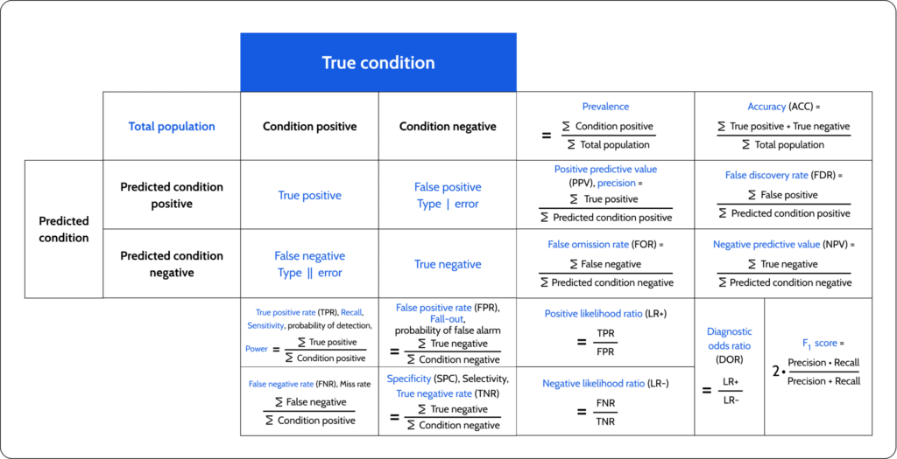

## Table of Contents

## What is a fairness metric in machine learning?

A fairness metric in machine learning is a way to measure if a model treats different groups of people fairly. Imagine you have a computer program that decides who gets a loan. A fairness metric helps check if the program is fair to everyone, no matter their race, gender, or other characteristics. For example, it can look at if the program gives loans to men and women at the same rate.

There are different fairness metrics because fairness can mean different things. One common metric is called "demographic parity," which means the model's decisions should be the same across different groups. For example, if 30% of men get approved for a loan, then 30% of women should get approved too. Another metric is "equal opportunity," which checks if the model gives the same chances to people who should get a positive outcome. These metrics help make sure machine learning models are fair and don't unfairly disadvantage certain groups.

## Why are fairness metrics important in machine learning models?

Fairness metrics are important in machine learning models because they help make sure the models treat everyone fairly. Imagine a computer program that decides if someone gets a job or a loan. If the program is not fair, it might give jobs or loans to some groups of people more often than others, even if everyone is equally qualified. This can hurt people and make society less fair. By using fairness metrics, we can check if the model is being fair and fix it if it's not.

These metrics also help build trust in machine learning models. If people know that a model is checked for fairness, they are more likely to trust it and use it. For example, if a bank uses a fair model to decide on loans, people from different backgrounds will feel more confident that they have a fair chance. This trust is important for making sure that machine learning can be used in ways that help everyone, not just a few.

## What are some common types of fairness metrics used in machine learning?

There are several common types of fairness metrics used in [machine learning](/wiki/machine-learning). One popular metric is demographic parity, which means the model's decisions should be the same across different groups. For example, if a model is used to approve loans, demographic parity would mean the same percentage of men and women get approved. This can be measured by comparing the approval rates across different groups. Another common metric is equal opportunity, which checks if the model gives the same chances to people who should get a positive outcome. For instance, if the model is trying to predict if someone will repay a loan, equal opportunity would mean that the model is equally good at predicting repayment for men and women.

Another important fairness metric is equalized odds, which is a bit more complex. Equalized odds means the model's predictions should be equally accurate for different groups, both for people who should get a positive outcome and those who should not. For example, if the model is trying to predict if someone will commit a crime, equalized odds would mean the model is equally good at predicting this for different races, both for those who will commit a crime and those who won't. Lastly, there's the metric called predictive parity, which focuses on the positive predictive value being the same across groups. This means that if the model predicts someone will get a positive outcome, like getting a loan, the actual chance of that happening should be the same for everyone, no matter their group.

These metrics help make sure machine learning models are fair and don't unfairly disadvantage certain groups. By using these metrics, we can check if a model is treating everyone the same way and fix it if it's not. This is important for making sure that machine learning can be used in ways that help everyone and don't cause harm.

## How do fairness metrics help in identifying and mitigating bias in machine learning models?

Fairness metrics help identify and mitigate bias in machine learning models by providing a way to measure how fair the model's decisions are across different groups of people. When we use these metrics, we can see if the model is treating everyone the same way. For example, if we find that a loan approval model approves loans for men at a higher rate than for women, a fairness metric like demographic parity can show us this difference. By identifying these biases, we can then work on fixing the model to make it fairer.

To mitigate bias, we can use the insights from fairness metrics to adjust the model. If we find that the model is biased against certain groups, we can change the data used to train the model, or we can adjust the model's decision-making process. For instance, if the model is less accurate at predicting loan repayment for a certain group, we can use techniques like re-weighting the data to give more importance to examples from that group. By continuously monitoring and adjusting the model using fairness metrics, we can make sure that it treats everyone fairly and reduces the impact of bias.

## Can you explain the difference between individual fairness and group fairness?

Individual fairness means treating similar people in a similar way. Imagine two people who are very alike in terms of their job history and credit score. If one person gets a loan, the other should get a loan too. This kind of fairness focuses on making sure the model treats each person fairly based on their own characteristics. It's like saying, "If you and I are the same in important ways, we should get the same treatment." Individual fairness can be hard to measure because it's about comparing pairs of people, but it's important for making sure no one is treated unfairly just because of who they are.

Group fairness, on the other hand, looks at how a model treats different groups of people. For example, it might check if men and women get loans at the same rate. Group fairness metrics like demographic parity or equal opportunity focus on making sure that the model's decisions are fair across groups. This means the model should not favor one group over another just because of their group identity. Group fairness is easier to measure because it's about looking at overall rates for different groups, but it might not catch unfairness to individuals within those groups.

## What is the concept of 'disparate impact' and how is it measured in machine learning?

Disparate impact is a concept in machine learning that looks at whether a model's decisions have a different effect on different groups of people. Imagine a computer program that decides who gets a job. If this program says "no" to more women than men, even if they are equally qualified, that's called disparate impact. It means the model is having a bigger, negative effect on one group compared to another, even if it's not trying to be unfair on purpose.

To measure disparate impact in machine learning, we compare how often the model makes a certain decision for different groups. For example, if we want to check if a loan approval model has a disparate impact on race, we would look at the approval rates for different racial groups. If the approval rate for one group is much lower than for another, that could show disparate impact. One way to measure this is by using the "disparate impact ratio," which is calculated as the ratio of the favorable outcome rate for the less favored group to the rate for the more favored group. If this ratio is less than a certain threshold, like 0.8, it suggests there might be a problem with disparate impact.

## How can fairness metrics be applied in different stages of the machine learning lifecycle?

Fairness metrics can be applied at different stages of the machine learning lifecycle to make sure the model is fair. In the data collection and preprocessing stage, fairness metrics can help check if the data used to train the model is biased. For example, if the data shows that one group of people is underrepresented, fairness metrics can help us see this and fix it by collecting more data from that group. During the model training stage, fairness metrics can be used to keep an eye on how the model is learning. If the model starts making unfair decisions, we can adjust it right away. For example, we might use techniques like re-weighting the data to give more importance to examples from underrepresented groups, which helps the model learn to treat everyone fairly.

In the model evaluation stage, fairness metrics are really important. After the model is trained, we use fairness metrics to check if it's making fair decisions. For example, we might use demographic parity to see if the model's decisions are the same across different groups. If we find that the model is not fair, we can go back and make changes to the data or the model. Finally, in the deployment and monitoring stage, fairness metrics help us keep the model fair over time. We can keep checking the model's decisions with fairness metrics to make sure it stays fair, even as new data comes in. If we see that the model starts to become unfair, we can update it to fix the problem.

## What are the challenges in implementing fairness metrics in real-world machine learning applications?

Implementing fairness metrics in real-world machine learning applications can be challenging because there are many different ways to define fairness, and they often conflict with each other. For example, if we want to use demographic parity to make sure the same percentage of men and women get loans, it might mean giving loans to some people who are less likely to repay them. This can conflict with the goal of making good business decisions. Also, fairness metrics can be hard to measure accurately because real-world data is often messy and incomplete. If the data we use to train the model is biased, the model's decisions will be biased too, even if we use fairness metrics to check it.

Another challenge is that fairness metrics can change over time. As new data comes in, the model's decisions might start to become unfair, even if they were fair at first. This means we need to keep checking and updating the model to make sure it stays fair. This can be a lot of work, especially for big models that are used by lots of people. Also, there can be legal and ethical issues to think about. Different places have different laws about fairness and discrimination, and using fairness metrics might not be enough to follow these laws. So, we need to be careful and make sure we understand the rules and how to apply fairness metrics in a way that works for everyone.

## How do fairness metrics relate to ethical considerations in AI?

Fairness metrics are important for making sure AI systems treat everyone fairly, which is a big part of ethical AI. When we use fairness metrics, we can check if an AI model is making decisions that are the same for everyone, no matter their race, gender, or other characteristics. For example, if an AI model decides who gets a job, we can use fairness metrics to see if it's giving jobs to men and women at the same rate. This helps us make sure the AI is not unfairly hurting certain groups of people, which is something that's important for ethical reasons.

However, using fairness metrics can be tricky because there are different ways to define fairness, and they can sometimes conflict with each other. For example, if we want to make sure the same percentage of men and women get loans (demographic parity), it might mean giving loans to some people who are less likely to repay them. This can cause problems for the business using the AI model. Also, fairness metrics can change over time as new data comes in, so we need to keep checking and updating the model to make sure it stays fair. This is important for making sure AI is used in ways that are ethical and don't cause harm to anyone.

## Can you discuss a case study where fairness metrics were used to improve a machine learning model?

In a case study from the healthcare industry, a machine learning model was used to predict the risk of patients developing a certain disease. The model was initially found to be less accurate for certain ethnic groups, which could lead to unfair treatment and poorer health outcomes for those groups. To address this, the researchers used fairness metrics like equal opportunity and equalized odds to check how the model was performing for different groups. They found that the model's predictions were not as good for one ethnic group compared to others. By using these fairness metrics, the team was able to identify the bias and adjust the model to make it fairer. They did this by re-weighting the training data to give more importance to examples from the underrepresented group, which helped improve the model's accuracy for everyone.

In another example, a company used a machine learning model to decide which job applicants to interview. They noticed that the model was approving fewer women than men, even when the applicants had similar qualifications. To fix this, the company used the fairness metric of demographic parity to compare the approval rates for men and women. They found that the model was indeed biased against women. By using demographic parity as a guide, the company was able to adjust the model to make sure it was treating everyone the same way. They did this by changing the data used to train the model and by adding new features that helped the model make fairer decisions. As a result, the model started approving men and women at the same rate, making the hiring process more fair.

## What are the latest research developments in fairness metrics for machine learning?

Recent research in fairness metrics for machine learning has been focusing on developing new ways to measure and improve fairness. One big development is the creation of fairness metrics that can handle multiple sensitive attributes at the same time. For example, instead of just looking at fairness by race or gender, these new metrics can look at fairness across race, gender, and age all at once. This is important because real-world fairness problems often involve many different groups. Researchers are also working on fairness metrics that can work well even when the data is not perfect. They are trying to find ways to measure fairness when the data is missing information or when the groups are not clearly defined.

Another area of research is about making fairness metrics easier to use in real-world applications. This includes developing tools and software that help people check and improve the fairness of their machine learning models. For example, researchers have created libraries that let you easily calculate fairness metrics and adjust your models to make them fairer. They are also working on ways to make sure that fairness metrics can be used in different kinds of machine learning models, not just the most common ones. This is important because different models are used in different situations, and fairness is important no matter what kind of model you are using.

## How can organizations balance the trade-offs between model performance and fairness when using fairness metrics?

Balancing the trade-offs between model performance and fairness can be tricky for organizations. When they use fairness metrics to make their machine learning models more fair, they might find that the model's overall accuracy goes down a bit. For example, if a company wants to make sure that their loan approval model treats men and women the same, they might need to approve loans for some people who are less likely to repay them. This can hurt the model's performance, but it's important for treating everyone fairly. Organizations need to think about how much fairness they want and how much they are willing to give up in terms of performance.

To find the right balance, organizations can use different techniques. One way is to try out different versions of the model and see how each one does on both fairness and performance. They can use fairness metrics like demographic parity or equal opportunity to check how fair the model is, and then compare that to the model's overall accuracy. If the model is too unfair, they can adjust it to be more fair, even if it means the performance goes down a little. On the other hand, if the model's performance is too low, they might need to find other ways to make it more accurate without hurting fairness too much. By carefully checking and adjusting the model, organizations can find a good balance that works for everyone.

## References & Further Reading

[1]: Barocas, S., Hardt, M., & Narayanan, A. (2019). ["Fairness and Machine Learning."](https://fairmlbook.org/) fairmlbook.org.

[2]: Mehrabi, N., Morstatter, F., Saxena, N., Lerman, K., & Galstyan, A. (2021). ["A Survey on Bias and Fairness in Machine Learning."](https://arxiv.org/abs/1908.09635) Knowledge and Information Systems, 63(9), 2493-2532.

[3]: Chouldechova, A. (2017). ["Fair Prediction with Disparate Impact: A Study in Bias and Fairness in Machine Learning."](https://pubmed.ncbi.nlm.nih.gov/28632438/) Big Data, 5(2), 153-163.

[4]: Corbett-Davies, S., & Goel, S. (2018). ["The Measure and Mismeasure of Fairness: A Critical Review of Fair Machine Learning."](https://arxiv.org/abs/1808.00023) Communications of the ACM, 61(6), 39-49.

[5]: Kleinberg, J., Mullainathan, S., & Raghavan, M. (2017). ["Inherent Trade-Offs in the Fair Determination of Risk Scores."](https://arxiv.org/abs/1609.05807) ITCS '17: 395-402.