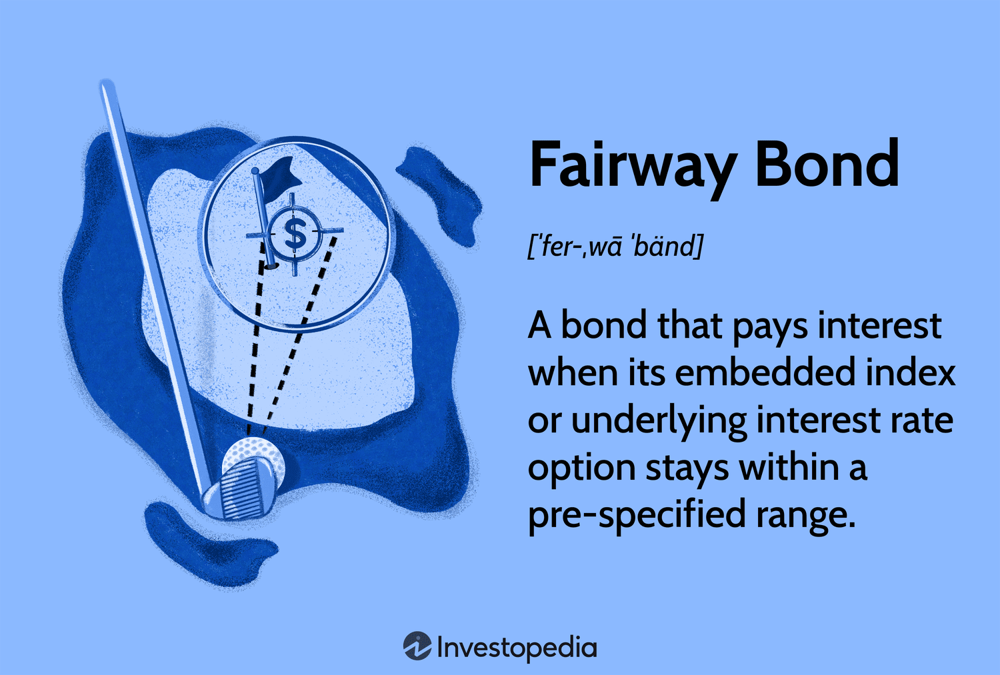

In finance, investors constantly seek innovative strategies promising solid returns while managing risk. One such strategy is fairway bond investment, a type of bond recognized for its floating interest rates. Fairway bonds, often referred to as index floaters or range accrual notes, feature interest payments linked to a benchmark interest rate or index, which fluctuate within a predefined range. This structure makes them particularly attractive for investors anticipating stable interest rates, offering a balance between risk and return that traditional fixed-rate bonds may not provide.

This article explores the nuances of fairway bonds, their potential benefits, and how algorithmic trading is reshaping bond investment finance. As automated systems become increasingly prevalent in financial markets, understanding these intersections is crucial for both seasoned and novice investors. Algorithmic trading employs complex algorithms and machine learning to automate the trading process, enhancing decision-making through precise timing and efficient execution. This technological advancement allows investors to optimize their bond strategies, particularly when navigating the slightly fluctuating rates characteristic of fairway bonds.



Key concepts and trends will be discussed, providing insights into how fairway bonds and algorithmic trading can significantly enhance portfolio management. With these tools, investors can systematically monitor market conditions, ensuring their assets remain within optimal interest ranges and thus securing better yields. By embracing these innovative strategies, investors can align their practices with market opportunities, ensuring long-term growth and stability.

A fairway bond distinguishes itself through its use of a calculated, floating interest rate, allowing it to remain adaptable to market changes while offering greater potential returns than traditional bonds. Understanding these bonds and leveraging automation creates opportunities for portfolio diversification and effective interest rate risk management. As financial technologies continue to evolve, staying informed and adaptive is key to cultivating successful investment strategies.

## Table of Contents

## Understanding Fairway Bonds

Fairway bonds, commonly referred to as index floaters or range accrual notes, represent a unique class of bonds that derive interest payments based on an index or underlying interest rate option remaining within a designated range. These financial instruments have gained attention as they provide potential advantages in specific interest rate environments.

The term "fairway" is inspired by golf, where "staying in the fairway" refers to remaining on a desirable and optimal path. Similarly, fairway bonds are designed to perform well when interest rates fluctuate within a certain range, thus optimizing returns under stable or slightly varying conditions. The underlying index could be linked to various benchmarks, such as the London Interbank Offered Rate (LIBOR) or the U.S. Treasury Rate, and the bond accrues interest at a variable rate reflecting these benchmarks' performance within the agreed range.

A notable feature of fairway bonds is their appeal to conservative investors. These bonds are particularly beneficial when there is an expectation that interest rates will not deviate significantly over the life of the bond. In this scenario, fairway bonds can yield higher returns compared to traditional fixed-rate bonds, assuming the [interest rate](/wiki/interest-rate-trading-strategies) remains within the specified range. For instance, if the agreed interest rate range is 1% to 3% and the actual rate consistently stays within this band, investors may earn superior returns compared to a fixed-rate bond set at 1.5%.

The mechanism of fairway bonds includes specific conditions where interest accrual occurs only if the index remains within the predetermined range. If rates fall outside of this range, the bond may accrue little to no interest, thus safeguarding the issuer from excessive interest payouts during unfavorable conditions. However, the bondholder is protected by receiving the principal back at maturity, adding a layer of security.

Consider a hypothetical example: a fairway bond linked to LIBOR with a range set between 1.5% and 3.5%. As long as LIBOR stays within this interval, the bond pays a competitive floating rate. Should LIBOR exceed 3.5% or drop below 1.5%, the accrued interest could be significantly reduced or cease entirely. This payoff structure naturally attracts investors confident in stable market conditions.

In summary, fairway bonds offer a dynamic investment opportunity tailored for market conditions where interest rate stability is anticipated. By offering potential higher yields when rates remain within their target ranges, they serve as an attractive option for investors seeking balance between risk and returns.

## Benefits of Fairway Bonds

Fairway bonds present an attractive investment opportunity, particularly due to their unique ability to offer higher yields compared to traditional bonds, contingent upon the alignment of market conditions with the predicted range. Unlike fixed-rate bonds, whose yields remain constant regardless of interest rate changes, fairway bonds have floating interest rates that allow them to adapt and potentially provide better returns when rates stay within a specified band. This characteristic makes them particularly appealing to investors seeking predictable income with minimized risk exposure.

In sideways markets, where interest rates fluctuate minimally within a range, fairway bonds provide an advantage by maintaining a stable income stream while adjusting to modest rate changes. This stability is afforded by the core design of fairway bonds, which accrue benefits when rates are within a set range, effectively allowing investors to maximize returns in stable interest rate environments.

During periods of incremental interest rate increases, fairway bonds can be particularly advantageous. They leverage the potential of floating rates, ensuring that bondholders can benefit from slight rate hikes without the [volatility](/wiki/volatility-trading-strategies) that typically accompanies significant market fluctuations. This quality is especially beneficial for investors who require a safeguard against substantial rate shifts while still aiming to optimize returns.

Moreover, fairway bonds guarantee the return of principal at maturity, even if market conditions are unfavorable. This assurance of capital return enhances their appeal as a secure investment vehicle. The structure of these bonds inherently provides a buffer against risks commonly associated with significant interest rate changes, further solidifying their position as a prudent investment choice for conservative investors.

In summary, fairway bonds offer a blend of higher yield potential and risk management, making them suitable for investors who prioritize stable returns and capital preservation. Their adaptive nature under various interest rate scenarios underscores their utility in diversified investment portfolios, providing both security and opportunity in managing interest rate risks.

## The Role of Algorithmic Trading in Bond Investment

Algorithmic trading, commonly referred to as algo trading, has fundamentally transformed the bond market by integrating sophisticated technology to automate trading decisions. This approach utilizes predefined criteria encompassing timing, price, and [volume](/wiki/volume-trading-strategy) to execute trades. By employing complex algorithms and advancements in [machine learning](/wiki/machine-learning), traders can efficiently manage large orders, thereby minimizing market impact and enhancing the overall execution of trades.

The implementation of [algorithmic trading](/wiki/algorithmic-trading) in the bond market enables investors to capitalize on the dynamic interest rate environment characteristic of fairway bonds. Fairway bonds, known for their dependence on fluctuating interest rates within a specified range, benefit significantly from the precise and timely execution that algo trading can provide. This precision allows traders to optimize entry and [exit](/wiki/exit-strategy) points, thereby maximizing returns and minimizing risks associated with market volatility.

The automation brought forth by algorithmic trading leads to improved trading strategies that are not only reactive but also predictive. For instance, algorithms can analyze historical data and real-time market conditions to predict interest rate movements with a higher degree of accuracy. This predictive capability is particularly beneficial in the bond market, where interest rate trends can significantly impact bond pricing and yields.

Moreover, algo trading enhances [liquidity](/wiki/liquidity-risk-premium) in the bond market. The ability to execute trades rapidly and with reduced costs encourages more trading activity, leading to a more liquid market environment. This increased liquidity not merely aids individual investors in executing trades swiftly but also contributes to the stabilization of the overall bond market.

Looking forward, the integration of machine learning and [artificial intelligence](/wiki/ai-artificial-intelligence) (AI) within algorithmic trading is poised to further refine these benefits. Machine learning algorithms can be trained to recognize complex patterns in market data, leading to more accurate predictions and smarter trade execution strategies. As these technologies continue to advance, they are expected to forge more effective investment strategies, thereby shaping the future of bond trading.

The implications of these advancements are profound, suggesting a future where technology not only aids in executing trades but also plays an integral role in strategic decision-making. Investors who leverage these technologies can expect to maintain a competitive edge, staying ahead in a rapidly shifting market landscape. As algorithmic trading continues to evolve, it is set to redefine the possibilities within bond investment finance.

## Combining Fairway Bonds and Algo Trading for Optimal Returns

Fairway bonds and algorithmic trading combined can create a robust investment strategy aimed at optimizing returns while managing risk effectively. By automating the monitoring of market conditions, investors can keep the bond's performance within its ideal interest range, thus securing better yields. This approach leverages the dynamic nature of fairway bonds, which are designed to capitalize on interest rates remaining within a pre-specified range.

Implementing an automated trading system requires understanding both the characteristics of fairway bonds and the capabilities of algorithmic tools. Algorithms can track interest rate trends, historical bonds data, and predictive analytics to automate buy or sell decisions. For instance, if the interest rates deviate from the intended range, the algorithm can trigger actions that either protect the principal or maximize yield, depending on pre-set conditions.

When configuring such a system, there are critical elements to consider. First, data accuracy and timely updates are paramount. Algorithms must process real-time information to make decisions reflective of the current market landscape. Second, it’s essential to set appropriate parameters for the algorithm, aligning them with the investment goals and risk tolerance levels. Third, regular system audits are necessary to ensure that the algorithms function as expected and adapt to any market changes.

A potential pitfall in this strategy is overfitting the algorithm to historical data, which might lead to inefficiency in new or unforeseen market conditions. Furthermore, excessive reliance on automation without human oversight could result in losses if abrupt market changes occur that algorithms are not designed to handle. To avoid these pitfalls, a balance between automation and human intervention should be maintained, ensuring that algorithms run based on rational and strategic inputs.

In today's competitive financial markets, a systematic investment approach using these technologies provides a competitive edge. Programmers and financial analysts can create Python scripts that incorporate machine learning models to increase the prediction accuracy of interest rate movements. Here's an illustrative example of a simple Python code snippet that demonstrates a basic interest rate monitoring script:

```python
import pandas as pd
from sklearn.linear_model import LinearRegression
import numpy as np

# Load interest rate data
data = pd.read_csv('interest_rates.csv')
X = np.array(data['date']).reshape(-1, 1)
y = np.array(data['interest_rate']).reshape(-1, 1)

# Create a linear regression model
model = LinearRegression().fit(X, y)

# Predict future interest rates
future_dates = np.array([20250101, 20250201, 20250301]).reshape(-1, 1)
predicted_rates = model.predict(future_dates)

print("Predicted Interest Rates:", predicted_rates.flatten())
```

In summary, by combining fairway bonds with algorithmic trading, investors can devise a strategic investment plan that maximizes returns. This fusion offers a meticulous and adaptive approach to bond trading, which is imperative in the fluctuating financial landscape. By using advanced technology and maintaining vigilant oversight, investors can achieve optimal returns with balanced risk management.

## Conclusion

Fairway bonds serve as a strategic investment vehicle, especially when combined with algorithmic trading techniques. By incorporating both, investors can effectively diversify their portfolios while managing the inherent risks of fluctuating interest rates. The integration of automation into fairway bond investment not only enhances precision in executing trades but also improves the predictability of returns.

As financial technology continues to evolve, staying informed and adaptive is crucial for crafting successful financial strategies. With algorithmic trading, investors are equipped with tools capable of responding to market movements with speed and accuracy, enhancing their ability to exploit favorable conditions and mitigate adverse effects.

The use of fairway bonds and algo trading aligns investment practices with prevailing market opportunities, offering pathways to sustained growth and financial stability. This strategic synergy ensures investments are not only diversified but also optimized to capitalize on interest rate environments that suit fairway bonds.

In conclusion, broadening your understanding and application of fairway bonds coupled with algorithmic trading can yield substantial benefits in financial planning and asset management. Engaging with these investment methods provides significant advantages, empowering investors to achieve their long-term financial goals more effectively.

## References & Further Reading

[1]: ["Handbook of Fixed-Income Securities"](https://www.amazon.com/Handbook-Fixed-Income-Securities-Ninth/dp/1260473899) by Frank J. Fabozzi

[2]: ["Advances in Financial Machine Learning"](https://www.amazon.com/Advances-Financial-Machine-Learning-Marcos/dp/1119482089) by Marcos Lopez de Prado

[3]: ["Machine Learning for Algorithmic Trading"](https://github.com/stefan-jansen/machine-learning-for-trading) by Stefan Jansen

[4]: ["Quantitative Trading: How to Build Your Own Algorithmic Trading Business"](https://www.amazon.com/Quantitative-Trading-Build-Algorithmic-Business/dp/1119800064) by Ernest P. Chan

[5]: ["The Intelligent Asset Allocator: How to Build Your Portfolio to Maximize Returns and Minimize Risk"](https://www.amazon.com/Intelligent-Asset-Allocator-Portfolio-Maximize/dp/1260026647) by William J. Bernstein