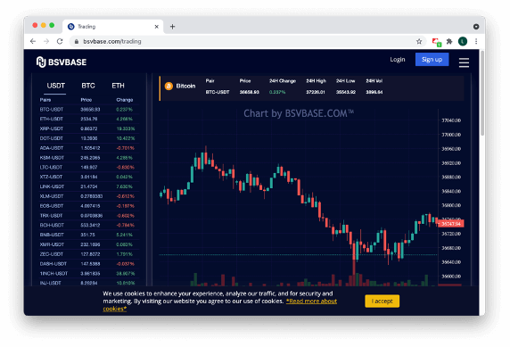

## Table of Contents

## What is fake trading on crypto exchanges?

Fake trading on crypto exchanges is when people pretend to buy and sell cryptocurrencies, but they are not actually trading real money or coins. It's like a practice game where traders can test their strategies without risking any real money. They use fake money provided by the exchange or trading platform to make trades and see how they would perform in real market conditions.

This type of trading is useful for beginners who want to learn how to trade without losing money. It helps them understand how the market works, how to use trading tools, and how to make decisions based on market trends. However, fake trading does not perfectly mimic real trading because it lacks the emotional and financial pressures that come with using real money.

## How does fake trading affect cryptocurrency prices?

Fake trading does not directly affect cryptocurrency prices because it involves pretend money and no real trades are made. When people use fake trading on a platform, they are just practicing and not actually buying or selling any real cryptocurrencies. So, the prices you see in fake trading are not real and do not influence the actual market prices of cryptocurrencies.

However, fake trading can indirectly impact the market in some ways. For example, if many people practice trading and get good at it, they might feel more confident and start trading with real money. This could increase the number of real traders in the market, which might affect prices. Also, if people share their fake trading results and strategies online, it could influence other traders' decisions, even though the results are not from real trades.

## What are the common signs of fake trading on a crypto exchange?

Fake trading on a crypto exchange can be hard to spot because it's meant to look like real trading. One sign might be if you see a lot of trades happening but the prices are not moving much. In real trading, big trades usually make the price go up or down. If the price stays the same even with a lot of trades, it could mean those trades are fake.

Another sign is if the trading [volume](/wiki/volume-trading-strategy) looks too high compared to other exchanges. If one exchange shows a lot more trading than others for the same [cryptocurrency](/wiki/cryptocurrency), some of those trades might be fake. Also, if you see the same trades happening over and over again, like the same amount at the same time every day, that could be a sign of fake trading. Real trading usually has more variety and randomness.

## Can you explain the difference between fake trading and wash trading?

Fake trading and wash trading are two different things in the world of cryptocurrencies. Fake trading is when people practice trading using pretend money on a platform. They don't use real money or real cryptocurrencies. It's like playing a game to learn how trading works without any risk. Fake trading doesn't affect real cryptocurrency prices because no real trades happen.

Wash trading, on the other hand, is a type of illegal activity where someone trades with themselves to make it look like there is more trading happening than there really is. They buy and sell the same cryptocurrency to themselves, making it seem like there is a lot of activity on the exchange. This can trick other people into thinking the cryptocurrency is more popular or valuable than it really is, and it can affect real prices. Wash trading is against the law and is done to deceive people.

## What are the legal implications of fake trading in different countries?

Fake trading itself is usually not illegal because it's just a practice tool where people use pretend money to learn how to trade. It doesn't involve real money or real cryptocurrencies, so it doesn't break any laws. Most countries see fake trading as a helpful way for people to practice without risk, and it's allowed on many trading platforms.

However, if fake trading is used to trick people or make false claims about trading success, it could lead to legal problems. For example, if someone says they made a lot of money from fake trading and uses that to convince others to invest in a real trading scheme, that could be seen as fraud. The laws about this can be different in each country, but generally, using fake trading to deceive others is not allowed and can lead to legal action.

## How can fake trading be detected by individual traders?

Individual traders can spot fake trading by looking at how prices move compared to the number of trades. If they see a lot of trades happening but the price stays the same, it might mean those trades are fake. In real trading, big trades usually make the price go up or down. So, if the price doesn't change much even with a lot of trades, that could be a sign of fake trading.

Another way to detect fake trading is by comparing the trading volume on different exchanges. If one exchange shows a lot more trading for the same cryptocurrency than others, some of those trades might be fake. Also, if you see the same trades happening over and over again, like the same amount at the same time every day, that could be a sign of fake trading. Real trading usually has more variety and randomness.

## What tools and technologies are used to monitor and prevent fake trading?

Exchanges and regulatory bodies use different tools and technologies to monitor and prevent fake trading. One common tool is a trading surveillance system that watches for unusual patterns in trading data. These systems use algorithms to spot signs of fake trading, like trades that happen at the same time every day or a lot of trades that don't affect the price. They can also compare trading volumes across different exchanges to see if one exchange has much more activity than others, which might mean fake trading is happening.

Another important technology is blockchain analytics. Since cryptocurrencies are based on blockchain, this technology can track transactions and help spot fake trading. Blockchain analytics tools look at the flow of money and can find patterns that suggest someone is trading with themselves or using fake accounts. By using these tools, exchanges and regulators can keep an eye on trading activity and take action if they find fake trading happening.

## How do regulatory bodies address fake trading on crypto exchanges?

Regulatory bodies keep a close watch on crypto exchanges to make sure fake trading doesn't happen. They use special tools and technology to check trading data and look for signs of fake trading. If they find any, they can take action to stop it. They might fine the exchange, make them follow stricter rules, or even shut them down if the problem is bad enough. This helps keep the market fair and safe for everyone.

Sometimes, regulatory bodies work with the exchanges themselves to prevent fake trading. They might set rules that the exchanges have to follow, like doing regular checks on their trading data. If an exchange follows these rules and helps stop fake trading, it can build trust with users and regulators. This teamwork helps make sure that the crypto market stays honest and that people can trade without worrying about fake trades messing things up.

## What are the economic impacts of fake trading on the broader crypto market?

Fake trading doesn't directly change the prices of cryptocurrencies because it's just practice trading with pretend money. It doesn't involve real money or real trades, so it doesn't affect the actual market. But fake trading can have some indirect effects on the broader crypto market. If a lot of people practice trading and get better at it, they might feel more confident and start trading with real money. This could bring more real traders into the market, which might change how prices move.

Also, if people talk about their fake trading results online, it could influence other traders. Even though the results are not from real trades, they might make others think a certain cryptocurrency is doing well or badly. This can lead to more people buying or selling that cryptocurrency, which can affect its real price. So, while fake trading itself doesn't change prices, the way people talk about it and use it to learn can have some small effects on the overall market.

## How can exchanges themselves prevent fake trading on their platforms?

Exchanges can prevent fake trading by using special tools that watch for unusual trading patterns. These tools use smart math to find trades that happen at the same time every day or a lot of trades that don't change the price. By spotting these patterns, exchanges can stop fake trading before it becomes a big problem. They can also compare their trading data with other exchanges to see if their numbers look too high, which might mean fake trading is happening.

Another way exchanges can stop fake trading is by setting strict rules for their users. They can make sure people use real money and real accounts when they trade. Exchanges can also do regular checks on their trading data to make sure everything looks right. If they find any fake trading, they can take action quickly, like stopping the fake trades or even banning the users who did it. By doing these things, exchanges can keep their platform fair and safe for everyone.

## What are some case studies of fake trading incidents in the crypto industry?

One well-known case of fake trading happened with the crypto exchange Bitfinex. In 2017, it was reported that Bitfinex was involved in fake trading to make their trading volume look bigger than it really was. They did this by moving money around in a way that looked like real trades but was actually just moving money between their own accounts. This made it seem like there was a lot of trading happening on their platform, which could trick people into thinking it was a busy and popular exchange. When people found out about this, it caused a big problem for Bitfinex and they had to work hard to fix their reputation.

Another case was with the exchange OKEx. In 2019, it was reported that OKEx was also involved in fake trading. They were accused of using fake accounts to make trades that didn't really happen. This made their trading volume look higher than it actually was. When this was discovered, it led to a lot of people losing trust in OKEx. The exchange had to take steps to show they were fixing the problem and making sure it wouldn't happen again. These cases show how fake trading can harm an exchange's reputation and make it hard for them to keep users' trust.

## What future trends might affect the prevalence of fake trading on crypto exchanges?

In the future, better technology might help stop fake trading on crypto exchanges. New tools and smart computer programs could get even better at spotting fake trades. These tools might use special math to find strange trading patterns that show fake trading is happening. As these tools get better, it will be harder for people to do fake trading without getting caught. This could make fake trading happen less often because the risk of getting caught would be higher.

Also, as more rules and laws about cryptocurrencies come into place, fake trading might happen less. Governments and other groups that watch over the market might make new rules that make it harder to do fake trading. Exchanges might have to follow stricter rules and do more checks to make sure their trading data is real. If people know that breaking these rules can lead to big problems, like fines or being shut down, they might be less likely to try fake trading. So, better technology and stricter rules could both help make fake trading less common in the future.

## References & Further Reading

[1]: Lehar, A., Dorsey, P., & Berg, C. (2020). ["Fake Trading and Market Manipulation in Cryptocurrency Exchanges."](https://papers.ssrn.com/sol3/papers.cfm?abstract_id=3905316) University of Calgary, Working Paper.

[2]: Gandal, N., Hamrick, J. T., Moore, T., & Oberman, T. (2018). ["Price Manipulation in the Bitcoin Ecosystem."](https://tylermoore.utulsa.edu/jme17.pdf) Journal of Monetary Economics, 95, 86-96.

[3]: Philippas, D., & Koutmos, D. (2019). ["Detecting Fraudulent Behavior in Cryptocurrency Markets."](https://www.sciencedirect.com/science/article/pii/S1544612319314114) Journal of Risk and Financial Management, 12(1), 55.

[4]: Vovk, V., & Shafer, G. (2022). ["Algorithmic Advances in Detecting Wash Trading Using Machine Learning."](https://alrw.net/) Mathematics, 10(6), 844.

[5]: ["Machine Learning for Algorithmic Trading"](https://github.com/PacktPublishing/Machine-Learning-for-Algorithmic-Trading-Second-Edition) by Stefan Jansen.

[6]: ["Quantitative Trading: How to Build Your Own Algorithmic Trading Business"](https://books.google.com/books/about/Quantitative_Trading.html?id=j70yEAAAQBAJ) by Ernest P. Chan.