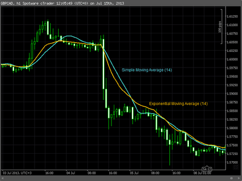

## Table of Contents

## What is a fakeout in technical analysis?

A fakeout in technical analysis is when the price of a stock or other asset tricks traders into thinking it will move in one direction, but then it suddenly goes the other way. Imagine you see a stock price going up and you think it will keep going up, so you buy it. But then, the price suddenly drops. That's a fakeout. It can be frustrating because it makes traders think they made a good decision based on the information they had, but the market does something unexpected.

Fakeouts often happen around important price levels, like support and resistance. Support is a price level where the price tends to stop falling, and resistance is where it tends to stop rising. Traders watch these levels closely. When the price breaks through one of these levels, traders might think the trend is changing and act on it. But if the price quickly reverses and goes back to where it was, that's a fakeout. It's important for traders to be careful and not jump into trades too quickly because fakeouts can lead to losses.

## How can you identify a fakeout on a price chart?

To spot a fakeout on a price chart, you need to watch how the price moves around important levels. These levels are called support and resistance. Support is like a floor where the price stops falling, and resistance is like a ceiling where the price stops rising. If you see the price break through one of these levels, it might look like the trend is changing. But if the price quickly turns around and goes back to where it was, that's a fakeout. 

You can also look at the [volume](/wiki/volume-trading-strategy) of trades when the price breaks through these levels. If the volume is low when the price breaks through, it might not be a strong move, and a fakeout could happen. Another thing to watch is how fast the price moves. If it breaks through a level very quickly but then reverses just as fast, it's more likely to be a fakeout. By paying attention to these signs, you can be more careful and avoid getting tricked by the market.

## What are the common causes of fakeouts?

Fakeouts often happen because of how people trade. When many traders think the price will go up or down and start buying or selling, it can push the price past important levels like support or resistance. But if those traders are wrong and the price doesn't keep going in that direction, it can quickly turn around and cause a fakeout. This can happen when traders act too fast without waiting to see if the price move is strong enough.

Another reason for fakeouts is market manipulation. Sometimes big traders or institutions might try to trick other traders by pushing the price past a key level on purpose. They might do this to make other traders think the price will keep moving in that direction and then sell or buy at a better price when the smaller traders jump in. This kind of fakeout can be hard to spot, but it's something to watch out for.

Lastly, fakeouts can also happen because of news or events that affect the market. If there's a big news event, the price might move sharply in one direction but then reverse if the news turns out to be less important than people thought. These sudden changes can lead to fakeouts, especially if traders react quickly to the news without waiting to see how the market really reacts.

## How do fakeouts affect trading strategies?

Fakeouts can really mess with trading strategies. When traders see a price break through an important level, they might think it's a good time to buy or sell. But if it's a fakeout, they could end up losing money because the price goes the other way. This can make traders lose confidence in their strategy and make them more hesitant to trade, even when the price moves are real. To deal with fakeouts, traders might add extra steps to their strategies, like waiting for more signs that the price move is strong before they trade.

Using extra steps can help traders avoid fakeouts, but it also means they might miss out on some good trades. If they wait too long to be sure, the price might move too far and they won't get the best price. So, it's a balance. Traders need to find a way to protect themselves from fakeouts without missing out on real opportunities. This can make their trading strategies more complex, but it's important to stay safe in the market.

## Can fakeouts be predicted, and if so, how?

Fakeouts can be hard to predict, but traders can look for some signs that might help. One sign is low trading volume when the price breaks through important levels like support or resistance. If not many people are trading when the price moves, it might not be a strong move and could lead to a fakeout. Another sign is how fast the price moves. If it breaks through a level very quickly but then turns around just as fast, it's more likely to be a fakeout. Traders can also use tools like moving averages or trend lines to see if the price move fits with the bigger picture of the market.

Even with these signs, it's tough to always know when a fakeout will happen. Sometimes big traders or news events can cause sudden price changes that lead to fakeouts. Because of this, it's important for traders to be careful and not jump into trades too quickly. They might use extra steps in their trading plan, like waiting for more signs that the price move is real before they act. This can help them avoid fakeouts, but it also means they might miss some good trades if they wait too long. Finding the right balance is key to dealing with fakeouts in trading.

## What are the psychological impacts of fakeouts on traders?

Fakeouts can really mess with a trader's head. When a trader sees a price move that looks like a good chance to make money, and then it turns out to be a fakeout, it can make them feel frustrated and disappointed. They might start to doubt their own trading skills and feel less confident about making future trades. This can lead to second-guessing themselves a lot and being afraid to take action even when there are good opportunities.

Over time, these fakeouts can cause a lot of stress and even make traders feel anxious about trading. They might start to see every price move as a potential fakeout, which can make them too cautious and miss out on real chances to make money. It's important for traders to learn how to handle these feelings and keep a clear head, so they can stick to their trading plan and not let fakeouts throw them off too much.

## How do different time frames influence the occurrence of fakeouts?

Different time frames can change how often fakeouts happen and how they look. On shorter time frames, like a 1-minute or 5-minute chart, fakeouts can happen a lot because the price can move up and down quickly. Traders who look at these short time frames might see the price break through important levels often, but these moves can be fakeouts because they don't last long. It's like trying to guess where a ball will go when it's bouncing around fast; it's hard to tell if it will keep going the same way or suddenly change direction.

On longer time frames, like a daily or weekly chart, fakeouts can still happen, but they might be less common and more important. When the price breaks through a level on a longer time frame, it can seem more significant, and traders might think it's a real change in the trend. But if it turns out to be a fakeout, it can be more surprising and affect more traders because they might have been more confident in the move. So, while fakeouts can happen on any time frame, they can feel different and affect traders in different ways depending on how long they're looking at the chart.

## What are some historical examples of notable fakeouts in the market?

One famous fakeout happened in the stock market with the "Flash Crash" of May 6, 2010. The Dow Jones Industrial Average suddenly dropped almost 1,000 points in just a few minutes. Many traders thought it was the start of a big sell-off, but the market quickly bounced back. It turned out that the big drop was caused by high-frequency trading algorithms that went wild. This fakeout shocked a lot of people and showed how fast the market can change and trick traders.

Another example of a fakeout was with the [cryptocurrency](/wiki/cryptocurrency) Bitcoin in early 2018. Bitcoin's price had been going up a lot, and in December 2017, it hit almost $20,000. But then, in January 2018, it suddenly broke below a key support level, making many traders think the price would keep falling. However, the price quickly went back up above that level, showing it was just a fakeout. This taught traders to be careful about jumping into trades too quickly, even with something as new and exciting as Bitcoin.

## How can traders protect their portfolios from the effects of fakeouts?

Traders can protect their portfolios from fakeouts by being patient and not jumping into trades too quickly. When they see the price move past an important level, they should wait and see if the move is strong before they act. They can check if the trading volume is high when the price breaks through, because a strong move usually has a lot of people trading. If the volume is low, it might be a fakeout. Traders can also use tools like moving averages or trend lines to see if the price move fits with the bigger picture of the market. By taking their time and looking for more signs, traders can avoid getting tricked by fakeouts.

Another way to protect their portfolios is by using stop-loss orders. A stop-loss order is like a safety net that automatically sells a stock if the price drops to a certain level. This can help traders limit their losses if a fakeout happens and the price goes the other way. Traders should also keep a clear head and not let their emotions control their decisions. Fakeouts can make traders feel frustrated or anxious, but sticking to a good trading plan and not getting too upset can help them stay safe. By being careful and using these strategies, traders can better protect their portfolios from the effects of fakeouts.

## What are the differences between a fakeout and a genuine breakout?

A fakeout happens when the price of a stock or asset tricks traders into thinking it will keep moving in one direction, but then it suddenly goes the other way. This often happens around important levels like support and resistance. Support is like a floor where the price stops falling, and resistance is like a ceiling where the price stops rising. When the price breaks through one of these levels, traders might think the trend is changing and make trades based on that. But if the price quickly turns around and goes back to where it was, that's a fakeout. It can be frustrating because it makes traders think they made a good decision, but the market does something unexpected.

A genuine breakout, on the other hand, is when the price moves past an important level and keeps going in that direction. It's a real change in the trend, not just a trick. Traders can tell it's a genuine breakout if the price stays above or below the level for a while and if there's a lot of trading happening when the price breaks through. This shows that many people believe in the new trend and are making trades based on it. A genuine breakout can be a good chance for traders to make money if they get in at the right time, but it's important to make sure it's not a fakeout first.

## How do advanced technical indicators help in distinguishing fakeouts?

Advanced technical indicators can help traders tell the difference between a fakeout and a real breakout by giving them more information about the price move. One helpful indicator is the Relative Strength Index (RSI). The RSI shows if a stock is overbought or oversold, which means it might be due for a price change. If the RSI doesn't confirm the price break through an important level, it could be a sign of a fakeout. Another useful tool is the Moving Average Convergence Divergence (MACD). The MACD helps traders see the strength and direction of a trend. If the MACD doesn't show a strong trend when the price breaks through a level, it might be a fakeout.

Traders can also use volume-based indicators like the On-Balance Volume (OBV) to spot fakeouts. The OBV measures how much trading is happening and can show if the price move has a lot of support from other traders. If the OBV doesn't increase when the price breaks through a level, it might mean the move isn't strong and could be a fakeout. By using these advanced indicators, traders can get a better idea of whether a price move is real or just a trick, helping them make smarter trading decisions and avoid getting caught in fakeouts.

## What role do market manipulators play in creating fakeouts?

Market manipulators can create fakeouts on purpose to trick other traders. They might push the price of a stock past an important level like support or resistance to make it look like the price will keep going in that direction. When other traders see this, they might jump into the market thinking they can make money. But then, the manipulators quickly sell or buy the stock, making the price go the other way. This sudden change can cause a fakeout, leaving other traders with losses while the manipulators make a profit.

Spotting fakeouts caused by market manipulators can be really hard. These manipulators often use big trades to make the price move look real. They might also use high-frequency trading algorithms to make the price move very fast. Traders need to be careful and look for signs like low trading volume when the price breaks through a level, or use tools like the Relative Strength Index (RSI) or Moving Average Convergence Divergence (MACD) to check if the price move is strong. By being patient and waiting for more signs, traders can better protect themselves from getting tricked by market manipulators.

## What are common technical indicators for identifying fakeouts?

Technical analysts employ various patterns and indicators to verify trading signals, with a particular focus on identifying fakeouts. Fakeouts occur when price movement suggests a [breakout](/wiki/breakout-trading) or reversal, only to reverse direction unexpectedly, which can mislead traders.

Envelope channels and Bollinger Bands are frequently used tools for defining price ranges and recognizing potential breakouts. Envelope channels involve plotting bands around a moving average by adding and subtracting a fixed percentage. This helps frame the expected price limits, with movements outside these limits signaling potential breakouts. Bollinger Bands follow a similar premise but use a moving average and standard deviations to plot upper and lower bounds. A formula often used for Bollinger Bands is:

$$

Upper \, Band = MA + k \times \sigma 
$$
$$

Lower \, Band = MA - k \times \sigma 
$$

Here, $MA$ represents the moving average, $\sigma$ the standard deviation, and $k$ a multiplier, often set to 2. Prices breaking outside Bollinger Bands can indicate possible reversals or breakouts. However, these movements can also result in fakeouts, where initially seeming true breakout cues mislead traders and lead to adverse price reversals.

Trend channels are also prevalent in identifying market direction and potential fakeouts. These are constructed by drawing parallel lines connecting consecutive highs and lows, encapsulating the prevailing price trend. While effective, trend channels present risks due to their short-term focus. They can easily reflect volatile market shifts, proving unreliable under fluctuating market conditions.

Overall, though indicators like envelope channels, Bollinger Bands, and trend channels provide valuable insights, their susceptibility to false signals necessitates cautious application. Recognizing the potential for fakeouts and employing multiple validation methods is critical to effective technical analysis.

## References & Further Reading

[1]: Bergstra, J., Bardenet, R., Bengio, Y., & Kégl, B. (2011). ["Algorithms for Hyper-Parameter Optimization."](https://dl.acm.org/doi/10.5555/2986459.2986743) Advances in Neural Information Processing Systems, 24.

[2]: Lopez de Prado, M. (2018). ["Advances in Financial Machine Learning."](https://www.amazon.com/Advances-Financial-Machine-Learning-Marcos/dp/1119482089) Wiley.

[3]: Aronson, D. R. (2006). ["Evidence-Based Technical Analysis: Applying the Scientific Method and Statistical Inference to Trading Signals."](https://www.amazon.com/Evidence-Based-Technical-Analysis-Scientific-Statistical/dp/0470008741) Wiley.

[4]: Jansen, S. (2018). ["Machine Learning for Algorithmic Trading."](https://github.com/stefan-jansen/machine-learning-for-trading) Packt Publishing.

[5]: Chan, E. P. (2009). ["Quantitative Trading: How to Build Your Own Algorithmic Trading Business."](https://github.com/ftvision/quant_trading_echan_book) Wiley.