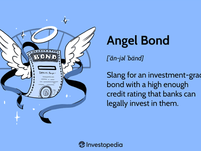

High-yield bonds, commonly known as junk bonds, are fixed-income securities that offer higher yields than investment-grade bonds due to their lower credit ratings and higher risk of default. Within this category, two intriguing subtypes stand out: rising star and fallen angel bonds. Rising star bonds are those that start with lower credit ratings and subsequently achieve investment-grade status as the issuing company's financial health improves. Factors contributing to this upgrade can include enhanced business performance, better financial management, or favorable economic conditions.

Conversely, fallen angel bonds refer to bonds that once held investment-grade ratings but have been downgraded to junk status due to a deterioration in the issuer's creditworthiness. Such downgrades can be caused by various internal and external factors, including reduced revenue, increased debt burden, or adverse changes in the broader economic environment.



Both rising star and fallen angel bonds play significant roles in the investment landscape. Rising star bonds attract investors seeking to capitalize on potential credit improvements and the corresponding appreciation in bond prices. Fallen angels, on the other hand, may attract investors who are willing to take on additional risk for the possibility of capital gains if the issuer's credit situation improves.

Algorithmic trading has revolutionized how investors assess risks and identify opportunities in bond markets, including those related to rising stars and fallen angels. By employing advanced algorithms, traders can process vast amounts of financial data swiftly and accurately, identifying patterns and trends that may not be immediately apparent to human analysts. This capability allows for more informed decision-making, especially in the dynamic and sometimes volatile high-yield bond market.

The objective of this article is to explore how algorithmic trading can assist investors in navigating the complexities associated with investing in high-yield bonds, specifically rising star and fallen angel bonds. By understanding these bonds, investors can better appreciate the potential risks and benefits, allowing for more strategic investment decisions. Algorithmic trading tools bridge the gap between traditional analysis and modern data-driven strategies, offering a nuanced approach to high-yield bond investment.

## Table of Contents

## Understanding Rising Star Bonds

Rising star bonds are financial instruments that have progressed from a lower credit rating, often categorized as junk status, to an investment-grade status. These bonds represent companies that have significantly improved their creditworthiness due to various positive developments in their financial health and operational metrics. The transformation of a bond from junk to investment-grade is typically assessed by credit rating agencies, such as Moody’s, S&P Global Ratings, and Fitch Ratings, which evaluate the credit quality based on several factors.

Key factors leading to an upgrade in credit quality to become rising star bonds include an improvement in a company's earnings and cash flow stability, which enhances its ability to service debt. A strong business model leading to increased market share, product diversification, and operational efficiencies also play crucial roles. Moreover, successful debt management strategies, reflected in reduced leverage ratios and enhanced [liquidity](/wiki/liquidity-risk-premium) positions, contribute significantly to the credit upgrade.

The market conditions that often favor the emergence of rising star bonds include a stable and growing economy, where companies can capitalize on favorable business conditions to boost revenues and profitability. Access to capital markets at favorable rates, due to lower interest rates or improved investor sentiment, aids these companies in refinancing expensive debt, further stabilizing their financial standing.

Investing in rising star bonds can offer several advantages. First, these bonds are likely to experience a price appreciation as their credit ratings improve, offering capital gains potential to investors. Additionally, they may still provide higher yields than typical investment-grade bonds, as the market may not have fully priced in the improved credit quality, thus presenting an attractive risk-return profile. Moreover, investing in rising stars affords diversification benefits by including high-potential debt instruments in a bond portfolio that may not fully correlate with the traditional fixed-income assets. This could potentially lead to enhanced portfolio performance, especially during periods of economic expansion.

## Exploring Fallen Angel Bonds

Fallen angel bonds refer to corporate bonds that were initially issued with an investment-grade rating but have since been downgraded to a sub-investment, or junk, status. This descent usually occurs when the issuer experiences financial distress, business downturns, or adverse market conditions leading to a deterioration in their creditworthiness. A credit rating downgrade from agencies like Moody's, Standard & Poor's, or Fitch signifies diminished confidence in the issuer’s ability to meet its debt obligations. Such downgrades can result from a combination of internal and external factors.

Internally, fallen angels may face challenges such as declining sales, increasing leverage, poor management decisions, or operational inefficiencies. For instance, if a company fails to adapt to technological advancements or shifts in consumer preferences, its revenue may decline, thus impacting its financial health. Externally, macroeconomic issues, such as a recession, rising interest rates, or geopolitical tensions, can exacerbate financial strains, leading to credit rating downgrades.

Fallen angel bonds [carry](/wiki/carry-trading) significant risks. Their junk status implies higher credit risk, reflected in elevated yields compared to investment-grade bonds. These bonds may also face reduced liquidity, making it challenging for investors to buy or sell them without significantly impacting their price. Market sentiment can further amplify price [volatility](/wiki/volatility-trading-strategies), as negative perceptions regarding an issuer's downgraded status may induce fear among investors.

Conversely, fallen angel bonds may present attractive opportunities. They often trade at substantial discounts due to their depressed ratings. If an investor anticipates an issuer’s financial recovery, they can acquire these bonds at lower prices and potentially benefit from price appreciation and higher yield returns if the issuer regains investment-grade status. Recovery could be driven by strategic management changes, successful restructuring efforts, or improvements in the broader economic environment.

When assessing potential recovery and re-upgrade for fallen angels, investors can gauge several indicators. Improvements in the issuer’s financial metrics, positive cash flow trends, cost-cutting measures, or increased market share could signal a turnaround. Furthermore, investor activism or interest from private equity firms may lead to structural changes enhancing the issuer's prospects.

The stochastic nature of bond markets implies that assessing the likelihood of a downgrade or upgrade involves complex analyses. Mathematical models, such as the Merton model based on option pricing theory, can offer insights into default probabilities by analyzing a firm's asset value relative to its liabilities. Such quantitative methods complement qualitative assessments, aiding in investment decision-making related to fallen angel bonds. Thus, while risky, investing in fallen angels can yield substantial returns when the issuer's underlying business experiences a credible path to recovery.

## The Role of Algorithmic Trading in Bond Markets

Algorithmic trading has dramatically transformed the landscape of financial markets, particularly in the bond sector. This approach utilizes automated, sophisticated algorithms to execute trading decisions, reducing human intervention and leveraging real-time data analysis. The increasing prominence of [algorithmic trading](/wiki/algorithmic-trading) is attributed to its ability to process vast quantities of financial data swiftly, thereby revealing nuanced investment opportunities that might elude traditional analysis.

Algorithms in trading are developed to analyze large datasets—comprising historical spreads, yield curves, credit ratings, and macroeconomic indicators—to identify favorable conditions for buying or selling bonds. By employing complex mathematical models, these algorithms can detect patterns and correlations, assess market signals, and adapt to changing market conditions. For instance, [machine learning](/wiki/machine-learning) techniques like clustering and regression analysis are often integrated into these algorithms to enhance prediction accuracy and decision-making processes.

In the context of rising star and fallen angel bonds, algorithmic trading provides distinct efficiency gains. Rising star bonds, which transition from junk status to investment-grade, and fallen angel bonds, which fall from investment-grade to junk status, both present unique challenges and opportunities. Algorithms assess the credit upgrade trajectory of rising stars or potential recovery pathways for fallen angels, optimizing timing and asset allocation to capitalize on these shifts.

Specific strategies in algorithmic trading applicable to these bonds include [momentum](/wiki/momentum)-based and mean-reversion strategies. Momentum strategies exploit price trends by initiating trades based on expected continuations of current trends. Conversely, mean-reversion strategies focus on prices that deviate from their historical average, anticipating their eventual return to mean values. For example, Python code implementing a simple moving average crossover strategy could look like this:

```python
import numpy as np
import pandas as pd

def moving_average_crossover(data, short_window=40, long_window=100):
    signals = pd.DataFrame(index=data.index)
    signals['price'] = data['price']
    signals['short_mavg'] = data['price'].rolling(window=short_window, min_periods=1, center=False).mean()
    signals['long_mavg'] = data['price'].rolling(window=long_window, min_periods=1, center=False).mean()

    # Generate buy/sell signals
    signals['signal'] = 0.0
    signals['signal'][short_window:] = np.where(signals['short_mavg'][short_window:] > signals['long_mavg'][short_window:], 1.0, 0.0)   
    signals['positions'] = signals['signal'].diff()

    return signals
```

This basic strategy could be tailored for bonds by integrating bonding-specific factors like credit score improvements for rising stars or market sentiment shifts for fallen angels.

The enhanced speed and precision of algorithmic trading reduce transaction costs and slippage, optimizing profit margins for investors. Moreover, the back-testing capability of algorithms permits fine-tuning strategies based on historical data, minimizing risk and enhancing potential returns. Through these approaches, algorithmic trading offers substantial advantages in the efficient and effective management of rising star and fallen angel bonds, paving the way for informed, data-driven investment decisions.

## Risks Involved with Rising Star and Fallen Angel Bonds

High-yield bonds, such as rising star and fallen angel bonds, carry distinct risks that investors must evaluate. These risks can significantly influence investment decisions and potential returns.

### Risks Associated with Rising Star Bonds

**Timing and Volatility:** Investing in rising star bonds can involve substantial timing risks. These are bonds that have been upgraded from junk to investment-grade status, and understanding the precise timing of purchasing such bonds is crucial. A premature investment might not capture the potential gains from further improvements in credit quality, while a delayed investment might miss the price appreciation. Volatility is another inherent risk. As bonds approach an upgrade, they may experience significant price fluctuations, driven by market speculation and changing investor perceptions about the issuer's financial stability.

### Risks of Investing in Fallen Angel Bonds

**Credit Deterioration and Liquidity:** Fallen angel bonds, which have been downgraded from investment-grade to junk status, bear the risk of further credit deterioration. Investors face the possibility that the issuer’s financial situation could worsen, leading to additional downgrades or even default. Additionally, fallen angels often suffer from lower liquidity than their investment-grade counterparts. Reduced liquidity can make it challenging to buy or sell large quantities without affecting the bond's price, potentially leading to suboptimal trade executions.

### General Market Risks Impacting Both Classes

Both rising star and fallen angel bonds are subject to broader market risks, such as [interest rate](/wiki/interest-rate-trading-strategies) fluctuations, economic cycles, and changes in investor risk appetite. Interest rate risk is especially pertinent, as rising rates can lead to a decline in bond prices, affecting both pre- and post-upgrade bonds. Economic downturns may amplify default risks, whereas shifts in investor sentiment toward high-yield bonds can alter demand dynamics.

### Challenges Posed by Inaccurate Credit Ratings and Market Sentiments

Inaccurate credit ratings pose a significant challenge for investors in both rising star and fallen angel bonds. Ratings agencies may not promptly reflect an issuer's true creditworthiness due to delayed updates or flawed assessments, leading investors to make decisions based on outdated or incorrect information. Furthermore, market sentiment, influenced by news reports and macroeconomic events, can diverge from the fundamental credit quality of bond issuers. This divergence can create scenarios where bond prices do not accurately represent associated credit risks, potentially misleading uninformed investors.

In summary, investments in rising star and fallen angel bonds require a comprehensive understanding of the associated risks, including timing, volatility, credit deterioration, liquidity, and the impact of external factors such as interest rates and inaccurate credit ratings. These elements underscore the importance of vigilant risk assessment and informed decision-making in bond investments.

## Opportunities in Harnessing Algo Trading for Bond Investment

Algorithmic trading stands as a pivotal innovation in the financial markets, offering significant opportunities for bond investments, including rising star and fallen angel bonds. By leveraging advanced computational techniques, algorithmic trading can substantially mitigate risks and enhance potential returns. Algorithms, through intricate data analysis, manage the voluminous datasets inherent to the credit markets. This capability allows for the identification of nuanced investment signals and timely execution of trades, which can be particularly advantageous in the fluctuating landscapes of rising star and fallen angel bonds.

### Case Studies and Examples of Successful Algorithms in Bond Investment

Several case studies exemplify the efficacy of algorithmic trading in bond markets. For instance, J.P. Morgan's LOXM, a self-learning AI-powered trading platform, demonstrated significant improvements in execution quality and cost reduction by predicting the best trading strategies in real-time. Similarly, BlackRock's Aladdin platform leverages machine learning to manage extensive bond portfolios, optimizing asset allocation, and forecasting potential credit events, thus safeguarding investments from adverse market shifts.

### Advantages: Speed, Accuracy, and Cost-Efficiency

The primary benefits of algorithmic trading are speed, accuracy, and cost-efficiency. Algorithms can analyze and process data faster than human traders, providing a substantial speed advantage, especially during volatile market conditions. This speed ensures that trading opportunities are seized at the optimal moment, reducing slippage and improving execution prices.

Accuracy is another significant advantage. Algorithms minimize human errors and are capable of executing complex strategies with precision. When trading rising star and fallen angel bonds, which may be sensitive to credit ratings and economic indicators, the precision of algorithmic systems can be critical in capturing value.

Moreover, algorithmic trading reduces transaction costs by automating repetitive processes that would otherwise require extensive human resources, improving the overall cost-efficiency of managing bond portfolios.

### Algorithmic Insights for Predictive Analytics

The predictive analytics capabilities of algorithmic trading are pivotal in anticipating future bond performance. By continuously analyzing historical data, credit ratings, market trends, and economic indicators, algorithms can forecast shifts in bond valuations and credit quality. Machine learning models, such as Random Forest or neural networks, can be trained to predict downgrades or upgrades of credit ratings, providing early warnings to investors.

For example, a Python-based machine learning model might utilize a decision-tree algorithm to predict bond rating changes. Here's a simplified code snippet illustrating how an algorithm could be applied to such a dataset:

```python
from sklearn.model_selection import train_test_split
from sklearn.ensemble import RandomForestClassifier
from sklearn.metrics import accuracy_score
import pandas as pd

# Load dataset
data = pd.read_csv('bond_data.csv')

# Features and target variable
X = data.drop('RatingChange', axis=1)
y = data['RatingChange']

# Split the dataset
X_train, X_test, y_train, y_test = train_test_split(X, y, test_size=0.3, random_state=42)

# Train a Random Forest Classifier
model = RandomForestClassifier(n_estimators=100, random_state=42)
model.fit(X_train, y_train)

# Predict and evaluate
predictions = model.predict(X_test)
print(f"Accuracy: {accuracy_score(y_test, predictions) * 100:.2f}%")
```

This example demonstrates how algorithmic insights can identify potential investment risks and opportunities by predicting credit rating changes, crucial for managing rising star and fallen angel bonds. By combining speed, accuracy, cost-efficiency, and predictive analytics, algorithmic trading presents a comprehensive toolkit for navigating the complexities of the bond market.

## Conclusion

Rising star and fallen angel bonds represent two dynamic segments within the high-yield bond market. Rising star bonds transition from junk status to investment-grade as issuers improve their creditworthiness, offering appealing returns owing to this upward trajectory. Conversely, fallen angel bonds fall from grace, descending from investment-grade to junk status, yet present potential recovery opportunities due to their initial solid investment foundations.

Investing in these bonds involves navigating distinct risks and opportunities. Rising stars may appeal due to their improving credit profiles and the potential for appreciation in value. However, these bonds can be volatile, and timing their growth correctly remains challenging. Fallen angels, while associated with deteriorated credit ratings and liquidity concerns, may offer opportunities if issuers recover and are upgraded once again.

Algorithmic trading stands as a robust tool in the bond market, enhancing investment strategies through the rapid analysis of financial data. Utilizing algorithms enables traders to identify emerging investment opportunities and execute trades with speed and precision, making them valuable when dealing with the variability and complexity of rising star and fallen angel bonds. Algorithmic systems offer efficiency, accuracy, and cost-effectiveness, thereby bolstering potential returns while mitigating certain inherent risks.

Investors are encouraged to adopt a diversified approach that combines human expertise with the capabilities of algorithmic tools. Such integration allows for a well-rounded strategy that leverages both qualitative insights and quantitative analytics. Staying abreast of market trends and technological advancements is crucial in making informed investment decisions.

As high-yield bond markets continue to evolve, incorporating both strategic human judgment and advanced algorithmic methods will likely remain pivotal in optimizing investment outcomes and capitalizing on the unique characteristics of rising star and fallen angel bonds.

## References & Further Reading

[1]: Bergstra, J., Bardenet, R., Bengio, Y., & Kégl, B. (2011). ["Algorithms for Hyper-Parameter Optimization."](https://papers.nips.cc/paper/4443-algorithms-for-hyper-parameter-optimization) Advances in Neural Information Processing Systems 24.

[2]: ["Advances in Financial Machine Learning"](https://www.amazon.com/Advances-Financial-Machine-Learning-Marcos/dp/1119482089) by Marcos Lopez de Prado

[3]: ["Evidence-Based Technical Analysis: Applying the Scientific Method and Statistical Inference to Trading Signals"](https://www.amazon.com/Evidence-Based-Technical-Analysis-Scientific-Statistical/dp/0470008741) by David Aronson

[4]: ["Machine Learning for Algorithmic Trading"](https://github.com/stefan-jansen/machine-learning-for-trading) by Stefan Jansen

[5]: ["Quantitative Trading: How to Build Your Own Algorithmic Trading Business"](https://www.amazon.com/Quantitative-Trading-Build-Algorithmic-Business/dp/1119800064) by Ernest P. Chan