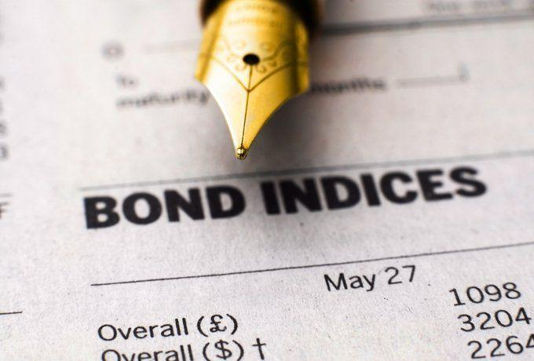

## Table of Contents

## What are Fallen Angel Bonds?

Fallen Angel Bonds are bonds that were once considered investment-grade but have been downgraded to below investment-grade, or "junk" status. This downgrade happens when a bond issuer's financial health worsens, making it riskier for investors. These bonds start off with a high credit rating, which means they are seen as safe investments. But if the company starts to struggle financially, credit rating agencies might lower their rating, turning the bond into a fallen angel.

Investors often pay close attention to fallen angel bonds because they can offer higher returns. Since these bonds are now considered riskier, they need to offer a higher interest rate to attract buyers. However, this also means that investors might lose money if the company's financial situation gets even worse and it can't pay back the bond. So, while fallen angel bonds can be a good opportunity for higher rewards, they also come with greater risks.

## What are Rising Star Bonds?

Rising Star Bonds are bonds that start off with a low credit rating, often called "junk" bonds, but then get upgraded to a higher, investment-grade rating. This happens when the company that issued the bond improves its financial health, making it less risky for investors. When a bond gets upgraded like this, it becomes a rising star.

Investors like rising star bonds because they can offer good returns. When a bond is upgraded, its price usually goes up, and it might also pay a higher [interest rate](/wiki/interest-rate-trading-strategies) than other investment-grade bonds. But, there's still some risk involved because the company's financial situation could change again. So, while rising star bonds can be a great investment, it's important to keep an eye on the company's performance.

## How do Fallen Angel Bonds differ from Rising Star Bonds?

Fallen Angel Bonds and Rising Star Bonds are types of bonds that change their credit ratings, but they start from different places. Fallen Angel Bonds begin as investment-grade bonds, which means they are considered safe. But if the company that issued them starts to have money problems, the bonds get downgraded to junk status. This makes them riskier, but they can offer higher interest rates to attract investors. So, Fallen Angel Bonds go from being safe to being risky.

On the other hand, Rising Star Bonds start as junk bonds, which means they are seen as risky from the beginning. But if the company that issued them improves its financial health, the bonds can get upgraded to investment-grade status. This makes them safer and their price usually goes up. Rising Star Bonds go from being risky to being safer. Both types of bonds can be good investments, but they come with different levels of risk and reward.

## What causes a bond to become a Fallen Angel?

A bond becomes a Fallen Angel when it is downgraded from being an investment-grade bond to a junk bond. This happens because the company that issued the bond is not doing as well financially as it used to. When a company's financial health gets worse, credit rating agencies like Moody's or Standard & Poor's lower the bond's rating. This downgrade shows that the bond is now riskier because there's a bigger chance the company might not be able to pay back the money it owes.

The reasons for a company's financial troubles can be many. It could be because the company is making less money, or it might have taken on too much debt. Sometimes, the whole economy can be struggling, which makes it harder for the company to do well. When investors see that a bond has become a Fallen Angel, they might want a higher interest rate to take on the extra risk. This is why Fallen Angel Bonds can offer higher returns, but they are also more risky than they were before.

## What factors contribute to a bond becoming a Rising Star?

A bond becomes a Rising Star when it gets upgraded from being a junk bond to an investment-grade bond. This happens when the company that issued the bond starts doing better financially. When a company improves its money situation, credit rating agencies like Moody's or Standard & Poor's raise the bond's rating. This upgrade shows that the bond is now safer because there's a smaller chance the company will not be able to pay back the money it owes.

The reasons for a company's financial improvement can be many. It might start making more money or it could pay off some of its debt. Sometimes, the whole economy can start doing better, which helps the company do well too. When investors see that a bond has become a Rising Star, they might be willing to buy it at a higher price because it's now safer. This is why Rising Star Bonds can be a good investment, but it's important to keep watching the company to make sure it keeps doing well.

## What are the typical risks associated with investing in Fallen Angel Bonds?

When you invest in Fallen Angel Bonds, you take on more risk than with investment-grade bonds. These bonds used to be safe, but now they're riskier because the company that issued them is not doing as well financially. This means there's a bigger chance the company might not be able to pay back the money it owes you. If the company's financial problems get worse, the bond's value could drop a lot, and you might lose money.

Another risk is that Fallen Angel Bonds can be harder to sell quickly. Since they're now junk bonds, fewer people want to buy them, so it can be tough to find someone to take them off your hands if you need to sell them fast. This is called [liquidity](/wiki/liquidity-risk-premium) risk. Even though Fallen Angel Bonds can offer higher interest rates to make up for these risks, it's important to think carefully about whether the extra reward is worth the extra danger.

## What opportunities can investors find in Rising Star Bonds?

Investing in Rising Star Bonds can be a good opportunity for investors. These bonds start off as junk bonds but get upgraded to investment-grade status when the company that issued them starts doing better financially. When a bond becomes a Rising Star, its price usually goes up. This means if you bought the bond when it was still a junk bond, you could make money from the price going up. Also, because the bond is now safer, it can attract more investors, which can make it easier to sell if you need to.

Another opportunity with Rising Star Bonds is that they can offer a higher interest rate than other investment-grade bonds. This is because they were junk bonds before, so they need to give investors a good reason to buy them. If the company keeps doing well, you can enjoy this higher interest rate while also having a safer bond. But, it's important to keep an eye on the company because if it starts to struggle again, the bond could lose its Rising Star status.

## How do credit ratings affect the classification of Fallen Angel and Rising Star Bonds?

Credit ratings are really important for deciding if a bond is a Fallen Angel or a Rising Star. A Fallen Angel starts as an investment-grade bond, which means it has a high credit rating and is seen as safe. But if the company that issued the bond starts having money problems, credit rating agencies like Moody's or Standard & Poor's might lower its rating. When the bond's rating drops below investment-grade, it becomes a Fallen Angel. This means it's now riskier, but it might offer a higher interest rate to attract investors.

On the other hand, a Rising Star starts as a junk bond with a low credit rating, meaning it's seen as risky. If the company that issued the bond starts doing better financially, credit rating agencies might raise its rating. When the bond's rating goes up to investment-grade, it becomes a Rising Star. This makes the bond safer and its price usually goes up, which can be good for investors who bought it when it was still a junk bond. Both types of bonds can be good investments, but they come with different levels of risk and reward.

## What strategies can investors use to mitigate risks when investing in Fallen Angel Bonds?

When investing in Fallen Angel Bonds, one way to lower the risk is to do a lot of research on the company that issued the bond. Look at their financial reports and see if they have a plan to fix their money problems. It's also a good idea to keep an eye on the economy because if things are going badly everywhere, it might be harder for the company to get better. By understanding the company's situation and the bigger picture, you can make smarter choices about which Fallen Angel Bonds to buy.

Another strategy is to not put all your money into just one Fallen Angel Bond. Instead, spread your money across different bonds from different companies. This is called diversification. If one company does really badly, you won't lose all your money because you have other bonds that might be doing okay. Also, think about how long you want to keep the bond. If you can hold onto it for a long time, you might be able to wait for the company to get better and the bond to go back up in value. But if you might need your money soon, Fallen Angel Bonds might be too risky because they can be hard to sell quickly.

## How can investors capitalize on the potential of Rising Star Bonds?

Investors can take advantage of Rising Star Bonds by buying them when they are still junk bonds and then holding onto them until they get upgraded to investment-grade. When a bond becomes a Rising Star, its price usually goes up. This means if you bought the bond at a lower price when it was still risky, you could make money from the price increase. It's important to do your homework and pick companies that are likely to improve their financial health. By choosing the right Rising Star Bonds, you can enjoy the benefits of a safer bond that also offers a higher interest rate than other investment-grade bonds.

Another way to make the most of Rising Star Bonds is to keep a close watch on the companies that issue them. If you see that a company is starting to do better, it might be a good time to buy their bonds before they get upgraded. Also, think about how long you can keep the bond. If you can hold onto it for a while, you might be able to wait for the company to keep improving and the bond to keep going up in value. By staying informed and being patient, you can really benefit from the potential of Rising Star Bonds.

## What are the historical performance trends of Fallen Angel Bonds compared to Rising Star Bonds?

Historically, Fallen Angel Bonds have shown that they can offer higher returns than other junk bonds. This is because they start off as safe, investment-grade bonds, but get downgraded to junk status when the company starts having money problems. Investors who buy these bonds after they become Fallen Angels can get a higher interest rate to make up for the extra risk. However, Fallen Angel Bonds can also be more risky than they were before. If the company's financial situation keeps getting worse, the bond's value can drop a lot, and investors might lose money. Over time, studies have shown that Fallen Angel Bonds can do better than other junk bonds, but they can also be more up and down.

On the other hand, Rising Star Bonds have a different kind of performance trend. These bonds start off as risky junk bonds but get upgraded to investment-grade when the company starts doing better financially. When a bond becomes a Rising Star, its price usually goes up, which can be good for investors who bought it when it was still a junk bond. Rising Star Bonds can offer a higher interest rate than other investment-grade bonds because they were junk bonds before. Over the years, Rising Star Bonds have shown that they can be a good investment, especially if the company keeps improving. But, if the company starts to struggle again, the bond could lose its Rising Star status, and its value could go down.

## How do macroeconomic factors influence the dynamics between Fallen Angel and Rising Star Bonds?

Macroeconomic factors like the overall health of the economy, interest rates, and inflation can really change how Fallen Angel and Rising Star Bonds do. When the economy is doing well, companies might start making more money, which can help turn junk bonds into Rising Star Bonds. On the other hand, if the economy is struggling, companies might have a hard time paying their debts, which can turn investment-grade bonds into Fallen Angels. Interest rates also matter a lot. If interest rates go up, it can make it harder for companies to borrow money, which might lead to more Fallen Angels. But if rates go down, it can help companies do better, which might create more Rising Stars.

Inflation can also affect these bonds. If inflation is high, it can make it harder for companies to keep up with their costs, which might lead to more Fallen Angels. But if inflation is low and stable, it can help companies plan better and improve their financial health, possibly leading to more Rising Stars. So, the bigger picture of the economy can really shape whether bonds turn into Fallen Angels or Rising Stars, and understanding these factors can help investors make better choices.

## References & Further Reading

[1]: Bergstra, J., Bardenet, R., Bengio, Y., & Kégl, B. (2011). ["Algorithms for Hyper-Parameter Optimization."](https://papers.nips.cc/paper/4443-algorithms-for-hyper-parameter-optimization) Advances in Neural Information Processing Systems 24.

[2]: ["Advances in Financial Machine Learning"](https://www.amazon.com/Advances-Financial-Machine-Learning-Marcos/dp/1119482089) by Marcos Lopez de Prado

[3]: ["Evidence-Based Technical Analysis: Applying the Scientific Method and Statistical Inference to Trading Signals"](https://www.amazon.com/Evidence-Based-Technical-Analysis-Scientific-Statistical/dp/0470008741) by David Aronson

[4]: ["Machine Learning for Algorithmic Trading"](https://github.com/stefan-jansen/machine-learning-for-trading) by Stefan Jansen

[5]: ["Quantitative Trading: How to Build Your Own Algorithmic Trading Business"](https://www.amazon.com/Quantitative-Trading-Build-Algorithmic-Business/dp/1119800064) by Ernest P. Chan