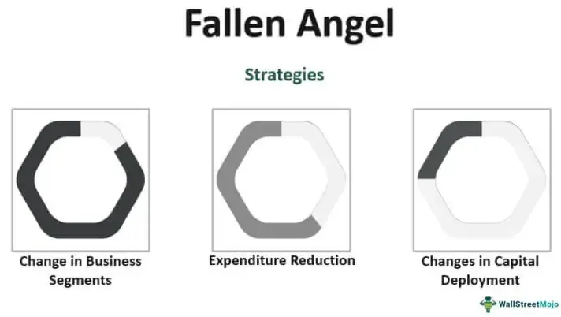

In the intricate world of finance, the intersection of investment risk, credit downgrades, fallen angels, and algorithmic trading presents unique challenges and opportunities. These elements form a complex network within today's financial markets, where changes in one area can significantly impact the others. Understanding the dynamics between these factors is crucial for investors seeking to navigate the financial landscape effectively.

Investment risks, which encompass the potential for financial loss in investment portfolios, are intrinsically linked to credit downgrades. When a credit rating agency lowers the rating of a bond issuer, it signals an increased risk of default, leading to elevated borrowing costs and potentially severe price drops in the issuer's securities. This process creates a ripple effect throughout the financial markets, affecting investor sentiments and strategies.



Fallen angels, a term used to describe bonds that have been downgraded from investment-grade to junk status, illustrate the direct consequence of credit downgrades. These bonds often attract contrarian investors due to their higher yields and the potential for recovery, despite the increased risks associated with them. Economic downturns, industry-specific challenges, and poor management decisions often contribute to such downgrades, adding layers of complexity for investors to consider.

Algorithmic trading and its ability to manage these investment risks offer a modern approach to navigating these challenges. By utilizing sophisticated computer algorithms, investors can execute trades swiftly and efficiently, potentially capitalizing on or hedging against the volatility brought on by fallen angels and credit downgrades.

This article explores these interconnected concepts, aiming to provide a comprehensive understanding of the nature of fallen angels, the risks they pose, and how algorithmic trading can be leveraged to manage these risks. As market conditions continue to evolve, mastering these aspects is essential for investors aiming to skillfully manage their portfolios and seize opportunities in a volatile market environment.

## Table of Contents

## What Are Investment Risks and Credit Downgrades?

Investment risk is a fundamental concept in finance, capturing the potential for losses in an individual's or institution's investment portfolio. This risk can stem from various factors, such as market volatility, economic changes, or specific events affecting an asset class or individual investment. It's typically quantified by measuring the variability of returns, often using metrics like standard deviation or beta. Investment risk necessitates careful management to ensure portfolio stability and the achievement of financial goals.

Credit downgrades are specific instances of investment risk that occur when a credit rating agency, such as Moody's, Standard & Poor's (S&P), or Fitch, lowers its rating of a bond issuer. This action signals an increased risk of default by the issuer due to various reasons, such as deteriorating financial health or adverse economic conditions. For example, if a bond were initially rated 'A' and is downgraded to 'BBB', it reflects the agency's view that the bond has become riskier.

The impact of credit downgrades on the issuer and the broader market is significant. Firstly, downgrades can raise the issuer's borrowing costs. This is because lower-rated bonds are perceived as riskier, and investors demand higher yields as compensation for this increased risk. Consequently, the issuer may encounter higher interest expenses when issuing new debt. Additionally, a downgrade often results in substantial price drops in the issuer's outstanding securities, as the market re-prices the bonds to reflect the new risk assessment. This can affect [liquidity](/wiki/liquidity-risk-premium), as investors might become hesitant to buy or hold these downgraded securities.

For example, consider a scenario where a company's bonds are downgraded from 'BBB' to 'BB', shifting them from investment-grade to speculative-grade (junk) status. Such a downgrade may prompt institutional investors, who might have policies restricting investments in non-investment-grade securities, to sell the affected bonds, exacerbating the price decline. The overall market perception of the company's financial health could suffer, potentially impacting its stock price as well.

Understanding the mechanics of investment risks and credit downgrades is essential for investors aiming to manage their portfolios effectively. Sophisticated strategies, including diversification and hedging, are often employed to mitigate these risks and navigate the investment landscape successfully.

## Understanding Fallen Angels

Fallen angels are bonds initially issued with an investment-grade rating but subsequently downgraded to junk status due to the issuing entity's financial challenges. Credit rating agencies like Moody's, Standard & Poor's, and Fitch play a significant role in this reclassification, marking a shift in perceived creditworthiness and signaling a higher risk of default.

These bonds are characterized by higher yields compared to their investment-grade counterparts. This increased yield acts as a compensation mechanism for the elevated risk assumed by investors. The downgrade triggers a loss of investor confidence, leading to a sell-off that diminishes the bond's price, consequently increasing its yield. Contrarian investors often find fallen angels attractive, as they may speculate on the issuer's potential recovery and the bond's resultant appreciation.

Several factors can precipitate a downgrade to fallen angel status. Economic downturns can strain an issuer's financial stability, leading to increased borrowing costs and cash flow constraints. Industry-specific challenges, such as regulatory changes or disruptive technological advancements, can exacerbate these pressures by altering market dynamics and reducing competitiveness. Moreover, poor management decisions, including inadequate strategic planning or excessive financial leverage, can impair an issuer's ability to meet debt obligations.

Investors considering fallen angels must weigh the prospects of higher returns against the possibility of financial instability. Thorough analysis and strategic risk assessment are crucial components in navigating the complexities associated with these bonds.

## Algorithmic Trading in Managing Risks

Algorithmic trading, or "algo trading," involves the use of computer algorithms to execute trades with speed and efficiency. This approach significantly aids in managing investment risks by swiftly analyzing vast market data and executing trades based on predefined strategies. In the context of fallen angels—bonds downgraded from investment-grade to junk status—[algorithmic trading](/wiki/algorithmic-trading) offers unique advantages.

By leveraging intricate algorithms, traders can efficiently handle the increased [volatility](/wiki/volatility-trading-strategies) and uncertainty associated with fallen angels. These algorithms are designed to process real-time data and identify patterns, allowing investors to react promptly to market changes. The algorithms can implement strategies such as mean reversion, [momentum](/wiki/momentum) trading, or statistical [arbitrage](/wiki/arbitrage), which help capitalize on price fluctuations that often occur following credit downgrades.

A typical strategy might involve monitoring the spread between a fallen angel bond's yield and that of its peers. The algorithm could buy the bond if the spread widens beyond a certain threshold, anticipating a reversion to the mean, and sell when the spread narrows, thus profiting from price corrections. The use of coding languages like Python is common in this process, given its extensive libraries for data analysis and [machine learning](/wiki/machine-learning). A simple example of how one might model mean reversion using Python is as follows:

```python
import numpy as np
import pandas as pd
import matplotlib.pyplot as plt
from sklearn.linear_model import LinearRegression

# Example bond yield data (simulated)
dates = pd.date_range('2023-01-01', periods=100)
yields = np.random.normal(loc=5.0, scale=1.0, size=(100,))

# Convert to DataFrame
yield_data = pd.DataFrame({'Date': dates, 'Yield': yields})

# Calculate moving average
yield_data['SMA50'] = yield_data['Yield'].rolling(window=50).mean()

# Linear regression for mean reversion
model = LinearRegression()
X = yield_data['Yield'].values.reshape(-1, 1)
y = yield_data['SMA50'].dropna().values.reshape(-1, 1)
model.fit(X[-len(y):], y)

# Predict using the model
predictions = model.predict(X)

# Plot the results
plt.figure(figsize=(10, 6))
plt.plot(yield_data['Date'], yield_data['Yield'], label='Yield')
plt.plot(yield_data['Date'], yield_data['SMA50'], label='SMA50', linestyle='--')
plt.plot(yield_data['Date'], predictions, label='Mean Reversion Line', linestyle='-.')
plt.xlabel('Date')
plt.ylabel('Yield')
plt.title('Mean Reversion Strategy')
plt.legend()
plt.show()
```

This example illustrates a simple approach to identifying mean reversion opportunities using historical yield data, a method well-suited to algorithmic trading strategies aimed at managing fallen angel bonds.

In essence, algorithmic trading not only facilitates quick responses to market dynamics but also improves decision-making processes by executing trades with precision and minimizing human error. It enables traders to proactively manage the risks associated with fallen angels, turning volatility into potential benefits.

## Investment Strategies for Fallen Angels

Investing in fallen angels, securities that have recently been downgraded from investment-grade to junk status, offers an intriguing opportunity for investors seeking high yields. However, these investments are not without challenges, primarily revolving around mitigating credit risk. To navigate this complex environment, a strategic approach is essential.

A cornerstone of investing in fallen angels is conducting thorough credit risk analysis. This involves evaluating the issuer's financial health, industry conditions, and economic indicators to assess the potential for recovery. Investors should examine balance sheets, cash flow statements, and other financial metrics to gain insights into the issuer's ability to improve its credit standing. Key financial ratios, such as the debt-to-equity ratio, interest coverage ratio, and credit spread, are vital metrics in this analysis. For instance, a lower debt-to-equity ratio indicates lesser financial leverage and potentially lower risk.

Diversification is another critical strategy that helps mitigate the inherent risks associated with fallen angels. By spreading investments across various issuers, sectors, and geographies, investors can reduce the impact of a default or further downgrade of a single security on their overall portfolio. This diverse spread out can lower the risk of substantial losses, a principle well-illustrated by portfolio theory's emphasis on diversification as a risk management tool.

Contrarian investing can be particularly appealing with fallen angels, as it focuses on identifying bonds with the potential for credit rating reinstatement to investment-grade status. This approach involves investing in bonds that may be undervalued due to widespread pessimism but possess strong fundamentals or restructuring plans that could lead to recovery. Investors embracing this strategy often seek companies undergoing significant strategic changes, such as new management or mergers, that can catalyze a turnaround.

Exchange-traded funds (ETFs) specializing in fallen angels offer another avenue for investors to engage with these high-yield instruments. These ETFs track indexes composed of fallen angel bonds, providing instant diversification and liquidity. By investing in an [ETF](/wiki/etf-trading-strategies), investors can gain exposure to a wide array of fallen angels without the need for deep individual bond analysis. This makes ETFs an attractive option for investors looking to benefit from the potential recovery of fallen angels while spreading risk across multiple holdings.

Overall, a combination of detailed credit evaluations, diversified portfolios, contrarian strategies, and ETF investments can effectively balance the high-yield potential of fallen angels with credit risk mitigation, allowing investors to capitalize on the opportunities within this asset class.

## The Role of Credit Rating Agencies

Credit rating agencies, such as Moody's, Standard & Poor's (S&P), and Fitch, are critical in assessing and conveying the creditworthiness of bond issuers. These agencies provide ratings that reflect the financial stability and likelihood of default by the issuers. By evaluating various financial and economic factors, they assign ratings that range from high-grade, indicating low default risk, to junk status, which signifies higher risk.

The activities of these agencies significantly influence the dynamics of fallen angels—bonds downgraded from investment-grade to junk status. When an agency lowers a rating, it signals increased risk of default. This downgrade often results in immediate repercussions on the market. For example, a downgrade can lead to higher borrowing costs for the issuer due to elevated perceived credit risk, and can also trigger substantial declines in bond prices as investors reassess the associated risks.

Investors closely monitor these ratings as they provide standardized metrics for evaluating credit risk. Changes in credit ratings, whether upgrades or downgrades, can drastically alter market perceptions and significantly impact the valuation of bonds. An upgrade might lead to increased demand, boosting bond prices, whereas a downgrade typically results in a decline. This responsiveness to rating changes underscores the influential capacity of credit rating agencies in financial markets, directing investor behavior and decision-making.

In summary, credit rating agencies play an essential role in shaping the investment landscape. By signaling changes in credit quality, they affect market perceptions and bond valuations, providing critical information needed by investors to manage risks associated with fallen angels and other high-risk securities.

## Market Impact and Historical Performance

Fallen angels, referring to bonds downgraded from investment-grade to junk status, significantly affect market dynamics. Their transition often leads to increased volatility, as the downgrades can trigger a wave of selling by institutional investors required to hold only investment-grade securities. This sell-off can create buying opportunities for high-yield investors who are willing to take on additional risk in pursuit of higher returns.

Historically, fallen angels have demonstrated the potential for recovery during periods of economic growth. This potential is rooted in their origin as investment-grade bonds, implying that despite the downgrade, these issuers might still possess relatively sound fundamentals compared to traditional high-yield bonds. During economic upturns, companies issuing fallen angels may manage to improve their financial situations, leading to potential credit rating upgrades and corresponding price increases. 

For example, in periods of economic expansion, increased revenues and improved cash flows can provide companies with the ability to repay debt and strengthen their balance sheets, thus improving their credit profiles. This, in turn, can lead to an appreciation in the prices of their bonds as the perceived risk decreases and demand from investors increases.

Conversely, fallen angels are particularly sensitive to economic downturns. During such times, the financial difficulties that caused their initial downgrade may be exacerbated, leading to further declines in bond prices. Investors should, therefore, be cautious and prepared for the heightened risk of volatility and potential losses during market contractions.

A comparative analysis reveals that fallen angels often exhibit greater price volatility than other high-yield bonds due to their recent downgrade status. However, their initial investment-grade rating implies an intrinsic quality that might offer better recovery prospects when markets stabilize.

These historical insights underscore the importance of strategic timing and economic context in investing in fallen angels. The dynamic nature of these bonds means they can offer substantial returns if market conditions are favorable and risks are managed effectively.

## Comparative Analysis with Other High-Yield Bonds

Fallen angels, which are bonds downgraded from investment-grade to non-investment-grade, offer a unique position within the spectrum of high-yield bonds. Unlike typical junk bonds, fallen angels start with higher original credit quality. This distinction often leads to better recovery rates should the issuer's financial situation improve. Investors may view this potential for recovery as an attractive aspect of fallen angels, as these securities may regain investment-grade status if the issuer's creditworthiness is restored. 

One of the primary advantages of fallen angels over standard junk bonds is their potential for better price performance during periods of economic recovery. Historically, some fallen angels have achieved significant price recovery after experiencing a downgrade, as their issuers manage to stabilize or improve their financial performance. This potential for recovery can make fallen angels an appealing option for investors willing to undertake the associated risks.

However, this opportunity for potential recovery is tempered by the heightened price volatility associated with recent downgrades from investment-grade status. The market's reaction to credit downgrades can be swift and severe, leading to initial price drops and increased trading volatility. This volatility can be attributed to several factors, including negative market sentiment, the forced selling by institutions required to hold only investment-grade securities, and the adjustment of portfolios by investors to mitigate risk.

In terms of evaluation, fallen angels may be analyzed using similar criteria as other high-yield bonds but require additional consideration of their previous investment-grade status. Analysts often assess factors such as the issuer's financial health, industry conditions, and broader economic trends. Given their recent downgrade, a pertinent question when analyzing fallen angels is whether the factors leading to the downgrade are likely to be transient or indicative of deeper, unresolved issues.

For investors looking to include fallen angels in their portfolios, the balance between the potential for capital appreciation and the inherent risks of volatility must be carefully navigated. A diversified approach, possibly incorporating algorithmic trading to respond swiftly to market movements, can be beneficial in managing both risks and opportunities presented by these securities.

## Conclusion

Fallen angels, bonds transitioning from investment-grade to junk status, present both significant risks and lucrative opportunities for investors. Their unique position as downgraded securities offers higher yields, albeit with increased risk. The strategic use of algorithmic trading can serve as a powerful tool in harnessing these opportunities while managing inherent risks. By leveraging computer algorithms, investors can swiftly analyze market trends and execute trades to either capitalize on undervalued assets or hedge against potential losses associated with credit downgrades.

A comprehensive understanding of credit downgrades and investment risks is crucial. Downgrades indicate an increased risk of default, impacting bond issuer borrowing costs and asset valuations. Therefore, effective risk management strategies are essential. Combining traditional strategies such as credit risk analysis and diversification with modern algorithmic trading approaches can optimize portfolio performance. Investors can benefit from identifying bonds with recovery potential, often adopting a contrarian perspective that anticipates market corrections.

Algorithmic trading assists investors in navigating the complexities of today's volatile market environment by executing trades based on predefined strategies. This technological advancement allows for the rapid adjustment of investment positions. By understanding the delicate balance between credit downgrades, market volatility, and high-yield opportunities, investors can enhance their investment strategies to achieve favorable outcomes with fallen angels in their portfolios.

## References & Further Reading

[1]: Bergstra, J., Bardenet, R., Bengio, Y., & Kégl, B. (2011). ["Algorithms for Hyper-Parameter Optimization."](https://papers.nips.cc/paper/4443-algorithms-for-hyper-parameter-optimization) Advances in Neural Information Processing Systems 24.

[2]: ["Advances in Financial Machine Learning"](https://www.amazon.com/Advances-Financial-Machine-Learning-Marcos/dp/1119482089) by Marcos Lopez de Prado

[3]: ["Evidence-Based Technical Analysis: Applying the Scientific Method and Statistical Inference to Trading Signals"](https://www.amazon.com/Evidence-Based-Technical-Analysis-Scientific-Statistical/dp/0470008741) by David Aronson

[4]: ["Machine Learning for Algorithmic Trading"](https://github.com/stefan-jansen/machine-learning-for-trading) by Stefan Jansen

[5]: ["Quantitative Trading: How to Build Your Own Algorithmic Trading Business"](https://www.amazon.com/Quantitative-Trading-Build-Algorithmic-Business/dp/1119800064) by Ernest P. Chan