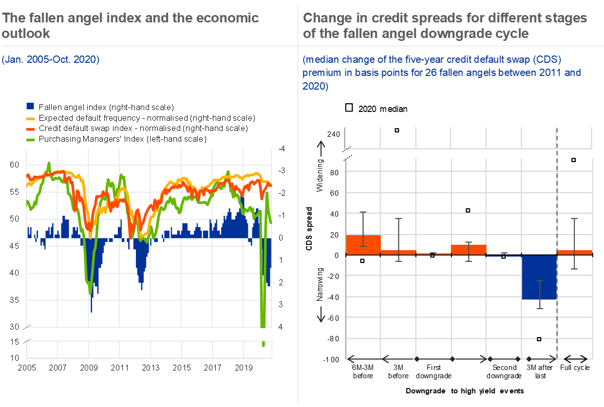

## Table of Contents

## What is a fallen angel in the context of finance?

In finance, a fallen angel is a bond that was once rated as investment grade but has been downgraded to junk status. Investment grade bonds are considered safe and reliable, so when a bond loses this rating, it becomes a fallen angel. This downgrade usually happens because the company issuing the bond is facing financial difficulties or other problems that make it riskier for investors.

When a bond becomes a fallen angel, it can have big effects on investors and the market. Investors who are only allowed to buy investment grade bonds might have to sell these fallen angels, which can cause the bond's price to drop even more. On the other hand, some investors who are looking for high-risk, high-reward opportunities might see fallen angels as a chance to buy bonds at a lower price, hoping that the company will recover and the bond will regain its investment grade status.

## How does a company become a fallen angel?

A company becomes a fallen angel when its bonds are downgraded from investment grade to junk status. This happens when credit rating agencies like Moody's or Standard & Poor's decide that the company is riskier than before. They look at things like the company's profits, debts, and how well it's doing in the market. If the company is struggling to make money or has too much debt, the agencies might lower its bond rating.

When a company's bonds are downgraded, it can be because of problems inside the company or because of bigger issues in the economy. For example, if the company is losing customers or facing new competition, its financial health might suffer. Or, if there's a recession, many companies might struggle, leading to more fallen angels. Once a company's bonds become fallen angels, it can be harder for the company to borrow money, and it might have to pay higher interest rates on new loans.

## What are the typical characteristics of a fallen angel?

A fallen angel is a bond that used to be safe and reliable but has been downgraded to a riskier status. This happens when a credit rating agency decides the company issuing the bond is not as financially stable as before. The bond is no longer considered investment grade, which means it's seen as more likely to default or not pay back the money it owes.

When a bond becomes a fallen angel, it can cause a lot of changes. Investors who can only buy safe bonds might have to sell these fallen angels, which can make the bond's price go down even more. But some investors who like taking risks might see fallen angels as a good chance to buy bonds at a lower price. They hope the company will get better and the bond will become safe again.

## What is the impact of a bond being downgraded to junk status?

When a bond is downgraded to junk status, it means it's seen as riskier than before. This can cause a lot of changes for the company that issued the bond. Investors who are only allowed to buy safe bonds might have to sell these bonds, which can make the bond's price drop even more. It can be harder for the company to borrow money, and they might have to pay higher interest rates on new loans. This can make the company's financial situation even worse.

On the other hand, some investors who like taking risks might see this as a chance to buy the bonds at a lower price. They hope that the company will get better and the bond will become safe again. This can help the company by giving them money when they need it, but it's still a risky move for the investors. So, a bond being downgraded to junk status can affect both the company and the people who invest in it.

## How can investors identify potential fallen angels?

Investors can identify potential fallen angels by keeping an eye on the credit ratings of bonds they're interested in. They should watch for bonds that are currently rated as investment grade but are close to being downgraded to junk status. Credit rating agencies like Moody's or Standard & Poor's provide these ratings, and investors can use them to see which companies might be at risk. If a company is struggling to make money or has a lot of debt, it's more likely to become a fallen angel.

Another way to spot potential fallen angels is by looking at the company's financial health. Investors should check if the company is losing customers, facing new competition, or dealing with economic problems like a recession. These issues can make it harder for the company to pay back its debts, which could lead to a downgrade. By keeping an eye on these factors, investors can be ready for when a bond might become a fallen angel.

## What are the investment strategies related to fallen angels?

Some investors see fallen angels as a chance to make money. They buy these bonds at a lower price after they've been downgraded, hoping that the company will get better and the bond will go back to being safe. This can be a good strategy if the company fixes its problems and the bond's price goes up. But it's risky because the company might not recover, and the bond could lose even more value.

Another strategy is to avoid fallen angels altogether. Investors who can only buy safe bonds have to sell these bonds when they're downgraded, which can make the bond's price drop even more. These investors want to keep their money in safe investments and don't want to take the risk of holding onto a bond that might not pay back. This strategy is about staying safe and not losing money, even if it means missing out on potential gains.

Some investors use a mix of both strategies. They might keep a small part of their money in fallen angels to try and make more money, while keeping most of their money in safe investments. This way, they can take some risk but still protect most of their money. It's all about finding the right balance between risk and reward.

## What are the risks associated with investing in fallen angels?

Investing in fallen angels can be risky because these bonds have been downgraded from safe to risky status. This means the company that issued the bond is having money problems or other issues that make it harder for them to pay back what they owe. If the company keeps struggling, the bond's value could drop even more, and investors could lose money. It's a big risk because the company might not get better, and the bond could end up being worth a lot less than what the investor paid for it.

Another risk is that fallen angels can be hard to sell. When a bond is downgraded, many investors who can only buy safe bonds have to sell these bonds, which can make the bond's price drop even more. This means that if an investor wants to sell their fallen angel bond, they might not be able to find someone to buy it at a good price. It can be hard to get out of the investment if things go wrong, which makes it even riskier.

## How do fallen angels affect the broader financial market?

Fallen angels can shake up the financial market because they used to be safe investments but are now seen as risky. When a bond gets downgraded to junk status, investors who can only buy safe bonds have to sell these fallen angels. This can cause the bond's price to drop a lot, which can make the whole market feel less stable. If a lot of bonds are downgraded at the same time, it can lead to big changes in the market, making investors worried and less likely to take risks.

On the other hand, some investors see fallen angels as a chance to make money. They buy these bonds at a lower price, hoping the company will get better and the bond will go back to being safe. This can help the company by giving them money when they need it, but it also adds more risk to the market. If too many investors are buying and selling fallen angels, it can make the market more unpredictable and harder to understand. So, fallen angels can make the financial market more exciting but also more risky.

## What historical examples illustrate the concept of fallen angels?

One famous example of a fallen angel is the case of General Motors (GM) in 2005. GM was a big car company that used to be seen as a safe investment. But when they started losing money and had too much debt, their bonds got downgraded to junk status. This made a lot of investors worried, and they had to sell their GM bonds. The price of the bonds went down a lot, and it was hard for GM to borrow money. It took years for GM to fix their problems and get their bonds back to being safe.

Another example is the energy company Enron in 2001. Enron was once seen as a strong company, but it turned out they were hiding a lot of debt and not telling the truth about their money. When people found out, their bonds got downgraded to junk status really fast. A lot of investors lost money because they thought Enron was safe but it wasn't. This made the whole market feel less stable and showed how quickly a company can go from being safe to being risky.

## How do credit rating agencies assess and classify fallen angels?

Credit rating agencies like Moody's and Standard & Poor's look at a company's money situation to decide if its bonds should be downgraded to junk status. They check things like how much money the company is making, how much debt it has, and if it's doing well in the market. If the company is losing money or has too much debt, the agencies might think it's riskier and lower its bond rating. When a bond goes from being safe to being risky, it becomes a fallen angel.

When a bond is downgraded, the agencies use a scale to show how risky it is. For example, Standard & Poor's might change a bond's rating from BBB- (the lowest investment grade) to BB+ (the highest junk status). This tells investors that the bond is no longer safe and they should be careful. The agencies keep watching the company to see if it gets better or worse, and they might change the rating again if things change.

## What role do fallen angels play in portfolio diversification?

Fallen angels can help investors spread out their money and take some risks. When a bond becomes a fallen angel, it means it's no longer seen as a safe investment. Some investors might want to buy these bonds at a lower price, hoping that the company will get better and the bond will go back to being safe. By adding fallen angels to their portfolio, investors can try to make more money if the company recovers. But it's a risky move because the company might not get better, and the bond could lose even more value.

Adding fallen angels to a portfolio can make it more exciting but also more unpredictable. If a lot of the money in a portfolio is in fallen angels, it can be hard to know what will happen. Investors need to be ready for the bond's price to go up or down a lot. But if they only put a small part of their money in fallen angels, they can still try to make more money while keeping most of their money in safe investments. It's all about finding the right balance between taking risks and staying safe.

## What are the advanced analytical tools used to predict fallen angels?

Investors use advanced tools to try and guess which bonds might become fallen angels. These tools look at a lot of information about a company, like how much money it's making, how much debt it has, and what's happening in the market. They use computer programs to find patterns and signs that a company might be in trouble. For example, if a company's profits are going down or its debt is going up, these tools can warn investors that the bond might be downgraded soon.

Some of these tools use something called [machine learning](/wiki/machine-learning), which means they can learn from past data to make better guesses about the future. They look at old examples of fallen angels and try to find out what made them happen. This helps investors see if a bond is at risk of being downgraded. By using these advanced tools, investors can make smarter choices about which bonds to buy or sell, and they can be ready for when a bond might become a fallen angel.

## References & Further Reading

[1]: Bergstra, J., Bardenet, R., Bengio, Y., & Kégl, B. (2011). ["Algorithms for Hyper-Parameter Optimization."](https://papers.nips.cc/paper/4443-algorithms-for-hyper-parameter-optimization) Advances in Neural Information Processing Systems 24.

[2]: ["Advances in Financial Machine Learning"](https://www.amazon.com/Advances-Financial-Machine-Learning-Marcos/dp/1119482089) by Marcos Lopez de Prado

[3]: ["Evidence-Based Technical Analysis: Applying the Scientific Method and Statistical Inference to Trading Signals"](https://www.amazon.com/Evidence-Based-Technical-Analysis-Scientific-Statistical/dp/0470008741) by David Aronson

[4]: ["Machine Learning for Algorithmic Trading"](https://github.com/stefan-jansen/machine-learning-for-trading) by Stefan Jansen

[5]: ["Quantitative Trading: How to Build Your Own Algorithmic Trading Business"](https://www.amazon.com/Quantitative-Trading-Build-Algorithmic-Business/dp/1119800064) by Ernest P. Chan