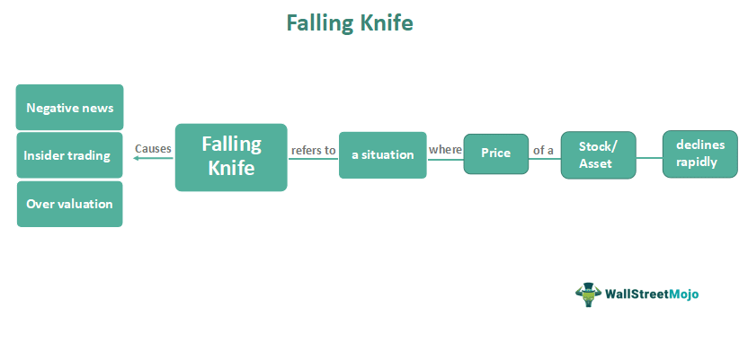

In the trading world, the phrase "falling knife" is often cautionary, symbolizing a market situation where the price of an asset experiences a rapid decline. An investor employing a falling knife strategy attempts to purchase such assets amidst strong downward momentum, hoping to capitalize on an eventual price rebound. This approach is inherently high-risk given the difficulty in predicting the bottom of the market downturn, yet it carries the potential for substantial returns if timed correctly. Understanding this strategy requires a deep appreciation of market dynamics and a robust risk appetite.

Algorithmic trading, commonly known as algo trading, represents a growing shift in financial markets towards automated decision-making. Based on pre-programmed instructions and set parameters, algorithms enable traders to perform high-frequency, high-volume trades with precision and speed. The continual advancements in technology and widespread access to real-time market data have fueled the popularity of algo trading. Its increasing adoption is driven by the quest for mitigating human error and the capability to exploit fleeting market inefficiencies.



Combining falling knife investing with algorithmic trading provides a fascinating intersection of traditional risk-taking and modern technology. In this context, sophisticated algorithms are designed to identify falling knife opportunities leveraging vast amounts of market data. The synthesis of speed, precision, and data analysis offered by algo trading could refine the inherently risky falling knife strategy, potentially enhancing its profitability.

This article aims to explore the strategies, advantages, and risks of merging falling knife investing with algorithmic trading principles. Understanding these aspects is pivotal for investors seeking to navigate this complex landscape. By examining this blend of strategies, the article will provide insights into making informed decisions in dynamic market conditions. The combination of falling knife investing with algo trading could redefine traditional approaches, offering new opportunities and challenges in the pursuit of financial gains.

## Table of Contents

## Understanding Falling Knife Investing

Falling knife investing refers to a high-risk strategy where investors purchase stocks or other securities that are experiencing a sharp decline in price. The term "falling knife" is derived from the metaphor "catching a falling knife," which suggests that attempting to buy securities during a steep drop can be dangerous and lead to significant losses if not executed with precision.

Investors might be attracted to this strategy for several reasons. Firstly, the allure of purchasing undervalued assets at a discount can be appealing, especially if the investor believes that the market has overreacted to negative news or events affecting the security in question. These investors hope that the security's price will rebound, providing substantial profits once the market correction occurs. Additionally, falling knife investing can be an enticing opportunity for contrarian investors who seek to capitalize on market pessimism.

However, the potential rewards of falling knife investing are counterbalanced by significant risks. The primary risk is that the price of the security may continue to fall rather than stabilize or recover, leading to further losses for the investor. There is also the risk that the factors causing the decline, such as poor financial performance or adverse economic conditions, may persist longer than anticipated. This possibility emphasizes the need for careful analysis and timing in executing this strategy.

Historically, there have been notable examples of falling knife scenarios in the market. For instance, during the 2008 financial crisis, many stocks experienced precipitous declines. Some investors who attempted to buy stocks during the downturn incurred substantial losses as prices continued to fall. Conversely, those who successfully timed their purchases and held onto their investments saw significant gains during the recovery period.

The psychological factors influencing falling knife investments are multifaceted. Greed and fear often play pivotal roles; the greed of potentially [earning](/wiki/earning-announcement) high returns can drive investors to take on substantial risks, while the fear of missing out on a market recovery can lead to hasty decisions. Cognitive biases, such as overconfidence in one's ability to predict market movements or the desire to recoup recent losses quickly, may also contribute to the appeal of this investment strategy.

Understanding falling knife investing requires a careful evaluation of both the potential rewards and the inherent risks. It calls for a disciplined approach to analysis and decision-making, recognizing the psychological factors at play and their influence on investor behavior.

## The Basics of Algorithmic Trading

Algorithmic trading, often referred to as algo trading, involves using computer algorithms to automate trading decisions and execute trades at speeds and frequencies that are impossible for human traders. At its core, [algorithmic trading](/wiki/algorithmic-trading) relies on the integration of complex mathematical models, comprehensive data analysis, and cutting-edge technology to make trading decisions based on pre-defined sets of rules.

Algorithms are used in high-frequency trading ([HFT](/wiki/high-frequency-trading-strategies)) to execute trades with exceptional precision. HFT allows traders to capitalize on minute price discrepancies that might arise within milliseconds. A key advantage of this automated method is its speed and accuracy, which significantly reduces the potential for human errors that can occur due to emotional or psychological biases. By removing human intervention, algorithmic trading ensures consistent adherence to strategies—crucial in dynamic markets where human hesitation or impulsive actions can lead to suboptimal results.

Data analysis plays a pivotal role in the development of trading algorithms. It involves processing large datasets to identify patterns or trends that might inform market movements. Machine learning (ML), a subset of [artificial intelligence](/wiki/ai-artificial-intelligence), has become a crucial tool in refining these algorithms. ML models can learn from historical data to predict future trends, adapting the algorithm's decision-making processes for improved performance. For instance, a [machine learning](/wiki/machine-learning) model can be programmed to recognize specific market signals and automatically execute trades when certain conditions are met.

The technological foundation of algo trading has seen numerous advancements. Innovations in computational technology and data processing have enabled the analysis of big data in real-time, making it possible to react immediately to market changes. Cloud computing and high-speed internet connectivity further support the scalability and efficiency of these trading systems.

In recent years, the integration of artificial intelligence into trading algorithms has opened new avenues for innovation. AI systems enhance the adaptability of trading strategies by continually learning from new data inputs and automatically adjusting to changing market conditions without manual intervention.

Overall, the advancements in algorithmic trading technology continue to transform the landscape of financial markets, offering increased opportunities and efficiencies for traders who leverage these sophisticated tools. As technology evolves, the potential for even more rapid and precise trading decisions grows, reshaping traditional trading paradigms.

## Integrating Falling Knife Strategy with Algo Trading

Algorithmic trading opens new avenues for trading strategies, including those that focus on the falling knife approach. By leveraging algorithms, traders can potentially identify and capitalize on assets experiencing sharp declines, with an eye for eventual recovery. This integration offers a structured method to address the inherent challenges associated with falling knife investing, primarily through speed, precision, and systematic risk management.

Algorithms specifically designed for identifying falling knife opportunities employ advanced analytics to recognize the conditions and patterns indicative of such a scenario. These algorithms utilize various technical indicators like moving averages, Relative Strength Index (RSI), and candlestick patterns to flag potential falling knives. The integration of machine learning models can further enhance these algorithms' predictive power by learning from historical data to improve future decision-making processes.

Real-time data is crucial for effectively capturing falling knife market movements. High-frequency trading (HFT) systems play a pivotal role as they are capable of processing vast datasets and executing trades within milliseconds. This capability ensures traders can swiftly react to market changes, thus minimizing losses and maximizing potential gains. In practice, such algorithms continuously monitor market feeds, adjusting their parameters dynamically in response to incoming information, which allows for timely interventions during asset price declines.

Risk management is an integral component of any algorithmic system targeting falling knives. This involves implementing stringent stop-loss orders, which automatically [exit](/wiki/exit-strategy) trades to prevent substantial losses. Position sizing and [volatility](/wiki/volatility-trading-strategies) scaling are also used to manage exposure, ensuring that the amounts invested in each opportunity are commensurate with the associated risks. Moreover, these systems frequently undergo [backtesting](/wiki/backtesting) against historical data to validate their effectiveness and refine their operational protocols.

When properly integrated, the combination of falling knife strategy and algorithmic trading has the potential for profitability. The use of precise entry and exit points, facilitated by algorithms, reduces the emotional bias often exhibited in manual trading. Additionally, because algorithms can operate continuously without fatigue, they are capable of seizing opportunities that may be missed by human traders. Such advantages might lead to exceeding returns, especially in volatile markets where rapid price movements are common.

In summary, the synergy between algorithmic trading and falling knife strategies offers a structured framework for tackling high-risk investments, with substantial potential rewards. Through the intelligent use of technology and risk protocols, investors can effectively maneuver through the complexities of falling knife scenarios, maximizing their chances for financial gain.

## Risks and Challenges

Falling knife algo trading, which involves attempting to catch securities experiencing significant price declines, presents a range of unique risks and challenges. Understanding these risks is crucial for traders who wish to employ such strategies effectively.

### Unique Risks of Falling Knife Algo Trading

Falling knife algo trading combines the inherent risks of both the falling knife strategy and algorithmic trading. One primary risk is that of enhanced volatility. Securities that are labeled as "falling knives" are typically undergoing rapid downward movements, often triggered by adverse news or poor financial performance, which could be compounded by additional market volatility. This turbulence can challenge algorithms, particularly those not specifically designed to handle such volatility, leading to unfavorable trades.

Moreover, the timing of trades is critical. The potential for executing trades too early, before the stock has fully bottomed out, remains a significant risk, potentially amplifying losses. Even finely tuned algorithms may struggle with accurately predicting when the decline will cease, resulting in substantial financial losses.

### Regulatory Challenges and Ethical Considerations

Algorithmic trading is subject to stringent regulatory oversight designed to maintain market fairness and stability. The risk of inadvertently breaching regulations is heightened in falling knife algo trading due to the rapid execution of high-frequency trades. Traders must ensure compliance with market regulations, such as those stipulated by the Securities and Exchange Commission (SEC) in the United States, to avoid legal repercussions.

Ethical considerations also arise, particularly concerning market manipulation and fairness. Algorithms must not be programmed in ways that could lead to unfair trading advantages or market disruption, as these practices are closely scrutinized by regulators.

### Technological Setbacks: System Errors and Latency Issues

Technological infrastructure is the backbone of algorithmic trading; however, it is not without its flaws. System errors and failures can lead to incorrect executions or missed opportunities, significantly impacting profitability. Latency issues, where there is a delay in trade execution due to slow data processing or transmission, are particularly prominent in high-frequency trading environments. These delays can result in trades being executed at non-optimal prices, further compounding potential losses.

### Market Volatility and Strategy Effectiveness

Market volatility can erode the effectiveness of falling knife algo trading strategies. Extremely volatile markets may lead to rapid price swings that algorithms find difficult to interpret, leading to inappropriate buying or selling decisions. This unpredictability can nullify the predictive capabilities of even the most sophisticated algorithms, potentially resulting in substantial financial losses.

### Cautionary Tales from Trading Failures

Several historical cases highlight the risks associated with falling knife algo trading. For example, the "flash crash" of 2010, where markets experienced a sudden, severe drop, underscores the potential for algorithmic strategies to contribute to, or be adversely affected by, market downturns. During such events, algorithms triggered automatic trades, exacerbating market declines and leading to extensive financial repercussions for numerous traders.

In another instance, Knight Capital suffered a devastating loss in 2012 due to a software glitch that resulted in thousands of unintended trades. This event underscores the jeopardies associated with technological failures and poor algorithm governance, highlighting the need for robust risk management and oversight mechanisms to prevent similar occurrences.

In conclusion, while the integration of falling knife investing with algorithmic trading offers potential rewards, it also requires a thorough understanding of the inherent risks. Traders must ensure that their strategies are well-calibrated to manage market turbulence and adhere to regulatory standards to mitigate the challenges presented by this high-risk trading approach.

## Success Stories and Case Studies

In the trading world, several success stories illustrate the potential benefits of integrating falling knife strategies with algorithmic trading. These case studies demonstrate how carefully designed algorithms can turn volatile market situations into profitable opportunities.

One notable example is the successful application of falling knife algo trading by a high-frequency trading firm during the energy sector downturn in the mid-2010s. During this period, oil prices plummeted due to geopolitical tensions and oversupply, leading to significant losses in energy stocks. The firm's algorithm was programmed to identify oversold conditions, capitalizing on brief periods of excessive pessimism in specific undervalued stocks. By analyzing historical price movements, market sentiment, and macroeconomic data, the algorithm swiftly executed trades that capitalized on the eventual market corrections. The strategy proved profitable due to its ability to identify entry points where the probability of a rebound was statistically significant.

Another sector where this strategy has gained traction is the technology industry. In the early 2020s, a prominent investment firm employed a falling knife algorithm during the tech sell-off triggered by concerns over rising interest rates and regulatory challenges. The algorithm utilized machine learning models to digest vast amounts of market data in real-time, identifying stocks that, despite their temporary price slumps, showed strong fundamentals and growth potential. As the algorithm adapted to fluctuations, it adjusted its parameters, ensuring trades occurred only when certain volatility thresholds were met. This strategic flexibility allowed the firm to achieve considerable gains as the tech market recovered.

The adaptability of algorithms in these scenarios has been crucial to their success. Whether through real-time data analysis or machine learning enhancements, the capacity of algorithms to respond dynamically to market changes is a vital trait. By continuously updating their criteria and employing advanced statistical models, these algorithms can maintain relevance even in rapidly changing market environments.

From these successes, key takeaways for individual traders include the importance of robust data analysis and risk management frameworks. Employing algorithms that incorporate diverse data inputs—ranging from price movements to sentiment analysis—and possessing the flexibility to adapt to evolving market conditions are crucial. Moreover, implementing strict stop-loss mechanisms can mitigate potential losses inherent in falling knife strategies.

Ultimately, these case studies underscore the potential of combining falling knife investing with algorithmic trading. When executed with precision, such strategies can identify lucrative opportunities in volatile markets, turning potential pitfalls into pathways for substantial returns. Traders aiming to harness this potential should focus on building adaptable, data-driven algorithms that prioritize both speed and accuracy.

## Future Trends and Developments

Algorithmic trading, often characterized by its reliance on automation, is at the frontier of technological advancements in financial markets. When combined with falling knife strategies, which involve buying assets that have experienced sharp declines, the future trends and developments in this field hold transformative potential.

### Future Advancements in Algo Trading Technology

The enhancement of machine learning algorithms and artificial intelligence (AI) is likely to play a crucial role in the evolution of algorithmic trading tailored to falling knife strategies. Machine learning models can be trained to identify the complex patterns and signals preceding significant market downturns, thus improving predictive accuracy. AI's capacity to process vast and varied datasets in real-time can enable more accurate assessments of when a stock has bottomed out.

Example of a simple Python implementation in machine learning might utilize libraries such as `sklearn` for predictive modeling:

```python
from sklearn.ensemble import RandomForestClassifier
from sklearn.model_selection import train_test_split

# Assume `features` and `labels` are pre-processed data arrays
X_train, X_test, y_train, y_test = train_test_split(features, labels, test_size=0.2)

model = RandomForestClassifier(n_estimators=100)
model.fit(X_train, y_train)
predictions = model.predict(X_test)
```

### Big Data's Role

Big data analytics is increasingly instrumental in refining algorithmic strategies. By analyzing vast amounts of structured and unstructured data, traders can gain insights into market sentiment, macroeconomic indicators, and sector-specific trends. The integration of big data methodologies allows for more sophisticated risk assessments and decision-making frameworks tailored to falling knife opportunities.

### New Markets and Opportunities

New market opportunities for employing falling knife algo trading are emerging in cryptocurrencies and decentralized finance (DeFi). These areas, known for their volatility, present both challenges and opportunities. Algorithms designed to detect falling knife patterns in these markets could potentially capitalize on rapid price swings, provided that the inherent risks are managed adequately.

### Regulatory Changes

The regulatory landscape surrounding algorithmic trading is evolving, which could significantly impact the deployment of falling knife strategies. Regulatory bodies are increasingly scrutinizing algorithmic practices due to concerns over market stability and fairness. New regulations might compel trading firms to increase transparency in how their algorithms function and make decisions, potentially influencing the design and deployment of such strategies.

In sum, the future of falling knife algo trading is poised for significant advancements through AI, big data, and the exploration of new financial markets. However, traders must navigate an evolving regulatory environment to successfully integrate these technologies into their strategies, balancing innovation with compliance. As the trading landscape continues to change, maintaining a deep understanding of these trends will be essential for leveraging falling knife strategies effectively.

## Conclusion

In summary, the intersection of falling knife investing and algorithmic trading offers a compelling yet complex approach to market participation. This strategy leverages the precision and speed of algorithms to identify and potentially capitalize on sharp price declines—akin to catching a "falling knife." The integration of sophisticated algorithms can assist in discerning market patterns, allowing for timely and informed decision-making. 

However, this investment approach comes with pronounced risks. The inherent volatility in falling knife scenarios, combined with potential technological challenges such as system failures or latency issues, underscores the high-risk nature of this strategy. Moreover, regulatory and ethical considerations must be navigated carefully to ensure compliance and integrity.

Given these factors, it is imperative for traders and investors to conduct comprehensive research and risk assessments before engaging in falling knife algo trading. A thorough understanding of both algorithmic technology and market dynamics is crucial to managing risks effectively and optimizing potential returns.

The trading world is ever-changing, driven by technological advancements and innovative strategies. As both markets and algorithms evolve, traders must remain adaptable and informed. We encourage readers to share their own experiences and insights regarding falling knife investing and algorithmic trading, fostering a deeper understanding of these complex yet exciting strategies.

## References & Further Reading

[1]: Bergstra, J., Bardenet, R., Bengio, Y., & Kégl, B. (2011). ["Algorithms for Hyper-Parameter Optimization."](https://papers.nips.cc/paper/4443-algorithms-for-hyper-parameter-optimization) Advances in Neural Information Processing Systems 24.

[2]: ["Advances in Financial Machine Learning"](https://www.amazon.com/Advances-Financial-Machine-Learning-Marcos/dp/1119482089) by Marcos Lopez de Prado

[3]: ["Evidence-Based Technical Analysis: Applying the Scientific Method and Statistical Inference to Trading Signals"](https://www.amazon.com/Evidence-Based-Technical-Analysis-Scientific-Statistical/dp/0470008741) by David Aronson

[4]: ["Machine Learning for Algorithmic Trading"](https://github.com/stefan-jansen/machine-learning-for-trading) by Stefan Jansen

[5]: ["Quantitative Trading: How to Build Your Own Algorithmic Trading Business"](https://www.amazon.com/Quantitative-Trading-Build-Algorithmic-Business/dp/1119800064) by Ernest P. Chan