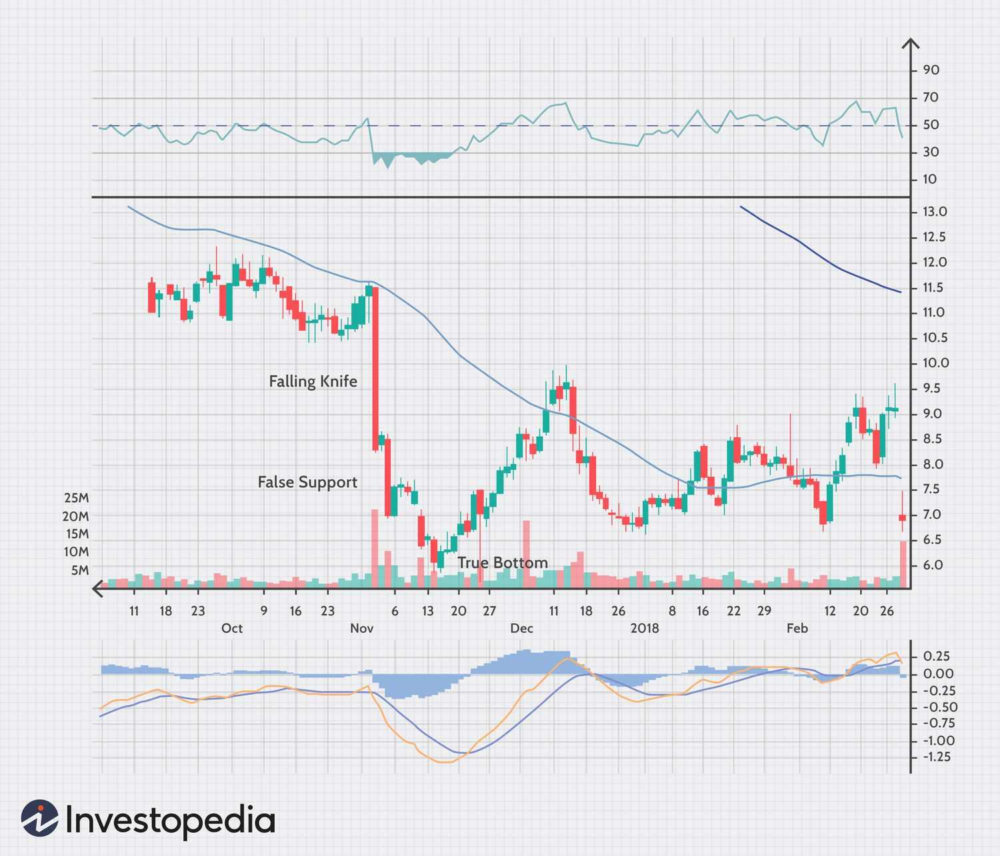

## Table of Contents

## What is a falling knife in the context of investing and trading?

A falling knife in investing and trading refers to a stock or other asset that is rapidly declining in value. The term comes from the idea that trying to catch a falling knife is dangerous, just like trying to buy a stock that is quickly losing value can be risky. Investors are often warned against trying to "catch" a falling knife because it's hard to predict when the price will stop dropping.

When people talk about a falling knife, they usually mean that the price is dropping fast and it's not clear when it will stop. This can happen for many reasons, like bad news about the company or problems in the market. Trying to buy the stock at a low price hoping it will go back up can lead to big losses if the price keeps falling. It's a situation where timing is very important, and it's often better to wait until the price stabilizes before making a decision.

## Why is catching a falling knife considered risky?

Catching a falling knife is considered risky because it's hard to know when the price of a stock will stop falling. When you try to buy a stock that's dropping fast, you might think it's a good deal, but you could end up losing money if the price keeps going down. It's like trying to guess the bottom of a slide that hasn't stopped yet. If you guess wrong, you could lose a lot of money.

Another reason it's risky is that there might be good reasons why the stock is falling. Maybe the company is having problems, or the whole market is going down. If you buy the stock without knowing why it's falling, you might be buying into a situation that's going to get worse before it gets better. It's often safer to wait and see what happens before you decide to buy.

## Can you provide examples of stocks that were considered falling knives?

One example of a falling knife was Enron in 2001. Enron was a big energy company, but it turned out they were hiding a lot of debt and lying about how much money they were making. When people found out, the stock price started to fall fast. People who tried to buy Enron stock hoping it would go back up lost a lot of money because the company went bankrupt.

Another example is Lehman Brothers in 2008. Lehman Brothers was a big bank that got into trouble during the financial crisis. Their stock price started to drop quickly as people realized the bank was in big trouble. Some investors tried to buy the stock thinking it was a good deal, but Lehman Brothers ended up going bankrupt, and those investors lost a lot of money.

These examples show how risky it can be to try and catch a falling knife. It's hard to know when a stock will stop falling, and if you guess wrong, you can lose a lot of money. It's often better to wait and see what happens before you decide to buy.

## What are the key indicators that a stock might be a falling knife?

A stock might be a falling knife if it's dropping fast and the price keeps going down day after day. You might see big drops in the stock price, and it doesn't seem to be stopping. This can happen when bad news comes out about the company, like they're losing money or they're in trouble with the law. It can also happen if the whole market is going down, and people are selling a lot of stocks.

Another sign that a stock might be a falling knife is if there's a lot of uncertainty about the company's future. If people don't know if the company will make it through its problems, they might keep selling the stock, which makes the price drop even more. It's important to look at why the stock is falling. If it's because of something that might not get better soon, it's riskier to try and buy it hoping the price will go back up.

## How can technical analysis help in identifying a falling knife?

Technical analysis can help in spotting a falling knife by looking at charts and patterns. One way to do this is by using moving averages, which are lines that show the average price of a stock over time. If the stock price is dropping below its moving averages, especially the longer-term ones like the 50-day or 200-day moving average, it might be a sign that the stock is falling fast and could be a falling knife. Another thing to look at is the stock's [momentum](/wiki/momentum). If the stock is making lower lows and lower highs, it's a sign that the price is falling and might keep going down.

Another useful tool in technical analysis is the Relative Strength Index (RSI). If the RSI is below 30, it means the stock might be oversold, but if it stays low and keeps dropping, it could mean the stock is a falling knife. Also, chart patterns like a head and shoulders or a descending triangle can show that the stock price is likely to keep going down. By looking at these signs, investors can get a better idea of whether a stock is a falling knife and decide if it's too risky to buy.

## What are the psychological factors that lead investors to attempt catching a falling knife?

One big reason investors try to catch a falling knife is because they don't want to miss out on a good deal. When a stock's price drops a lot, it can look really cheap. Investors might think, "If I buy now, I can get it for a low price and make a lot of money when it goes back up." This is called the fear of missing out, or FOMO. It makes people take big risks because they're scared they'll miss a chance to make money.

Another reason is that investors might think they can predict the bottom of the price drop. They might believe they're smart enough to know when the stock will stop falling and start going up again. This can make them feel confident and willing to take a risk. But it's hard to predict the bottom, and if they're wrong, they can lose a lot of money. These psychological factors can lead investors to try and catch a falling knife, even though it's risky.

## What strategies can be used to mitigate the risks of investing in a falling knife?

One way to lower the risk of investing in a falling knife is to do a lot of research before you buy. Look at why the stock is falling. Is it because the company is having problems, or is it because the whole market is going down? If the company is in trouble, it might be better to wait and see if they can fix their problems before you buy. Also, look at the company's financials. Are they making money, or are they losing it? If they're losing money, it's riskier to buy their stock.

Another strategy is to use stop-loss orders. A stop-loss order is a way to tell your broker to sell the stock if it drops to a certain price. This can help you limit how much money you lose if the stock keeps falling. It's also a good idea to only invest money that you can afford to lose. Don't use money you need for important things like bills or rent. That way, if the stock keeps going down, you won't be in big trouble.

Lastly, think about spreading out your investments. Instead of putting all your money into one stock that's falling fast, you can invest in different stocks or even different types of investments like bonds or mutual funds. This is called diversification, and it can help you lower the risk of losing a lot of money if one of your investments doesn't do well. By using these strategies, you can be more careful when you're thinking about buying a falling knife.

## How do market conditions influence the behavior of falling knives?

Market conditions can make a big difference in how falling knives behave. When the whole market is going down, like during a recession or a big financial crisis, more stocks can start to look like falling knives. This is because when people are scared about the market, they might sell a lot of stocks, which makes the prices drop even more. If a stock was already falling because of problems with the company, the bad market conditions can make it fall even faster. It's like a double hit for the stock price.

On the other hand, when the market is doing well and people feel good about investing, a falling knife might not fall as far or as fast. If the market is strong, people might be more willing to buy a stock that's dropping, thinking it's a good deal. This can slow down the fall of the stock price. But even in a good market, if a company has big problems, its stock can still be a falling knife. So, it's important to look at both the market conditions and the company's situation before deciding to buy a falling knife.

## What are the differences between a falling knife and a value trap?

A falling knife and a value trap are both risky for investors, but they are different in some ways. A falling knife is a stock that is dropping fast and it's not clear when it will stop. It's like trying to catch a knife that's falling through the air - it's dangerous because you might get hurt if you guess wrong about when it will stop. People might try to buy a falling knife because they think the price will go back up, but if the stock keeps falling, they can lose a lot of money.

A value trap, on the other hand, is a stock that looks cheap but doesn't end up being a good investment. It might seem like a good deal because the price is low, but the company might have big problems that keep it from growing or making money. Unlike a falling knife, a value trap might not be dropping fast, but it can still be risky because the stock price might stay low or even go down more over time. Both falling knives and value traps can trick investors into thinking they're getting a good deal, but they can lead to big losses if you're not careful.

## How can fundamental analysis be applied to assess whether a falling knife is a good investment?

Fundamental analysis can help you figure out if a falling knife is a good investment by looking at the company's financial health and future prospects. Start by checking the company's income statement, balance sheet, and cash flow statement. See if they're making money or losing it, how much debt they have, and if they have enough cash to keep going. If the company is losing money and has a lot of debt, it might be too risky to buy, even if the stock price is low. Also, look at the company's business model and see if it makes sense. If the company is in an industry that's shrinking or if they're losing customers, it might not be a good investment, no matter how low the price is.

Next, think about the reasons why the stock is falling. Is it because of something that will go away soon, like a temporary problem, or is it because of something that will last a long time? If the company has a plan to fix its problems and you believe they can do it, the stock might be a good investment. But if the problems are big and don't seem like they'll get better soon, it's probably better to stay away. Fundamental analysis helps you see the whole picture and decide if the risk of buying a falling knife is worth it.

## What historical case studies demonstrate successful and unsuccessful attempts at catching falling knives?

One successful case of catching a falling knife was when Warren Buffett bought shares of American Express in 1964. The stock had fallen a lot because of a big scandal. But Buffett did a lot of research and saw that the company was still strong and would likely recover. He bought a lot of shares at a low price, and when American Express got better, the stock price went up a lot. Buffett made a lot of money because he believed in the company and waited for the right time to buy.

On the other hand, an unsuccessful attempt at catching a falling knife was when many investors bought shares of WorldCom in 2002. The stock was falling fast because of bad news about the company. Some people thought it was a good deal and bought the stock, hoping it would go back up. But WorldCom was hiding a lot of debt and lying about how much money they were making. The company went bankrupt, and people who bought the stock lost a lot of money. This shows how risky it can be to buy a falling knife without knowing why the stock is falling.

## How do professional traders approach the concept of falling knives in their trading strategies?

Professional traders often approach falling knives with caution, understanding the high risk involved. They use a lot of research and analysis to decide if a falling stock is worth buying. They look at the company's financials, the reasons why the stock is falling, and the overall market conditions. If they think the stock is falling because of a temporary problem and the company will recover, they might decide to buy. But they're careful and usually only invest a small amount of money they can afford to lose. They also set stop-loss orders to limit how much they can lose if the stock keeps falling.

Some professional traders use technical analysis to spot falling knives and decide when to buy. They look at charts and patterns to see if the stock is making lower lows and lower highs, which can show that the stock might keep falling. They also use tools like moving averages and the Relative Strength Index (RSI) to help them decide if the stock is a falling knife and when it might be a good time to buy. By combining both fundamental and technical analysis, professional traders try to make smart decisions and lower the risk of losing money when they try to catch a falling knife.

## References & Further Reading

[1]: Bergstra, J., Bardenet, R., Bengio, Y., & Kégl, B. (2011). ["Algorithms for Hyper-Parameter Optimization."](https://papers.nips.cc/paper/4443-algorithms-for-hyper-parameter-optimization) Advances in Neural Information Processing Systems 24.

[2]: ["Advances in Financial Machine Learning"](https://www.amazon.com/Advances-Financial-Machine-Learning-Marcos/dp/1119482089) by Marcos Lopez de Prado

[3]: ["Evidence-Based Technical Analysis: Applying the Scientific Method and Statistical Inference to Trading Signals"](https://www.amazon.com/Evidence-Based-Technical-Analysis-Scientific-Statistical/dp/0470008741) by David Aronson

[4]: ["Machine Learning for Algorithmic Trading"](https://github.com/stefan-jansen/machine-learning-for-trading) by Stefan Jansen

[5]: ["Quantitative Trading: How to Build Your Own Algorithmic Trading Business"](https://www.amazon.com/Quantitative-Trading-Build-Algorithmic-Business/dp/1119800064) by Ernest P. Chan