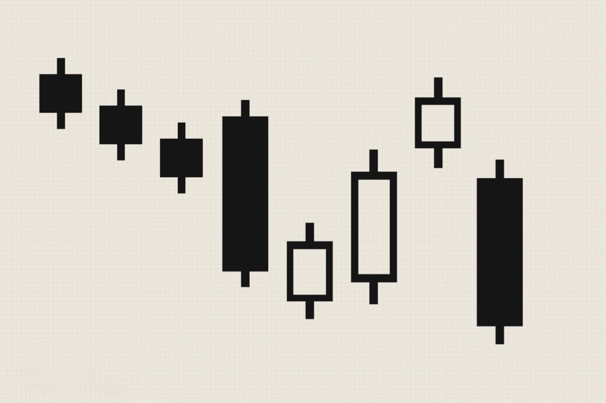

## Table of Contents

## What is the Falling Three Methods candlestick pattern?

The Falling Three Methods is a type of candlestick pattern used in technical analysis of stock prices. It shows that a downward trend in a stock's price is likely to continue. The pattern starts with a long bearish (downward) candlestick, which means the stock's price went down a lot that day. After this, there are three smaller bullish (upward) candlesticks. These smaller candlesticks show that the stock's price went up a little bit for three days, but not enough to change the overall downward trend.

The key part of the Falling Three Methods pattern is what happens after the three smaller bullish candlesticks. The pattern ends with another long bearish candlestick. This final candlestick shows that the stock's price went down a lot again, confirming that the downward trend is still strong. Traders use this pattern to decide when to sell their stocks, as it suggests that the price will keep falling.

## How does the Falling Three Methods pattern form on a chart?

The Falling Three Methods pattern starts with a long bearish candlestick on a chart. This means the stock's price went down a lot on that day. It's the first sign that the price might keep falling. After this, you see three smaller bullish candlesticks. These show the stock's price going up a little bit for three days, but not enough to change the overall downward trend. The price stays within the range of the first long bearish candlestick, showing that the small upward movements are not strong enough to reverse the trend.

After the three smaller bullish candlesticks, the pattern ends with another long bearish candlestick. This final candlestick confirms that the downward trend is still strong because the stock's price goes down a lot again. When traders see this pattern on a chart, they might decide to sell their stocks, expecting the price to keep falling. The Falling Three Methods pattern is a clear signal for traders to watch out for a continuing downward trend.

## What are the key components of the Falling Three Methods pattern?

The Falling Three Methods pattern has a few important parts that make it up. It starts with a long bearish candlestick. This means the price of the stock went down a lot on that day. It's the first sign that the price might keep going down. After this, you see three smaller bullish candlesticks. These show the price going up a little bit for three days, but not enough to change the overall downward trend. The price stays within the range of the first long bearish candlestick, showing that these small upward movements are not strong enough to turn things around.

The pattern ends with another long bearish candlestick. This final candlestick is key because it shows the price going down a lot again, confirming that the downward trend is still strong. When traders see this whole pattern on a chart, it's a clear sign that the price might keep falling. So, they might decide to sell their stocks because of this pattern.

## Can you explain the psychology behind the Falling Three Methods pattern?

The Falling Three Methods pattern shows what people are thinking and feeling during a time when a stock's price is going down. It starts with a big drop in price, which makes a lot of people worried and scared. They start selling their stocks because they think the price will keep going down. But then, for a few days, the price goes up a little bit. This might make some people think that the price is going to start going up again, so they might stop selling or even buy a little bit.

Even though the price goes up a little, it's not enough to make people feel confident. The small increases are not strong enough to change the overall feeling that the price is still going down. Then, when the price drops a lot again, it confirms what most people were thinking all along – that the price is going to keep falling. This makes more people sell their stocks, which pushes the price down even more. The Falling Three Methods pattern is a clear sign that the downward trend is strong and likely to continue.

## How reliable is the Falling Three Methods pattern in predicting price movements?

The Falling Three Methods pattern is seen as a good sign that a stock's price will keep going down. Traders and investors use it to help them decide when to sell their stocks. But, like all patterns in the stock market, it's not perfect. Sometimes, even when you see this pattern, the price might not keep falling like you expect. It's important to use this pattern along with other signs and information to make better guesses about what will happen next.

The reliability of the Falling Three Methods pattern can change depending on how the market is doing overall and how strong the trend is. If the market is very stable and the pattern is clear, it might be more reliable. But if the market is all over the place, the pattern might not work as well. So, while it can be a helpful tool, it's best to not rely on it alone. Always look at the bigger picture and use other tools to make smarter decisions about buying or selling stocks.

## What are the differences between the Falling Three Methods and the Rising Three Methods patterns?

The Falling Three Methods and the Rising Three Methods are two patterns that show opposite things about a stock's price. The Falling Three Methods pattern starts with a long bearish candlestick, which means the price went down a lot. Then, there are three smaller bullish candlesticks, showing the price going up a little bit but not enough to change the overall downward trend. Finally, another long bearish candlestick confirms that the price will keep falling. This pattern tells traders that it's a good time to sell because the price is likely to go down more.

On the other hand, the Rising Three Methods pattern starts with a long bullish candlestick, meaning the price went up a lot. After that, there are three smaller bearish candlesticks, showing the price going down a little bit but not enough to change the overall upward trend. The pattern ends with another long bullish candlestick, confirming that the price will keep rising. This pattern tells traders that it's a good time to buy because the price is likely to go up more.

Both patterns are used to predict what will happen next with a stock's price, but they give opposite signals. The Falling Three Methods is a sign to sell because it shows a strong downward trend, while the Rising Three Methods is a sign to buy because it shows a strong upward trend. Traders need to watch these patterns carefully to make smart decisions about buying or selling stocks.

## In what market conditions is the Falling Three Methods pattern most effective?

The Falling Three Methods pattern works best when the market is going down and the trend is strong. If a stock's price is already falling and everyone is selling, this pattern can be a good sign that the price will keep dropping. When you see the pattern in a market that's already going down, it's more likely to be right about what will happen next.

In a market that's not moving much or is going up, the Falling Three Methods pattern might not work as well. If the market is all over the place, it's harder to trust any pattern. So, the best time to use this pattern is when the market is clearly going down and the trend is strong. That way, you can be more sure that the price will keep falling like the pattern says.

## How should traders confirm the Falling Three Methods pattern before making a decision?

Traders should use other tools and signs to make sure the Falling Three Methods pattern is right before they decide to sell their stocks. One good way is to look at other technical indicators like moving averages or the Relative Strength Index (RSI). If these other indicators also show that the price is likely to keep going down, it makes the Falling Three Methods pattern more trustworthy. Another thing to do is to watch the volume of trades. If the volume is high when the price is going down, it means more people are selling, which supports the idea that the price will keep falling.

Also, traders should look at the bigger picture of the market. If the whole market or the industry the stock is in is going down, it's more likely that the Falling Three Methods pattern will be right. It's important not to just look at the pattern by itself but to see how it fits with everything else that's happening. By using these extra checks, traders can feel more confident about their decisions to sell based on the Falling Three Methods pattern.

## What are common mistakes traders make when using the Falling Three Methods pattern?

One common mistake traders make when using the Falling Three Methods pattern is relying on it too much without looking at other signs. They might see the pattern and decide to sell their stocks right away, but they don't check if other things in the market also show that the price will keep going down. Using other tools like moving averages or the RSI can help make sure the pattern is right. If traders don't do this, they might sell too soon or miss out on other important information.

Another mistake is not paying attention to the volume of trades. When the Falling Three Methods pattern shows up, it's important to see if a lot of people are selling their stocks. If the volume is low, it might mean that not many people think the price will keep falling, which can make the pattern less reliable. Traders who don't check the volume might end up making decisions based on a pattern that isn't as strong as it looks.

## Can the Falling Three Methods pattern be used in conjunction with other technical indicators?

Yes, the Falling Three Methods pattern can be used with other technical indicators to make better guesses about what a stock's price will do next. For example, traders might use moving averages to see if the stock's price is below a key moving average, which can confirm that the price is likely to keep going down. They might also look at the Relative Strength Index (RSI) to see if it's in a position that suggests the stock is oversold, which can support the idea that the price will keep falling. By combining the Falling Three Methods pattern with these other tools, traders can feel more sure about their decisions.

Another important thing to look at is the volume of trades. When the Falling Three Methods pattern appears, traders should check if the volume is high, especially on the days when the price is going down. High volume means more people are selling their stocks, which makes the pattern more reliable. If traders use the Falling Three Methods pattern along with volume and other indicators, they can get a fuller picture of what's happening in the market and make smarter choices about when to sell their stocks.

## How does the timeframe affect the interpretation of the Falling Three Methods pattern?

The timeframe you use to look at the Falling Three Methods pattern can change how you see it and what you think will happen next. If you look at a short timeframe, like a 15-minute chart, the pattern might show up more often, but it might not be as strong or reliable. Short timeframes can have a lot of ups and downs, so the pattern might not mean as much. On the other hand, if you use a longer timeframe, like a daily or weekly chart, the pattern can be more important. When you see the Falling Three Methods pattern on a longer timeframe, it's more likely to be a good sign that the price will keep going down because the trend is stronger and more clear.

Using different timeframes can help traders see the pattern in different ways. For example, if you see the Falling Three Methods pattern on a daily chart, it might be a good idea to check a shorter timeframe, like an hourly chart, to see if the pattern is also there. If it is, it can make you feel more sure about selling your stocks. But if the pattern only shows up on a short timeframe and not on a longer one, it might not be as reliable. So, looking at the pattern on different timeframes can help traders make better decisions about what to do next.

## What are some advanced strategies for trading the Falling Three Methods pattern?

One advanced strategy for trading the Falling Three Methods pattern is to combine it with other technical indicators to confirm the downward trend. Traders might look at moving averages, like the 50-day or 200-day moving average, to see if the stock's price is below these lines. If it is, it can make the Falling Three Methods pattern more reliable. They might also use the Relative Strength Index (RSI) to check if the stock is oversold, which means the price might keep going down. By using these other tools, traders can feel more confident about selling their stocks when they see the Falling Three Methods pattern.

Another strategy is to pay close attention to the volume of trades during the pattern. When the long bearish candlesticks appear, traders should look for high volume, which means a lot of people are selling their stocks. High volume can make the pattern more trustworthy. Traders can also use different timeframes to check the pattern. If the Falling Three Methods pattern shows up on both short and long timeframes, like hourly and daily charts, it can be a stronger sign to sell. This way, traders can use the pattern more effectively and make smarter decisions about when to get out of their positions.

## References & Further Reading

[1]: Bulkowski, T. N. (2008). ["Encyclopedia of Candlestick Charts"](https://onlinelibrary.wiley.com/doi/book/10.1002/9781119202288). Wiley.

[2]: Nison, S. (1991). ["Japanese Candlestick Charting Techniques: A Contemporary Guide to the Ancient Investment Techniques of the Far East"](https://www.amazon.com/Japanese-Candlestick-Charting-Techniques-Contemporary/dp/0139316507). New York Institute of Finance.

[3]: Murphy, J. J. (1999). ["Technical Analysis of the Financial Markets: A Comprehensive Guide to Trading Methods and Applications"](https://www.amazon.com/Technical-Analysis-Financial-Markets-Comprehensive/dp/0735200661). New York Institute of Finance.

[4]: Chan, E. (2009). ["Quantitative Trading: How to Build Your Own Algorithmic Trading Business"](https://github.com/ftvision/quant_trading_echan_book). Wiley.

[5]: Lopez de Prado, M. (2018). ["Advances in Financial Machine Learning"](https://books.google.com/books/about/Advances_in_Financial_Machine_Learning.html?id=oU9KDwAAQBAJ). Wiley.

[6]: Aronson, D. (2007). ["Evidence-Based Technical Analysis: Applying the Scientific Method and Statistical Inference to Trading Signals"](https://www.amazon.com/Evidence-Based-Technical-Analysis-Scientific-Statistical/dp/0470008741). Wiley.

[7]: Jansen, S. (2018). ["Machine Learning for Algorithmic Trading: Predictive models to extract signals from market and alternative data for systematic trading strategies with Python"](https://www.amazon.com/Machine-Learning-Algorithmic-Trading-alternative/dp/1839217715). Packt Publishing.