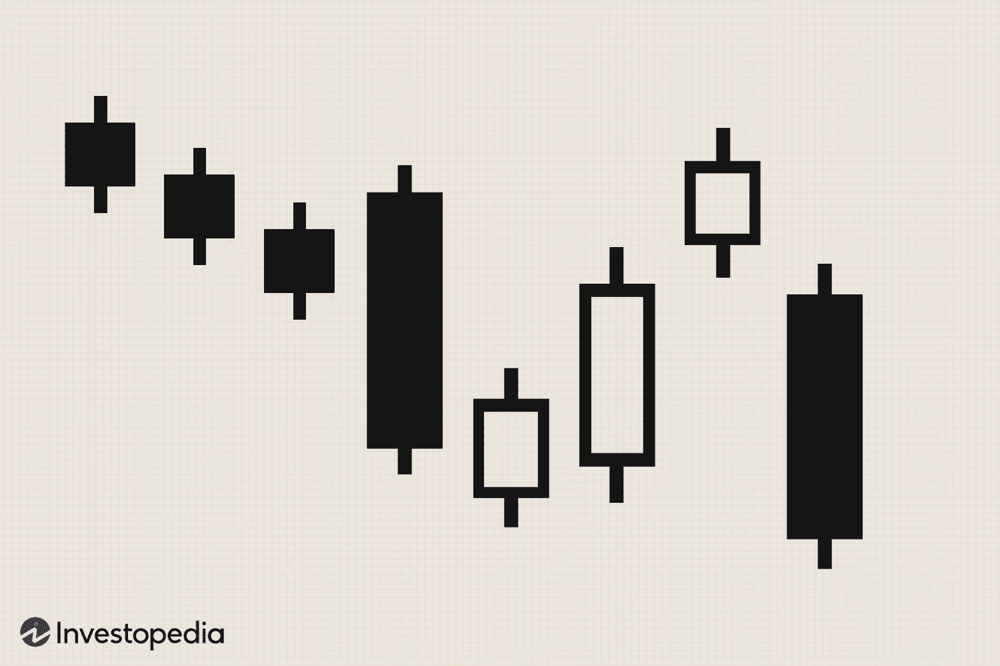

## Table of Contents

## What is the Falling Three Methods pattern?

The Falling Three Methods is a pattern you see in stock charts. It shows that the price of a stock is going down, but it takes a short break before continuing to fall. The pattern starts with a long red candle, which means the price dropped a lot in one day. Then, there are three smaller candles that go up a bit. These candles show a small recovery, but they stay within the range of the first big red candle. Finally, another long red candle appears, showing that the price has started falling again.

This pattern tells traders that the downward trend is still strong, even though there was a small pause. It's a sign that sellers are still in control and the price is likely to keep going down. Traders might use this pattern to decide when to sell their stocks or to enter a short position, betting that the price will continue to drop.

## In which type of market does the Falling Three Methods pattern typically occur?

The Falling Three Methods pattern usually shows up in a market that is going down. This means that the overall trend of the stock or asset is getting lower over time. When you see this pattern, it's a sign that the market is still in a bearish phase, where more people are selling than buying.

This pattern can be spotted in various types of markets, like stocks, forex, or commodities, as long as the market is trending downward. It's like a brief pause in the falling trend, but it doesn't change the fact that the market is still bearish. Traders watch for this pattern to help them make decisions about selling or shorting the asset, expecting the price to keep dropping.

## How can you identify the Falling Three Methods pattern on a candlestick chart?

To spot the Falling Three Methods pattern on a candlestick chart, start by looking for a long red candle. This candle shows that the price went down a lot in one day. After this big red candle, you'll see three smaller candles that go up a bit. These candles should stay within the range of the first big red candle, meaning they don't go higher than the top of the first candle or lower than its bottom.

Next, look for another long red candle that comes after the three smaller ones. This second big red candle means the price started falling again. The whole pattern shows that even though there was a small break where the price went up a little, the overall trend is still downward. This pattern tells you that the market is still bearish, and the price is likely to keep going down.

## What are the key components that make up the Falling Three Methods pattern?

The Falling Three Methods pattern has a few important parts that you need to see on a chart. It starts with a long red candle, which shows that the price dropped a lot in one day. This big red candle is the first thing you look for. After that, you'll see three smaller candles that go up a bit. These candles should stay inside the range of the first big red candle, meaning they don't go higher than the top or lower than the bottom of that first candle.

The last part of the pattern is another long red candle that comes after the three smaller ones. This second big red candle means the price started falling again. When you see all these parts together, it tells you that the market is still going down. Even though there was a small break where the price went up a little, the overall trend is still downward. This pattern is a sign that the market is still bearish, and the price is likely to keep going down.

## Can you explain the psychology behind the Falling Three Methods pattern?

The Falling Three Methods pattern shows what people are thinking when they're trading. It starts with a big drop in price, which makes sellers feel strong and confident. They see the price going down a lot in one day and think it will keep going down. This big drop scares some buyers away, making them less likely to buy the stock.

Then, there's a small break where the price goes up a little bit. This happens because some traders think the price has dropped too much and it might be a good time to buy. But these small rises don't go very high, and they stay within the range of the first big drop. This shows that the sellers are still in control and the buyers aren't strong enough to change the trend. Finally, another big drop happens, showing that the sellers are still winning. This pattern tells traders that even though there was a small pause, the overall feeling in the market is still bearish, and the price is likely to keep going down.

## How does the Falling Three Methods pattern differ from the Rising Three Methods pattern?

The Falling Three Methods and Rising Three Methods patterns are like opposite sides of a coin. The Falling Three Methods pattern shows up when the market is going down. It starts with a big red candle, showing a strong drop in price. Then, there are three small candles that go up a bit but stay within the range of the first big drop. Finally, another big red candle comes, showing the price keeps falling. This pattern tells traders that even though there was a small break, the market is still bearish, and the price will likely keep going down.

On the other hand, the Rising Three Methods pattern appears when the market is going up. It begins with a big green candle, which means the price went up a lot in one day. After that, you see three small candles that go down a little but stay within the range of the first big rise. The pattern ends with another big green candle, showing the price keeps going up. This tells traders that even though there was a small dip, the market is still bullish, and the price will likely keep rising. So, while the Falling Three Methods shows a continuing downward trend, the Rising Three Methods shows a continuing upward trend.

## What are the implications of the Falling Three Methods pattern for traders?

When traders see the Falling Three Methods pattern, it's a sign that the price of the stock or asset is likely to keep going down. This pattern tells them that even though there was a small break where the price went up a bit, the overall trend is still downward. Traders who are already holding the stock might decide to sell it to avoid losing more money. They can use this pattern to time their exit, selling before the price drops even further.

For traders who like to bet on falling prices, the Falling Three Methods pattern can be a good signal to start a short position. This means they borrow the stock and sell it, hoping to buy it back later at a lower price and make a profit from the difference. Seeing this pattern can make them feel more confident that the price will keep dropping, so they might enter the market at this point. Both types of traders use this pattern to make decisions based on the strong bearish signal it gives.

## How reliable is the Falling Three Methods pattern in predicting future price movements?

The Falling Three Methods pattern is seen as a good sign that the price will keep going down. But it's not perfect and doesn't always work. It's helpful because it shows that even with a small break, the overall trend is still downward. Traders often use it along with other signs and tools to make better guesses about what the price will do next.

Still, it's important to know that no pattern can tell the future for sure. The market can change quickly because of news, big events, or lots of people buying or selling at once. So, while the Falling Three Methods pattern can be a useful clue, traders should be careful and use other information too before deciding what to do.

## What are some common mistakes traders make when interpreting the Falling Three Methods pattern?

One common mistake traders make when interpreting the Falling Three Methods pattern is jumping to conclusions too quickly. They might see the pattern and think the price will keep falling without looking at other important signs or waiting to see if the pattern finishes. This can lead them to make bad trades because they didn't consider everything that could affect the price.

Another mistake is not using other tools to check if the pattern is a good sign. Traders should look at things like support and resistance levels, other chart patterns, and what's happening in the market overall. If they only focus on the Falling Three Methods pattern, they might miss important information that could change what they decide to do.

Sometimes, traders also forget that the pattern isn't perfect. They might think it always means the price will go down, but the market can be unpredictable. News or big events can change the price quickly, so it's important to be ready for surprises and not rely only on one pattern.

## How can the Falling Three Methods pattern be confirmed using technical indicators?

To confirm the Falling Three Methods pattern, traders can use technical indicators like the Moving Average Convergence Divergence (MACD). The MACD can help show if the downward trend is still strong. If the MACD line stays below the signal line during the pattern, it means the bearish trend is still in control. This helps traders feel more sure that the price will keep going down after the small break in the pattern.

Another useful indicator is the Relative Strength Index (RSI). When the RSI is below 50 and stays there during the Falling Three Methods pattern, it supports the idea that the market is still bearish. If the RSI doesn't go above 50 during the small rise in the pattern, it tells traders that the upward movement isn't strong enough to change the trend. By using these indicators along with the pattern, traders can make better guesses about what the price will do next.

## What are the best practices for trading based on the Falling Three Methods pattern?

When trading based on the Falling Three Methods pattern, it's important to wait for the whole pattern to finish before making a move. This means you should see the big drop at the start, the three small candles that go up a bit, and the final big drop. Don't jump in too early because the pattern might not finish the way you expect. Also, use other tools like the MACD and RSI to check if the pattern is a good sign. If the MACD stays below the signal line and the RSI stays below 50, it supports the idea that the price will keep going down.

It's also a good idea to set a stop-loss order when you trade based on this pattern. This means you decide ahead of time to sell if the price goes up a certain amount, so you don't lose too much money if the market surprises you. Don't just rely on the Falling Three Methods pattern alone. Look at other things happening in the market, like news or big events, because these can change what the price does. By using the pattern along with other information, you can make better trading decisions.

## How can the Falling Three Methods pattern be integrated into a broader trading strategy?

The Falling Three Methods pattern can be a helpful part of a bigger trading plan. When you see this pattern, it's a sign that the price might keep going down, even after a small break. But you shouldn't just trade based on this pattern alone. Instead, use it with other tools like the MACD and RSI. If the MACD stays below the signal line and the RSI stays below 50 during the pattern, it makes you feel more sure that the price will keep falling. Also, look at other things happening in the market, like news or big events, because these can change what the price does.

In your trading plan, you can use the Falling Three Methods pattern to help decide when to sell a stock you already own or when to start a short position, betting that the price will go down. But always set a stop-loss order to protect yourself from big losses if the market surprises you. By waiting for the whole pattern to finish and using other information, you can make smarter trading choices. This way, the Falling Three Methods pattern becomes a useful piece of your overall strategy, helping you trade with more confidence and less risk.

## What are the advantages of using algorithms with candlestick patterns?

Utilizing algorithms to identify and act on candlestick patterns, such as the falling three methods, offers significant speed and accuracy advantages over manual trading. By leveraging computer programs, traders can analyze substantial datasets in real-time, surpassing the capabilities of human traders. This speed not only allows for the swift identification of market patterns but also enables immediate execution of trades based on these insights. 

The automated nature of algorithmic trading means reactions to market signals occur in milliseconds, which is vital in fast-paced financial environments. The formula for processing speed could be simplified as:

$$
T = \frac{D}{R}
$$

where $T$ is the time taken to process data, $D$ represents the dataset size, and $R$ is the rate of data processing by the algorithm. Greater processing rates lead to a significant reduction in time, allowing traders to capitalize on fleeting market opportunities.

Moreover, algorithms eliminate emotional biases that can often cloud human judgment. Typically, traders may be influenced by fear or greed, leading to impulsive decisions that are not always aligned with rational strategies. By automating trading decisions, algorithms ensure consistency and objectivity. This method adheres strictly to predefined criteria set within the trading algorithm, thus adhering to strategic plans without deviation due to emotional pressures.

Python offers a robust ecosystem for algorithmic trading through libraries such as NumPy, Pandas, and TA-Lib. A basic example of using Python to detect the falling three methods pattern could involve coding the logic to identify the sequence of candles:

```python
def identify_falling_three_methods(candle_data):
    bearish_candle = candle_data[0]
    bullish_candles = candle_data[1:4]
    final_bearish_candle = candle_data[4]

    if bearish_candle.is_bearish and final_bearish_candle.is_bearish:
        if all(candle.is_bullish for candle in bullish_candles):
            return "Falling three methods pattern detected"
    return "No pattern detected"

# Example use with hypothetical candle data
result = identify_falling_three_methods(candle_data)
print(result)
```

This script exemplifies the algorithmic approach's precision and speed, highlighting the potential to make timely decisions devoid of emotional influence. As technology in the financial industry continues to advance, leveraging such methods markedly enhances a trader's ability to remain competitive.

## References & Further Reading

[1]: Bergstra, J., Bardenet, R., Bengio, Y., & Kégl, B. (2011). ["Algorithms for Hyper-Parameter Optimization."](https://papers.nips.cc/paper/4443-algorithms-for-hyper-parameter-optimization) Advances in Neural Information Processing Systems 24.

[2]: ["Advances in Financial Machine Learning"](https://www.amazon.com/Advances-Financial-Machine-Learning-Marcos/dp/1119482089) by Marcos Lopez de Prado

[3]: ["Evidence-Based Technical Analysis: Applying the Scientific Method and Statistical Inference to Trading Signals"](https://www.amazon.com/Evidence-Based-Technical-Analysis-Scientific-Statistical/dp/0470008741) by David Aronson

[4]: ["Machine Learning for Algorithmic Trading"](https://github.com/stefan-jansen/machine-learning-for-trading) by Stefan Jansen

[5]: ["Quantitative Trading: How to Build Your Own Algorithmic Trading Business"](https://www.amazon.com/Quantitative-Trading-Build-Algorithmic-Business/dp/1119800064) by Ernest P. Chan