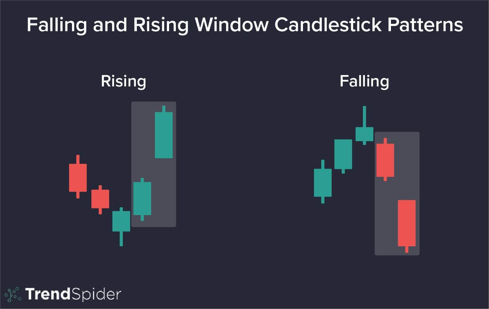

## Table of Contents

## What is a Falling Window Candlestick Pattern?

A Falling Window Candlestick Pattern is a type of chart pattern used in technical analysis of financial markets. It is also known as a "gap down" and occurs when there is a noticeable space between the closing price of one day and the opening price of the next day, with the latter being lower. This gap indicates a sudden drop in price and often signals increased selling pressure or bearish sentiment among traders.

This pattern is significant because it shows a strong shift in market sentiment. When you see a Falling Window, it suggests that something has changed in the market, causing prices to fall quickly. Traders often watch for this pattern because it can be a sign that prices might continue to fall, prompting them to sell their holdings or take short positions to profit from the expected decline.

## How does a Falling Window Candlestick Pattern form on a chart?

A Falling Window Candlestick Pattern forms on a chart when there's a gap between the closing price of one day and the opening price of the next day. Imagine you're looking at a chart where each bar or candle represents a day's trading. If the market closes at a certain price on one day, and then opens lower the next day, you'll see a space on the chart. This space is the "window" or gap, and because it's lower, it's called a "falling window."

This pattern shows that something happened overnight or over the weekend that made people want to sell the stock quickly. Maybe there was bad news about the company, or something else scared investors. When the market opens the next day, the price starts lower than where it closed the day before, creating that gap on the chart. Traders pay attention to this because it can mean the price might keep going down, so they might decide to sell their shares or bet on the price falling even more.

## What does a Falling Window Candlestick Pattern indicate about market sentiment?

A Falling Window Candlestick Pattern shows that people are feeling worried or scared about a stock or market. It happens when the price drops suddenly from one day to the next, leaving a gap on the chart. This gap means that something made a lot of people want to sell their shares quickly, maybe because of bad news or other scary things happening.

When traders see a Falling Window, they often think the price might keep going down. This pattern tells them that the mood in the market has turned more negative or "bearish." Because of this, they might decide to sell their shares to avoid losing more money, or they might try to make money by betting that the price will fall even more.

## Can you provide an example of a Falling Window Candlestick Pattern in a real market scenario?

Imagine a company called "TechGiant Inc." that everyone thought was doing great. One Friday, the stock closed at $150 per share. Over the weekend, bad news came out that TechGiant Inc. had a big problem with one of their products. When the market opened on Monday, the stock price started at $130 per share. On the chart, you would see a space between the $150 close on Friday and the $130 open on Monday. That space is the Falling Window, showing that people got scared and wanted to sell their shares quickly because of the bad news.

This Falling Window tells traders that the mood around TechGiant Inc. has turned negative. They see that the price dropped suddenly and might think it will keep going down. So, they might decide to sell their shares of TechGiant Inc. to avoid losing more money, or they might bet on the price falling even more to make some money from the drop. The Falling Window is a clear sign that the market sentiment has turned bearish, and it's something traders watch closely to make their decisions.

## How reliable is the Falling Window Candlestick Pattern as a trading signal?

The Falling Window Candlestick Pattern can be a helpful sign for traders, but it's not perfect. When you see this pattern, it often means the price might keep going down because a lot of people got scared and started selling. Traders might use this as a signal to sell their shares or to bet on the price dropping more. But, just like with any pattern, it's not always right. Sometimes, the price might go up again quickly, even after a Falling Window appears. That's why it's important to look at other things too, like the overall trend, news about the company, and other chart patterns.

It's a good idea to use the Falling Window along with other tools to make better trading choices. For example, if you see the Falling Window and the stock has been going down for a while, it might be a stronger sign that the price will keep falling. But if the stock was going up before the Falling Window, it might not be as reliable. Also, big news or events can change what the pattern means. So, while the Falling Window can be a useful clue, it's best to use it as part of a bigger plan and not the only reason to make a trade.

## What are the key differences between a Falling Window and a Rising Window Candlestick Pattern?

A Falling Window and a Rising Window are both types of gaps that you can see on a price chart, but they tell you different things about the market. A Falling Window happens when the price drops suddenly from one day to the next, leaving a space on the chart where the price used to be. This gap shows that something made people want to sell the stock quickly, and it usually means that more people might keep selling, making the price go down even more. When traders see a Falling Window, they often think the market is feeling worried or scared, and they might decide to sell their shares or bet on the price falling further.

On the other hand, a Rising Window is the opposite. It happens when the price jumps up suddenly from one day to the next, leaving a space on the chart where the price used to be. This gap shows that something made people want to buy the stock quickly, and it usually means that more people might keep buying, making the price go up even more. When traders see a Rising Window, they often think the market is feeling happy or hopeful, and they might decide to buy more shares or bet on the price going up even further. Both patterns are important, but they tell you different things about what people are thinking and feeling about the stock.

## How should traders confirm a Falling Window Candlestick Pattern before making a trade?

Traders should look at more than just the Falling Window before they decide to make a trade. They need to check the overall trend of the stock. If the stock has been going down for a while and then a Falling Window happens, it's a stronger sign that the price might keep falling. But if the stock was going up before the Falling Window, it might not be as reliable. Traders should also look at the [volume](/wiki/volume-trading-strategy) of trades. If a lot of shares are being traded when the Falling Window happens, it means more people are selling, which makes the pattern more important.

It's also a good idea to look at what's happening in the news or with the company. Sometimes, the Falling Window happens because of big news that makes people want to sell quickly. If there's no clear reason for the gap, it might not mean as much. Traders should use other tools too, like other chart patterns or technical indicators, to help them decide. By looking at all these things together, traders can feel more sure about whether the Falling Window really means the price will keep going down.

## What are common trading strategies that incorporate the Falling Window Candlestick Pattern?

When traders see a Falling Window, they often use it as a sign to sell their shares or to bet that the price will keep going down. This is called going short. They might sell their shares right away to avoid losing more money if the price keeps falling. Or, they might borrow shares and sell them, hoping to buy them back later at a lower price and make a profit from the difference. This strategy works well if the Falling Window is part of a bigger downward trend and there's a lot of trading happening, showing that many people are selling.

Another strategy is to wait and see if the price keeps going down after the Falling Window. If it does, traders might use other tools like moving averages or other chart patterns to help them decide when to sell or go short. They might also look at the news or events that caused the Falling Window to make sure it's a good time to trade. By using the Falling Window along with other signs, traders can feel more sure about their choices and try to make money from the price drop.

## How does the Falling Window Candlestick Pattern interact with other technical indicators?

When traders see a Falling Window, they often look at other technical indicators to make sure their trading decisions are good. One common indicator is the moving average. If the price is below the moving average and then a Falling Window happens, it might be a stronger sign that the price will keep going down. Traders also look at the trading volume. If a lot of shares are being traded when the Falling Window appears, it means more people are selling, which makes the pattern more important. They might also use other chart patterns, like a bearish flag or head and shoulders, to confirm that the market is turning more negative.

Another important indicator is the Relative Strength Index (RSI). If the RSI is also showing that the stock is overbought and then a Falling Window happens, it can be a strong signal that the price might keep falling. Traders also pay attention to support and resistance levels. If the Falling Window breaks through a key support level, it might mean the price will keep going down even more. By looking at the Falling Window along with these other indicators, traders can feel more sure about whether the price will really keep dropping and make better trading choices.

## What are the psychological factors that contribute to the formation of a Falling Window Candlestick Pattern?

When a Falling Window forms, it's often because people suddenly feel scared or worried about a stock. Maybe there was bad news about the company, like a problem with their products or a big loss in their earnings. This bad news makes people want to sell their shares quickly before the price goes down even more. They think it's better to sell now and lose a little bit of money than to wait and lose a lot. This rush to sell creates the gap on the chart, showing that the mood in the market has turned negative or "bearish."

Traders see the Falling Window and it makes them feel even more worried. They start thinking that if so many people are selling, maybe they should sell too. This fear can make more people want to sell, which can push the price down even further. The Falling Window becomes a signal that tells everyone the market sentiment has changed, and it can lead to more selling as people try to avoid bigger losses. It's all about how people feel and react to the sudden change in the stock's price.

## How does the time frame affect the interpretation of a Falling Window Candlestick Pattern?

The time frame you look at can change how you see a Falling Window. If you're looking at a daily chart, a Falling Window might mean the price will keep going down for a few days or weeks. But if you're looking at a weekly chart, that same Falling Window might mean the price will go down for months. The longer the time frame, the bigger the change in price might be, and the longer the effect might last. So, it's important to think about the time frame when you see a Falling Window because it can tell you different things about how long the price might keep falling.

On shorter time frames like hourly or minute charts, a Falling Window might not mean as much. It could just be a quick drop that doesn't last long. Traders who look at these short time frames might see a Falling Window and think it's just a small dip, not a big change in the market. But if they see the same pattern on longer time frames too, it might be a stronger sign that the price will keep going down. So, the time frame really matters when you're trying to understand what a Falling Window means for the stock's future price.

## What are some advanced techniques for using the Falling Window Candlestick Pattern in algorithmic trading?

In [algorithmic trading](/wiki/algorithmic-trading), traders can use the Falling Window Candlestick Pattern to make quick and smart trades. They can write computer programs to watch for Falling Windows on different time frames, like daily or hourly charts. When the program sees a Falling Window, it can check other things too, like the stock's trend, how many shares are being traded, and other chart patterns. If everything looks right, the program can then decide to sell the stock or go short, hoping to make money as the price keeps going down. This way, traders can act fast and not miss out on chances to trade.

Another advanced technique is to use the Falling Window along with other technical indicators in the trading algorithm. For example, the program can look at the Relative Strength Index (RSI) to see if the stock is overbought, or check if the price is below the moving average. If the Falling Window happens and these other indicators also show a bearish sign, the program can be more sure about making a trade. Traders can also set up their algorithms to look at the news or events that might have caused the Falling Window, making their trading decisions even smarter. By combining the Falling Window with these other tools, algorithmic traders can make better choices and try to make more money from the price drop.

## What are the characteristics of the Falling Window Candlestick Pattern?

The Falling Window candlestick pattern is a notable bearish continuation signal commonly observed by traders in financial markets. This pattern arises specifically within the context of an existing downtrend, serving to affirm the ongoing bearish sentiment in the market. The formation of a Falling Window pattern involves two consecutive bearish (red or black) candlesticks, characterized by a distinctive price gap.

The occurrence of the price gap is crucial for defining this pattern. It develops when the second candlestick's high is distinctly below the low of the first candlestick. Mathematically, if $H_1$ and $L_1$ represent the high and low of the first candle, and $H_2$ and $L_2$ represent those of the second candle, then the Falling Window condition can be expressed as:

$$
H_2 < L_1
$$

This gap is an indicator of significant selling pressure and acts as a new resistance level, a critical marker for traders evaluating the strength and continuation of the downtrend. The gap suggests that the sellers were so dominant that they were able to drive the prices significantly lower, bypassing any potential buying interest at previous price levels.

In the context of advanced chart analysis, identifying this gap is pivotal. Traders leverage it to determine key resistance levels for managing trades, setting stop-loss orders, or deciding entry points for short positions. Recognizing the gap as a resistance level assists in evaluating how strong the bearish trend in the market remains, providing further insights for trading decisions.

The understanding and application of the Falling Window pattern rely on its clear identification through correctly analyzing candlestick formations and ensuring that the associated price gap distinctly creates a new level of resistance. This characteristic makes it a fundamental element in confirming bearish market conditions continuing into the foreseeable future.

## References & Further Reading

[1]: ["Advances in Financial Machine Learning"](https://www.amazon.com/Advances-Financial-Machine-Learning-Marcos/dp/1119482089) by Marcos Lopez de Prado

[2]: ["Evidence-Based Technical Analysis: Applying the Scientific Method and Statistical Inference to Trading Signals"](https://www.amazon.com/Evidence-Based-Technical-Analysis-Scientific-Statistical/dp/0470008741) by David Aronson

[3]: ["Machine Learning for Algorithmic Trading"](https://github.com/stefan-jansen/machine-learning-for-trading) by Stefan Jansen

[4]: ["Quantitative Trading: How to Build Your Own Algorithmic Trading Business"](https://books.google.com/books/about/Quantitative_Trading.html?id=j70yEAAAQBAJ) by Ernest P. Chan

[5]: Bulkowski, T. (2008). ["Encyclopedia of Candlestick Charts"](https://onlinelibrary.wiley.com/doi/book/10.1002/9781119202288). Wiley.

[6]: Nison, S. (2001). ["Japanese Candlestick Charting Techniques: A Contemporary Guide to the Ancient Investment Techniques of the Far East"](https://www.amazon.com/Japanese-Candlestick-Charting-Techniques-Contemporary/dp/0139316507). Prentice Hall Press.