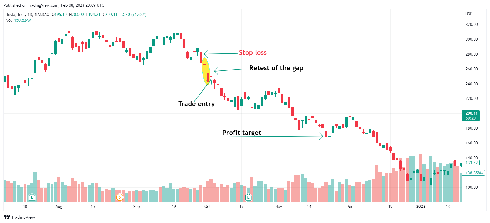

The candlestick charting method, developed in 18th-century Japan, revolutionized the way traders analyze and predict market trends. Known for its visual simplicity and profound implications, this technique has stood the test of time and remains integral in modern financial analysis. A crucial aspect of this method is the ability to discern specific patterns that suggest potential future price movements. Among these, the Falling Window candlestick pattern holds particular significance due to its ability to identify bearish trends with predictive value.

The Falling Window is characterized by its formation in a downtrend, where it signals further bearish continuation. It is a pattern observed when a price gap forms between two consecutive candlesticks, indicating strong resistance and a potential decline in price. This pattern's reliability makes it a popular choice among traders who focus on downtrend markets.



This article focuses on the Falling Window candlestick pattern within the context of algorithmic trading. Algorithmic trading, or "algo trading," utilizes computer programs to execute trades based on predefined criteria, often including pattern recognition. By leveraging the predictive nature of the Falling Window, algorithmic traders can design systems to identify and act on bearish trends with speed and accuracy.

We will provide insights into recognizing the Falling Window pattern and discuss methods for incorporating it into effective trading strategies. Through a combination of historical analysis, technical indicators, and algorithmic simulations, traders can enhance their decision-making processes and potentially improve their trading outcomes.

## Table of Contents

## Understanding the Falling Window Candlestick Pattern

The Falling Window candlestick pattern is a notable bearish continuation pattern frequently utilized by traders to identify and predict sustained downtrends in the market. Often referred to as a "gap-down," this pattern emerges when the high of the second candlestick is positioned below the low of the first candlestick, resulting in a visible gap on the chart. This gap serves as a pronounced indicator of a strong resistance level, marking a potential continuation of bearish market sentiment.

To understand this pattern, it is crucial to recognize its two defining candles. The first candle is typically bearish, closing at a price lower than its opening. The subsequent candle, also bearish, opens significantly lower than the first candle's closing price, so much that the highest price reached by this second candle is still below the lowest price of the first. This creates the titular "window" or gap, which is emblematic of strong selling pressure.

Mathematically, this can be expressed as:
$$
\text{Candle 1 Low} > \text{Candle 2 High}
$$
where Candle 1 Low represents the lowest price of the first candle and Candle 2 High represents the highest price of the second candle.

This pattern's predictive value lies in its illustration of overwhelming bearish sentiment. The gap represents a zone of aggressive selling, where buyers are unable or unwilling to drive the price beyond a certain threshold, reaffirming the presence of a resistance level. As a result, traders interpret this pattern as a signal for continued price declines, making it a critical component of bearish trading strategies.

By closely analyzing and identifying the Falling Window candlestick pattern, traders can effectively gauge the market's bearish [momentum](/wiki/momentum) and make informed predictions about the continuation of downtrends. Such analysis is often used in conjunction with other technical indicators to confirm the strength and reliability of the signal provided by the pattern.

## Characteristics of the Falling Window Candlestick Pattern

The Falling Window candlestick pattern is a notable bearish continuation signal commonly observed by traders in financial markets. This pattern arises specifically within the context of an existing downtrend, serving to affirm the ongoing bearish sentiment in the market. The formation of a Falling Window pattern involves two consecutive bearish (red or black) candlesticks, characterized by a distinctive price gap.

The occurrence of the price gap is crucial for defining this pattern. It develops when the second candlestick's high is distinctly below the low of the first candlestick. Mathematically, if $H_1$ and $L_1$ represent the high and low of the first candle, and $H_2$ and $L_2$ represent those of the second candle, then the Falling Window condition can be expressed as:

$$
H_2 < L_1
$$

This gap is an indicator of significant selling pressure and acts as a new resistance level, a critical marker for traders evaluating the strength and continuation of the downtrend. The gap suggests that the sellers were so dominant that they were able to drive the prices significantly lower, bypassing any potential buying interest at previous price levels.

In the context of advanced chart analysis, identifying this gap is pivotal. Traders leverage it to determine key resistance levels for managing trades, setting stop-loss orders, or deciding entry points for short positions. Recognizing the gap as a resistance level assists in evaluating how strong the bearish trend in the market remains, providing further insights for trading decisions.

The understanding and application of the Falling Window pattern rely on its clear identification through correctly analyzing candlestick formations and ensuring that the associated price gap distinctly creates a new level of resistance. This characteristic makes it a fundamental element in confirming bearish market conditions continuing into the foreseeable future.

## Identifying the Falling Window in Algorithmic Trading

Algorithmic trading systems are designed to identify and capitalize on patterns in financial data, with the Falling Window candlestick pattern being one particularly significant indicator of bearish market sentiment. In [algorithmic trading](/wiki/algorithmic-trading), identifying the Falling Window requires precise programming criteria to ensure accurate detection amidst vast amounts of market data.

Primarily, the system searches for two consecutive downtrend candles that exhibit a significant price gap between them. This gap, characterized by the second candle's high being lower than the first candle's low, is indicative of continued bearish momentum. The algorithm's effectiveness hinges on its ability to detect this critical price movement with precision.

To enhance confidence in identifying the Falling Window pattern, algorithmic traders often utilize complementary indicators. Moving averages, for instance, can provide insight into the broader market trend, helping to confirm whether the identified pattern aligns with a general downward trajectory. A moving average is calculated by averaging a security's price over a specific number of periods, smoothing out short-term fluctuations. For example:

```python
# Example of calculating a simple moving average in Python
import pandas as pd

# Assume `data` is a pandas DataFrame with a 'Close' column containing closing prices
def calculate_moving_average(data, period):
    return data['Close'].rolling(window=period).mean()

# Calculate a 50-period moving average
data['50_MA'] = calculate_moving_average(data, 50)
```

Additionally, [volume](/wiki/volume-trading-strategy) oscillators provide further validation by highlighting changes in trading volume, which can reinforce signals about market sentiment. When a Falling Window pattern is accompanied by increased trading volume, it suggests stronger conviction behind the observed bearish movement.

In sum, algorithmic systems employ a combination of precise pattern recognition and corroborating technical indicators to reliably identify the Falling Window candlestick pattern. By integrating these elements, traders can better assess the validity and potential impact of these bearish continuations on market behavior.

## Trading Rules for the Falling Window Candlestick Pattern

When trading the Falling Window candlestick pattern, it's crucial to adopt a systematic approach to minimize risks and enhance the probability of success. The first step is to ensure that the pattern fully materializes before making any trading decisions. The Falling Window is characterized by a significant downward gap, signaling increased bearish sentiment. Confirmation of this pattern strengthens the potential for a successful trade.

Once the pattern is identified and confirmed, traders can initiate short positions as the price approaches the gap and encounters resistance. This resistance often indicates that the bearish trend may continue, as the gap functions as a substantial obstacle to upward movement. By shorting at this juncture, traders can capitalize on the downward momentum.

Implementing effective risk management techniques is essential. Setting stop-loss orders just above the resistance level defined by the gap can protect against unforeseen market reversals. A stop-loss ensures that losses remain manageable even if the market moves against the trader's position.

Defining profit targets is another key component of trading the Falling Window pattern. Profit targets should be aligned with identified support levels, which are price points where the asset historically tends to bounce back. By establishing these targets, traders can systematically [exit](/wiki/exit-strategy) positions to maximize gains and preserve capital.

For those utilizing algorithmic trading, these rules can be programmed into trading systems. Here's a simplified example using Python's pseudo-code for executing trades based on the Falling Window pattern:

```python
def execute_trade(candlesticks):
    # Assume candlesticks is a list of dictionary with 'high', 'low', 'close' prices
    for i in range(1, len(candlesticks)):
        first_candle = candlesticks[i-1]
        second_candle = candlesticks[i]

        # Detect Falling Window
        if second_candle['high'] < first_candle['low']:
            # Calculate resistance and support
            resistance = first_candle['low']
            support = min(c['low'] for c in candlesticks[:i+1])

            # Wait for price to rally to resistance
            if second_candle['close'] <= resistance:
                # Short position logic
                short_price = second_candle['close']
                stop_loss = resistance + 0.01 * resistance  # Example stop-loss logic
                profit_target = support - 0.01 * support  # Example profit target

                print(f"Initiating short position at {short_price}, stop-loss at {stop_loss}, target at {profit_target}")

# Example usage
candlesticks = [
    {'high': 10, 'low': 9, 'close': 9.5},
    {'high': 8.5, 'low': 7.5, 'close': 8}
]

execute_trade(candlesticks)
```

This pseudo-code illustrates the identification of the Falling Window and how trading parameters such as entry points, stop-loss, and profit targets might be set. It highlights the significance of disciplined execution and prudent management to exploit the bearish continuation implied by the Falling Window pattern.

## Practical Applications and Examples in Algo Trading

Backtesting is an integral component in evaluating the effectiveness of the Falling Window candlestick pattern in predicting market trends. This process involves applying historical market data to the pattern to assess its performance in various market conditions. By analyzing past price movements, traders can determine the frequency and reliability of this pattern in signaling bearish continuations.

Algorithmic simulations further enhance the practical application of the Falling Window pattern. These simulations utilize computer algorithms to refine strategy parameters adapted to different asset classes. Through iterative testing and optimization, traders can identify the most suitable configurations for deploying this pattern across diverse financial instruments.

Real-world examples illustrate the efficacy of the Falling Window pattern. In the context of stocks such as Tesla and Apple, the formation of identifiable gaps has been observed to successfully predict continued downturns. For instance, the pattern was visible during certain periods in Tesla's trading history, where subsequent price action confirmed the bearish outlook indicated by the gap. Similarly, Apple has exhibited instances where a falling window served as a precursor to further declines, reinforcing the pattern's utility in stock trading strategies.

The integration of algorithmic techniques and real-world market scenarios underscores the importance of combining empirical testing with strategic adjustments. This approach enables traders to enhance the reliability of the Falling Window pattern, ultimately contributing to more robust trading strategies.

## Challenges and Common Mistakes

In algorithmic trading, the Falling Window candlestick pattern can provide valuable insights into potential bearish market trends. However, traders often encounter challenges and make common mistakes when relying solely on this pattern without considering additional indicators. Here, we discuss these challenges and outline strategies for effective implementation.

A primary challenge arises from the over-reliance on the Falling Window pattern without corroborating signals from other indicators. When traders depend solely on this pattern, it can result in false signals, leading to potential losses. To mitigate this risk, incorporating additional technical indicators such as Relative Strength Index (RSI), moving averages, or volume oscillators can provide confirmation and enhance the pattern's reliability. For instance, using Python, traders can implement a simple moving average (SMA) crossover strategy alongside the Falling Window pattern to validate the bearish signal:

```python
import pandas as pd

# Assuming 'data' is a DataFrame with columns 'Close', 'High', and 'Low'
data['SMA20'] = data['Close'].rolling(window=20).mean()
data['SMA50'] = data['Close'].rolling(window=50).mean()

# Detect Falling Window pattern
data['FallingWindow'] = (data['High'].shift(1) > data['Low']) & (data['Low'].shift(2) > data['High'].shift(1))

# Confirm with SMA crossover
data['Signal'] = (data['FallingWindow']) & (data['SMA20'] < data['SMA50'])
```

Another common mistake is ignoring broader market conditions or external news events, which may drastically impact market dynamics. Economic announcements, geopolitical events, or significant corporate news can invalidate technical patterns by rapidly altering market sentiment. Therefore, traders should integrate [fundamental analysis](/wiki/fundamental-analysis) or news sentiment analysis tools to account for these variables.

Lastly, maintaining diversified strategies is essential in reducing the impact of false positives generated by any single pattern or indicator. By diversifying across different strategies and asset classes, traders can balance their risk and increase their chances of capturing profitable trades. Portfolio-level [backtesting](/wiki/backtesting) can be implemented in Python to evaluate the performance of these diversified strategies over historical data:

```python
from pypfopt import EfficientFrontier, risk_models, expected_returns

# Construct a portfolio of different assets
mu = expected_returns.mean_historical_return(data)
S = risk_models.sample_cov(data)

# Optimize portfolio for maximum Sharpe ratio
ef = EfficientFrontier(mu, S)
weights = ef.max_sharpe()

# Output a portfolio containing the optimized asset weights
cleaned_weights = ef.clean_weights()
```

In conclusion, while the Falling Window candlestick pattern can be a potent tool for predicting bearish trends, traders must corroborate its signals with additional indicators, consider broader market conditions, and employ diversified trading strategies to navigate the complexities of the financial markets effectively.

## Conclusion

The Falling Window candlestick pattern serves as an effective indicator of bearish continuations, offering traders a signal of potential downtrends in financial markets. Its value, however, is significantly enhanced when used within algorithmic trading systems alongside other analytical tools. Such tools, including moving averages, volume oscillators, and support/resistance assessments, provide critical confirmations that reduce the risk of false signals and improve decision-making accuracy. 

In practice, relying solely on the Falling Window without contingent verification from additional indicators may lead to suboptimal performance or unintended losses. Thus, a comprehensive approach that incorporates this pattern into broader trading strategies is recommended. This approach not only increases robustness but also aligns with diversified trading methodologies that can adapt to varying market conditions. Effective implementation involves backtesting strategies across different asset classes and timeframes, ensuring that the pattern's historical performance aligns with expected outcomes under current market dynamics.

Traders are encouraged to implement risk management practices when employing the Falling Window candlestick pattern. Strategies such as setting stop-loss orders and pre-determined profit targets help manage potential [volatility](/wiki/volatility-trading-strategies) and protect against unexpected market shifts. By integrating the Falling Window pattern with a diversified arsenal of trading techniques, traders can maximize their predictive capabilities and enhance their overall strategy effectiveness.

## FAQ

### How is the Falling Window Pattern formed?

The Falling Window pattern, also known as a gap-down, is a bearish continuation pattern that forms when there is a visible gap between two consecutive candlesticks during a downtrend. Specifically, the pattern occurs when the low of the current candlestick is below the high of the previous candlestick, creating a gap indicative of strong downward momentum. This gap signifies that the market sentiment is overwhelmingly bearish, with sellers in control, thus pushing prices lower and creating a resistance level within the gap area.

### What is the significance of the Falling Window Pattern in trading?

In trading, the Falling Window pattern holds significant predictive power for identifying bearish trends. It acts as a continuation signal, reinforcing the existing downtrend. Traders use this pattern to anticipate further price declines, making it valuable for decision-making in short-selling strategies. The gap itself is critical as it forms a resistance level that can be used to gauge the strength of the downward momentum. By analyzing this pattern, traders can strategize entries and exits, thus enhancing the effectiveness of their market positions.

### What are the trading rules for the Falling Window Pattern?

To effectively trade the Falling Window pattern, consider the following rules:

1. **Confirmation**: Wait for the pattern to complete before taking any trading actions. Ensure confirmed bearish sentiment through the appearance of the gap and subsequent candle formations.

2. **Short Trades**: Initiate short trades when the price attempts to rally back into the gap but fails to break through the resistance level established by the gap.

3. **Stop-Loss Orders**: Implement stop-loss orders above the gap’s resistance level to protect against potential upward price movements that could invalidate the pattern.

4. **Profit Targets**: Establish profit targets based on nearby support levels. These levels serve as potential areas where the price may stall or reverse, allowing traders to lock in gains.

5. **Additional Indicators**: Use corroborating signals from other technical indicators, such as moving averages or volume oscillators, to strengthen the pattern’s validity and improve decision-making accuracy.

## References & Further Reading

[1]: ["Advances in Financial Machine Learning"](https://www.amazon.com/Advances-Financial-Machine-Learning-Marcos/dp/1119482089) by Marcos Lopez de Prado

[2]: ["Evidence-Based Technical Analysis: Applying the Scientific Method and Statistical Inference to Trading Signals"](https://www.amazon.com/Evidence-Based-Technical-Analysis-Scientific-Statistical/dp/0470008741) by David Aronson

[3]: ["Machine Learning for Algorithmic Trading"](https://github.com/stefan-jansen/machine-learning-for-trading) by Stefan Jansen

[4]: ["Quantitative Trading: How to Build Your Own Algorithmic Trading Business"](https://books.google.com/books/about/Quantitative_Trading.html?id=j70yEAAAQBAJ) by Ernest P. Chan

[5]: Bulkowski, T. (2008). ["Encyclopedia of Candlestick Charts"](https://onlinelibrary.wiley.com/doi/book/10.1002/9781119202288). Wiley.

[6]: Nison, S. (2001). ["Japanese Candlestick Charting Techniques: A Contemporary Guide to the Ancient Investment Techniques of the Far East"](https://www.amazon.com/Japanese-Candlestick-Charting-Techniques-Contemporary/dp/0139316507). Prentice Hall Press.