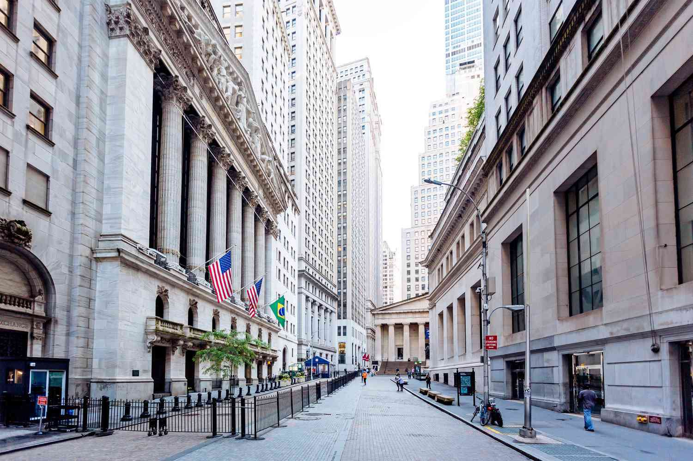

In the modern financial landscape, the concept of a false market has gained significant attention. This financial phenomenon is characterized by manipulated prices and misinformation, presenting a distorted view of economic reality to market participants. Such distortions can have serious implications, impairing the ability of financial markets to efficiently allocate resources based on true supply and demand dynamics.

Algorithmic trading, commonly referred to as algo trading, is increasingly becoming a significant factor in both the identification and exploitation of these market conditions. Algo trading leverages complex algorithms to execute trades at speeds and frequencies that are impossible for human traders. These algorithms can analyze vast quantities of market data, identifying inefficiencies and potential manipulation instances, but they can also exacerbate market distortions by reacting to false signals propagated in the market.

Understanding how false markets form is crucial. False markets are often the result of deliberate attempts to manipulate market prices through the dissemination of erroneous or misleading information. This not only affects pricing but also misguides investment strategies and decisions, leading to financial instability. The integration of algo trading in these processes adds complexity, as the same technology that can detect these false signals can also be exploited to manipulate them further.

The historical and contemporary examples of false markets provide insight into how these practices evolve and impact economies. From well-known cases to ongoing challenges in emerging sectors like cryptocurrency, false markets pose a continuous threat to financial stability. This article explores these themes while examining the economic implications of such practices. It becomes clear that as financial markets continue to evolve, so must our approaches to detecting, understanding, and mitigating the effects of false markets.

## Table of Contents

## What is a False Market?

A false market arises when prices in a financial market are artificially influenced, deviating from their true economic values. This distortion is often orchestrated through deliberate manipulation, resulting in a marketplace where investors make decisions based on false or misleading information. A false market can manifest through significant price volatility, where abrupt and unexplained changes in prices occur without any fundamental basis. This volatility often confuses investors and leads them to make decisions that are disconnected from the actual market conditions or the intrinsic value of the assets.

A key [factor](/wiki/factor-investing) in the creation of a false market is the dissemination of misinformation. Various entities, including companies and media outlets, may release inaccurate information that influences investor perceptions and prompts trading behavior that further skews market prices. The spread of such misinformation can lead investors to buy or sell assets based on perceived trends that do not reflect genuine economic signals or company performance.

False markets disrupt the proper negotiation of prices by impeding the natural flow of supply and demand. Under normal market conditions, prices adjust based on the interaction of buyers and sellers, driven by the underlying economic fundamentals. However, in a false market, this balance is manipulated, leading to inefficient pricing and potential financial instability. Investors and other market participants may suffer losses as they make transactions based on distorted prices.

This manipulation and resulting false pricing can have severe implications for broader economic stability. Market stakeholders, including individual traders, institutional investors, and even governments, may face financial losses due to misjudgments made in such a manipulated environment. Recognizing and understanding the mechanisms behind false markets is crucial for developing strategies to mitigate their effects and enhance market integrity.

## Understanding Market Manipulation

Market manipulation is the strategic and intentional effort to control or influence market prices or trading volumes with the objective of creating false or misleading impressions about the value of an asset. This practice undermines the principle of market integrity and is considered illegal across various jurisdictions. Despite legal frameworks that prohibit such actions, market manipulation remains a persistent challenge for regulatory bodies due to the evolving nature of financial markets and the sophisticated techniques employed by manipulators.

One common form of market manipulation is the "pump and dump" scheme. In this strategy, the price of a stock or asset is artificially inflated ("pumped") through the dissemination of positive, yet often false or exaggerated, information. Once the price reaches a desirable level, the manipulators sell off their positions at a profit, leading to an abrupt decline in the asset's value ("dump"). This leaves unsuspecting investors with depreciated holdings and often results in financial losses.

Insider trading is another prevalent form of market manipulation, where an individual with access to non-public, material information about a company exploits this knowledge to trade its stocks, thereby gaining unfair advantages over other investors. Despite its illegality, insider trading poses significant regulatory challenges due to the clandestine nature of how insider information is shared and acted upon.

Additionally, spreading false or misleading information is a tactic used to create inaccurate market perceptions. This involves releasing erroneous statements or rumors in an effort to influence investor behavior and stock prices. Such practices distort the information available to market participants, resulting in suboptimal decision-making and mispricing of securities.

Regulatory bodies such as the Securities and Exchange Commission (SEC) in the United States enforce laws that prohibit these manipulative practices. Violations can result in severe penalties, including fines and imprisonment for individuals found guilty of engaging in market manipulation. However, the enforcement of these laws is complex due to the sophistication and rapid technological advancements in trading strategies.

The repercussions of market manipulation extend beyond individual traders and investors. It erodes trust in financial systems and markets, potentially discouraging investment and participation. The loss of confidence can lead to reduced market [liquidity](/wiki/liquidity-risk-premium) and increased [volatility](/wiki/volatility-trading-strategies), which are detrimental to the overall economic stability.

In summary, market manipulation is a deliberate act to distort market perceptions and prices. It takes various forms, each posing unique challenges in detection and regulation. The persistence of these practices highlights the need for continued vigilance and adaptation by regulatory bodies to safeguard the integrity of financial markets.

## Economic Examples of Market Manipulation

Market manipulation has profound implications on financial markets, as illustrated by various historical and contemporary examples. One such case is that of trader James Alan Craig in 2015. Craig's actions involved crafting fake Twitter accounts that closely resembled those of actual securities research firms. Through these accounts, he disseminated false information, causing dramatic albeit temporary fluctuations in stock prices. Such activities underline the significant influence misinformation can wield, particularly in the age of social media, where news is rapidly consumed and can trigger swift market reactions. The incident led to legal repercussions, emphasizing the critical need for vigilance against such manipulation.

Cryptocurrency markets have also been fertile ground for manipulation schemes, notably 'pump and dump' activities. These schemes involve artificially inflating the value of a [cryptocurrency](/wiki/cryptocurrency) through false or misleading positive reports, allowing manipulators to sell off their holdings at elevated prices. The inherently speculative nature of cryptocurrencies, combined with their often lax regulatory environments, makes them particularly susceptible to such manipulations. These schemes can significantly distort market perceptions and result in considerable financial losses for uninformed investors.

Historically, the case of the Hunt brothers' attempt to corner the silver market in the late 1970s and early 1980s stands out. The Hunt brothers accumulated vast amounts of silver, driving up prices spectacularly. According to findings, they borrowed heavily to finance these purchases, intending to monopolize silver supply and dictate market prices. However, changes in trading rules and a subsequent market crash led to their undoing, causing them substantial financial loss and highlighting the inherent risks and limits of such market manipulations.

Each of these instances stresses the complexities involved in market manipulation. From sophisticated social media-based misinformation to traditional schemes in emerging digital markets, the spectrum of tactics used demonstrates the challenges facing market regulators. The potential for significant destabilization of market integrity and investor trust is evident, underscoring the necessity for effective monitoring and regulation to safeguard economic systems against such unethical practices.

## The Role of Algo Trading in False Markets

Algorithmic trading, often referred to as algo trading, has fundamentally changed how financial markets function by enabling the swift execution of trades and providing sophisticated analysis of vast market data. This technological advancement allows for high-frequency trading, which can execute thousands of trades per second based on programmed criteria. While this can lead to greater efficiency and market liquidity, it also presents new challenges, particularly concerning false markets.

One way [algorithmic trading](/wiki/algorithmic-trading) contributes to false markets is through the exploitation of small discrepancies or misinformation. For instance, algorithms can be designed to capitalize on temporary price misalignments or rumors by initiating trades that amplify these false signals. This behavior can increase volatility and create an illusion of genuine market movement, thus misleading other market participants who might follow these fabricated trends.

Conversely, algorithmic trading can also mitigate market manipulation. Advanced algorithms are capable of sifting through massive datasets to detect irregular patterns indicative of manipulation, such as suspiciously frequent bidding anomalies or abrupt surges in trading [volume](/wiki/volume-trading-strategy). By identifying these anomalies, algo trading systems can forestall broader market disruptions, thereby supporting market integrity.

Understanding this dual role is vital for both market participants and regulatory bodies. An informed perspective on how algorithms function allows stakeholders to discern between beneficial and detrimental uses of the technology. For instance, strategies such as [arbitrage](/wiki/arbitrage), which seek to profit from price differentials across markets without influencing market prices, underscore the positive applications of algo trading.

To safeguard markets, regulation must adapt to the nuances of algorithmic practices. Crafting intelligent policies that encourage transparency in algorithmic mechanisms, while punishing misuse, establishes a balanced environment that fosters innovation without compromising market stability. Additionally, regulatory authorities are beginning to incorporate [machine learning](/wiki/machine-learning) tools to enhance their ability to monitor and regulate these complex trading systems effectively.

By examining the influence of algorithmic trading on false markets, the necessity of a refined regulatory approach becomes evident. Clear guidelines and robust monitoring systems will be crucial in ensuring that the trading landscape remains both efficient and fair.

## Regulatory and Legal Implications

Regulatory bodies such as the Securities and Exchange Commission (SEC) are pivotal in the oversight and prosecution of market manipulation incidents. They are tasked with maintaining market integrity by enforcing laws and regulations designed to deter manipulative practices. Despite these efforts, enforcing these laws is increasingly challenging due to the sophistication of modern trading strategies, including algorithmic trading, which can obscure manipulative activities.

One significant aspect of regulatory action is the continuous debate surrounding the efficacy of current regulations. Given the rapid evolution of trading technologies and strategies, existing regulatory frameworks often struggle to keep pace. For instance, while regulations such as the Dodd-Frank Wall Street Reform and Consumer Protection Act in the United States aim to enhance the oversight of financial markets, they may be insufficient in preemptively identifying and mitigating novel forms of market manipulation. This gap underscores the necessity for more advanced detection tools and methodologies.

Technological advancements such as [artificial intelligence](/wiki/ai-artificial-intelligence) and machine learning offer potential in this regard. For example, machine learning algorithms can analyze vast datasets to identify unusual trading patterns that may indicate manipulative behavior. These technologies could enhance the ability of regulatory bodies to monitor market activities effectively.

The global nature of financial markets further complicates regulatory efforts. Market manipulation often transcends national borders, necessitating cooperation among regulators across different jurisdictions. Initiatives such as the International Organization of Securities Commissions (IOSCO) aim to foster international collaboration and establish global standards for securities regulation. However, achieving consensus and implementing coordinated mechanisms remain complex due to varying national laws and regulatory frameworks.

In summary, while regulatory bodies like the SEC are instrumental in combating market manipulation, the continual adaptation and enhancement of both domestic and international regulatory approaches are imperative. Embracing technological innovations and fostering cross-border collaboration will be crucial in safeguarding the integrity of modern financial markets.

## Conclusion

False markets and market manipulation pose considerable threats to both financial stability and investor confidence. The evolution of technology, notably algorithmic trading, introduces additional complexities into the financial ecosystem. While algorithmic trading can enhance market efficiency, it also has the potential to disrupt market integrity if used to exploit misinformation or small market discrepancies. As technological tools and strategies advance, the methods of deceiving market participants have also become more sophisticated.

In response to these evolving challenges, regulatory frameworks must adapt to effectively monitor and address manipulative activities. Regulatory bodies such as the Securities and Exchange Commission (SEC) face significant challenges in keeping pace with these advanced trading strategies. They must implement innovative detection tools and foster international cooperation to maintain market fairness and stability. Enhanced cross-border regulatory measures are increasingly crucial, given the global interconnectedness of financial markets and the ease with which information—or misinformation—can traverse geographical boundaries.

For investors, awareness is a critical line of defense against market manipulation. Recognizing the signs of false markets and understanding the potential risks can help mitigate the effects of manipulative practices. Educating oneself about market dynamics and staying informed about regulatory developments are essential steps investors can take to protect their investments. By staying vigilant, leveraging technology responsibly, and adapting regulatory approaches, the financial industry can work towards minimizing the impact of false markets and preserving investor trust.

## References & Further Reading

[1]: Bergstra, J., Bardenet, R., Bengio, Y., & Kégl, B. (2011). ["Algorithms for Hyper-Parameter Optimization."](https://dl.acm.org/doi/10.5555/2986459.2986743) Advances in Neural Information Processing Systems 24.

[2]: ["Advances in Financial Machine Learning"](https://www.amazon.com/Advances-Financial-Machine-Learning-Marcos/dp/1119482089) by Marcos Lopez de Prado

[3]: ["Evidence-Based Technical Analysis: Applying the Scientific Method and Statistical Inference to Trading Signals"](https://www.amazon.com/Evidence-Based-Technical-Analysis-Scientific-Statistical/dp/0470008741) by David Aronson

[4]: ["Machine Learning for Algorithmic Trading"](https://github.com/stefan-jansen/machine-learning-for-trading) by Stefan Jansen

[5]: ["Quantitative Trading: How to Build Your Own Algorithmic Trading Business"](https://www.amazon.com/Quantitative-Trading-Build-Algorithmic-Business/dp/1119800064) by Ernest P. Chan