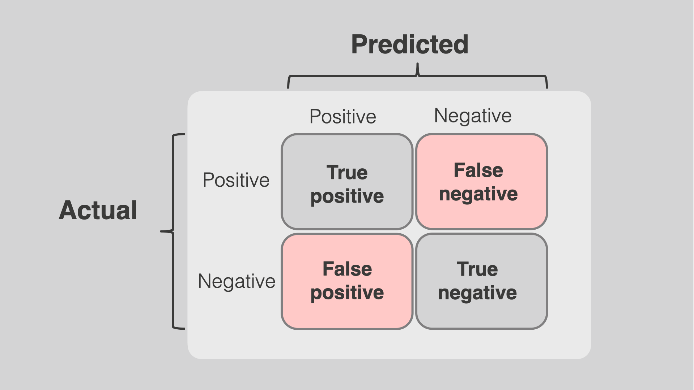

## Table of Contents

## What is a False Negative in the context of machine learning?

In machine learning, a False Negative happens when a model says something is not there, but it actually is. Imagine you're using a machine learning model to check if an email is spam. If the model says an email is not spam when it really is, that's a False Negative. This is a problem because it means the model missed something important, and you might end up reading spam emails thinking they are important.

False Negatives can be very serious in some situations. For example, in medical tests, a False Negative means the test says a person does not have a disease when they actually do. This can be dangerous because the person might not get the treatment they need. In machine learning, we use something called a confusion matrix to keep track of False Negatives and other types of errors. The confusion matrix helps us understand how well our model is doing and where it needs to improve.

## How does a False Negative differ from a False Positive?

A False Negative and a False Positive are two different kinds of mistakes that can happen when a machine learning model makes predictions. A False Negative happens when the model says something is not there, but it actually is. For example, if a model is checking for spam emails and it says an email is not spam when it really is, that's a False Negative. This is a problem because the model missed something important.

On the other hand, a False Positive happens when the model says something is there, but it actually isn't. Using the same spam email example, if the model says an email is spam when it's not, that's a False Positive. This is also a problem because you might miss important emails if you automatically delete them thinking they are spam. Both types of errors can be serious depending on the situation, but they are different because they involve different kinds of mistakes in prediction.

## Can you give a simple example of a False Negative in a real-world scenario?

Imagine you're at the airport and you go through a security scanner to check for dangerous items. The scanner is supposed to beep if it finds something dangerous, like a weapon. But sometimes, the scanner might miss a small knife that someone is carrying. If the scanner doesn't beep and lets the person through even though they have a knife, that's a False Negative. The scanner said there was no danger when there actually was.

This kind of mistake can be very serious because it means a dangerous item got through security without being noticed. In [machine learning](/wiki/machine-learning), we use something called a confusion matrix to keep track of these mistakes. A False Negative in this case would be recorded in the confusion matrix as a situation where the model predicted "no danger" but the actual situation was "danger."

## What are the potential consequences of a False Negative in medical diagnosis?

A False Negative in medical diagnosis happens when a test says a person does not have a disease, but they actually do. This can be very dangerous. For example, if someone takes a test for cancer and the test says they are fine, but they really have cancer, they might not get the treatment they need. This could make the cancer worse and harder to treat later on. It can also make people feel safe when they are not, which can lead to more health problems down the road.

In some cases, False Negatives can even lead to death. If a person with a serious disease like a heart condition gets a False Negative, they might not take the necessary steps to manage their health. They could have a heart attack and not be prepared for it. This shows why it's so important to make medical tests as accurate as possible. Doctors and scientists work hard to reduce False Negatives because they know how serious the consequences can be.

## How is the False Negative rate calculated?

The False Negative rate is a way to figure out how often a test or a machine learning model says something is not there when it actually is. To find the False Negative rate, you need to know two things: the number of False Negatives and the total number of actual positive cases. The False Negative rate is calculated by dividing the number of False Negatives by the total number of actual positive cases. You can write this formula as $$ \text{False Negative Rate} = \frac{\text{Number of False Negatives}}{\text{Total Number of Actual Positives}} $$.

For example, imagine you have a test for a disease. Out of 100 people who actually have the disease, the test says 10 people do not have it. Those 10 cases are False Negatives. To find the False Negative rate, you would divide 10 by 100, which gives you a rate of 0.1 or 10%. This means the test misses the disease 10% of the time when it is actually present. Knowing the False Negative rate helps doctors and scientists understand how reliable a test is and where they need to make improvements.

## What factors can contribute to a high False Negative rate in a model?

A high False Negative rate in a model can happen because of many reasons. One reason is if the data the model was trained on doesn't cover all the situations it might see in real life. For example, if a model to detect spam emails was only trained on old spam emails, it might miss new types of spam. Another reason is if the model is too simple and can't see the difference between things that look similar. If a model to find cancer in pictures is too simple, it might not see small signs of cancer.

Also, problems with the data can make the False Negative rate go up. If the data has mistakes or is missing important information, the model might learn the wrong things. For example, if a model to predict heart disease is missing data about smoking, it might not know how important smoking is and miss people who smoke. Lastly, if the model is set to be very careful about saying something is positive, it might miss a lot of real positives. This is called setting a high threshold for positive predictions, and it can make the False Negative rate go up. The formula to find the False Negative rate is $$ \text{False Negative Rate} = \frac{\text{Number of False Negatives}}{\text{Total Number of Actual Positives}} $$.

## How can data imbalance affect the occurrence of False Negatives?

Data imbalance happens when there are a lot more examples of one thing than another in the data used to train a model. For example, if you're trying to build a model to detect rare diseases, you might have way more data on people who don't have the disease than those who do. When the model sees so many examples of people without the disease, it might start to think that most people don't have it. This can make the model miss the few cases where the disease is actually present, leading to more False Negatives. The formula to find the False Negative rate is $$ \text{False Negative Rate} = \frac{\text{Number of False Negatives}}{\text{Total Number of Actual Positives}} $$. If the model sees too few examples of the disease, it might not learn well enough to spot it correctly.

To fix this problem, people use different methods to make the data more balanced. One way is to use techniques like oversampling, where you make more copies of the rare cases, or undersampling, where you use fewer examples of the common cases. Another way is to use special algorithms that can handle imbalanced data better. By making the data more balanced, the model can learn to spot the rare cases more accurately, which can help lower the number of False Negatives. This is important because a high False Negative rate can be dangerous, especially in areas like medical diagnosis where missing a disease can have serious consequences.

## What techniques can be used to reduce False Negatives in a machine learning model?

To reduce False Negatives in a machine learning model, you can start by making sure the data you use to train the model is balanced. If you have a lot more examples of one thing than another, like more examples of people without a disease than with it, the model might miss the rare cases. You can fix this by using techniques like oversampling, where you make more copies of the rare cases, or undersampling, where you use fewer examples of the common cases. Another way is to use special algorithms that can handle imbalanced data better. By making the data more balanced, the model can learn to spot the rare cases more accurately, which can help lower the number of False Negatives.

Another technique is to adjust the model's threshold for saying something is positive. If the model is set to be very careful about saying something is positive, it might miss a lot of real positives, leading to more False Negatives. You can change the threshold to make the model less strict. This means it might say something is positive more often, which can help catch more true positives and reduce False Negatives. The formula to find the False Negative rate is $$ \text{False Negative Rate} = \frac{\text{Number of False Negatives}}{\text{Total Number of Actual Positives}} $$. By adjusting the threshold and balancing the data, you can make the model better at spotting the things it should, which is important in areas like medical diagnosis where missing a disease can be dangerous.

## How does the choice of threshold in a classification model impact False Negatives?

The choice of threshold in a classification model can have a big impact on False Negatives. The threshold is like a line that the model uses to decide if something is positive or negative. If you set the threshold too high, the model will only say something is positive if it is very sure. This can lead to more False Negatives because the model might miss cases that are actually positive but don't meet the high threshold. For example, if a model is checking for a disease and the threshold is set high, it might miss people who have the disease but show only mild symptoms.

To reduce False Negatives, you can lower the threshold. When you do this, the model becomes less strict about saying something is positive. This means it might catch more true positives, which are cases where the model correctly says something is positive. However, lowering the threshold can also increase the number of False Positives, where the model says something is positive when it's not. The key is finding a good balance. The formula to find the False Negative rate is $$ \text{False Negative Rate} = \frac{\text{Number of False Negatives}}{\text{Total Number of Actual Positives}} $$. By adjusting the threshold, you can make the model better at spotting the things it should, which is important in areas like medical diagnosis where missing a disease can be dangerous.

## Can you explain the trade-off between False Negatives and False Positives in model tuning?

When you're tuning a machine learning model, you have to think about the balance between False Negatives and False Positives. A False Negative happens when the model says something is not there when it actually is. A False Positive is when the model says something is there when it's not. If you want to lower the number of False Negatives, you might need to make the model less strict about saying something is positive. This means you lower the threshold, which is like a line the model uses to decide if something is positive or negative. When you do this, the model might catch more true positives, but it can also lead to more False Positives because the model is saying "yes" more often.

Finding the right balance between False Negatives and False Positives is important because it depends on what you're using the model for. In some situations, like medical diagnosis, missing a disease (a False Negative) can be very dangerous. So, you might want to lower the threshold to catch more cases, even if it means more False Positives. But in other situations, like spam email detection, having too many False Positives can be annoying because you might miss important emails. The formula to find the False Negative rate is $$ \text{False Negative Rate} = \frac{\text{Number of False Negatives}}{\text{Total Number of Actual Positives}} $$. By adjusting the threshold, you can make the model better at spotting the things it should, but you have to be careful about the trade-offs.

## What advanced methods exist for handling False Negatives in imbalanced datasets?

When dealing with imbalanced datasets, one advanced method to handle False Negatives is to use techniques like Synthetic Minority Over-sampling Technique (SMOTE). SMOTE works by creating new examples of the minority class, which are the cases that are less common in the data. For example, if you're trying to detect a rare disease, SMOTE can make more copies of the people who have the disease, but these copies are slightly different from each other. This helps the model see more examples of the disease and learn to spot it better, which can reduce False Negatives. The formula to find the False Negative rate is $$ \text{False Negative Rate} = \frac{\text{Number of False Negatives}}{\text{Total Number of Actual Positives}} $$. By using SMOTE, you can make the data more balanced and help the model catch more true positives.

Another method is to use algorithms that are designed to handle imbalanced data, like Random Forests or Gradient Boosting Machines with class weights. These algorithms can be set up to pay more attention to the minority class, which means they try harder to spot the rare cases. For example, you can tell the algorithm to give more importance to the people who have the disease when it's learning. This can help the model be better at finding the disease and reduce False Negatives. By using these special algorithms, you can make the model more sensitive to the minority class without needing to change the data as much.

## How can one evaluate the performance of a model specifically in terms of False Negatives?

To evaluate the performance of a model specifically in terms of False Negatives, you need to look at how often the model says something is not there when it actually is. The main way to do this is by calculating the False Negative rate. The formula to find the False Negative rate is $$ \text{False Negative Rate} = \frac{\text{Number of False Negatives}}{\text{Total Number of Actual Positives}} $$. This rate tells you what percentage of the time the model missed something that was actually positive. If the rate is high, it means the model is missing a lot of true positives, which can be a problem, especially in areas like medical diagnosis where missing a disease can be dangerous.

Another way to evaluate the model's performance in terms of False Negatives is by using a confusion matrix. A confusion matrix is a table that shows how many times the model got things right or wrong. It has four main parts: True Positives, True Negatives, False Positives, and False Negatives. By looking at the False Negatives in the confusion matrix, you can see how many times the model missed something that was actually positive. This helps you understand where the model is making mistakes and where it needs to improve. By focusing on reducing the number of False Negatives, you can make the model better at spotting the things it should, which is important for making accurate predictions.