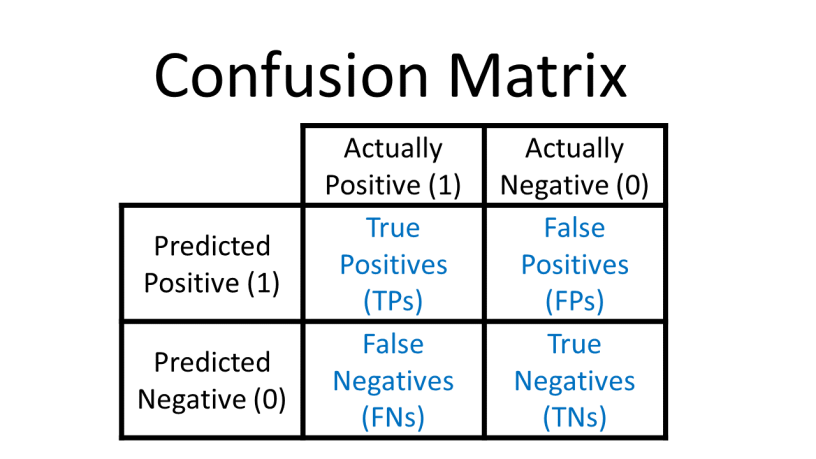

## Table of Contents

## What is a False Negative in the context of machine learning?

In machine learning, a False Negative happens when a model says something is not there, but it actually is. Imagine you're using a model to check if an email is spam. If the model says an email is not spam when it really is, that's a False Negative. It's like the model missed the target, thinking everything was fine when there was a problem.

False Negatives can be a big deal depending on what the model is used for. For example, in medical tests, a False Negative might mean a sick person is told they're healthy. This could delay important treatment. So, when building models, it's important to balance the risk of False Negatives with other types of errors to make sure the model works well for its purpose.

## How is the False Negative Rate (FNR) defined and calculated?

The False Negative Rate (FNR) tells us how often our model misses something important. It's like when you're looking for your keys and you say they're not in your pocket, but they actually are. In the world of machine learning, FNR is the number of times our model says "no" when it should have said "yes," divided by all the times it should have said "yes." If we're trying to find sick people, FNR shows us how often we're missing those who are actually sick.

To calculate the False Negative Rate, you need to know two things: the number of False Negatives (FN) and the total number of actual positive cases, which is the sum of True Positives (TP) and False Negatives (FN). The formula for FNR is simple: $$ \text{FNR} = \frac{\text{FN}}{\text{FN} + \text{TP}} $$. For example, if out of 100 sick people, your model correctly identifies 90 as sick (TP = 90) but misses 10 (FN = 10), the FNR would be $$ \frac{10}{10 + 90} = \frac{10}{100} = 0.1 $$ or 10%. This means your model misses 10% of the sick people.

## Why is the False Negative Rate important in machine learning models?

The False Negative Rate (FNR) is important in machine learning because it shows us how often our model misses something important. Imagine you're using a model to check if someone is sick. If the model says a person is healthy when they're actually sick, that's a False Negative. A high FNR means our model is missing a lot of these cases, which can be dangerous or costly, depending on what the model is used for. For example, in medical diagnosis, missing a sick person can delay treatment and worsen their condition.

Understanding and minimizing the FNR is crucial for building reliable models. If we know our model has a high FNR, we can work on improving it to catch more of the cases it's missing. For example, if the FNR is calculated as $$ \text{FNR} = \frac{\text{FN}}{\text{FN} + \text{TP}} $$, and we find it's too high, we might adjust our model's threshold or gather more data to train it better. This way, we can make sure our model is more accurate and trustworthy, especially in critical applications where missing positives can have serious consequences.

## Can you provide an example of a scenario where a high False Negative Rate is particularly harmful?

Imagine a hospital using a machine learning model to check if patients have a dangerous disease like cancer. If the model says a patient doesn't have cancer when they actually do, that's a False Negative. A high False Negative Rate (FNR) means the model is missing a lot of sick people. The FNR is calculated as $$ \text{FNR} = \frac{\text{FN}}{\text{FN} + \text{TP}} $$. If the FNR is high, many patients might be told they're healthy when they're not, which can delay their treatment and make their condition worse.

In this scenario, a high FNR is very harmful because missing cancer can lead to serious health problems or even death. Doctors and patients rely on these models to make important decisions about treatment. If the model misses too many cases, it can cause a lot of harm. That's why it's so important to keep the FNR as low as possible in medical settings, so we can catch diseases early and help people get the care they need.

## How does the False Negative Rate relate to other metrics like True Positive Rate and False Positive Rate?

The False Negative Rate (FNR) is connected to other important metrics like the True Positive Rate (TPR) and the False Positive Rate (FPR). FNR tells us how often our model misses something important, like when it says a sick person is healthy. TPR, on the other hand, shows how often our model correctly identifies something, like when it correctly says a sick person is sick. FPR tells us how often our model says something is there when it's not, like when it says a healthy person is sick. These three metrics together give us a full picture of how well our model is doing. If we know our FNR, TPR, and FPR, we can see where our model needs to improve.

For example, if we're using a model to check for cancer, the FNR is calculated as $$ \text{FNR} = \frac{\text{FN}}{\text{FN} + \text{TP}} $$. This tells us the percentage of sick people our model misses. The TPR, or sensitivity, is calculated as $$ \text{TPR} = \frac{\text{TP}}{\text{TP} + \text{FN}} $$, showing the percentage of sick people our model correctly identifies. The FPR is calculated as $$ \text{FPR} = \frac{\text{FP}}{\text{FP} + \text{TN}} $$, showing the percentage of healthy people our model incorrectly says are sick. By looking at these three rates together, we can adjust our model to balance the risk of missing sick people (high FNR) with the risk of wrongly identifying healthy people as sick (high FPR), making sure our model is as useful and accurate as possible.

## What are common causes of a high False Negative Rate in machine learning models?

A high False Negative Rate (FNR) in machine learning models often happens when the model is not good at spotting the things it's supposed to find. This can happen if the model is trained on data that doesn't include enough examples of what it's looking for. For example, if you're trying to find pictures of cats but your training data has very few cat pictures, the model might miss cats in new pictures because it hasn't seen enough examples to recognize them well. Another reason could be that the model is too strict about what it considers a positive result. If the model needs to be very sure before it says "yes," it might miss a lot of cases where it should say "yes."

Another common cause of a high FNR is when the data used to train the model is not the same as the data it sees in real life. This is called a "data drift." If the model was trained on old data and the world has changed since then, the model might not work well anymore. For example, if a model was trained to detect flu cases in winter but is now used in summer, it might miss a lot of flu cases because the patterns it learned don't match the new data. Also, if the model is too simple and can't learn the complex patterns in the data, it might miss important details and have a high FNR.

To fix a high FNR, you might need to gather more data that includes the cases you're trying to find, adjust how strict the model is about saying "yes," or use a more complex model that can learn the patterns better. The FNR is calculated as $$ \text{FNR} = \frac{\text{FN}}{\text{FN} + \text{TP}} $$. By understanding why the FNR is high and making these changes, you can help the model miss fewer important cases.

## How can the False Negative Rate be reduced in a machine learning model?

To reduce the False Negative Rate (FNR) in a machine learning model, one of the first steps is to make sure the model is trained on enough data that includes plenty of examples of what it's trying to find. If the model is trying to spot sick people, it needs to see lots of examples of sick people during training. This way, it can learn the patterns better and miss fewer cases. Another way to help is by adjusting how strict the model is about saying "yes." If the model is too strict, it might miss a lot of cases where it should say "yes." By making the model a bit less strict, it might catch more of the important cases and lower the FNR.

Another important way to reduce the FNR is to make sure the data the model sees in real life is similar to the data it was trained on. If the world changes and the model is seeing different data, it might start missing more cases. This is called "data drift." To fix this, you can keep updating the model with new data so it stays up-to-date. Also, if the model is too simple, it might not be able to learn the complex patterns in the data. Using a more complex model that can learn these patterns better can help catch more cases and lower the FNR. The FNR is calculated as $$ \text{FNR} = \frac{\text{FN}}{\text{FN} + \text{TP}} $$. By understanding why the FNR is high and making these changes, you can help the model miss fewer important cases.

## What is the trade-off between False Negative Rate and False Positive Rate in model tuning?

When you're trying to make a machine learning model better, you often have to balance the False Negative Rate (FNR) and the False Positive Rate (FPR). The FNR is how often the model misses something important, like saying a sick person is healthy. The FPR is how often the model says something is there when it's not, like saying a healthy person is sick. If you make the model less strict about saying "yes," it might catch more of the important cases and lower the FNR. But at the same time, it might start saying "yes" too often and increase the FPR. So, you have to find the right balance that works best for what you're trying to do.

For example, in a medical test for a disease, a high FNR means the model is missing sick people, which can be dangerous. But a high FPR means the model is telling healthy people they're sick, which can cause worry and unnecessary tests. You can adjust the model's threshold to change how strict it is about saying "yes." If you lower the threshold, the model might catch more sick people (lower FNR), but it might also start saying more healthy people are sick (higher FPR). The formulas for these rates are $$ \text{FNR} = \frac{\text{FN}}{\text{FN} + \text{TP}} $$ and $$ \text{FPR} = \frac{\text{FP}}{\text{FP} + \text{TN}} $$. Finding the right balance between these two rates is important to make sure the model works well for its purpose.

## How does class imbalance affect the False Negative Rate, and what can be done about it?

Class imbalance happens when the thing you're trying to find with your model is much rarer than the thing you're not trying to find. For example, if you're trying to spot a rare disease, most of your data will be from healthy people. This can make your model miss the rare cases because it learns more about the common ones. When there's a lot more of one class than the other, the model might become too good at spotting the common class and not good enough at spotting the rare one. This can lead to a high False Negative Rate (FNR), which is calculated as $$ \text{FNR} = \frac{\text{FN}}{\text{FN} + \text{TP}} $$. A high FNR means your model is missing a lot of the important cases, like saying a sick person is healthy.

To fix the problem of class imbalance and lower the FNR, you can try a few things. One way is to balance your data by adding more examples of the rare class or removing some examples of the common class. Another way is to use special techniques in your model that help it pay more attention to the rare class. For example, you can use something called "oversampling" to make more copies of the rare class data, or "undersampling" to use less of the common class data. You can also use methods like "SMOTE" to create new examples of the rare class that are similar to the ones you already have. By doing these things, you can help your model learn better about the rare cases and lower the FNR, making it better at spotting what's important.

## Can you explain how the choice of threshold affects the False Negative Rate in classification models?

The threshold in a classification model is like a line that the model uses to decide if something is a "yes" or a "no." If you move this line, it changes how often the model says "yes" and how often it says "no." When you make the threshold lower, the model becomes less strict about saying "yes." This means it might catch more of the important cases, like saying a sick person is sick, which can lower the False Negative Rate (FNR). The FNR is calculated as $$ \text{FNR} = \frac{\text{FN}}{\text{FN} + \text{TP}} $$. A lower FNR means the model is missing fewer important cases.

But, if you make the threshold too low, the model might start saying "yes" too often. This can increase the False Positive Rate (FPR), which is how often the model says something is there when it's not. The FPR is calculated as $$ \text{FPR} = \frac{\text{FP}}{\text{FP} + \text{TN}} $$. So, when you're adjusting the threshold, you have to find a balance. You want to lower the FNR to catch more important cases, but you don't want the FPR to get too high and cause other problems. Finding the right threshold depends on what's more important for your model's purpose.

## How do different evaluation metrics, such as ROC curve and Precision-Recall curve, help in understanding False Negative Rate?

The ROC (Receiver Operating Characteristic) curve is a useful tool for understanding how well a model is doing at spotting important cases while also keeping an eye on how often it makes mistakes. The ROC curve shows the True Positive Rate (TPR) on the y-axis and the False Positive Rate (FPR) on the x-axis. The TPR is how often the model correctly says "yes" when it should, like when it correctly says a sick person is sick. The FPR is how often the model says "yes" when it shouldn't, like when it says a healthy person is sick. By looking at the ROC curve, you can see how changing the threshold affects both the TPR and FPR. The closer the curve is to the top-left corner of the graph, the better the model is at balancing these rates. The False Negative Rate (FNR) is related to the TPR because $$ \text{FNR} = 1 - \text{TPR} $$. So, a higher TPR means a lower FNR, which means the model is missing fewer important cases.

The Precision-Recall curve is another way to understand how well a model is doing, especially when the thing you're trying to find is rare. Precision is how often the model is right when it says "yes," like when it says a person is sick and they really are. Recall is the same as the True Positive Rate (TPR), showing how often the model correctly says "yes" when it should. The Precision-Recall curve plots precision on the y-axis and recall on the x-axis. A high recall means the model is catching a lot of the important cases, which means a lower False Negative Rate (FNR). The FNR is calculated as $$ \text{FNR} = \frac{\text{FN}}{\text{FN} + \text{TP}} $$. By looking at the Precision-Recall curve, you can see how well the model is doing at spotting the important cases without making too many mistakes. This helps you find the right balance between catching as many important cases as possible and keeping the number of mistakes low.

## What advanced techniques or algorithms are used to minimize False Negative Rate in specialized domains like medical diagnostics?

In medical diagnostics, where missing a disease can be dangerous, advanced techniques like ensemble methods are often used to minimize the False Negative Rate (FNR). Ensemble methods combine the predictions of multiple models to make a final decision. This can help catch more cases of a disease because different models might spot different signs of the illness. Techniques like boosting and bagging are common. Boosting focuses on the cases that the model keeps missing, trying to improve on them with each new model added to the ensemble. Bagging, on the other hand, trains different models on different parts of the data and then combines their predictions. By using these methods, the overall model can be better at spotting the important cases, lowering the FNR, which is calculated as $$ \text{FNR} = \frac{\text{FN}}{\text{FN} + \text{TP}} $$.

Another advanced technique used in medical diagnostics is deep learning, particularly with convolutional neural networks (CNNs) for image-based diagnoses like detecting cancer from scans. Deep learning models can learn complex patterns in the data that simpler models might miss, which helps in reducing the FNR. These models are trained on large datasets of medical images, allowing them to recognize subtle signs of diseases that might be overlooked by human eyes or simpler algorithms. Additionally, techniques like transfer learning can be applied, where a model pretrained on a large dataset is fine-tuned on a smaller, specific medical dataset. This helps the model perform better with less data, which is often the case in medical settings. By using these advanced methods, the model can become more accurate in spotting diseases, thereby lowering the FNR and improving patient outcomes.