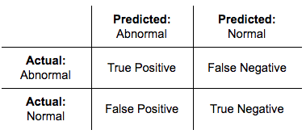

## Table of Contents

## What is a False Positive in the context of machine learning?

In machine learning, a False Positive happens when a model says something is true when it's actually not. Imagine you have a spam email filter. If it marks a normal email as spam, that's a False Positive. The model thought the email was spam, but it was a regular message. False Positives can be annoying because they might make you miss important emails or cause other problems.

False Positives are important to think about when you're making and using machine learning models. They can affect how much you trust the model. For example, in medical tests, a False Positive might make a healthy person think they are sick. This can cause worry and lead to more tests. So, it's important to balance the number of False Positives with other kinds of errors to make the model as helpful as possible.

## How does a False Positive differ from a False Negative?

A False Positive and a False Negative are two types of errors that can happen in machine learning. A False Positive is when the model says something is true when it's actually false. For example, if a security system thinks a harmless object is a threat, that's a False Positive. On the other hand, a False Negative happens when the model says something is false when it's actually true. If a medical test says a sick person is healthy, that's a False Negative.

Both types of errors are important to think about because they can affect how well a model works. False Positives might make you do extra work or worry unnecessarily, like getting more spam emails or thinking you're sick when you're not. False Negatives can be more serious because they might make you miss something important, like a real threat or a disease that needs treatment. Balancing these errors is key to making a good machine learning model.

## Can you give a simple example of a False Positive in a real-world scenario?

Imagine you're at an airport and you go through a security scanner. The scanner is supposed to beep if it finds something dangerous, like a weapon. But sometimes, it beeps even when you're not carrying anything dangerous. Maybe you have a lot of metal in your belt or shoes. When the scanner beeps and the security people think you have a weapon, but you don't, that's a False Positive. The scanner made a mistake and said you were carrying a weapon when you weren't.

This kind of mistake can be annoying. You might have to wait while security checks your bags and pats you down. It can make you late for your flight and cause a lot of stress. But it's better to have a few False Positives than to miss a real threat. So, while False Positives can be frustrating, they're an important part of keeping everyone safe at the airport.

## What are the common causes of False Positives in machine learning models?

False Positives in [machine learning](/wiki/machine-learning) models can happen for a few reasons. One common cause is when the data used to train the model isn't good enough. If the data is too messy or doesn't have enough examples of what the model is supposed to find, the model might get confused. For example, if a model is trying to spot spam emails but it's trained on a small set of emails, it might think regular emails are spam because it hasn't seen enough examples of what regular emails look like.

Another reason for False Positives is when the model is too simple or too complex. If a model is too simple, it might not be able to tell the difference between what it's supposed to find and what it's not. On the other hand, if a model is too complex, it might start to see patterns that aren't really there. This is called overfitting, and it can make the model think something is true when it's not. Balancing the complexity of the model is important to reduce False Positives.

Lastly, False Positives can also happen because the world changes. What was true when the model was trained might not be true anymore. For example, if a model is used to find credit card fraud, new types of fraud might appear that the model hasn't seen before. The model might think these new types of fraud are normal transactions, leading to False Positives. Keeping the model updated with new data can help reduce these errors.

## How can False Positives impact the performance of a machine learning model?

False Positives can make a machine learning model less useful because they can lead to wrong decisions. Imagine a model that's supposed to spot sick people. If it keeps saying healthy people are sick, doctors might waste time and money on unnecessary tests. This can make people trust the model less. In a business, too many False Positives might mean more work for employees who have to check the model's predictions, slowing down the business and costing more money.

To understand how False Positives affect a model's performance, we can look at a measure called the False Positive Rate (FPR). The FPR is the number of False Positives divided by the total number of times the model said something was negative. If the FPR is high, it means the model often makes mistakes by saying something is true when it's not. A good model tries to keep the FPR low while still being able to spot the things it's supposed to find. Balancing this can be tricky, but it's important for making the model work well in the real world.

## What metrics are used to evaluate False Positives in classification problems?

In classification problems, we use different metrics to see how many False Positives a model makes. One important metric is the False Positive Rate (FPR). The FPR tells us how often the model says something is true when it's actually false. You can find the FPR by dividing the number of False Positives by the total number of times the model said something was negative. If we use math to show this, the formula looks like this: $$ \text{FPR} = \frac{\text{False Positives}}{\text{False Positives} + \text{True Negatives}} $$. A lower FPR means the model makes fewer mistakes by saying something is true when it's not.

Another useful metric is the Precision. Precision tells us how many of the things the model said were true actually were true. It's calculated by dividing the number of True Positives by the total number of times the model said something was true. In math, it looks like this: $$ \text{Precision} = \frac{\text{True Positives}}{\text{True Positives} + \text{False Positives}} $$. High Precision means the model is good at avoiding False Positives. Both FPR and Precision help us understand how well a model is doing at keeping False Positives low, which is important for making sure the model's predictions are useful and trustworthy.

## How can one reduce the rate of False Positives in a machine learning model?

To reduce the rate of False Positives in a machine learning model, it's important to start with good data. The model needs to be trained on a large and diverse set of examples so it can learn what to look for and what to ignore. If the training data is messy or doesn't have enough examples, the model might get confused and make more False Positives. Cleaning up the data and making sure it has plenty of examples can help the model learn better and make fewer mistakes.

Another way to reduce False Positives is to adjust the model's complexity. If the model is too simple, it might not be able to tell the difference between what it's supposed to find and what it's not. But if the model is too complex, it might start to see patterns that aren't really there, which can lead to False Positives. This is called overfitting. Balancing the model's complexity can help it perform better. One way to do this is by using a technique called regularization, which helps the model focus on the most important patterns and ignore the noise.

Lastly, keeping the model updated with new data can also help reduce False Positives. The world changes, and what was true when the model was trained might not be true anymore. By regularly retraining the model with new data, it can learn about new patterns and avoid making mistakes on things it hasn't seen before. For example, if a model is used to spot credit card fraud, new types of fraud might appear that the model hasn't seen before. By updating the model with new data, it can learn to spot these new types of fraud without thinking normal transactions are fraudulent.

## What is the trade-off between False Positives and False Negatives, and how is it managed?

The trade-off between False Positives and False Negatives is about balancing two types of mistakes a machine learning model can make. A False Positive happens when the model says something is true when it's actually false. A False Negative happens when the model says something is false when it's actually true. If you try to reduce False Positives, you might end up with more False Negatives, and if you try to reduce False Negatives, you might end up with more False Positives. For example, if you make a spam filter stricter to catch more spam, it might start marking regular emails as spam, causing more False Positives. But if you make it less strict to avoid marking regular emails as spam, it might miss some spam emails, causing more False Negatives.

Managing this trade-off involves finding the right balance that works best for your specific situation. One way to do this is by adjusting the model's decision threshold. The decision threshold is the point at which the model decides if something is true or false. If you lower the threshold, the model might be more likely to say something is true, which can reduce False Negatives but increase False Positives. If you raise the threshold, the model might be more likely to say something is false, which can reduce False Positives but increase False Negatives. You can use a metric called the Receiver Operating Characteristic (ROC) curve to see how changing the threshold affects the balance between False Positives and False Negatives. The ROC curve plots the True Positive Rate (TPR) against the False Positive Rate (FPR) at different thresholds, helping you find the best balance for your needs. The formula for TPR is $$ \text{TPR} = \frac{\text{True Positives}}{\text{True Positives} + \text{False Negatives}} $$, and the formula for FPR is $$ \text{FPR} = \frac{\text{False Positives}}{\text{False Positives} + \text{True Negatives}} $$.

## In what types of applications are False Positives particularly problematic?

False Positives can be very problematic in medical tests. Imagine a test that checks if someone has a disease. If the test says a healthy person is sick, that's a False Positive. This can make the person worry a lot and go through more tests that they don't need. It can also make doctors waste time and money on unnecessary treatments. So, in medicine, it's really important to keep False Positives low to make sure people trust the tests and get the right care.

Another area where False Positives are a big problem is in security systems. Think about a security scanner at an airport that beeps when it thinks someone has a weapon. If the scanner beeps and it's wrong, that's a False Positive. This can make people late for their flights and cause a lot of stress while security checks their bags. In security, too many False Positives can make people stop trusting the system, and that's not good because the system is there to keep everyone safe. So, it's important to balance the number of False Positives to make sure the security system works well without causing too many problems.

## How do advanced techniques like ensemble methods help in managing False Positives?

Ensemble methods are a smart way to make machine learning models better at avoiding False Positives. They work by combining the predictions of many different models to come up with a final answer. Imagine you're trying to guess what kind of animal is in a picture. If you ask a bunch of friends and combine their guesses, you're more likely to get it right than if you just asked one friend. Ensemble methods do something similar. By using many models together, they can balance out the mistakes each model might make, including False Positives. This can make the final prediction more accurate and reduce the number of False Positives.

One popular type of ensemble method is called Random Forests. A Random Forest is a group of decision trees, and each tree makes its own prediction. The final prediction is based on what most of the trees say. This can help lower the chances of False Positives because if one tree makes a mistake, the other trees might not make the same mistake. By combining the predictions of many trees, Random Forests can make better guesses and be more reliable. This is really helpful in situations where False Positives can cause big problems, like in medical tests or security systems.

## What role does data preprocessing play in minimizing False Positives?

Data preprocessing is a big help in making sure a machine learning model doesn't make too many False Positives. Before you even start training the model, you clean up the data to make it better. This means fixing mistakes, getting rid of information that's not needed, and making sure the data is in a good format. If the data is messy or has too many gaps, the model can get confused and think something is true when it's not. By cleaning up the data, you help the model learn better and make fewer mistakes, like saying a healthy person is sick or marking a regular email as spam.

Another important part of data preprocessing is making sure the data is balanced. Sometimes, the data might have a lot more examples of one thing than another. For example, if you're trying to spot rare diseases, you might have a lot more examples of healthy people than sick people. If the model only sees a lot of healthy people, it might think everyone is healthy and miss the sick people, causing False Negatives. But if you balance the data to have more examples of sick people, the model can learn better and avoid making too many False Positives. By taking the time to preprocess the data carefully, you can make the model more accurate and trustworthy.

## How can one use ROC curves and AUC to analyze the performance of a model in terms of False Positives?

ROC curves and AUC are tools that help you see how well a model is doing at balancing False Positives and True Positives. An ROC curve is a graph that shows how the model's True Positive Rate (TPR) changes as you change the False Positive Rate (FPR). The TPR is how often the model correctly says something is true, and the FPR is how often it wrongly says something is true. You can see this balance by plotting the TPR against the FPR at different decision thresholds. The formula for TPR is $$ \text{TPR} = \frac{\text{True Positives}}{\text{True Positives} + \text{False Negatives}} $$, and the formula for FPR is $$ \text{FPR} = \frac{\text{False Positives}}{\text{False Positives} + \text{True Negatives}} $$. If the ROC curve is close to the top-left corner of the graph, it means the model is good at keeping False Positives low while still catching the True Positives.

The Area Under the Curve (AUC) is a number that tells you how well the model is doing overall. It's the area under the ROC curve, and it ranges from 0 to 1. A higher AUC means the model is better at telling the difference between true and false cases. If the AUC is close to 1, the model is doing a great job. If it's close to 0.5, the model is doing no better than guessing. By looking at the ROC curve and the AUC, you can see how well your model is doing at avoiding False Positives and decide if you need to make changes to improve it.