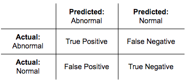

## Table of Contents

## What is a False Positive in the context of machine learning?

In machine learning, a false positive happens when a model says something is true, but it's actually false. Imagine you have a machine that checks if emails are spam. A false positive would be when the machine says an email is spam, but it's really not. This can be frustrating because you might miss important emails if they get sorted into the spam folder by mistake.

False positives are important to understand because they affect how much we can trust a model. If a model has too many false positives, people might not use it because it's not reliable. For example, in medical tests, a false positive could mean someone thinks they are sick when they are not, which can cause unnecessary worry and extra tests. So, it's crucial to balance the model to reduce false positives while still catching the true cases.

## How is the False Positive Rate (FPR) defined and calculated?

The False Positive Rate (FPR) is a way to measure how often a model makes a mistake by saying something is true when it's actually false. It's like checking how many times the model cries wolf when there's no wolf. In simple terms, FPR tells us the percentage of negative cases that the model incorrectly labels as positive.

To calculate the False Positive Rate, you need to know two things: the number of false positives (FP) and the total number of actual negatives (TN + FP). The formula for FPR is: $$ \text{FPR} = \frac{\text{FP}}{\text{FP} + \text{TN}} $$. Here, FP is the number of times the model said 'yes' when it should have said 'no', and TN is the number of times the model correctly said 'no'. So, FPR is the ratio of false positives to all the cases that were actually negative.

## Why is the False Positive Rate important in machine learning models?

The False Positive Rate (FPR) is important in [machine learning](/wiki/machine-learning) because it helps us understand how often our model makes mistakes by saying something is true when it's actually false. Imagine you're using a model to check if emails are spam. If the FPR is high, it means the model often labels normal emails as spam, which can be annoying because you might miss important messages. By knowing the FPR, we can adjust the model to make it more reliable and reduce the number of false alarms.

In fields like healthcare, the FPR is crucial because a high rate could lead to unnecessary worry and additional tests for patients. For example, if a test for a disease has a high FPR, it might tell someone they are sick when they are not. This can cause stress and extra medical costs. By keeping the FPR low, we can trust the model more and make better decisions based on its predictions. The formula to calculate FPR is $$ \text{FPR} = \frac{\text{FP}}{\text{FP} + \text{TN}} $$, where FP is the number of false positives and TN is the number of true negatives.

## Can you explain the relationship between False Positive Rate and True Positive Rate?

The False Positive Rate (FPR) and True Positive Rate (TPR) are two important measures used to understand how well a machine learning model is doing. The FPR tells us how often the model says something is true when it's actually false. For example, if a model is checking for spam emails, the FPR would show how many normal emails it wrongly labels as spam. The formula for FPR is $$ \text{FPR} = \frac{\text{FP}}{\text{FP} + \text{TN}} $$, where FP is the number of false positives and TN is the number of true negatives. On the other hand, the TPR, also known as sensitivity or recall, tells us how often the model correctly says something is true when it really is true. If the model is looking for spam emails, the TPR would show how many spam emails it correctly labels as spam. The formula for TPR is $$ \text{TPR} = \frac{\text{TP}}{\text{TP} + \text{FN}} $$, where TP is the number of true positives and FN is the number of false negatives.

The relationship between FPR and TPR is often shown using a tool called the Receiver Operating Characteristic (ROC) curve. This curve plots the TPR on the y-axis and the FPR on the x-axis for different thresholds of the model. A good model will have a high TPR and a low FPR, meaning it catches most of the true cases without making too many mistakes. The area under the ROC curve (AUC) gives us a single number that shows how well the model is doing overall. A higher AUC means the model is better at distinguishing between positive and negative cases. By looking at both FPR and TPR, we can adjust the model to find the right balance between catching true positives and avoiding false positives, which is important for making the model useful in real life.

## How does the False Positive Rate relate to the Receiver Operating Characteristic (ROC) curve?

The False Positive Rate (FPR) is an important part of the Receiver Operating Characteristic (ROC) curve. The ROC curve is a graph that shows how well a machine learning model can tell the difference between true and false cases. It plots the True Positive Rate (TPR) on the y-axis and the FPR on the x-axis. The TPR, which is also called sensitivity or recall, shows how many of the true cases the model correctly identifies. The FPR, on the other hand, shows how often the model says something is true when it's actually false. By looking at the ROC curve, you can see how the model's performance changes as you adjust the threshold for deciding what counts as a positive case.

The area under the ROC curve (AUC) is a single number that summarizes how well the model is doing. A higher AUC means the model is better at distinguishing between positive and false cases. For example, if the AUC is close to 1, the model is doing a great job. If it's close to 0.5, it's not much better than guessing. The formula for FPR is $$ \text{FPR} = \frac{\text{FP}}{\text{FP} + \text{TN}} $$, where FP is the number of false positives and TN is the number of true negatives. The formula for TPR is $$ \text{TPR} = \frac{\text{TP}}{\text{TP} + \text{FN}} $$, where TP is the number of true positives and FN is the number of false negatives. By understanding the relationship between FPR and TPR on the ROC curve, you can adjust the model to find the right balance between catching true positives and avoiding false positives, which is key to making the model useful in real life.

## What are some common scenarios where a high False Positive Rate might be problematic?

A high False Positive Rate (FPR) can be a big problem in many situations. Imagine you're using a machine learning model to check if emails are spam. If the FPR is high, the model might label a lot of normal emails as spam. This means you could miss important messages from friends, family, or work. It's frustrating and can make you not trust the model anymore. The formula for FPR is $$ \text{FPR} = \frac{\text{FP}}{\text{FP} + \text{TN}} $$, where FP is the number of false positives and TN is the number of true negatives.

In healthcare, a high FPR can be even more serious. If a test for a disease has a high FPR, it might tell someone they are sick when they are not. This can cause a lot of worry and stress for the person. They might need to go through more tests, which can be expensive and time-consuming. In this case, a high FPR can lead to unnecessary medical procedures and costs. It's important to keep the FPR low so that people can trust the test results and make the right decisions about their health.

## How can one reduce the False Positive Rate in a machine learning model?

To reduce the False Positive Rate (FPR) in a machine learning model, you can start by adjusting the decision threshold. This is the point at which the model decides something is true or false. If you make the threshold higher, the model will be more cautious about saying something is true, which can lower the number of false positives. The formula for FPR is $$ \text{FPR} = \frac{\text{FP}}{\text{FP} + \text{TN}} $$, where FP is the number of false positives and TN is the number of true negatives. By tuning this threshold, you can find a balance that works best for your needs.

Another way to reduce the FPR is by using better features or more data to train your model. If the model has more information to work with, it can learn to tell the difference between true and false cases better. You can also try different algorithms or use techniques like cross-validation to see if they help. Sometimes, using ensemble methods, where you combine several models, can also improve the overall performance and reduce false positives. By experimenting with these approaches, you can make your model more reliable and trustworthy.

## What is the trade-off between False Positive Rate and False Negative Rate?

The trade-off between the False Positive Rate (FPR) and the False Negative Rate (FNR) is like balancing two sides of a scale. When you try to lower the FPR, which is how often the model says something is true when it's actually false, you might end up increasing the FNR, which is how often the model says something is false when it's actually true. For example, if you're using a model to check for spam emails, making the model more cautious about labeling an email as spam can reduce false positives (normal emails labeled as spam), but it might also miss some actual spam emails, leading to more false negatives.

This trade-off is important to understand because it affects how you set up your model. If you care more about not missing any true cases (low FNR), you might be okay with a higher FPR. On the other hand, if you want to avoid false alarms (low FPR), you might accept a higher FNR. The formulas for these rates are $$ \text{FPR} = \frac{\text{FP}}{\text{FP} + \text{TN}} $$ for the False Positive Rate, where FP is the number of false positives and TN is the number of true negatives, and $$ \text{FNR} = \frac{\text{FN}}{\text{FN} + \text{TP}} $$ for the False Negative Rate, where FN is the number of false negatives and TP is the number of true positives. Finding the right balance depends on what's more important in your specific situation.

## How does adjusting the classification threshold affect the False Positive Rate?

Adjusting the classification threshold in a machine learning model changes how the model decides if something is true or false. If you make the threshold higher, the model becomes more careful about saying something is true. This means it will label fewer things as positive, which can lower the False Positive Rate (FPR). The FPR is calculated using the formula $$ \text{FPR} = \frac{\text{FP}}{\text{FP} + \text{TN}} $$, where FP is the number of false positives and TN is the number of true negatives. By setting a higher threshold, you reduce the number of false positives because the model needs more evidence to call something positive.

However, making the threshold higher also has a downside. While it reduces the FPR, it can increase the False Negative Rate (FNR), which is how often the model misses true cases. If the model is too cautious, it might miss some actual positives because it needs too much evidence to label them as such. The FNR is calculated using the formula $$ \text{FNR} = \frac{\text{FN}}{\text{FN} + \text{TP}} $$, where FN is the number of false negatives and TP is the number of true positives. So, adjusting the threshold is about finding the right balance between catching true cases and avoiding false alarms, depending on what's more important in your situation.

## What are some advanced techniques for optimizing the False Positive Rate in imbalanced datasets?

When dealing with imbalanced datasets, where one class has a lot more examples than the other, it can be hard to get a good False Positive Rate (FPR). One advanced technique to help with this is called oversampling the minority class or undersampling the majority class. Oversampling means making more copies of the less common examples, so the model sees them more often and learns better. Undersampling means removing some of the more common examples, so the model doesn't focus too much on them. Another technique is using Synthetic Minority Over-sampling Technique (SMOTE), which creates new, similar examples of the minority class to balance things out. By using these methods, you can help the model learn better and reduce the FPR.

Another approach is to use different cost-sensitive learning methods. This means telling the model that making mistakes on the minority class is more important than on the majority class. You can do this by adjusting the weights of the classes in the model or using different loss functions that penalize errors on the minority class more heavily. For example, you can use the formula $$ \text{Weighted Loss} = w_1 \cdot \text{Loss}_{\text{minority}} + w_2 \cdot \text{Loss}_{\text{majority}} $$ where $w_1$ and $w_2$ are weights you set to make the model care more about the minority class. By doing this, you can make the model more careful about false positives, especially in the minority class, which can help improve the FPR.

## How can the False Positive Rate be used to compare different machine learning models?

The False Positive Rate (FPR) is a helpful tool for comparing different machine learning models. It tells us how often a model makes a mistake by saying something is true when it's actually false. For example, if you have two models trying to detect spam emails, you can look at their FPRs to see which one is better at not labeling normal emails as spam. The model with the lower FPR is better at avoiding these mistakes. The formula for FPR is $$ \text{FPR} = \frac{\text{FP}}{\text{FP} + \text{TN}} $$, where FP is the number of false positives and TN is the number of true negatives. By comparing the FPRs of different models, you can choose the one that makes fewer false alarms.

However, it's important to not just look at the FPR alone when comparing models. You also need to think about the True Positive Rate (TPR), which shows how well the model catches the true cases. Sometimes, a model might have a low FPR but also miss a lot of true positives, which can be a problem. The TPR is calculated with the formula $$ \text{TPR} = \frac{\text{TP}}{\text{TP} + \text{FN}} $$, where TP is the number of true positives and FN is the number of false negatives. By looking at both the FPR and TPR together, you can get a better idea of how well each model is doing and choose the one that balances catching true cases and avoiding false alarms the best.

## What are the implications of False Positive Rate in real-world applications like medical diagnosis or fraud detection?

In medical diagnosis, a high False Positive Rate (FPR) can cause a lot of problems. Imagine a test for a disease that often says someone is sick when they are not. This can make people worried and stressed. They might need to go through more tests, which can be expensive and take up a lot of time. Doctors might even start treatments that aren't needed, which can harm the patient. So, it's really important to keep the FPR low in medical tests. The formula for FPR is $$ \text{FPR} = \frac{\text{FP}}{\text{FP} + \text{TN}} $$, where FP is the number of false positives and TN is the number of true negatives. By making sure the FPR is low, doctors can trust the test results more and help patients make better decisions about their health.

In fraud detection, a high FPR can also be a big issue. If a system often flags normal transactions as fraud, it can be annoying for customers. They might have their accounts frozen or need to spend time proving that the transaction was okay. This can lead to a lot of customer complaints and even make people stop using the service. On the other hand, if the system misses real fraud because it's trying to avoid false positives, the company could lose a lot of money. So, finding the right balance between catching real fraud and not having too many false alarms is key. By understanding and managing the FPR, companies can make their fraud detection systems more reliable and keep their customers happy.

## References & Further Reading

[1]: Fawcett, T. (2006). ["An introduction to ROC analysis."](https://www.sciencedirect.com/science/article/pii/S016786550500303X) Pattern Recognition Letters, 27(8), 861-874.

[2]: Hanley, J. A., & McNeil, B. J. (1982). ["The meaning and use of the area under a receiver operating characteristic (ROC) curve."](https://pubmed.ncbi.nlm.nih.gov/7063747/) Radiology, 143(1), 29-36.

[3]: Provost, F., & Fawcett, T. (2013). ["Data Science for Business: What you need to know about data mining and data-analytic thinking."](https://www.researchgate.net/publication/256438799_Data_Science_for_Business) O'Reilly Media, Inc.

[4]: Saito, T., & Rehmsmeier, M. (2015). ["The precision-recall plot is more informative than the ROC plot when evaluating binary classifiers on imbalanced datasets."](https://journals.plos.org/plosone/article?id=10.1371/journal.pone.0118432) PLOS ONE, 10(3), e0118432.

[5]: Powers, D. M. W. (2011). ["Evaluation: From precision, recall and F-measure to ROC, informedness, markedness and correlation."](https://arxiv.org/abs/2010.16061) Journal of Machine Learning Technologies, 2(1), 37-63.