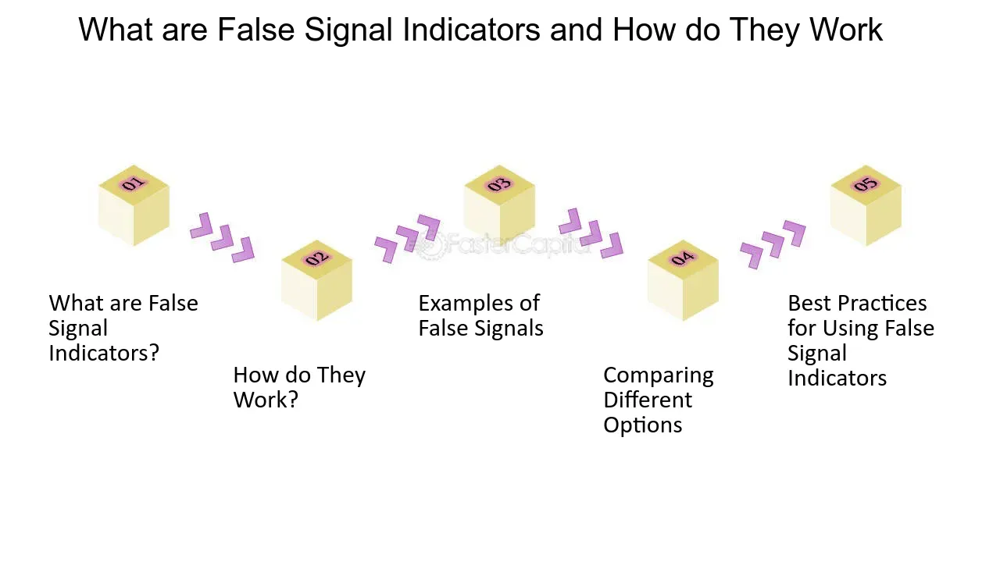

## Table of Contents

## What is a false signal?

A false signal is when something seems to be true or important, but it's not. It can trick people into thinking something is happening when it's not. For example, in the stock market, a false signal might make people think a stock's price will go up, but it actually goes down.

False signals can happen in many places, like science, technology, and everyday life. They can cause problems because people might make wrong choices based on them. It's important to check information carefully to avoid being fooled by false signals.

## How does a false signal differ from a true signal?

A false signal is like a trick. It looks real and important, but it's not. It can make people think something is happening when it's not. For example, if you see a shadow and think it's a person, but it's just a tree, that's a false signal. False signals can lead people to make wrong choices because they believe something that isn't true.

A true signal, on the other hand, is real and accurate. It gives correct information about what is happening. For example, if you see smoke and there's actually a fire, that's a true signal. True signals help people make good decisions because they show what is really going on. It's important to tell the difference between false and true signals to avoid mistakes.

## What are common causes of false signals?

False signals can happen because of mistakes or on purpose. Sometimes, people or machines make errors. For example, a weather sensor might be broken and show the wrong temperature. This can trick people into thinking it's colder or hotter than it really is. Also, in the stock market, a computer might read the data wrong and show a price that's not real. These mistakes can lead to false signals that confuse people.

Other times, false signals are made on purpose to trick people. For example, someone might spread fake news to make others believe something that isn't true. In technology, a hacker might send a false signal to a computer to steal information. These kinds of false signals can be very harmful because they are meant to deceive people and can cause big problems.

Understanding why false signals happen can help us be more careful. We need to check our information and think critically to avoid being fooled. Whether it's a mistake or done on purpose, knowing about false signals can help us make better choices and stay safe.

## In what contexts are false signals most likely to occur?

False signals often happen in financial markets. People and computers look at a lot of information to decide if they should buy or sell stocks. Sometimes, the information can be wrong or misunderstood. For example, a computer might read data wrong and show a stock price that's not real. This can trick people into buying or selling at the wrong time. It's important for people in the stock market to check their information carefully to avoid these false signals.

False signals also happen a lot in technology and communication. For example, a sensor might be broken and give the wrong information. If a weather sensor says it's going to rain when it's actually sunny, that's a false signal. Also, hackers can send false signals to trick computers and steal information. In everyday life, false signals can come from fake news or rumors. People need to think carefully about what they see and hear to avoid being fooled by these false signals.

## How can false signals impact decision-making processes?

False signals can mess up decision-making by making people think something is true when it's not. For example, if a weather report says it's going to rain, but it's actually going to be sunny, people might decide to stay inside or cancel plans. This can lead to missed opportunities and wasted time because people made choices based on wrong information. In the stock market, a false signal about a stock's price can make people buy or sell at the wrong time, leading to financial losses.

False signals can also cause big problems in important situations. In medicine, if a test gives a false positive, doctors might think a patient is sick when they're not. This can lead to unnecessary treatments and stress for the patient. In technology, a false signal from a security system might make people think there's a break-in when there isn't. This can cause panic and wasted effort as people respond to something that's not real. Checking information carefully can help avoid these problems and make better decisions.

## What are some examples of false signals in everyday life?

False signals happen a lot in everyday life. For example, you might see a shadow and think it's a person, but it's just a tree. This can make you feel scared or confused for a moment. Another example is when someone spreads a rumor at school or work. You might hear that a big event is happening, but it turns out to be fake news. These false signals can make people make wrong choices or feel worried about things that aren't true.

False signals also show up in technology. Your phone might beep, making you think you got a message, but it's just a glitch. This can be annoying and distracting. In traffic, a broken traffic light might show green when it should be red, causing drivers to go when they should stop. This can lead to accidents and confusion on the road. Being aware of these false signals can help us stay calm and make better decisions in our daily lives.

## What techniques can be used to identify false signals?

One way to spot false signals is to double-check the information you get. If you hear something surprising or important, look for other sources that say the same thing. If you can't find other sources to back it up, it might be a false signal. For example, if a friend tells you about a big event happening in town, but you can't find any news about it, the information might be wrong. Also, think about who is giving you the information. If it's from someone you don't trust or a website known for fake news, be careful.

Another technique is to use common sense and think critically. If something seems too good to be true or doesn't make sense, it could be a false signal. For example, if you see an ad for a product that promises amazing results but sounds too perfect, it might be misleading. Also, pay attention to how you feel. If a piece of information makes you feel scared or confused, take a step back and think about it carefully before making a decision. By using these simple techniques, you can better spot false signals and make smarter choices.

## How do statistical methods help in distinguishing false signals?

Statistical methods help us tell the difference between false signals and real ones by looking at data in a smart way. They use numbers and patterns to figure out if something is likely to be true or just a random fluke. For example, if a weather sensor shows a sudden temperature change, [statistics](/wiki/bayesian-statistics) can help us see if this change is normal or if it's just a mistake. By looking at past data and seeing how often these changes happen, we can decide if the new reading is a false signal or something we should pay attention to.

These methods also help us understand how sure we can be about our information. They use things like confidence intervals and p-values to show how likely it is that our data is correct. If a test result in medicine shows a patient might be sick, statistics can tell us how sure we should be about that result. If the numbers say there's a high chance the result is wrong, it might be a false signal. By using these statistical tools, we can make better decisions and avoid being tricked by false information.

## What role do false signals play in financial markets?

False signals in financial markets can cause big problems. They happen when the information about a stock or the market is wrong or misunderstood. For example, if a computer reads data wrong and shows a stock price that's not real, it can trick people into buying or selling at the wrong time. This can lead to financial losses because people made choices based on wrong information. It's important for people in the stock market to check their information carefully to avoid these false signals and make better decisions.

False signals can also create a lot of confusion and panic in the market. If a false signal makes people think a stock's price will go up, but it actually goes down, it can cause a lot of people to lose money. This can make the market go up and down a lot, which can scare people and make them less likely to invest. By understanding and spotting false signals, people can stay calm and make smarter choices about their money.

## How can technology be used to minimize the occurrence of false signals?

Technology can help reduce false signals by making systems smarter and more accurate. For example, better sensors and data collection tools can give us more reliable information. If a weather sensor is more accurate, it's less likely to give a false signal about the temperature. Also, computers can use special programs to check data many times and spot mistakes. If a computer sees a strange stock price, it can compare it with other data to see if it's a false signal or not. By using technology to double-check information, we can catch false signals before they cause problems.

Another way technology helps is by using [artificial intelligence](/wiki/ai-artificial-intelligence) (AI) and [machine learning](/wiki/machine-learning). These tools can learn from past data and get better at spotting false signals over time. For example, AI can look at lots of medical test results and learn what a false positive looks like. This can help doctors know when a test result might be wrong. In the stock market, machine learning can watch how prices move and figure out when a price change is a false signal. By using technology to learn and improve, we can make our decisions based on more accurate information and avoid being tricked by false signals.

## What are the advanced algorithms used for detecting false signals in complex systems?

Advanced algorithms help us find false signals in complex systems by looking at a lot of data and finding patterns that might not be easy to see. One type of algorithm is called machine learning. It can learn from past data to tell the difference between real and false signals. For example, in the stock market, machine learning can watch how prices move and figure out when a price change is just a random fluke and not something important. This helps traders make better choices and avoid losing money because of false information.

Another type of algorithm is called anomaly detection. This one looks for things that are different from what is normal. If a sensor in a factory suddenly shows a strange reading, anomaly detection can spot it and say, "Hey, this might be a false signal." By using these algorithms, we can keep an eye on big systems and catch false signals before they cause problems. This makes our systems work better and helps us trust the information we get.

## How do false signals affect the reliability of scientific research and data analysis?

False signals can mess up scientific research and data analysis by making scientists think something is true when it's not. For example, if a test in a lab shows a result that looks important, but it's just a mistake, scientists might waste time and money studying something that isn't real. This can lead to wrong conclusions and slow down the progress of science. It's important for scientists to check their results carefully and use good methods to make sure they are looking at real signals and not false ones.

In data analysis, false signals can also cause big problems. When people analyze data, they look for patterns and trends to learn something new. But if the data has false signals, like a wrong reading from a sensor or a mistake in the numbers, it can make the analysis show things that aren't true. This can lead to bad decisions based on wrong information. By using good tools and methods to spot false signals, scientists and analysts can make their work more reliable and trustworthy.

## What are some case studies and practical examples?

In the ever-evolving landscape of trading, the application of various techniques to confirm trading signals is crucial for mitigating the effects of false signals. This section elaborates on practical strategies for enhancing signal accuracy, particularly in Forex trading and equity markets.

### Forex Trading: Combining Bollinger Bands and Fibonacci Retracement

Forex trading often deals with highly volatile currency pair movements, which can lead to frequent false signals. An effective method to enhance signal verification involves the combination of Bollinger Bands and Fibonacci retracement.

**Bollinger Bands** are a popular tool that consists of a middle band (a simple moving average) and two outer bands set at standard deviations from the mean. The formula for Bollinger Bands is:

$$
\text{BOLU} = \text{MA}(T, n) + m \times \sigma(T, n)
$$
$$
\text{BOLD} = \text{MA}(T, n) - m \times \sigma(T, n)
$$

where:
- $\text{BOLU}$ = Upper Bollinger Band
- $\text{BOLD}$ = Lower Bollinger Band
- $\text{MA}$ = Moving Average
- $T$ = Current Price
- $n$ = Number of periods
- $m$ = Number of standard deviations (typically 2)
- $\sigma$ = Standard Deviation

**Fibonacci Retracement** levels, derived from the Fibonacci sequence, help to identify potential reversal levels by calculating percentages of the price range.

Forex traders can combine these two tools to enhance signal accuracy by looking for confluence. For instance, a signal is considered more reliable if a currency pair approaches a Bollinger Band level that coincides with a key Fibonacci retracement level (such as 61.8% or 38.2%).

### Equity Markets: Using Sentiment Analysis Tools

The equity markets are influenced heavily by news, which can often lead to false signals due to rapid, sentiment-driven price movements. Sentiment analysis tools provide an effective method for mitigating these effects by processing large volumes of text from financial news and social media to gauge market sentiment.

Sentiment analysis can be applied programmatically to trading by using Python libraries such as Natural Language Toolkit (NLTK) or TextBlob. These tools can analyze the polarity and subjectivity of news articles as follows:

```python
from textblob import TextBlob

def analyze_sentiment(text):
    # Create a TextBlob object
    blob = TextBlob(text)
    # Get the polarity and subjectivity
    return blob.sentiment.polarity, blob.sentiment.subjectivity

news_article = "The recent earnings report shows promising growth and has excited the investors."
polarity, subjectivity = analyze_sentiment(news_article)
print(f"Polarity: {polarity}, Subjectivity: {subjectivity}")
```

A positive polarity suggests positive sentiment, while high subjectivity indicates a more opinion-based piece, which may be less reliable for decision-making. Traders can utilize sentiment scores to gauge market mood and filter out noise by considering sentiment thresholds before executing trades. This approach reduces the likelihood of overreacting to news and enhances the robustness of trading signals. 

By applying these methodologies in Forex and equity markets, traders can better navigate false signals and improve the precision of their trading strategies.

## References & Further Reading

[1]: Bergstra, J., Bardenet, R., Bengio, Y., & Kégl, B. (2011). ["Algorithms for Hyper-Parameter Optimization."](https://dl.acm.org/doi/10.5555/2986459.2986743) Advances in Neural Information Processing Systems 24.

[2]: ["Advances in Financial Machine Learning"](https://www.amazon.com/Advances-Financial-Machine-Learning-Marcos/dp/1119482089) by Marcos Lopez de Prado

[3]: ["Evidence-Based Technical Analysis: Applying the Scientific Method and Statistical Inference to Trading Signals"](https://www.amazon.com/Evidence-Based-Technical-Analysis-Scientific-Statistical/dp/0470008741) by David Aronson

[4]: ["Machine Learning for Algorithmic Trading"](https://github.com/stefan-jansen/machine-learning-for-trading) by Stefan Jansen

[5]: ["Quantitative Trading: How to Build Your Own Algorithmic Trading Business"](https://www.amazon.com/Quantitative-Trading-Build-Algorithmic-Business/dp/1119800064) by Ernest P. Chan