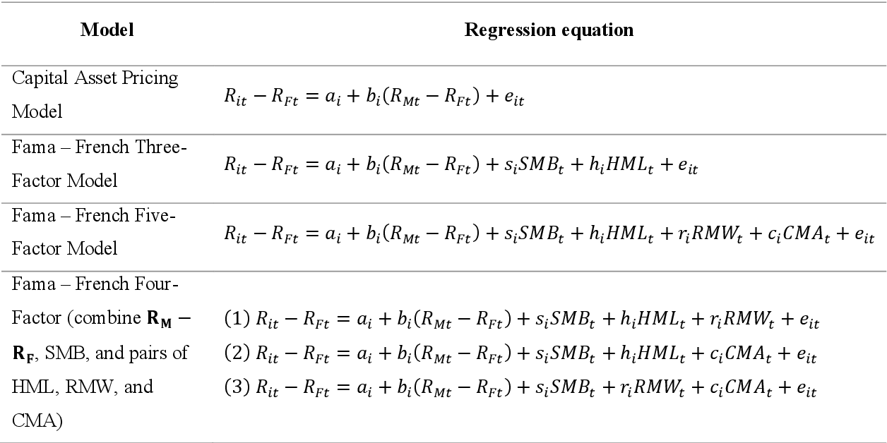

The Fama French 5 Factor Model is an extension of the original 3-factor model, which was developed by Eugene F. Fama and Kenneth R. French in the early 1990s. The original model expanded on the Capital Asset Pricing Model (CAPM) by adding two factors—size and value—to the market risk factor. It was an influential advancement, significantly improving the explanation of portfolio returns.

Over time, however, the 3-factor model began to show limitations, particularly in explaining the anomalies in stock returns that were not accounted for by market risk, company size, or book-to-market value ratios. The 5-factor model, introduced by Fama and French in a 2014 paper, aimed to address these limitations by adding two additional factors: profitability, measured by robust minus weak (RMW), and investment patterns, measured by conservative minus aggressive (CMA).

The inclusion of these two new factors allows the model to capture the variance in returns due to differences in companies' profitability and investment approaches. Profitable firms tend to have higher returns than less profitable ones, and firms that invest conservatively have different return profiles compared to those investing aggressively.

In contemporary financial analysis, the 5-factor model offers a more comprehensive framework for evaluating investment returns. It's particularly relevant for portfolio construction and risk assessment in equity markets. Asset managers and academic researchers alike use the model to dissect the complexities of returns, laying the groundwork for more informed investment decisions.

The model's robustness across different time periods and markets emphasizes its significance and demonstrates its superior predictive power compared to the 3-factor model. It's widely regarded as a cornerstone of modern financial theory and remains a focal point for asset pricing research and practice[1][2].

## Table of Contents

## Historical Context

The Fama French 5 Factor Model is anchored in the pursuit to explain and predict stock returns more accurately. This pursuit began with the CAPM, which posited that the expected return of a security is proportional to its systematic risk or market risk. However, empirical tests led by Fama and French suggested that CAPM's market risk [factor](/wiki/factor-investing) alone was not sufficient to explain the cross-section of expected returns.

In their seminal 1993 study, Fama and French expanded CAPM with two additional factors—size and value—after observing that smaller companies (small-cap stocks) and companies with high book-to-market ratios (value stocks) tended to outperform the market on a regular basis. This model became known as the 3-factor model, providing a more nuanced framework that better captured the compl[exit](/wiki/exit-strategy)y of stock returns.

Despite its advancements, the 3-factor model had its shortcomings. It failed to account for anomalies such as the [momentum](/wiki/momentum) effect and neglected the role of profitability and investment choices of firms. Fama and French responded to these gaps with a more encompassing model, which was first introduced in their working paper “A Five-Factor Asset Pricing Model” in 2014.

This new model retained the original factors but introduced two additional dimensions: profitability, which is the company’s gross profits relative to its assets, and investment, measured by the company’s asset growth rate. The addition of these factors was motivated by the empirical observation that companies with high profitability and conservative investment strategies tended to yield higher returns.

The Fama French 5 Factor Model doesn't merely expand the dimensionality of the risk-return profile but provides a framework that resonates with the intuitive strategies of investors. For instance, the market has long rewarded firms with solid profits and prudent investment strategies—an empirical reality now captured in the model.

The historical path from CAPM to the 5-factor model marks a continuous effort in financial economics to refine the tools for asset pricing. By doing so, Fama and French have not only contributed a framework for academic inquiry but have also armed practitioners with refined lenses through which to view market movements and inform investment decisions.

## The Five Factors Explained

The Fama French 5 Factor Model expands upon the traditional three-factor model by adding two additional factors aimed at providing a more comprehensive explanation of stock returns. Below is an elucidation of each factor:

**Market Risk:** This factor, often denoted as the market excess return, is the return of a broad market index over the risk-free rate. It represents the compensation investors require for taking on the higher risk associated with equity market investments, as opposed to risk-free assets such as government bonds.

**Size (SMB - Small Minus Big):** SMB stands for Small Minus Big, capturing the historical excess returns of small-cap stocks over big-cap stocks. The size effect posits that, on average, small-cap companies tend to outperform large-cap companies over long periods, providing investors with a premium for the higher risk associated with smaller firms' equities.

**Value (HML - High Minus Low):** HML represents the difference in returns between stocks with high book-to-market ratios (value stocks) and those with low book-to-market ratios (growth stocks). Value stocks have historically been associated with higher returns compared to growth stocks, indicative of a value premium in the market.

**Profitability:** This factor is a measure of a firm's profitability, taken as the difference between the returns of companies with robust profits and those with weaker profits. Companies that are more profitable are typically able to generate higher returns for investors, leading to the inclusion of this factor in the model.

**Investment Patterns:** The investment factor distinguishes between firms that invest conservatively and those that invest aggressively. Historically, companies with conservative investment patterns tend to have better returns than those that invest aggressively.

Each of these factors is quantified and utilized in the model's mathematical framework to explain the differences in returns across various portfolios. The coefficients related to these factors are estimated through regression analyses, where the excess returns on a portfolio are regressed on the factors.

This multifaceted approach allows for a more nuanced analysis of the determinants of equity returns, enabling investors and financial analysts to better gauge expected returns by considering diverse risk dimensions beyond the market risk.

## Why Five Factors?

The progression from the Fama French 3-factor to the 5-factor model is rooted in the pursuit of a more comprehensive framework for understanding stock returns. The 3-factor model, which included market risk, size, and value, was groundbreaking in its time for moving beyond the single-factor CAPM model. However, as the breadth of empirical financial research expanded, certain limitations of the 3-factor model came to light, particularly its inability to fully explain the variations in stock returns.

One significant limitation was that the 3-factor model occasionally fell short when it came to accounting for anomalies in stock returns that were not associated with size and value. For instance, research indicated that stocks of companies with high profitability tended to outperform those with low profitability, regardless of their size or book-to-market characteristics. This finding was not adequately captured by the 3-factor model.

Furthermore, investment patterns also emerged as an influential aspect of return profiles. Companies that were more conservative in their investment strategy (investing less relative to their assets) seemed to achieve better returns than those that invested more aggressively, which also wasn't explained by the original three factors.

Incorporating profitability allowed the 5-factor model to adjust for the higher expected returns from stocks of profitable firms, which is consistent with the rationale that more profitable companies should provide higher returns to their shareholders. The investment factor, on the other hand, addressed the tendency for companies with conservative investment strategies to be undervalued, offering investors higher expected returns as a result.

By addressing these nuances, the 5-factor model offered a more holistic understanding of stock returns by taking into account a wider array of systematic risk factors that affect a stock's performance. This expansion of factors improved the model's explanatory power and made it more relevant for the analysis of portfolios that could be affected by variables beyond the scope of the original 3-factor model.

## Methodology & Mathematical Framework

The Fama French 5 Factor Model extends the traditional 3-factor model by adding two additional factors to better explain stock returns. The mathematical framework of the model is a linear regression that is used to explain the returns of a portfolio or a stock with the returns of the five factors.

Here’s a breakdown of the equations and methodologies:

**Market Risk (Market Premium)**

$R - R_f = \beta_{mkt}(R_{mkt} - R_f)$

- Where $R$ is the expected portfolio return, $R_f$ is the risk-free rate, and $R_{mkt}$ is the return of the market portfolio.
- $\beta_{mkt}$ is the sensitivity of the expected excess return to the excess return of the market.

**Size (SMB for Small Minus Big)**

$SMB = \frac{1}{2}(Small Value + Small Growth) - \frac{1}{2}(Big Value + Big Growth)$

- $SMB$ is the average return on the three small portfolios minus the average return on the three big portfolios.

**Value (HML for High Minus Low)**

$HML = \frac{1}{2}(Small Value + Big Value) - \frac{1}{2}(Small Growth + Big Growth)$

- $HML$ is the average return on the two value portfolios minus the average return on the two growth portfolios.

**Profitability**

$RMW = \frac{1}{2}(Robust Small + Robust Big) - \frac{1}{2}(Weak Small + Weak Big)$

- $RMW$ (Robust Minus Weak) represents the difference between the returns of firms with robust (high) and weak (low) operating profitability.

**Investment Patterns**

$CMA = \frac{1}{2}(Conservative Small + Conservative Big) - \frac{1}{2}(Aggressive Small + Aggressive Big)$

- $CMA$ (Conservative Minus Aggressive) captures the difference between the returns of firms that are conservative and aggressive in their investment strategies.

The complete 5-factor model is expressed as:

$R - R_f = \beta_{mkt}(R_{mkt} - R_f) + \beta_{smb}SMB + \beta_{hml}HML + \beta_{rmw}RMW + \beta_{cma}CMA + \alpha$

- Where $\beta_{smb}$, $\beta_{hml}$, $\beta_{rmw}$, and $\beta_{cma}$ are the sensitivities of the portfolio returns to the $SMB$, $HML$, $RMW$, and $CMA$ factors respectively.
- $\alpha$ represents the abnormal return of the portfolio that cannot be explained by these risk factors and is often referred to as the "alpha" of the portfolio.

Each $\beta$ coefficient is calculated using historical data and reflects the extent to which a given factor impacts the portfolio's returns. To apply this model, investors typically perform a regression analysis where they regress historical returns of a portfolio against the returns of the five factors.

For example, to calculate the expected return of a small-cap value portfolio, one would:

1. Estimate the $\beta$ coefficients for the portfolio using historical returns data.
2. Use current or expected factor returns to estimate the portfolio’s expected return.

In practice, this model allows investors to decompose returns and attribute performance to the different risk factors. It is widely used for portfolio construction, performance attribution, and risk management. This model is also frequently applied in academic research to test market efficiency and other asset pricing phenomena.

## Real-world Application & Case Studies

The Fama French 5 Factor Model is applied across various domains of finance, demonstrating its versatility and robustness in explaining stock returns and aiding in the construction of diversified portfolios.

**Asset Pricing**

Asset pricing, at its core, involves determining the intrinsic value of investment instruments. The Fama French model is instrumental in deciphering the expected returns of stocks by considering the exposure to the five factors, thus guiding investors on whether a stock is undervalued or overvalued compared to its ‘true’ value as explained by these risk factors.

**Portfolio Management**

In portfolio management, the model is used to enhance portfolio construction by identifying which factors are currently rewarded by the market and to what degree. For instance, a portfolio manager might tilt a portfolio towards small-cap value stocks if historical and current data suggest that SMB and HML are providing higher returns. The model’s ability to dissect portfolio performance into these factors also helps managers in conducting performance attribution to understand which decisions contributed most to the portfolio's performance.

**Financial Analysis**

Financial analysts employ the Fama French model to identify the risks that are most influential in the returns of certain stocks or industries. This can influence recommendations for stock selections or sector weighting in an investment strategy.

**Case Studies**

One case study involves the analysis of mutual fund performance. An examination of a mutual fund’s returns using the 5 Factor Model can reveal how much of its performance can be attributed to smart stock-[picking](/wiki/asset-class-picking) skills (alpha) and how much to exposure to the model's factors. In several instances, funds that appeared to have significant alpha under a CAPM or even a 3-factor analysis were found to have their returns fully explained by the 5-factor model, indicating that returns were due to factor exposures rather than manager skill.

Another practical application can be seen in smart beta strategies which involve creating indices that are weighted not by market cap, but by one or more of the factors in the Fama French model. For instance, a smart beta [ETF](/wiki/etf-trading-strategies) might track an index of companies that score highly on the SMB and HML factors, thus aiming to capture those specific risk premia.

Moreover, financial consultants use the model to tailor investment strategies to an investor’s risk preferences. For instance, an investor who is risk-averse may prefer investments that have low market risk (low beta) and are skewed towards high profitability and conservative investment patterns.

## Comparative Analysis with Other Models

The Fama French 5 Factor Model stands as a landmark in asset pricing theory, and to appreciate its significance, it's critical to consider it alongside other prevalent models in finance.

**Capital Asset Pricing Model (CAPM)**

The CAPM, grounded in the work of Sharpe, Lintner, and Mossin during the 1960s, posits that the expected return on a security is a function of its systemic risk as measured by beta. It suggests that only market risk should explain the returns, a perspective that was both pioneering and simplifying.

| Aspect | Description |
| --- | --- |
| Strengths | The CAPM's greatest strength is its simplicity and ease of use, requiring only the calculation of a security's beta against the market to estimate expected returns. |
| Weaknesses | Its limitations are well-documented; it assumes a single source of risk (market) and ignores other factors that can affect a stock's return. |
| Usage | CAPM is still used for its simplicity in calculating the cost of equity for capital budgeting and corporate finance decisions. |

**Arbitrage Pricing Theory (APT)**

Developed by Stephen Ross in 1976, APT is a multi-factor model that allows for various macroeconomic factors to affect asset returns. Unlike CAPM, APT does not require the market portfolio to be mean-variance efficient.

| Aspect | Description |
| --- | --- |
| Strengths | APT is more flexible than CAPM as it can accommodate multiple factors that might influence returns, making it potentially more applicable to various market conditions. |
| Weaknesses | Its main drawback is that it doesn't specify which factors to use, leaving it up to the user to decide, which can lead to inconsistent results. |
| Usage | APT is employed in more sophisticated asset pricing environments, especially where the investment universe is large and potentially influenced by several factors. |

**Multifactor Extensions of CAPM**

The Fama French 3-factor model, which added size and value factors to the market risk of CAPM, was a significant improvement over CAPM, addressing some of its empirical shortcomings.

APT is employed in more sophisticated asset pricing environments, especially where the investment universe is large and potentially influenced by several factors.

---

| Aspect | Description |
| --- | --- |
| Strengths | This model increased the explanatory power of the asset returns over CAPM, recognizing the impact of a firm's size and book-to-market ratio. |
| Weaknesses | Despite its advancements, it still left out relevant aspects affecting asset prices, such as profitability and investment patterns, which led to the development of the 5-factor model. |
| Usage | The 3-factor model is widely adopted for academic research and by practitioners who seek more nuance than CAPM but less complexity than the 5-factor model. |

**Fama French 5 Factor Model**

This model extends the 3-factor model by adding two more factors – profitability and investment patterns – into the framework.

| Aspect | Description |
| --- | --- |
| Strengths | The 5-factor model covers more ground in explaining stock returns, incorporating the effects of profitability (quality of profits) and investment (conservatism in investment) alongside size, value, and market risk. |
| Weaknesses | Despite its comprehensiveness, there's debate about the independence and relevance of each factor, particularly the value factor in recent times. |
| Usage | It's applied in advanced portfolio construction, performance attribution, and is a benchmark in academic studies exploring stock return behaviors. |

In summary, the choice of model often hinges on the balance between simplicity and explanatory power. CAPM, with its single-factor approach, offers ease but lacks breadth. APT and multi-factor CAPM extensions introduce more complexity but also more realism. The Fama French 5 Factor Model achieves a strong balance, offering deep insights into return patterns at the cost of increased complexity. Practitioners often make their choice based on the specific context of their analysis, the size and complexity of the investment universe, and the depth of information required.

## Model Performance and Validation

The Fama French 5 Factor Model has been subjected to rigorous empirical testing since its inception, with numerous studies validating its explanatory power over asset returns. For instance, Fama and French's own 2015 paper, "A five-factor asset pricing model," published in the Journal of Financial Economics, extended their previous work by incorporating profitability and investment factors into their original 3-factor model, finding that these additional factors capture a significant proportion of the variation in average returns, especially for stocks that do not pay dividends.

Empirical tests, such as those by Hou, Xue, and Zhang in their 2015 paper "Digesting Anomalies: An Investment Approach," published in the Review of Financial Studies, have supported the 5-factor model's performance. They found that the model explains most anomaly returns and thus performs better than the 3-factor model in capturing the cross-section of average returns[3].

Regarding the criticism that the "HML" (high minus low) factor, which accounts for value premiums, is redundant in the presence of the "CMA" (conservative minus aggressive) investment factor, recent studies offer a nuanced view. Critics argue that the proliferation of smart beta strategies targeting value stocks may have [arbitrage](/wiki/arbitrage)d away the value premium, challenging the factor's effectiveness. However, research by Fama and French themselves has responded to such claims by testing international markets, as detailed in their 2017 paper "International Tests of a Five-Factor Asset Pricing Model," which found the HML factor to be robust across major regions and sectors.

Another validation of the HML factor's continued relevance comes from the analysis of market cycles. A 2016 paper by Barillas and Shanken, "Which Alpha?," in the Journal of Financial Economics, shows that while the value factor's premiums can be sporadic, over long horizons, it remains a significant predictor of returns.

Furthermore, a working paper by Fama and French, "Choosing Factors," posted on SSRN in 2018, examines the predictive power of various factors and concludes that the HML factor cannot be easily dismissed as redundant. They assert that when combined with the other four factors—market risk, size, profitability, and investment—the five-factor model provides a more comprehensive tool for asset pricing[4].

In practice, the Fama French 5 Factor Model's performance has also been validated by its adoption in the investment management industry, where it is used to design portfolios and benchmark performance. Investment firms, such as Dimensional Fund Advisors, actively employ the model in constructing enhanced index funds that aim to capture these risk premia for their clients.

While critiques of the model persist, the preponderance of empirical evidence suggests that the five-factor model offers a robust framework for understanding asset prices. Its refinement over the 3-factor model has improved the empirical fit and deepened the financial community's comprehension of the multifaceted nature of stock returns.

## Recent Advancements and Criticisms

Recent advancements in the Fama French 5 Factor Model largely revolve around the ongoing debate regarding its efficacy and adaptability to changing market conditions. One significant update to the model was the inclusion of two additional factors—profitability (RMW: robust minus weak) and investment (CMA: conservative minus aggressive)—which were integrated to address anomalies that the original 3-factor model could not fully explain.

These updates reflect the model’s responsiveness to a dynamic financial landscape and criticism that it does not account for all aspects of stock returns. For instance, the 3-factor model was scrutinized for its failure to capture the returns of stocks with high operational efficiency and conservative investment strategies, hence the addition of profitability and investment as factors to remedy this.

Fama and French continue to refine their model in response to empirical challenges. They’ve conducted extensive back-testing on international markets, demonstrating the global applicability of the 5-factor model. This expansion can be seen in their 2017 study, "International Tests of a Five-Factor Asset Pricing Model," where the model's effectiveness was observed across diverse markets, reinforcing its robustness[5].

Criticisms remain, notably concerning the model's complexity and the diminishing returns to adding factors beyond the original three. Some researchers argue that with each additional factor, the incremental explanatory power decreases, raising the question of whether the complexity of the 5-factor model is justified. The counterargument to this, as found in Fama and French's research, is that each factor addresses different dimensions of risk and collectively they improve the model’s explanatory power.

Another criticism is the model's applicability in the face of rapid advancements in machine l[earning](/wiki/earning-announcement) and big data analytics. Detractors suggest that the model, being linear and factor-based, may not capture more complex market dynamics that non-linear models or [machine learning](/wiki/machine-learning) algorithms could potentially uncover. In response, there have been efforts to integrate Fama-French factors into more complex statistical models, leveraging machine learning to enhance predictive performance while still maintaining the theoretical underpinnings of the original factors.

Additionally, with the advent of environmental, social, and governance ([ESG](/wiki/esg-investing)) investing, questions arise about the model’s ability to account for such non-financial factors that are becoming increasingly material to company performance and stock pricing. Some recent studies have started to look into how ESG considerations can be integrated with the Fama French model, but this is still an area ripe for further research.

The Fama French model, thus, continues to evolve, with adaptations that reflect changes in the market and the introduction of new data analysis techniques. The balance between maintaining the model’s original academic rigor while incorporating new insights from data-driven methods is an ongoing process that will likely keep the model relevant in academic and applied contexts.

## Conclusion

The Fama French 5 Factor Model remains a cornerstone in understanding and predicting stock returns. Its relevance endures in the academic sphere and among practitioners due to its robustness in explaining the cross-section of returns. In essence, the model enhances the capital asset pricing model (CAPM) by factoring in size and value effects, which CAPM fails to address, and further adding profitability and investment patterns to capture a broader spectrum of return dynamics.

Despite the emergence of alternative models, the 5 Factor Model's integration of risk and behavioral finance insights grants it continued significance in portfolio construction and risk assessment. The adaptability of the model has been demonstrated in various empirical studies, indicating its effectiveness across different time periods and international markets.

Looking forward, the model's relevance is expected to be sustained by its adaptability. As financial markets evolve, the model can be adjusted to include other factors such as momentum, which Fama and French have acknowledged, or even ESG factors, which are becoming increasingly significant. The challenge will be to balance model complexity with practical utility, ensuring that any additional factors contribute meaningful explanatory power without overfitting.

Furthermore, the integration of the model with burgeoning fields such as machine learning presents an opportunity for future advancements. Such integrations could refine the model's predictive capabilities, potentially leading to more nuanced and dynamic asset pricing tools.

In summary, the Fama French 5 Factor Model's deep roots in empirical research, combined with its capacity for modification, ensure its ongoing relevance. Its theoretical rigor and practical utility make it likely to remain a fixture in finance, even as it evolves in response to new data, technologies, and market phenomena.

## References & Further Reading

[1]: Fama and French’s 2014 paper "[A Five-Factor Asset Pricing Model](https://www.sciencedirect.com/science/article/abs/pii/S0304405X14002323)" published in the Journal of Financial Economics

[2]: Fama and French’s 1992 paper "[The Cross-Section of Expected Stock Returns](https://www.jstor.org/stable/2329112)" published in The Journal of Finance

[3]: ["Digesting Anomalies: An Investment Approach"](https://academic.oup.com/rfs/article/28/3/650/1574802), Hou, Xue, and Zhang 2015 paper 

[4]: ["Choosing Factors"](https://www.sciencedirect.com/science/article/abs/pii/S0304405X18300515) SSRN in 2018

[5]: ["International Tests of a Five-Factor Asset Pricing Model"](https://www.sciencedirect.com/science/article/abs/pii/S0304405X1630215X), 2017