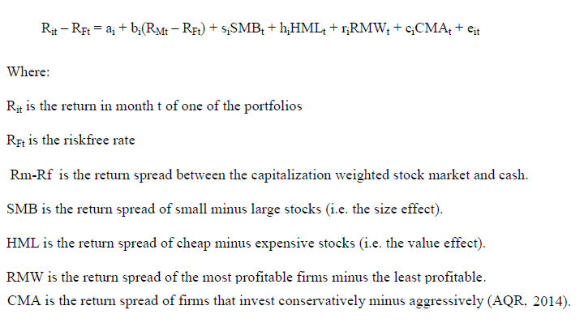

In the ever-evolving world of algorithmic trading, numerous models have been developed to enhance the prediction and assessment of stock returns. Among these, the Fama-French 5 Factor Model has gained considerable prominence. Building on the foundation of the earlier 3-factor model, the Fama-French 5 Factor Model incorporates five distinct factors to create a comprehensive framework for understanding stock returns: market risk, size, value, profitability, and investment patterns. These factors offer a multidimensional perspective on the drivers of asset returns, making the model an important tool in both academic research and practical trading applications.

This article aims to explore the theoretical underpinnings, practical applications, and significance of the Fama-French 5 Factor Model within algorithmic trading. It will look into the historical evolution leading to the model's formulation, provide a detailed explanation of its constituent factors, and evaluate its relevance to contemporary trading strategies. Moreover, it will compare the Fama-French 5 Factor Model with other asset pricing models, highlighting its distinctive advantages and addressing any recent advancements or criticisms.

The insights offered here aim to serve both traders seeking to refine their algorithmic trading strategies and academic researchers aiming to deepen their understanding of stock return dynamics. By investigating this model's comprehensive approach to risk factors, participants in the financial markets can better navigate the complexities of asset pricing and portfolio management.

## Table of Contents

## Historical Context

The pursuit of accurately predicting stock returns has led to the evolution of various models, starting with the Capital Asset Pricing Model (CAPM). CAPM, developed in the early 1960s, provides a foundational framework by suggesting that the expected return on a security is proportional to its market risk, as measured by beta. Although influential in the field of finance, CAPM has limitations, notably its reliance on a single risk factor, which often fails to capture the complexity of stock return behaviors observed in real markets.

To address these limitations, Eugene F. Fama and Kenneth R. French introduced the three-factor model in the early 1990s. This model expanded CAPM by adding two additional factors: size and value. Specifically, it incorporates the size factor (Small Minus Big, SMB) to account for the tendency of smaller firms to achieve higher returns compared to larger ones, and the value factor (High Minus Low, HML), which reflects the superior performance of stocks with high book-to-market ratios over those with low ratios. Despite the improvements and better explanatory power offered by the 3-factor model, it still fell short in accounting for several anomalies and variations in stock returns.

In response to its shortcomings, Fama and French further expanded their model in 2014 by introducing the five-factor model. This iteration aimed to enhance the explanatory power by including two more factors: profitability (Robust Minus Weak, RMW) and investment (Conservative Minus Aggressive, CMA). The profitability factor considers the difference in returns between firms with higher profitability and those with lower profitability, while the investment factor addresses the return disparities tied to firms' investment strategies, examining the impact of conservative versus aggressive investment behavior on stock returns.

This development marked a significant milestone in asset pricing theory, as it addressed gaps left by previous models and improved investors' ability to decompose returns into distinct risk dimensions. The introduction of profitability and investment factors provided a richer analytical framework for understanding the various drivers impacting asset prices. Consequently, the Fama-French 5 Factor Model has become an essential tool for researchers and practitioners seeking better forecasts and analyses of stock return dynamics.

## The Five Factors Explained

The Fama-French 5 Factor Model identifies five key variables that explain stock returns. These factors build on the foundation of the Fama-French 3 Factor Model, providing a more comprehensive understanding by examining additional dimensions of company behavior and market performance.

**Market Risk**: Often represented by the market beta (β), this factor is based on the Capital Asset Pricing Model (CAPM) and measures the sensitivity of a stock's returns to movements in the overall market. Investors require compensation for the systemic risk inherent in the market, which impacts all stocks. The equation for this factor is typically expressed as $R_m - R_f$, where $R_m$ is the market return, and $R_f$ is the risk-free return.

**Size (SMB - Small Minus Big)**: This factor captures the size effect, which suggests that smaller companies tend to outperform larger ones. It is calculated by taking the difference in returns between small-cap and large-cap stocks:  
$$
\text{SMB} = R_s - R_b \]  
where $R_s$ is the return on a portfolio of small-cap firms and $R_b$ is the return on a portfolio of large-cap firms. This factor reflects market capitalization considerations.

**Value (HML - High Minus Low)**: The value factor accounts for the contrasting returns between value stocks and growth stocks. Value stocks, often characterized by high book-to-market ratios, have been observed to earn higher average returns than growth stocks with low book-to-market ratios. This factor is calculated as:  
$$
\text{HML} = R_h - R_l \]  
where $R_h$ represents the returns on high book-to-market stocks, and $R_l$ represents the returns on low book-to-market stocks.

**Profitability (RMW - Robust Minus Weak)**: Profitability examines the differential returns based on the financial robustness of firms. More profitable companies tend to deliver higher returns compared to less profitable ones. The formula for this factor is:  
$$
\text{RMW} = R_r - R_w \]  
where $R_r$ represents the returns on firms with robust profitability, and $R_w$ represents returns on firms with weak profitability. This factor addresses anomalies overlooked by prior models.

**Investment Patterns (CMA - Conservative Minus Aggressive)**: The investment factor considers companies' reinvestment behavior, reflecting their growth strategies. Firms that invest conservatively tend to perform differently than those with aggressive investment strategies. This factor is calculated as:  
$$
\text{CMA} = R_c - R_a \]  
where $R_c$ is the return on conservatively investing firms, and $R_a$ is the return on aggressively investing firms. This variable captures the impact of differing investment styles on stock performance.

These five factors contribute to a nuanced understanding of stock returns, facilitating an improved asset pricing model for financial analysis and strategy development.

## Why Five Factors?

The development from the Fama-French 3-[factor](/wiki/factor-investing) model to the 5-factor model was primarily driven by the need for a model that could more adequately explain variations in stock returns by considering a broader range of risk dimensions. The original Fama-French 3-factor model, which incorporated market risk, size, and value factors, often fell short in accounting for certain persistent anomalies. Among these anomalies were the [momentum](/wiki/momentum) effect—a pattern where stocks that have performed well in the past continue to do so—and variations in returns attributable to company-specific factors like profitability and investment strategies. 

The introduction of the 5-factor model in 2014 by Eugene F. Fama and Kenneth R. French addressed these limitations by introducing two additional factors: profitability and investment. The model's profitably factor (RMW—Robust Minus Weak) accounts for the return differential between companies with robust versus weak operating profitability. The investment factor (CMA—Conservative Minus Aggressive) considers how companies' varying investment behaviors influence stock returns, differentiating firms with conservative investment practices from those with aggressive growth strategies.

By integrating these extra dimensions, the 5-factor model better captures the complex dynamics influencing asset returns, making it a more comprehensive tool for both investors seeking to diversify portfolios and researchers examining asset pricing. The model's enhanced explanatory power enables a more nuanced assessment of systematic risk factors, translating into improved investment decision-making and risk management processes. 

The 5-factor model represents a move towards capturing a more holistic picture of market forces and firm characteristics influencing stock performance, thereby facilitating more strategic allocation of assets and anticipation of market trends.

## Methodology & Mathematical Framework

The Fama-French 5 Factor Model is grounded in a linear regression framework designed to elucidate portfolio returns through five distinct factors: market risk, size, value, profitability, and investment patterns. The foundational equation of the model is expressed as:

$$
R - R_f = \beta_{\text{mkt}}(R_m - R_f) + \beta_{\text{smb}}\text{SMB} + \beta_{\text{hml}}\text{HML} + \beta_{\text{rmw}}\text{RMW} + \beta_{\text{cma}}\text{CMA} + \alpha
$$

Where:
- $R$ denotes the portfolio return.
- $R_f$ signifies the risk-free rate, often derived from government bond yields.
- $R_m$ represents the return of the market portfolio.
- $\text{SMB}$ (Small Minus Big) captures the size factor, defined by the return differential between small-cap and large-cap stocks.
- $\text{HML}$ (High Minus Low) signifies the value factor, indicating the return spread between value stocks and growth stocks.
- $\text{RMW}$ (Robust Minus Weak) considers profitability by examining the return disparity between firms with robust and weak profitability metrics.
- $\text{CMA}$ (Conservative Minus Aggressive) analyzes differences in returns based on companies’ investment strategies, typically contrasting conservative with aggressive investment approaches.
- $\alpha$ represents the model's intercept or alpha, which captures any excess return not explained by the factors.
- $\beta$ coefficients measure the sensitivity of the portfolio to each respective factor, calculated using regression analysis.

The essence of this model lies in its capacity to decompose the returns of a portfolio into contributions from these five factors. By doing so, it aids in understanding the extent to which each factor contributes to overall performance, beyond what can be attributed to market movements alone.

In practice, this model serves several objectives, such as enhancing portfolio construction strategies and reinforcing risk management protocols. By identifying the sensitivities (betas) to each factor, investors can tailor their portfolios to take advantage of specific risk premiums or balance out undesired exposures. The Fama-French 5 Factor Model thus provides a nuanced tool for understanding and navigating the complexities of financial markets.

## Real-world Application & Case Studies

The Fama-French 5 Factor Model has become a crucial instrument in asset pricing, portfolio management, and financial analysis. Asset management firms deploy this model to craft portfolios that take advantage of the risk premia associated with its five factors: market risk, size, value, profitability, and investment patterns. By understanding these factors, firms can achieve better diversification, thereby enhancing returns and managing risks more effectively.

In asset pricing, the model aids in comprehending how different securities are priced relative to these risk factors, thereby providing a more comprehensive picture than traditional models like CAPM. This enables practitioners to identify undervalued or overvalued stocks by examining their specific factor loadings, leading to more informed investment decisions.

The model's utility extends to dissecting mutual fund performance, offering a framework to evaluate fund managers' skill based on factor exposures rather than raw return data. Investors can isolate how much of a fund’s performance can be attributed to specific factors, providing a clearer picture of returns driven by systematic risk versus those achieved through active management.

Smart beta strategies, which seek to outperform traditional market cap-weighted indices, also benefit from the Fama-French model by leveraging its factors to construct portfolios that target enhanced risk-adjusted returns. For instance, a strategy focusing on the value factor might invest more heavily in undervalued stocks, expecting to capitalize on the historical value premium advantage.

By analyzing factor exposures in portfolios, traders and investors can refine their asset allocation strategies. Understanding which factors are contributing most to a portfolio's returns allows for adjustments that can optimize performance in light of shifting market conditions or investment objectives. This aspect of the model is critical for dynamic strategy optimization, where real-time adjustments based on factor performance can lead to improved outcomes.

In summary, the Fama-French 5 Factor Model serves not only as a theoretical framework but also as a practical tool for driving investment strategy and performance analysis, empowering asset managers and investors to exploit structural market patterns for strategic advantage.

## Comparative Analysis with Other Models

The Fama-French 5 Factor Model offers a comprehensive approach to analyzing stock returns by incorporating multiple risk dimensions, unlike the simpler Capital Asset Pricing Model (CAPM). The CAPM, introduced by William Sharpe in the 1960s, is a single-factor model that primarily considers market risk, represented by the formula:

$$
R_i - R_f = \beta (R_m - R_f) + \alpha
$$

where $R_i$ is the expected return on the asset, $R_f$ is the risk-free rate, $R_m$ is the expected market return, and $\beta$ represents the sensitivity of the asset's returns to market returns.

In contrast, the Fama-French 5 Factor Model extends this framework by including additional factors such as size, value, profitability, and investment patterns. This allows for a more nuanced explanation of asset returns, capturing variations that the CAPM might overlook.

The Arbitrage Pricing Theory (APT), another prominent model in finance, suggests that multiple factors can explain the return of an asset. However, it does not specify these factors explicitly, leaving their selection to empirical investigation. This flexibility, while useful, can lead to inconsistencies. Unlike APT, the Fama-French 5 Factor Model defines its factors clearly:

- Market risk (as in CAPM)
- Size (Small Minus Big, SMB)
- Value (High Minus Low, HML)
- Profitability (Robust Minus Weak, RMW)
- Investment (Conservative Minus Aggressive, CMA)

The predetermined nature of these factors in the Fama-French model aids in achieving consistent applications across various studies and contexts.

The transition from the Fama-French 3-factor model to the 5-factor model marked a significant advancement in asset pricing theory. The 3-factor model already expanded on CAPM by including the size and value factors, improving its ability to explain discrepancies observed in stock returns. However, the introduction of the profitability and investment factors in the 5-factor model addressed persistent anomalies such as differences in returns due to firms' profitability levels and investment decisions.

The comprehensive nature of the 5-factor model thus provides a deeper understanding of the dynamics driving asset returns, offering distinct advantages over both the CAPM and APT by clearly identifying the systematic risk factors that influence securities.

## Model Performance and Validation

Empirical assessments of the Fama-French 5 Factor Model affirm its ability to effectively capture the cross-section of average stock returns, surpassing the explanatory power of its predecessor, the 3-factor model. The primary advantage of the 5-factor model lies in its incorporation of profitability (RMW) and investment (CMA) factors, which address gaps previously unexplained by the 3-factor structure. This model's formula is:

$$
R_i - R_f = \beta_{mkt}(R_m - R_f) + \beta_{smb} \cdot SMB + \beta_{hml} \cdot HML + \beta_{rmw} \cdot RMW + \beta_{cma} \cdot CMA + \alpha
$$

where $R_i$ is the expected return of the portfolio, $R_f$ is the risk-free rate, $R_m$ is the market return, and each $\beta$ represents the factor's sensitivity. The addition of RMW and CMA aids in explaining a substantial portion of the variance in stock returns by identifying critical factors influencing performance, thus enhancing the model's robustness.

Extensive empirical studies highlight that the 5-factor model outperforms not only in explaining variances but also in identifying economically significant contributing factors across various markets. Research indicates the model's efficiency in delineating risk-adjusted returns when applied to different portfolios, supporting its practical applicability in asset management.

However, critiques persist regarding the model's complexity due to its expanded factor set and potential factor redundancy. Some critics argue that certain factors might overlap, diluting their distinct explanatory capabilities. Despite these criticisms, the model continues to be esteemed within asset pricing literature for its comprehensive approach to risk dimensions, providing valuable insights into stock return predictions. The balance between explanatory broadness and practical simplicity poses ongoing challenges and opportunities for refinement. Overall, the Fama-French 5 Factor Model remains a fundamental tool in the arsenal of modern financial analysis.

## Recent Advancements and Criticisms

The Fama-French 5 Factor Model has seen numerous advancements, particularly in its adaptability and application across international financial markets. Analysts and academic researchers have applied the model to various international contexts, proving its robustness in different economic environments. This global applicability serves to validate the model's utility beyond its initial parameters and enhances its credibility in asset pricing.

Critiques of the model often point to diminishing returns when additional factors are added beyond the original five. While the model aims to comprehensively capture multiple dimensions of risk, there is a concern that incorporating more factors could lead to overfitting. This complexity not only poses operational challenges but may also dilute the model’s explanatory power. Moreover, the integration of modern computational tools, such as [machine learning](/wiki/machine-learning), is increasingly seen as a necessary step to refine and strengthen the model's predictive capabilities. Machine learning techniques can potentially enhance factor analysis and optimize model performance by identifying nonlinear patterns that traditional linear regression might miss.

Efforts are also underway to incorporate Environmental, Social, and Governance ([ESG](/wiki/esg-investing)) parameters within the model, highlighting a shift towards more sustainable finance practices. ESG factors are becoming crucial in portfolio management as investors demand strategies that not only yield financial returns but also align with ethical and sustainability goals. By integrating ESG criteria, the Fama-French model could offer a more holistic view of risk and return, reflecting the growing importance of responsible investing.

Data-driven methods are pivotal in these advancements. With the surge in big data analytics, there's a concerted effort to leverage large datasets to fine-tune the model's factors and improve its predictive accuracy. This approach facilitates a more nuanced understanding of the economic variables driving stock returns, thereby positioning the model as an invaluable tool in contemporary finance. These advancements, coupled with ongoing critiques, ensure that the Fama-French 5 Factor Model continues to evolve, maintaining its relevance in the fast-changing landscape of financial markets.

## Conclusion

The Fama-French 5 Factor Model represents a significant advancement in the understanding of stock return dynamics by incorporating a comprehensive range of risk factors. By expanding the dimensions of risk through the integration of market risk, size, value, profitability, and investment patterns, the model provides enhanced insights into the factors driving stock performance. This multidimensional approach allows for a more accurate assessment of asset pricing, making it an essential tool for investors and financial analysts.

The model's adaptability to changing financial landscapes signifies its robustness and continuing importance. As global markets evolve and new financial instruments emerge, the Fama-French 5 Factor Model's framework remains applicable, offering flexibility in various contexts. The potential integration with emerging technologies, such as machine learning and big data analytics, further ensures its relevance in contemporary financial analysis. These technologies can refine the model's predictive capabilities, optimize factor selection, and enhance the precision of return predictions.

Ongoing advancements and critical evaluations of the model are anticipated to sustain its significance in future [algorithmic trading](/wiki/algorithmic-trading) strategies. As researchers and practitioners continue to explore new dimensions of risk and develop sophisticated computational tools, the model is likely to be augmented with additional factors and refined methodologies. This iterative process of refinement will help maintain the model's efficacy and applicability, allowing it to remain a cornerstone of asset pricing and a valuable resource for those aiming to develop and implement effective trading strategies in an increasingly complex market environment.

## References & Further Reading

[1]: Fama, E. F., & French, K. R. (2015). ["A five-factor asset pricing model."](https://www.sciencedirect.com/science/article/pii/S0304405X14002323) Journal of Financial Economics, 116(1), 1-22.

[2]: Fama, E. F., & French, K. R. (1993). ["Common risk factors in the returns on stocks and bonds."](https://people.hec.edu/rosu/wp-content/uploads/sites/43/2023/09/Fama-French-Common-risk-factors-1993.pdf) Journal of Financial Economics, 33(1), 3-56.

[3]: Carhart, M. M. (1997). ["On Persistence in Mutual Fund Performance."](https://onlinelibrary.wiley.com/doi/full/10.1111/j.1540-6261.1997.tb03808.x) The Journal of Finance, 52(1), 57-82.

[4]: French, K. R. ["Research papers on the Fama-French factors."](https://pubs.aeaweb.org/doi/pdfplus/10.1257/0895330042162430) Kenneth R. French - Data Library.

[5]: Hou, K., Xue, C., & Zhang, L. (2015). ["Digesting Anomalies: An Investment Approach."](https://academic.oup.com/rfs/article/28/3/650/1574802) Review of Financial Studies, 28(3), 650-705.

[6]: Israel, R., & Ross, A. (2015). ["Measuring factor exposures: Uses and abuses."](https://papers.ssrn.com/sol3/papers.cfm?abstract_id=2841037) The Journal of Portfolio Management, 42(5), 99-112.

[7]: Sharpe, W. F. (1964). ["Capital Asset Prices: A Theory of Market Equilibrium Under Conditions of Risk."](https://onlinelibrary.wiley.com/doi/full/10.1111/j.1540-6261.1964.tb02865.x) The Journal of Finance, 19(3), 425–442.