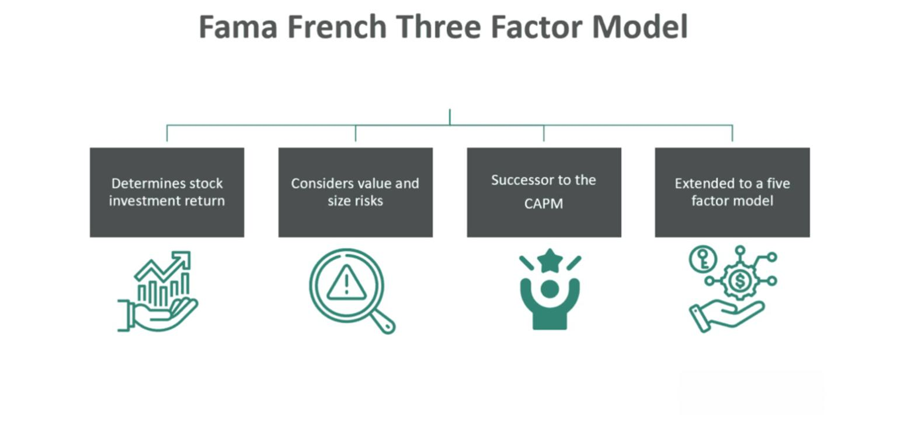

The Fama-French Three-Factor Model, developed by Eugene Fama and Kenneth French, is a pivotal framework in asset pricing that extends the basic Capital Asset Pricing Model (CAPM) by incorporating three factors: the market risk factor, the size factor (Small Minus Big, SMB), and the value factor (High Minus Low, HML). This model has become a cornerstone in understanding and predicting the cross-section of stock returns by accounting for observed anomalies in asset performance, such as the tendency for small-cap stocks and value stocks to outperform large-cap and growth stocks.

This article aims to explore the application of the Fama-French model within the context of algorithmic trading systems—a method that utilizes algorithms to automate trading decisions based on pre-defined criteria. By integrating this model, traders can potentially enhance portfolio performance by systematically identifying and exploiting statistical relationships in historical financial data. Utilizing this model within algorithmic trading enables more informed trading signals, ultimately contributing to improved trading strategies and portfolio construction.



Furthermore, the discussion will cover the theoretical underpinnings of the Fama-French model, addressing its components and the mathematical basis for its predictive capabilities. A focus will be placed on how these factors can be operationalized within an algorithmic framework to anticipate portfolio returns better. This examination will also consider the model's strengths, such as its empirical support in financial literature, and limitations, including its assumptions and reliance on historical performance data. By providing these insights, the article seeks to equip traders and financial analysts with a robust tool for enhancing stock analysis and crafting resilient trading strategies.

## Table of Contents

## Understanding the Fama-French Three-Factor Model

The Fama-French Three-Factor Model, introduced in 1992 by economists Eugene Fama and Kenneth French, enhances the Capital Asset Pricing Model (CAPM) by incorporating three crucial factors to explain stock returns more comprehensively. These additional factors are Small Minus Big (SMB), High Minus Low (HML), and the market risk [factor](/wiki/factor-investing), which together offer a more nuanced understanding of asset pricing.

The first factor, the market risk premium, as in CAPM, is the expected return of the market portfolio minus the risk-free rate and reflects the compensation investors require for taking on market risk. The second factor, SMB, is constructed by calculating the average return on three small-cap portfolios minus the average return on three big-cap portfolios. This factor accounts for the size effect, where historical data has shown that smaller companies often have higher risk-adjusted returns than larger ones.

The third factor, HML, represents the difference in returns between high book-to-market value stocks and low book-to-market value stocks. This factor captures the value effect, highlighting the propensity for value stocks, characterized by high book-to-market ratios, to outperform [growth stocks](/wiki/growth-stocks) over the long term. The economic intuition behind this factor is linked to the market's sentiment towards different stock types, wherein value stocks may be undervalued by the market compared to their fundamentals.

By considering size and value effects alongside market risk, the Fama-French model provides a robust framework for explaining a significant portion of the variations in stock returns. The empirical strength of the model lies in its ability to cover anomalies and market inefficiencies that CAPM cannot address, particularly in obligating a comprehensive cross-section of stock returns.

The model's mathematical representation can be illustrated as follows:

$$

R_i - R_f = \alpha + \beta_1 (R_m - R_f) + \beta_2 \cdot SMB + \beta_3 \cdot HML + \epsilon_i 
$$

Where:
- $R_i$ is the return on the portfolio or stock.
- $R_f$ is the risk-free rate.
- $R_m$ is the return on the market portfolio.
- $\alpha$ is the model’s intercept which represents the stock’s abnormal return.
- $\beta_1, \beta_2, \beta_3$ are the factor loadings for the respective risk factors.
- $\epsilon_i$ is the error term.

The Fama-French model's accuracy in explaining stock returns has made it an essential tool in both academic research and practical finance applications. It continues to inform investment strategies and portfolio management, promising deeper insights into the complexities of financial markets.

## Integration into Algorithmic Trading

Algorithmic trading leverages complex algorithms to automate trading decisions, allowing for improved efficiency and execution. Integrating the Fama-French Three-Factor Model into these systems offers a quantitative method to generate trading signals. This model uses three key factors: the market risk factor, SMB (Small Minus Big), which accounts for the size effect, and HML (High Minus Low), addressing the value effect in stock returns. By identifying statistical relationships through these factors, traders can develop predictive models that potentially enhance trading strategies.

An essential component of utilizing the Fama-French model in [algorithmic trading](/wiki/algorithmic-trading) is [backtesting](/wiki/backtesting). This process involves applying the model to historical data to evaluate its predictive performance and robustness. Backtesting helps determine how Fama-French factors can be effectively integrated into trading algorithms. By simulating trades over historical periods, traders can assess potential strategies and make necessary adjustments to improve performance. 

Moreover, the Fama-French model assists in constructing portfolios by identifying stocks with characteristics that have historically outperformed, such as small-cap and value stocks. This characteristic allows traders to potentially improve portfolio returns by allocating capital toward stocks that align with Fama-French factors. For example, a trading algorithm might increase the weight of assets with historically high HML values, anticipating that these will continue to generate superior returns.

The integration of the Fama-French model within algorithmic trading systems requires proficiency in data analysis and model implementation, often facilitated by programming languages such as Python. Python's extensive libraries, including pandas for data manipulation, NumPy for numerical operations, and statsmodels for statistical modeling, are invaluable when integrating this model into trading systems. 

Overall, the Fama-French Three-Factor Model offers a systematic approach to generating trading signals and constructing portfolios by leveraging historical patterns of stock returns. When carefully integrated and rigorously tested, it provides traders with a powerful tool for enhancing algorithmic trading strategies.

## Implementing the Model with Python

Python libraries such as pandas, NumPy, and statsmodels are instrumental in implementing the Fama-French Three-Factor Model for financial analysis and trading strategies. 

Pandas serves as a robust tool for handling and manipulating large datasets — a common requirement in financial modeling. By leveraging pandas, users can efficiently read, clean, and preprocess financial time series data, which are essential steps before applying any model.

```python
import pandas as pd

# Load stock data
data = pd.read_csv("stock_data.csv")

# Clean data
data.dropna(inplace=True)
```

NumPy is pivotal for performing numerical computations, which are integral to calculating the factors of the Fama-French model. Specifically, NumPy provides fast, operations on arrays which enable handling of complex mathematical operations necessary for factor computation.

```python
import numpy as np

# Example: Compute factor returns
smb = np.random.rand(len(data))  # Simulated SMB factor returns
hml = np.random.rand(len(data))  # Simulated HML factor returns
```

The statsmodels library offers advanced tools for statistical modeling that are instrumental in regression analysis, a core component of the Fama-French model. By using statsmodels, one can build regression models that incorporate the three factors: market risk premium, SMB (Small Minus Big), and HML (High Minus Low), to assess their impact on stock returns.

```python
import statsmodels.api as sm

# Example: Regression Model
X = sm.add_constant(data[['Market_Risk_Premium', 'SMB', 'HML']])
y = data['Stock_Return']
model = sm.OLS(y, X).fit()

print(model.summary())
```

Code snippets like these facilitate the setup of data pipelines for obtaining historical financial data and constructing predictive models. Running logistic regressions or other statistical analyses enables users to backtest trading strategies, evaluating their effectiveness based on historical performance. This allows traders to identify patterns and relationships that the Fama-French model suggests, providing a data-driven foundation for decision-making in trading. By harnessing the computational power of Python, one can seamlessly integrate these processes into algorithmic trading systems, thereby potentially enhancing portfolio performance through informed risk management and strategic trading actions.

## Case Study: Using the Fama-French Three-Factor Model

A practical case study illustrates the application of the Fama-French Three-Factor Model in a trading system using historical data from AT&T (ATT). This analysis aims to demonstrate the model's effectiveness compared to traditional buy-and-hold strategies. Specifically, trading strategies incorporating the model were backtested against ATT's historical stock returns to forecast future performance and identify potential stock mispricings.

The Fama-French Three-Factor Model considers three primary elements: market risk, size, and value, represented by the market risk factor, SMB (Small Minus Big), and HML (High Minus Low), respectively. These factors are used in regression analysis to predict stock returns. For ATT's stock, historical pricing data and factor returns are required inputs for these computations.

To evaluate the performance of these model-driven trading strategies, key risk-adjusted return metrics such as the Sharpe Ratio and Sortino Ratio were employed. The Sharpe Ratio, calculated as $\frac{E[R_p - R_f]}{\sigma_p}$, where $E[R_p - R_f]$ is the expected excess return of the portfolio over the risk-free rate and $\sigma_p$ is the standard deviation of the portfolio's excess return, measures the performance of the investment by adjusting for risk. Similarly, the Sortino Ratio refines this assessment by only accounting for downside [volatility](/wiki/volatility-trading-strategies), thus providing a clearer analysis of returns relative to actually experienced losses.

Python can effectively be used to optimize this analysis. Libraries such as pandas can handle data preprocessing, while NumPy facilitates numerical operations needed for calculating returns and related metrics. Statsmodels offers robust tools to run the necessary regressions and evaluate predictive accuracy.

In conducting this analysis for ATT's stock, the model's algorithmic strategies produced superior results compared to a benchmark buy-and-hold strategy. Under conducive market conditions, the model-based strategy delivered higher risk-adjusted returns, validated by elevated Sharpe and Sortino Ratios. This suggests that exploiting the historical premium attached to small-cap and value-oriented stocks, as identified by the Fama-French factors, can lead to more effective trading strategies.

In conclusion, while results can vary with different market conditions, the Fama-French Three-Factor Model's application to algorithmic trading illustrates its potential for enhancing predictive accuracy and improving financial outcomes when compared to traditional investment approaches.

## Advantages and Limitations

The Fama-French Three-Factor Model is widely regarded for its robustness in explaining stock returns. One of its primary advantages lies in its simplicity, relying on just three factors: market risk, size (Small Minus Big, SMB), and value (High Minus Low, HML). This simplicity allows for straightforward integration into various trading models, making it a popular choice among financial analysts and traders.

The three-factor model extends beyond the Capital Asset Pricing Model (CAPM) by capturing the performance differences between small-cap and large-cap stocks and between value and growth stocks. This enhanced explanatory power is one of the key reasons the Fama-French model is prominently utilized. The model is supported by a wealth of empirical evidence in financial literature, solidifying its credibility and encouraging its application in practical trading scenarios.

Despite these advantages, the Fama-French Three-Factor Model inherently possesses limitations. It operates under certain assumptions that may not fully capture the complexities of real-world market dynamics. One such assumption is that the model components remain constant over time, while in reality, market conditions and economic environments are subject to change, potentially affecting factor relevance.

Additionally, the model does not account for external influences such as macroeconomic shocks or political events, which can have profound impacts on stock returns. This potential oversight may lead to risk when traders depend heavily on the historical data utilized in the model. The axiom "past performance is not indicative of future results" aptly summarizes this limitation. Historical data assumptions can work well under stable market conditions but may falter during periods of significant economic disruption or change.

In summary, while the Fama-French Three-Factor Model provides a useful framework for understanding and predicting stock returns, practitioners should remain cautious about its limitations. It is crucial to consider additional factors and real-time data to enhance predictive accuracy and mitigate potential risks inherent in model assumptions.

## Conclusion

The Fama-French Three-Factor Model stands out as a robust framework for incorporating critical factors such as market risk, size, and value into predictive trading models. Its integration into algorithmic trading systems allows for enhanced insights into market behaviors, helping traders develop more comprehensive and effective trading strategies. By focusing on these three specific factors, the model aids in explaining the variations in stock returns that traditional models might overlook. This capability makes it a practical tool for algorithmic traders aiming to construct diversified portfolios that leverage the historical advantages of small-cap and value stocks.

Despite its notable advantages, the Fama-French model is not without its limitations. Its reliance on historical data means that it may not fully account for future market conditions or unforeseen economic factors. Thus, while it offers a more nuanced perspective on stock performance compared to models like the Capital Asset Pricing Model (CAPM), caution must be exercised to avoid over-reliance on its predictions. Traders should complement the model with additional insights and data sources to address any potential gaps.

Ongoing research and adaptation are crucial in preserving the efficacy of trading strategies based on the Fama-French Three-Factor Model. As markets evolve, continuous evaluation and refinement of the model's integration into trading systems help maintain a competitive edge. By staying informed of new developments and incorporating additional factors or modifying existing ones, traders and analysts can better exploit the model's predictive power, driving improved stock analysis and portfolio management outcomes.

## References & Further Reading

[1]: Fama, E. F., & French, K. R. (1993). ["Common risk factors in the returns on stocks and bonds."](https://people.hec.edu/rosu/wp-content/uploads/sites/43/2023/09/Fama-French-Common-risk-factors-1993.pdf) Journal of Financial Economics, 33(1), 3-56.

[2]: Carhart, M. M. (1997). ["On Persistence in Mutual Fund Performance."](https://www.jstor.org/stable/2329556) The Journal of Finance, 52(1), 57-82.

[3]: Jegadeesh, N., & Titman, S. (1993). ["Returns to Buying Winners and Selling Losers: Implications for Stock Market Efficiency."](https://www.bauer.uh.edu/rsusmel/phd/jegadeesh-titman93.pdf) The Journal of Finance, 48(1), 65-91.

[4]: ["Python for Finance: Mastering Data-Driven Finance"](https://books.google.com/books/about/Python_for_Finance.html?id=2qd9DwAAQBAJ) by Yves Hilpisch

[5]: ["Quantitative Value: A Practitioner's Guide to Automating Intelligent Investment and Eliminating Behavioral Errors"](https://www.amazon.com/Quantitative-Value-Web-Site-Practitioners/dp/1118328078) by Wesley R. Gray and Tobias E. Carlisle

[6]: ["The Econometrics of Financial Markets"](https://web.mit.edu/~alo/www/Books/efm_desc.html) by John Y. Campbell, Andrew W. Lo, and A. Craig MacKinlay

[7]: Statman, M. (1980). ["Betas Compared: Merrill Lynch Versus the Faculty."](https://www.russellsage.org/sites/all/files/Rethinking-Finance/Shefrin%20Statman%2001272012.pdf) The Journal of Portfolio Management, 6(2), 64-66.