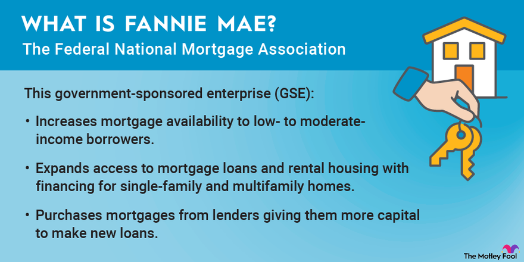

## Table of Contents

## What is Fannie Mae?

Fannie Mae, short for the Federal National Mortgage Association, is a company that helps people buy homes. It does this by buying mortgages from banks and other lenders. When a bank gives a loan to someone to buy a house, it can sell that loan to Fannie Mae. This helps the bank have more money to lend to other people who want to buy homes.

Fannie Mae doesn't lend money directly to home buyers. Instead, it buys loans and puts them together into groups called mortgage-backed securities. These securities are then sold to investors. This process helps keep money flowing in the housing market, making it easier for people to get loans to buy homes.

## When was Fannie Mae founded?

Fannie Mae was started a long time ago, in 1938. It was created by the government to help people buy homes during a time when it was hard to get loans. Back then, the country was still recovering from the Great Depression, and many people needed help to afford a place to live.

Over the years, Fannie Mae changed a lot. In 1968, it became a private company but still worked closely with the government. Its main job has always been to make sure there's enough money available for people to borrow when they want to buy a home. This helps keep the housing market stable and helps more people become homeowners.

## What is the primary function of Fannie Mae?

Fannie Mae's main job is to help people buy homes by making sure banks have money to lend. It does this by buying mortgages from banks. When a bank gives a loan to someone to buy a house, it can sell that loan to Fannie Mae. This way, the bank gets money back quickly and can use it to give out more loans to other people who want to buy homes.

Fannie Mae doesn't give loans directly to home buyers. Instead, it takes the loans it buys from banks and groups them together into what are called mortgage-backed securities. These securities are then sold to investors. By doing this, Fannie Mae helps keep money moving in the housing market, making it easier for people to get the loans they need to buy homes.

## How does Fannie Mae support the housing market?

Fannie Mae helps the housing market by buying mortgages from banks. When a bank lends money to someone to buy a home, it can sell that loan to Fannie Mae. This gives the bank money back quickly, so it can lend more money to other people who want to buy homes. This keeps the flow of money in the housing market going strong.

Fannie Mae also groups the loans it buys into something called mortgage-backed securities. These securities are then sold to investors. By doing this, Fannie Mae makes sure there is always money available for banks to lend. This helps more people afford to buy homes and keeps the housing market stable.

## What is the difference between Fannie Mae and Freddie Mac?

Fannie Mae and Freddie Mac are both big companies that help people buy homes, but they are a little different. Fannie Mae, or the Federal National Mortgage Association, was started in 1938. It buys mortgages from banks and turns them into mortgage-backed securities, which it sells to investors. This helps banks have more money to lend to others who want to buy homes. Freddie Mac, or the Federal Home Loan Mortgage Corporation, was created later in 1970. It does a similar job but focuses more on helping smaller banks and making sure there are loans available in different parts of the country.

While both companies work to keep the housing market stable, they have different ways of doing things. Fannie Mae often deals with bigger banks and focuses on making sure there's a lot of money available for home loans. Freddie Mac, on the other hand, tries to help smaller banks and makes sure loans are available in places where it might be harder to get them. Both companies are important because they help more people become homeowners by keeping money flowing in the housing market.

## How does Fannie Mae fund its operations?

Fannie Mae funds its operations mainly by buying mortgages from banks and turning them into mortgage-backed securities. When Fannie Mae buys a mortgage, it pays the bank for it. Then, Fannie Mae groups these mortgages together and sells them to investors as securities. The money from selling these securities is what Fannie Mae uses to buy more mortgages from banks. This cycle helps keep money flowing in the housing market.

Fannie Mae also gets money from the fees it charges for its services. When it buys a mortgage or guarantees a loan, it charges a fee. These fees help cover the costs of running the company. By using the money from selling securities and the fees it earns, Fannie Mae can keep buying mortgages and helping banks lend more money to people who want to buy homes.

## What are mortgage-backed securities and how does Fannie Mae use them?

Mortgage-backed securities are like bundles of home loans that are sold to investors. Imagine a bunch of home loans put together into one big package. When people pay their home loans, the money goes into this package, and investors who bought the package get a share of that money. It's a way for banks to get their money back quickly so they can lend more to others.

Fannie Mae uses mortgage-backed securities to help the housing market. When Fannie Mae buys a home loan from a bank, it puts that loan into a big group with other loans. Then, it sells this group as a mortgage-backed security to investors. The money Fannie Mae gets from selling these securities lets it buy more home loans from banks. This cycle keeps money moving in the housing market, helping more people buy homes.

## What role does Fannie Mae play in setting mortgage standards?

Fannie Mae helps set the rules for home loans. It does this by saying what kind of loans it will buy from banks. If a bank wants to sell its loans to Fannie Mae, it has to follow these rules. For example, Fannie Mae might say that people need to have a certain credit score or that the loan can't be too big. By setting these rules, Fannie Mae makes sure that the loans it buys are safe and that more people can get home loans.

These rules also help keep the housing market stable. When banks know what Fannie Mae will buy, they can plan better. This means they can give out more loans that meet Fannie Mae's standards. This helps more people buy homes and keeps the money flowing in the housing market. So, by setting these standards, Fannie Mae helps make sure that home buying stays steady and safe for everyone.

## How does Fannie Mae impact interest rates for homebuyers?

Fannie Mae helps keep interest rates for homebuyers lower by buying mortgages from banks. When banks sell their loans to Fannie Mae, they get money back quickly. This means banks don't have to wait a long time to get paid back, so they can keep lending money to more people. Because banks can lend more, there's more competition among them, which can help keep interest rates down.

Fannie Mae also sets rules for the loans it buys. These rules can affect how much interest banks charge. For example, if Fannie Mae says it will only buy loans with certain interest rates, banks might offer those rates to make sure they can sell their loans to Fannie Mae. This way, Fannie Mae helps make sure that interest rates stay reasonable for people buying homes.

## What are some of the risks associated with Fannie Mae's operations?

One big risk for Fannie Mae is that people might not pay back their home loans. When Fannie Mae buys these loans and turns them into securities, it's counting on people to keep paying. If a lot of people stop paying their loans, it can cause big problems for Fannie Mae and the investors who bought the securities. This can lead to losses and might even make it harder for Fannie Mae to keep buying loans from banks.

Another risk is that interest rates might change a lot. If rates go up suddenly, it can make the value of the loans Fannie Mae holds go down. This can hurt Fannie Mae's business because it might have to sell these loans at a lower price. Also, if rates change, it can affect how much money Fannie Mae makes from the fees it charges. So, big changes in interest rates can be risky for Fannie Mae and the whole housing market.

## How has Fannie Mae's role evolved since the 2008 financial crisis?

Since the 2008 financial crisis, Fannie Mae's role has changed a lot. Before the crisis, Fannie Mae was buying a lot of risky loans, which helped cause the crisis. After 2008, the government took over Fannie Mae to help fix things. Now, Fannie Mae is more careful about the loans it buys. It makes sure the loans are safer and that people can really afford them. This helps keep the housing market more stable and prevents another big crisis from happening.

Fannie Mae also started working more closely with the government after the crisis. It helps the government make rules to keep the housing market safe. For example, Fannie Mae now has to follow stricter rules about the loans it buys. This helps make sure that the loans are good for both the people who borrow the money and the investors who buy the securities. By working with the government and being more careful, Fannie Mae helps more people buy homes safely and keeps the housing market strong.

## What are the current challenges and future outlook for Fannie Mae?

Fannie Mae faces some big challenges right now. One challenge is making sure that people can still afford to buy homes, even when prices are going up. If home prices keep rising, it can be hard for Fannie Mae to help as many people as it wants to. Another challenge is dealing with changes in interest rates. If rates go up a lot, it can make loans more expensive and harder for people to pay back. Fannie Mae has to be careful about the loans it buys to make sure they are safe and that people can afford them.

Looking to the future, Fannie Mae wants to keep helping more people become homeowners. It plans to do this by working closely with the government and following strict rules to keep the housing market stable. Fannie Mae also wants to use new technology to make buying a home easier and faster. By being careful and using new tools, Fannie Mae hopes to help even more people buy homes and keep the housing market strong for years to come.

## References & Further Reading

[1]: Passmore, W., & Sparks, R. (1996). ["Putting the Squeeze on the Market: Understanding Fannie Mae and Freddie Mac."](https://link.springer.com/article/10.1007/BF00174549) Finance and Economics Discussion Series, Federal Reserve.

[2]: Hendershott, T., & Riordan, R. (2013). ["Algorithmic Trading and the Market for Liquidity."](https://www.jstor.org/stable/43303831) The Review of Financial Studies, 26(3), 711–741.

[3]: ["Inside the Black Box: The Simple Truth About Quantitative Trading"](https://www.amazon.com/Inside-Black-Box-Quantitative-Trading/dp/0470432063) by Rishi K. Narang

[4]: ["The Big Short: Inside the Doomsday Machine"](https://en.wikipedia.org/wiki/The_Big_Short) by Michael Lewis

[5]: Frame, W. S., & White, L. J. (2005). ["Fussing and Fuming over Fannie and Freddie: How Much Smoke, How Much Fire?"](https://www.aeaweb.org/articles?id=10.1257/0895330054048687) Journal of Economic Perspectives, 19(2), 159-184.