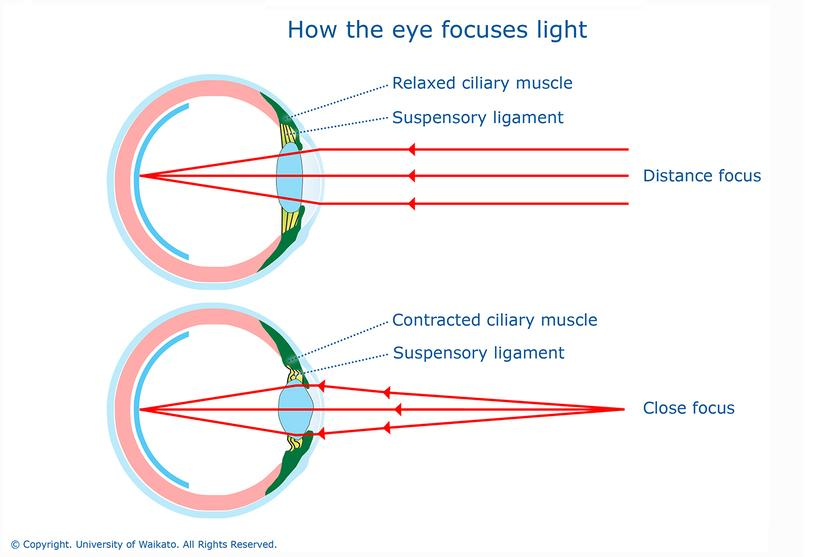

## Table of Contents

## What is a far option?

A far option is a type of stock option that has a long time before it expires. This means you can buy or sell the stock at a certain price for a longer period than usual. People might choose a far option if they think the stock's price will change a lot in the future. It gives them more time to wait and see what happens with the stock.

Far options can be good because they give you more time to make decisions. But they can also be riskier. The longer time means more things can happen that might affect the stock's price. So, it's important to think carefully before choosing a far option. They are not right for everyone, but they can be useful for some investors.

## How does a far option differ from a near option?

A far option and a near option are both types of stock options, but they differ mainly in how long they last before they expire. A far option has a longer time until it expires, which means you can buy or sell the stock at a set price for a longer period. This can be good if you think the stock's price will change a lot in the future because it gives you more time to wait and see what happens.

On the other hand, a near option has a shorter time until it expires. This means you have less time to decide whether to use the option to buy or sell the stock. Near options can be less risky because they don't last as long, but they also give you less time to react to changes in the stock's price. So, if you think the stock's price will change soon, a near option might be better for you.

## What are the key components of a far option?

A far option has a few main parts that you need to know about. First, there's the expiration date, which is the last day you can use the option. For far options, this date is far in the future, giving you more time to decide what to do. Second, there's the strike price, which is the price at which you can buy or sell the stock. This price stays the same no matter what happens to the stock's price in the market.

Another important part is the premium, which is the price you pay to buy the option. The premium for far options can be higher because they last longer and give you more time to use them. Lastly, there's the type of option, which can be a call option (giving you the right to buy the stock) or a put option (giving you the right to sell the stock). Understanding these parts helps you decide if a far option is right for you and how to use it best.

## How does the expiration date affect a far option?

The expiration date of a far option is really important because it tells you how long you have to use the option. Far options have a long time until they expire, which means you can wait and see what happens with the stock's price. This can be good if you think the stock will go up or down a lot in the future. You have more time to decide if you want to buy or sell the stock at the strike price.

But, having a long time until the expiration date can also make things more risky. The longer you wait, the more things can happen that might change the stock's price. So, while far options give you more time to make a decision, they can also be more unpredictable. It's important to think about how long you're willing to wait and what might happen in that time before you choose a far option.

## What are the advantages of trading far options?

Trading far options can give you more time to make decisions about buying or selling stocks. Since far options last longer, you can wait to see if the stock's price will go up or down a lot. This can be good if you think the stock will change a lot in the future. You don't have to decide right away, so you can be more patient and see how things go.

Another advantage is that far options can help you plan for the future. If you think a stock will do well in a few months or even years, a far option lets you lock in a price now. This can be useful if you want to buy or sell a stock at a certain price later on. Plus, far options can sometimes be less affected by short-term changes in the stock market, which can make your investment strategy more stable.

## What are the risks associated with far options?

Far options can be risky because they last a long time. The longer you wait, the more things can happen that might change the stock's price. This means you could lose money if the stock doesn't go the way you thought it would. Also, far options usually cost more to buy because they give you more time to use them. If the stock doesn't move much, you might end up paying a lot for an option that doesn't help you make money.

Another risk is that far options can be hard to predict. Since they last a long time, it's tough to guess what will happen with the stock over months or years. Things like company news, economic changes, or even world events can affect the stock's price. If you're wrong about what will happen, you could lose the money you spent on the option. So, while far options give you more time, they also come with more uncertainty and risk.

## How can far options be used in investment strategies?

Far options can be a part of your investment plan if you want to wait and see what happens with a stock over a long time. They give you the right to buy or sell a stock at a set price far into the future. This can be useful if you think the stock will go up or down a lot later on. For example, if you believe a company will do well in a few years, you can buy a far call option now. This lets you lock in a price today and buy the stock later at that price, even if it goes up a lot.

But far options can also help you protect your investments. If you own a stock and you're worried it might go down in the future, you can buy a far put option. This gives you the right to sell the stock at a set price, no matter how low it goes. This can help you limit your losses if the stock's price drops. Far options can be a smart way to plan for the future, but they also come with risks because so many things can change over a long time.

## What impact does market volatility have on far options?

Market volatility can make far options more valuable because they give you more time to wait and see what happens with the stock's price. When the market is moving a lot, the price of a stock can change quickly. If you have a far option, you can wait for the right moment to use it. This means you might be able to buy or sell the stock at a better price than if you had to decide right away. So, when the market is volatile, far options can be more useful because they let you be patient and take advantage of big price swings.

But market volatility can also make far options riskier. Because far options last a long time, there's more chance for the stock's price to go up and down a lot. If the market is very volatile, it's harder to predict what will happen to the stock's price over months or years. This means you could lose money if the stock doesn't move the way you thought it would. So, while far options can help you take advantage of market volatility, they also come with more uncertainty and risk.

## How do interest rates influence the pricing of far options?

Interest rates can affect how much far options cost. When interest rates go up, the price of far options usually goes up too. This is because when you buy a far option, you're not using your money right away. You can put that money in a bank and earn interest on it until the option expires. So, if interest rates are high, the option becomes more valuable because you could be earning more money on your cash while you wait.

On the other hand, when interest rates go down, the price of far options usually goes down too. This is because the money you're not using to buy the stock right away isn't earning as much interest. So, the option becomes less valuable because you're not missing out on as much potential interest income. Understanding how interest rates affect far options can help you make better decisions about when to buy or sell them.

## Can you explain the Greeks in relation to far options?

The Greeks are important tools that help you understand how far options might change in value. They are called Delta, Gamma, Theta, Vega, and Rho. Delta tells you how much the option's price will change if the stock's price changes by one dollar. For far options, Delta can be less sensitive because you have more time for the stock's price to move. Gamma shows how Delta changes when the stock's price changes. It's important for far options because it can help you see how the option's sensitivity to the stock's price might change over time.

Theta measures how much the option's value goes down as time passes. For far options, Theta is usually smaller because you have a long time until the option expires. This means the option loses value more slowly. Vega tells you how much the option's price will change if the market's volatility changes. Far options can be more affected by Vega because they have more time for volatility to impact the stock's price. Lastly, Rho shows how interest rates affect the option's price. For far options, Rho can be more important because the longer time frame means interest rates can have a bigger impact on the option's value.

## What are some advanced trading strategies involving far options?

One advanced strategy with far options is called a "leap." A leap is a long-term equity anticipation security, which is just a fancy way to say a far option that lasts a year or more. Investors use leaps to bet on a stock's price over a long time. For example, if you think a company will do well in the future, you can buy a leap call option now. This lets you lock in a price today and buy the stock later at that price, even if it goes up a lot. It's like making a long-term bet on the stock's success.

Another strategy is using far options for hedging. If you own a stock and you're worried it might go down in the future, you can buy a far put option. This gives you the right to sell the stock at a set price, no matter how low it goes. This can help you limit your losses if the stock's price drops. It's like buying insurance for your stock. By using far options in these ways, you can plan for the future and protect your investments over a long time.

## How do regulatory changes affect the trading of far options?

Regulatory changes can have a big impact on trading far options. When rules change, it can affect how much it costs to buy or sell options, how long they last, and even who can trade them. For example, if new rules make it harder to trade options, fewer people might want to buy far options. This could make them less valuable. Also, if the rules change how much money you need to have to trade options, it might stop some people from using far options in their investment plans.

But regulatory changes can also make far options more useful. If new rules make the market safer or more transparent, more people might feel comfortable trading far options. This could make them more popular and valuable. For example, if the rules make it easier to understand how options work, more investors might use far options to plan for the future or protect their investments. So, while regulatory changes can be tricky, they can also open up new opportunities for using far options in smart ways.

## References & Further Reading

[1]: Bergstra, J., Bardenet, R., Bengio, Y., & Kégl, B. (2011). ["Algorithms for Hyper-Parameter Optimization."](https://dl.acm.org/doi/10.5555/2986459.2986743) Advances in Neural Information Processing Systems 24.

[2]: ["Advances in Financial Machine Learning"](https://www.amazon.com/Advances-Financial-Machine-Learning-Marcos/dp/1119482089) by Marcos Lopez de Prado

[3]: ["Evidence-Based Technical Analysis: Applying the Scientific Method and Statistical Inference to Trading Signals"](https://www.amazon.com/Evidence-Based-Technical-Analysis-Scientific-Statistical/dp/0470008741) by David Aronson

[4]: ["Machine Learning for Algorithmic Trading"](https://github.com/stefan-jansen/machine-learning-for-trading) by Stefan Jansen

[5]: ["Quantitative Trading: How to Build Your Own Algorithmic Trading Business"](https://www.amazon.com/Quantitative-Trading-Build-Algorithmic-Business/dp/1119800064) by Ernest P. Chan