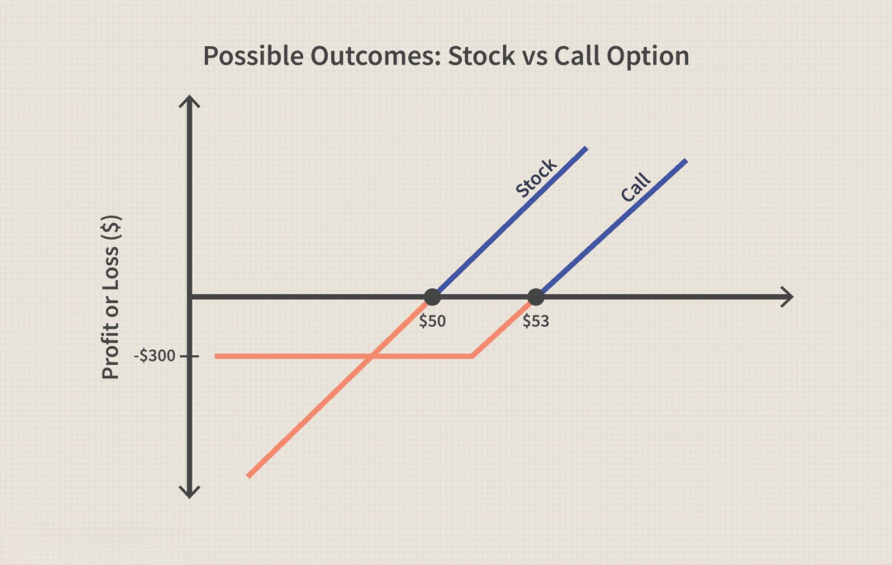

In modern finance, algorithmic trading and options stand out as influential tools, significantly enhancing investment strategies. Options are financial derivatives that provide holders the right, but not the obligation, to buy or sell an underlying asset at a predetermined price and date. This flexibility allows traders and investors the opportunity to hedge against risks or speculate on market movements without the obligation to fulfill the contract if the market conditions are unfavorable.

Algorithmic trading involves using computers to execute orders at speeds and frequencies impossible for human traders to match. It applies complex mathematical and statistical models to make decisions based on predefined criteria, optimizing trade execution and minimizing costs associated with trading activities. This method ensures trades are executed at the most favorable conditions, enhancing returns and allowing for systematic and quantitative approaches to trading.



This article focuses on far options and calendar spreads, illustrating their integration with algorithmic trading systems. Far options are those options with longer expiration dates. They provide investors with extended time frames for the underlying asset's price to reach or exceed the strike price, thus offering strategic leverage in trading. These options are integral in creating calendar spreads, which is a strategy that involves the simultaneous purchase and sale of options of the same underlying asset and strike price but with different expiration dates. Calendar spreads allow investors to exploit differing market conditions and expectations about volatility.

The exploration involves understanding the fundamentals of far options, examining their strategic uses in algorithmic trading, and highlighting potential advantages for investors. By leveraging far options and integrating them into algorithmic trading systems, investors can optimize their trading outcomes, better manage risks, and potentially enhance their returns.

## Table of Contents

## Understanding Far Options

Far options are financial derivatives characterized by their long expiration dates within a calendar spread. These options provide investors with extended timeframes, allowing for strategic leverage as they wait for the underlying asset to potentially reach or surpass a predetermined strike price. The longer duration of far options makes them suitable for traders with a long-term outlook, as they afford more opportunities for market conditions to align with their investment thesis.

In the context of spread trades, far options play a crucial role by enabling investors to balance their short-term and long-term strategic objectives. When used within a calendar spread, far options are typically paired with near options, which have shorter expiration dates. This combination allows investors to capitalize on different market conditions, exploiting time decay (theta) and volatility differences between the two options. For instance, traders can sell near options to collect premium and reduce the cost basis of their far options, effectively financing long-term positions while minimizing upfront expenditures.

Calendar spreads that involve far options are particularly useful in environments with minimal market movement. They allow traders to benefit from the gradual erosion of time value in the sold near options while maintaining a long position in the far options, which might gain value as the expiration date approaches. Furthermore, far options provide flexibility, as investors can adjust their positions in response to changing market conditions, ensuring their strategies remain aligned with overall investment goals.

By providing additional time for the market to move favorably, far options enhance the versatility of trading strategies. This time cushion can be particularly beneficial for investors in uncertain or highly volatile markets, where price movements can be unpredictable. As a component of sophisticated trading mechanisms like calendar spreads, far options enable nuanced approaches to managing risk and optimizing potential returns, making them an indispensable tool for both speculative and hedging purposes.

## Algorithmic Trading and Options

Algorithmic trading has transformed the landscape of financial markets by employing automated, pre-programmed trading instructions that execute trades under optimal conditions dictated by sophisticated algorithms. This form of trading is particularly significant in the context of options, where it adeptly manages intricate strategies such as calendar spreads. Calendar spreads, involving the simultaneous buying and selling of options with different expiration dates but the same strike price, can be complex to handle manually due to the continuous fluctuations and interplay between market variables.

The integration of [algorithmic trading](/wiki/algorithmic-trading) with options exploits the rapid-response capability to market changes. Automated systems are designed to react almost instantaneously to new data and market conditions. This swift adaptability not only boosts the efficiency of executing trades but also substantially reduces human-induced errors, which are often a result of delayed reactions or emotional decision-making processes.

Furthermore, algorithmic trading extends its advantages by allowing continuous operation beyond regular market hours. Given that financial markets operate across various time zones and are subject to global economic events, the ability to trade around the clock provides a significant edge. It ensures that portfolios are managed actively and adjust to global developments without the need for human intervention.

The high-speed, data-driven decision-making processes inherent to algorithmic trading augment both return potential and risk management when applied to options trading. By utilizing vast datasets and applying intricate mathematical models, these systems can identify patterns and opportunities that are difficult to discern manually. Algorithms can optimize parameters such as strike price selection, timing, and risk exposure, which are crucial for effective options trading strategies.

In mathematical terms, let $S(t)$ denote the price of an underlying asset at time $t$. An algorithmic system might use data to model expected returns using stochastic calculus or implement mean-reversion strategies through differential equations. Python, for example, could be used to simulate option pricing models such as the Black-Scholes model, enabling traders to automate the valuation of options based on current market parameters:

```python
from math import exp, sqrt, log
from scipy.stats import norm

def black_scholes_call_price(S, K, T, r, sigma):
    d1 = (log(S / K) + (r + 0.5 * sigma**2) * T) / (sigma * sqrt(T))
    d2 = d1 - sigma * sqrt(T)
    call_price = (S * norm.cdf(d1)) - (K * exp(-r * T) * norm.cdf(d2))
    return call_price

# Example usage:
S = 100  # current stock price
K = 105  # strike price
T = 1    # time to expiration in years
r = 0.05 # risk-free interest rate
sigma = 0.2 # volatility

call_price = black_scholes_call_price(S, K, T, r, sigma)
print(f"The call option price is: {call_price}")
```

This combination of rapid, precise execution and sophisticated, data-driven analysis renders algorithmic trading and options a pivotal element in modern investment strategies. Traders who leverage these systems effectively can enhance their ability to manage risks while maximizing returns, thereby navigating the complexities of today's financial markets with greater proficiency.

## Strategic Uses of Far Options in Algorithmic Trading

Far options serve distinct strategic purposes within algorithmic trading, particularly when employed in calendar spreads. These long-term options complement near-term options by allowing traders to collect premiums, thereby reducing the overall net cost of maintaining long positions. This premium collection enhances the profitability potential while providing additional flexibility in the strategy.

In scenarios such as bull calendar spreads, the primary aim is to mitigate risk if the market does not demonstrate significant movement before the expiration of the near-term option. By selling a near-term option and purchasing a far-term option, traders can position themselves advantageously for price movements over a prolonged period. This approach not only reduces the cost associated with holding a long position but also leverages the time decay properties of options to the trader's advantage.

Algorithmic trading plays a crucial role in the execution of these strategies. By automating the trading process, algorithms ensure that trades are executed with precision and timing that would be difficult for humans to achieve consistently. The automation minimizes slippage—the difference between the expected price of a trade and the actual price—and allows trades to be carried out swiftly in response to market conditions.

Moreover, integrating far options into algorithmic systems enables dynamic adjustments to be made based on current market conditions. These systems can continuously analyze vast amounts of data to maintain strategic alignment and optimize positions accordingly. This real-time responsiveness is critical in volatile markets where swift adaptations are necessary to maintain a profitable stance.

Python, widely used for developing algorithmic trading strategies, can facilitate these automated processes. Here is a simple example of how one might set up an algorithm for managing calendar spreads in Python:

```python
import pandas as pd
import numpy as np

# Sample data
options_data = pd.DataFrame({
    'option_type': ['near', 'far'],
    'expiry': [pd.Timestamp('2023-05-01'), pd.Timestamp('2024-05-01')],
    'strike_price': [100, 100],
    'premium': [5, 8]
})

# Calculate net cost
def calculate_net_cost(data):
    near_option = data[data['option_type'] == 'near']
    far_option = data[data['option_type'] == 'far']

    net_cost = far_option['premium'].values[0] - near_option['premium'].values[0]
    return net_cost

# Calculate net cost of holding the position
net_cost = calculate_net_cost(options_data)
print(f"Net cost of long position: {net_cost}")

# Placeholder for algorithmic trading logic
def trade_decision(market_data):
    # Implement strategy logic based on market_data
    # For example, if market_data['price'] > some_threshold:
    # execute trades
    pass

# Example usage:
market_data = {'price': 102}
trade_decision(market_data)
```

This script outlines a basic setup wherein options data is used to calculate the net cost of holding a position in a calendar spread. Further trading decisions can be integrated into such a script based on live market data, enabling a continuously adaptive trading strategy.

## Case Studies and Examples

In the practice of trading, using far options as part of a strategic approach can lead to profitable outcomes, especially when integrated with algorithmic trading techniques. A common illustration of a bullish trade in algorithmic systems involves a calendar spread, where an investor sells a near-term option while purchasing a far-term option. This approach capitalizes on a potential long-term increase in asset value, leveraging the extended expiration of far options for strategic gains.

Conversely, in bearish market conditions, far options can serve a defensive role, with the strategy focusing on predicted declines in asset value. Here, an investor would sell a near-term call option and buy a far-term call option, anticipating a drop before the short option expires. This tactic allows the investor to benefit from expected price decreases over time, using the premiums collected from the short position to offset the cost of the long position.

Algorithmic trading systems are particularly suited for managing such strategies, as they can effectively employ calendar spreads to capture returns even when market movements deviate from expectations. These systems utilize sophisticated algorithms to monitor market conditions, adjust positions dynamically, and execute trades with precision, reducing human error and operational delays.

Case studies have shown the versatility and effectiveness of algorithmic systems in utilizing far options. One notable example involved a trading algorithm designed to exploit discrepancies in implied [volatility](/wiki/volatility-trading-strategies) across different expiration dates. By systematically implementing calendar spreads with far options, the system managed to stabilize portfolio returns, even during periods of low market volatility. The algorithm adjusted its trading approach based on evolving market conditions, demonstrating the utility of far options in adapting to new variables.

These examples underscore the potential for far options, supported by algorithmic trading, to enhance portfolio performance and risk management. By offering flexibility and strategic leverage, far options can serve as valuable tools in both bullish and bearish market contexts.

## Benefits and Challenges

Utilizing far options in algorithmic trading provides several advantages, notably controlled risk exposure and the potential to capitalize on time decay. Far options enable traders to extend the duration of their positions, affording them time to react to market movements over extended periods. This temporal leverage can optimize trading strategies, allowing investors to navigate periods of volatility with a greater margin of safety. Moreover, far options facilitate premium collection from short-term options, which can reduce the overall cost of long positions.

Algorithmic trading enhances these benefits by executing innovative strategies that respond swiftly to market conditions. The automation of trades diminishes the likelihood of human error and ensures that trades are conducted at the most opportune times, even beyond regular market hours. Algorithms are capable of monitoring numerous data points simultaneously, providing a sophisticated understanding of market dynamics. This high-speed, data-intensive approach can improve decision-making, maximize returns, and enhance risk management.

Despite these benefits, integrating far options within algorithmic trading systems presents particular challenges. The complexity of modeling options strategies requires a profound understanding of financial markets and computational techniques. Precise data integration is crucial; algorithms must be fed with accurate, up-to-date information to function correctly and maximize effectiveness.

Another challenge involves navigating regulatory landscapes. Algorithmic trading must comply with strict financial regulations, and any misalignment could result in substantial penalties. Developing an effective algorithmic strategy thus necessitates a meticulous consideration of both market and technological factors. This involves collaboration between financial experts and data scientists to ensure the strategy is robust, adaptable, and compliant.

To illustrate the computational aspect, consider a simple model in Python that evaluates the potential payoff of a far option calendar spread:

```python
import numpy as np

# Parameters
S = 100  # Underlying asset price
K = 100  # Strike price
T1 = 30  # Days until near option expiration
T2 = 90  # Days until far option expiration
r = 0.01  # Annual risk-free rate
sigma = 0.2  # Volatility

# Function to calculate European Call option price using Black-Scholes formula
def black_scholes_call(S, K, T, r, sigma):
    from scipy.stats import norm
    d1 = (np.log(S / K) + (r + 0.5 * sigma**2) * T) / (sigma * np.sqrt(T))
    d2 = d1 - sigma * np.sqrt(T)
    return S * norm.cdf(d1) - K * np.exp(-r * T) * norm.cdf(d2)

# Calculate option prices
near_option_price = black_scholes_call(S, K, T1/365, r, sigma)
far_option_price = black_scholes_call(S, K, T2/365, r, sigma)

# Payoff calculation
payoff = far_option_price - near_option_price
print("Expected payoff for the far option calendar spread:", payoff)
```

Overall, while the benefits of incorporating far options into algorithmic trading are significant, realizing these advantages requires overcoming the inherent challenges through sophisticated strategy development and technological integration.

## Conclusion

Far options, when employed alongside algorithmic trading, present powerful opportunities to refine and enhance investment strategies. By leveraging the extended duration of far options, investors gain strategic leverage that allows for the potential appreciation of underlying assets over a longer period. This extended timeframe reduces the immediate pressure on investors, offering more flexibility to adjust positions in response to changing market conditions.

Utilizing technology in trading strategies enables precise execution and management of complex financial instruments such as options. Algorithmic trading systems can dynamically adapt to market variables, executing trades with both speed and accuracy. Such systems reduce the likelihood of human error and exploit optimal trading opportunities, which are critical for managing risk effectively.

The integration of far options into algorithmic trading strategies offers distinct advantages. It allows for improved risk management through sophisticated hedging techniques and enhances the potential for returns by capitalizing on time decay. Additionally, the automated nature of algorithmic trading systems ensures that traders can respond proactively to both anticipated and unforeseen market shifts, maintaining robust portfolio positions.

As financial markets continue their rapid evolution, the convergence of algorithmic trading and sophisticated financial instruments like far options will likely play a pivotal role in shaping future trading strategies. Investors who embrace these technologies and understand the strategic nuances of far options will be better positioned to navigate the complexities of the markets, potentially achieving superior investment outcomes.

## References & Further Reading

[1]: Bergstra, J., Bardenet, R., Bengio, Y., & Kégl, B. (2011). ["Algorithms for Hyper-Parameter Optimization."](https://dl.acm.org/doi/10.5555/2986459.2986743) Advances in Neural Information Processing Systems 24.

[2]: ["Advances in Financial Machine Learning"](https://www.amazon.com/Advances-Financial-Machine-Learning-Marcos/dp/1119482089) by Marcos Lopez de Prado

[3]: ["Evidence-Based Technical Analysis: Applying the Scientific Method and Statistical Inference to Trading Signals"](https://www.amazon.com/Evidence-Based-Technical-Analysis-Scientific-Statistical/dp/0470008741) by David Aronson

[4]: ["Machine Learning for Algorithmic Trading"](https://github.com/stefan-jansen/machine-learning-for-trading) by Stefan Jansen

[5]: ["Quantitative Trading: How to Build Your Own Algorithmic Trading Business"](https://www.amazon.com/Quantitative-Trading-Build-Algorithmic-Business/dp/1119800064) by Ernest P. Chan