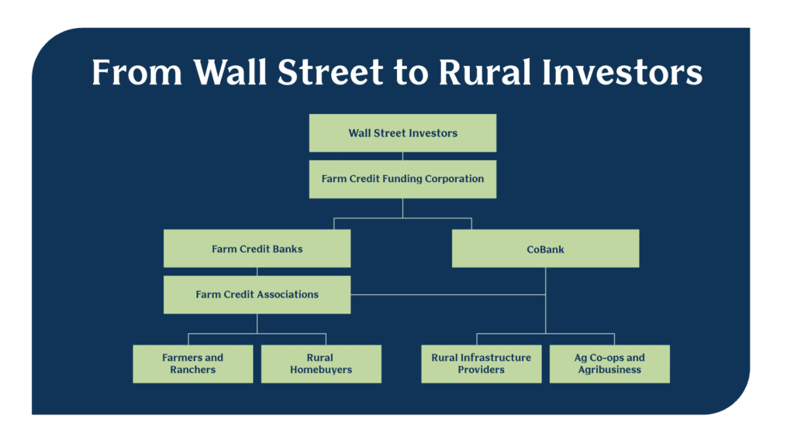

## Table of Contents

## What is the Farm Credit System?

The Farm Credit System is a network of banks and associations that provide loans and other financial services to farmers, ranchers, and others in rural areas. It was created by the U.S. Congress in 1916 to help support the agricultural sector by offering credit when traditional banks might not. The system is owned by its borrowers, which means that the people who use its services are also its shareholders.

The Farm Credit System operates through a cooperative structure. This means that the profits made by the system are either reinvested back into the business or returned to the borrowers as patronage dividends. The system is regulated by the Farm Credit Administration, a federal agency that ensures the system operates safely and soundly. This helps to make sure that farmers and ranchers have access to the credit they need to keep their operations running smoothly.

## What are the main components of the Farm Credit System?

The Farm Credit System has two main parts: banks and associations. The banks are called Farm Credit Banks and they give money to the associations. The associations then use this money to make loans to farmers and ranchers. There are also special banks called Agricultural Credit Banks that help with things like farm equipment loans and rural home loans.

The associations are spread out all over the country and work directly with farmers and ranchers. They know a lot about farming and can help people figure out what kind of loan they need. The associations are owned by the people who borrow from them, so everyone who gets a loan is also an owner of the association. This makes it a cooperative, where everyone works together and shares the benefits.

The whole system is watched over by the Farm Credit Administration. This is a government group that makes sure the Farm Credit System is working well and helping farmers and ranchers in the right way. They check that the banks and associations are safe and fair, so farmers can trust them to get the money they need to keep their farms going.

## How does the Farm Credit System support agricultural producers?

The Farm Credit System helps farmers and ranchers by giving them loans and other money help they need to run their farms. It's like a big group of banks and smaller groups that work together to make sure farmers can get the money they need. When farmers need to buy new equipment, seeds, or even land, they can go to these groups and get a loan. The system is special because it's owned by the farmers themselves, so it's all about helping each other out.

The Farm Credit System also makes sure that farmers can get money even when other banks might say no. It understands farming and knows that sometimes things like bad weather or low prices can make it hard for farmers to pay back loans right away. So, the system works with farmers to find the best way to help them, like giving them more time to pay back the loan or helping them find other ways to make money. This way, farmers can keep their farms going strong, even when times are tough.

## What types of loans and financial services does the Farm Credit System offer?

The Farm Credit System gives farmers and ranchers different kinds of loans to help them with their farms. They can get loans to buy land, which is really important because land is a big part of farming. They can also get loans to buy equipment like tractors or harvesters, which help them do their work faster and better. Another type of loan is for buying seeds, fertilizers, and other things they need to grow their crops. Sometimes, farmers need money to keep their farms running until they can sell their crops, so the Farm Credit System offers operating loans for that.

Besides loans, the Farm Credit System also helps farmers with other money services. They can give advice on how to manage money better, which can help farmers save more and spend less. They also offer something called crop insurance, which helps farmers if their crops get damaged by bad weather or other problems. This way, farmers can feel safer knowing they won't lose everything if something goes wrong. The Farm Credit System is all about making sure farmers have what they need to keep their farms going strong.

## How is the Farm Credit System structured and governed?

The Farm Credit System is made up of banks and smaller groups called associations. The banks, called Farm Credit Banks, give money to the associations. The associations then use this money to make loans to farmers and ranchers. There are also special banks called Agricultural Credit Banks that help with things like farm equipment loans and rural home loans. The associations are spread out all over the country and work directly with farmers and ranchers. They know a lot about farming and can help people figure out what kind of loan they need.

The whole system is owned by the people who borrow from it. This means that farmers and ranchers who get loans are also owners of the associations. It's like a big club where everyone works together and shares the benefits. The profits made by the system are either put back into the business or given back to the borrowers as patronage dividends. This way, everyone helps each other out.

The Farm Credit System is watched over by the Farm Credit Administration. This is a government group that makes sure the system is working well and helping farmers and ranchers in the right way. They check that the banks and associations are safe and fair, so farmers can trust them to get the money they need to keep their farms going.

## What is the historical background of the Farm Credit System?

The Farm Credit System started back in 1916 when the U.S. Congress made it to help farmers and ranchers. Before this, it was hard for farmers to get loans from regular banks because farming can be risky. The Farm Credit System was set up to give farmers a place to get the money they needed to buy land, equipment, and other things for their farms. It was made as a cooperative, which means it's owned by the farmers who use it. This way, farmers could help each other out and share the profits.

Over the years, the Farm Credit System has changed and grown. In the 1930s, during the Great Depression, it helped a lot of farmers who were struggling. Later, in the 1980s, there were some tough times for the system because of a big farm crisis, but it managed to bounce back. Today, the Farm Credit System is still going strong, helping farmers and ranchers all over the country. It's watched over by the Farm Credit Administration, a government group that makes sure everything is working well and that farmers are getting the help they need.

## How has the Farm Credit System evolved over time?

The Farm Credit System started in 1916 to help farmers and ranchers who had trouble getting loans from regular banks. Farming can be risky, and banks were often scared to lend money to farmers. So, the U.S. Congress made the Farm Credit System as a cooperative, which means it's owned by the farmers who use it. This way, farmers could help each other out and share the profits. It was a big deal because it gave farmers a place to get the money they needed to buy land, equipment, and other things for their farms.

Over the years, the Farm Credit System has changed a lot. In the 1930s, during the Great Depression, it helped many farmers who were struggling. It was a tough time, but the system was there to help. Then, in the 1980s, there was another big farm crisis, and the Farm Credit System had some tough times too. But it managed to bounce back and keep helping farmers. Today, the system is still going strong, helping farmers and ranchers all over the country. It's watched over by the Farm Credit Administration, a government group that makes sure everything is working well and that farmers are getting the help they need.

## What role does the Farm Credit System play in the U.S. economy?

The Farm Credit System plays a big part in the U.S. economy by helping farmers and ranchers. It gives them loans to buy land, equipment, seeds, and other things they need to run their farms. When farmers can get these loans, they can keep their farms going strong. This is good for the economy because farms make food and other things that people need. When farms do well, they can sell more and hire more people, which helps the whole country.

The system also makes the economy more stable. It understands that farming can be risky because of things like bad weather or low prices. So, it works with farmers to help them even when times are tough. This means farmers can keep working and not go out of business. When farms stay open, they keep paying taxes and buying things from other businesses. This helps keep money moving in the economy and makes it stronger.

## How does the Farm Credit System differ from other agricultural lending institutions?

The Farm Credit System is different from other agricultural lending places because it is owned by the farmers who use it. This means that the people who get loans are also the owners, so it's like a big club where everyone works together. Other banks might not be owned by farmers and might not understand farming as well. The Farm Credit System knows a lot about farming and can give farmers the right kind of help they need, like loans for buying land or equipment.

Another way the Farm Credit System is different is that it can help farmers even when times are tough. Farming can be risky because of things like bad weather or low prices. Other banks might say no to giving loans when things are hard, but the Farm Credit System works with farmers to find ways to help them. It might give them more time to pay back the loan or help them find other ways to make money. This makes it a big support for farmers, helping them keep their farms going strong.

## What are the eligibility criteria for borrowing from the Farm Credit System?

To borrow from the Farm Credit System, you need to be involved in farming or ranching. This means you should be growing crops, raising livestock, or doing other farm work. The system is made to help people who work in agriculture, so if you're a farmer or rancher, you can usually get a loan from them. They also help people who live in rural areas and need loans for things like buying a home or starting a small business.

The Farm Credit System looks at your ability to pay back the loan. They will check your farm's financial health, like how much money you make and how much you owe. They want to make sure you can handle the loan payments. Sometimes, they might ask for things like a good credit history or some kind of security, like land or equipment, to make sure the loan is safe. But the main thing is that you need to be part of the farming or ranching community to use their services.

## How are interest rates and loan terms determined within the Farm Credit System?

The Farm Credit System decides on interest rates and loan terms by looking at a few things. They check the overall economy and what other banks are doing with their rates. They also look at how risky the loan is. If a farmer's business is doing well and they have a good chance of paying back the loan, the interest rate might be lower. But if the farm is struggling or the loan is riskier, the rate might be higher. The Farm Credit System wants to make sure the rates are fair and help farmers as much as possible.

Loan terms are also set based on what the farmer needs and can handle. The system talks with the farmer to figure out the best way to help them. This might mean setting up a loan that can be paid back over a long time if the farmer is buying land, or a shorter time if they need money for seeds or equipment. The Farm Credit System tries to be flexible and work with farmers to make sure they can keep their farms going strong.

## What are the current challenges and future prospects for the Farm Credit System?

The Farm Credit System faces some challenges right now. One big challenge is that farming can be risky because of things like bad weather, changing prices, and new rules. This means the system has to be careful about giving out loans and making sure farmers can pay them back. Another challenge is competition from other banks and lenders who want to help farmers too. The Farm Credit System has to keep finding ways to be the best choice for farmers, which can be hard. Also, as farms get bigger and more high-tech, the system needs to keep up and offer new kinds of help that farmers need.

Looking to the future, the Farm Credit System has good prospects. It has a strong history of helping farmers and is owned by the farmers themselves, which makes it special. As farming keeps changing, the system can grow and change too. It can offer new services and loans that fit what farmers need today, like help with new technology or ways to be more sustainable. The system is also watched over by the Farm Credit Administration, which helps make sure it stays strong and keeps helping farmers for a long time. With these things in place, the Farm Credit System can keep being a big support for farmers and the U.S. economy.

## References & Further Reading

[1]: Clarke, J. M., & Zaring, D. T. (1982). ["The Farm Credit System: History, Structure, and Recent Developments."](https://aglawjournal.wp.drake.edu/wp-content/uploads/sites/66/2016/09/agVol19No3-manner.pdf) Journal of Agricultural Economics.

[2]: Hardy, D. C. (2020). ["Farm Credit Administration and the Regulation of the Farm Credit System."](https://www.fca.gov/laws-and-regulations/laws-regulations) Farm Credit Administration.

[3]: ["The New Financial World of Agriculture"](https://www.forbes.com/sites/nikmilanovic/2023/01/05/the-next-fintech-revolution-agriculture-finance/) by Neil E. Harl

[4]: Mishra, A. K., & El-Osta, H. S. (2002). ["Credit and Capital Constraints for U.S. Farm Operators."](https://www.ers.usda.gov/publications/pub-details/?pubid=41464) American Agricultural Economics Association Annual Meeting.

[5]: Barry, P. J., & Ellinger, P. N. (2012). ["Financial Management in Agriculture"](https://www.pearson.com/en-us/subject-catalog/p/financial-management-in-agriculture/P200000000749/9780137522903) (7th Edition). Prentice Hall.