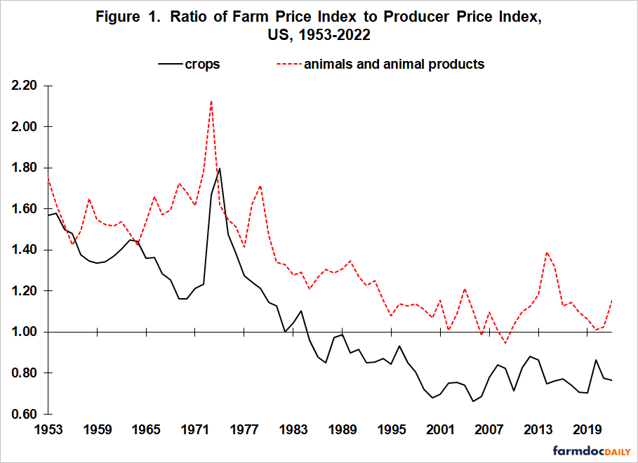

## Table of Contents

## What is the Farm Price Index?

The Farm Price Index is a tool that helps measure the average prices farmers get for their crops and livestock. It looks at the prices of many different farm products, like wheat, corn, and cattle, and then calculates an overall number that shows how these prices are changing over time. This index is important because it helps farmers, policymakers, and economists understand the health of the farming industry and make better decisions.

The index is usually calculated and published by government agencies or agricultural organizations. They collect data from markets and farms across the country to make sure the index is accurate. By tracking the Farm Price Index, people can see if prices are going up or down, which can affect how much farmers earn and how much consumers pay for food. This information is crucial for planning and managing the agricultural sector effectively.

## Why is the Farm Price Index important for farmers?

The Farm Price Index is really important for farmers because it tells them how much money they can expect to make from selling their crops and animals. When the index goes up, it means prices are good and farmers can earn more money. If the index goes down, it means prices are lower, and farmers might need to find ways to save money or change what they grow to make ends meet.

Farmers also use the Farm Price Index to plan for the future. By looking at the index, they can decide what to plant next year or how many animals to raise. If the index shows that prices for certain crops are going to be high, farmers might choose to grow more of those crops. This helps them make smarter choices and hopefully earn more money.

## How is the Farm Price Index calculated?

The Farm Price Index is calculated by looking at the prices of many different farm products like wheat, corn, and cattle. People from government agencies or agricultural groups collect price data from markets and farms all over the country. They take the prices of all these products and put them together to make an average. This average is what we call the Farm Price Index.

To make the index fair, each product's price is given a certain weight based on how important it is to farmers and the economy. For example, if corn is a big part of what farmers grow, it will have a bigger weight in the index. They use a special math formula to combine all these weighted prices into one number. This number shows if farm prices are going up or down over time, helping everyone understand the health of the farming industry.

## What are the key components of the Farm Price Index?

The Farm Price Index includes the prices of many different farm products like wheat, corn, and cattle. Each product's price is important, but not all products are equally important. Some products, like corn, might be a big part of what farmers grow, so they get more weight in the index. This means their prices affect the index more than others.

To calculate the index, people collect price data from markets and farms all over the country. They use a special math formula to combine all these prices into one number. This number tells us if farm prices are going up or down over time. It's like taking the temperature of the farming industry to see how it's doing.

## How often is the Farm Price Index updated?

The Farm Price Index is usually updated every month. This means that once a month, people from government agencies or agricultural groups collect new price data from markets and farms all over the country. They then use this data to calculate the new index number.

By updating the index every month, farmers and others can see the latest changes in farm prices. This helps them make better decisions about what to grow or sell. If the index shows that prices are going up, farmers might decide to grow more of certain crops. If prices are going down, they might need to change their plans to save money.

## Can the Farm Price Index be used to predict future agricultural prices?

The Farm Price Index can help give some ideas about what might happen with farm prices in the future, but it's not perfect. By looking at how the index has changed over time, people can see patterns and trends. If the index has been going up for a while, it might keep going up. But lots of other things can change prices too, like the weather, new laws, or problems in other countries. So, while the index can help, it's just one part of the puzzle.

Farmers and others use the Farm Price Index to make guesses about what to grow or sell next. If the index shows that prices for certain crops are going up, farmers might decide to plant more of those crops. But they have to be careful because the index is based on past data, and the future can be different. It's a helpful tool, but it's important to look at other information too before making big decisions.

## How does the Farm Price Index affect agricultural policy?

The Farm Price Index is really important for people who make rules about farming. When they see the index going up or down, they can decide if they need to help farmers more or if things are going okay. For example, if the index shows that prices are low for a long time, the government might give farmers money or change laws to help them make more money. This is because low prices can make it hard for farmers to keep going.

On the other hand, if the index shows that prices are high, the government might not need to help as much. They might even make rules to stop prices from going too high, so that food doesn't get too expensive for people to buy. By watching the Farm Price Index, people who make laws can keep the farming industry healthy and make sure farmers and consumers are both taken care of.

## What are the differences between the Farm Price Index and other agricultural indices?

The Farm Price Index focuses on the average prices that farmers get for their crops and livestock. It looks at many different farm products like wheat, corn, and cattle, and then calculates one number to show how these prices are changing over time. This index is important because it helps farmers and others understand if prices are going up or down, which affects how much money farmers make. Other agricultural indices might focus on different things, like the cost of farming supplies, the amount of crops produced, or how much money farmers earn after paying for everything they need to grow their crops.

For example, the Farm Input Price Index looks at the prices farmers pay for things they need to grow their crops, like seeds, fertilizers, and fuel. This index helps farmers understand if their costs are going up or down, which is different from the Farm Price Index, which only looks at the prices they get for their products. Another example is the Agricultural Production Index, which measures how much is being produced, not the prices. This can be useful for understanding if there's enough food being grown, but it doesn't tell you about the prices farmers get. Each index gives a different piece of information that helps people in the farming industry make better decisions.

## How can farmers use the Farm Price Index to make better decisions?

Farmers can use the Farm Price Index to make better decisions about what to grow and when to sell their crops or livestock. By looking at the index, farmers can see if prices are going up or down. If the index shows that prices for certain crops are high, farmers might decide to plant more of those crops next season. This can help them make more money. On the other hand, if the index shows that prices are low, farmers might choose to grow something different or wait to sell their products until prices go up again.

The Farm Price Index also helps farmers plan for the future. By keeping an eye on the index over time, farmers can spot patterns and trends. For example, if the index shows that corn prices usually go up in the fall, farmers might hold onto their corn until then to get a better price. This kind of planning can make a big difference in how much money farmers make and how well they can run their farms.

## What historical trends can be observed in the Farm Price Index?

Over the years, the Farm Price Index has shown some clear patterns. One big trend is that farm prices can go up and down a lot. Sometimes, prices go way up because there's not enough of a certain crop, like when there's a drought or a disease. Other times, prices go down because there's too much of something, like when everyone grows the same thing and the market gets flooded. These ups and downs can make it hard for farmers to plan, but they can also see that prices usually go in cycles.

Another thing we can see in the Farm Price Index is that prices for different crops and livestock change at different times. For example, corn prices might go up while wheat prices go down. This is because different things can affect each crop, like weather in different parts of the country or changes in what people want to eat. By looking at these trends, farmers can get a better idea of what to grow and when to sell their products to make the most money.

## How does global economic change impact the Farm Price Index?

Global economic changes can have a big impact on the Farm Price Index. When the world economy is doing well, people have more money to spend on food, which can make farm prices go up. For example, if countries like China or India are growing fast, they might buy more food from other countries, pushing up prices for things like wheat and soybeans. On the other hand, if there's a big economic problem, like a recession, people might not have as much money to spend on food. This can make farm prices go down because there's less demand for crops and livestock.

Changes in money values, called exchange rates, also affect the Farm Price Index. If the U.S. dollar gets stronger compared to other countries' money, it can make American farm products more expensive for people in other countries to buy. This might make them buy less, which can lower farm prices. But if the dollar gets weaker, American farm products become cheaper for other countries, and they might buy more, which can push up farm prices. So, global economic changes can really shake things up for farmers and the Farm Price Index.

## What are the limitations and criticisms of the Farm Price Index?

The Farm Price Index has some problems that people talk about. One big issue is that it only looks at prices, not how much it costs farmers to grow their crops or raise their animals. So, if prices go up but costs go up even more, farmers might not make more money. Another problem is that the index uses a set list of products, and if farmers start growing new things, the index might not show the real picture. Also, the index can be slow to update because it takes time to collect all the price data, which means it might not always show what's happening right now.

People also criticize the Farm Price Index because it doesn't always show what's happening in different parts of the country. Prices can be very different in different places, but the index mixes them all together into one number. This can make it hard for farmers in certain areas to use the index to make good decisions. Finally, some say the index can be affected by things like government help or big changes in the world economy, which can make it hard to understand what's really going on with farm prices.

## What is the Farm Price Index (FPI)?

The Farm Price Index (FPI) is an essential metric that quantifies the prices received by farmers and agricultural companies for their products. Published by the U.S. Department of Agriculture, the FPI is a vital tool for assessing economic health, akin to other indices like the Consumer Price Index (CPI) and Producer Price Index (PPI). By reflecting the current pricing landscape, the FPI serves as a lagging economic indicator, often showing price changes that have already taken effect in the market.

The calculation of the FPI involves compiling price data from a wide array of agricultural products, including grains, livestock, dairy, and produce. This data aggregation helps provide a comprehensive overview of price movements within the agricultural sector. The formula used in calculating the FPI typically follows the Laspeyres index formula:

$$

FPI = \left( \frac{\sum (P_t \times Q_0)}{\sum (P_0 \times Q_0)} \right) \times 100 
$$

where $P_t$ represents the current prices of the goods, $Q_0$ symbolizes the quantities in a base period, and $P_0$ stands for the prices in the base period. This index is often expressed as a percentage to indicate the change in prices relative to the base period.

Analyzing the movement of the FPI helps stakeholders understand the stability and potential trends within the agricultural economy. For example, a rising FPI may indicate increasing prices farmers receive, which could be due to elevated demand or reduced supply. Conversely, a decreasing FPI might suggest declining demand or an oversupply, impacting the broader economic landscape. The insights derived from the FPI are crucial for policymakers, economists, and investors to gauge the agricultural sector's health and make informed decisions regarding future economic strategies. Understanding the FPI can therefore play a significant role in anticipating economic shifts and planning accordingly.

## References & Further Reading

[1]: USDA National Agricultural Statistics Service. ["Agricultural Prices."](https://www.nass.usda.gov/Charts_and_Maps/Agricultural_Prices/) U.S. Department of Agriculture.

[2]: Murphy, C. B. (2020). ["Consumer Price Index (CPI)."](https://www.bls.gov/opub/ted/2021/consumer-price-index-2020-in-review.htm) Investopedia.

[3]: Geman, H. (2005). ["Commodities and Commodity Derivatives: Modeling and Pricing for Agriculturals, Metals and Energy."](https://download.e-bookshelf.de/download/0000/5675/90/L-G-0000567590-0015270354.pdf) Wiley Finance.

[4]: Lopez de Prado, M. (2018). ["Advances in Financial Machine Learning."](https://www.amazon.com/Advances-Financial-Machine-Learning-Marcos/dp/1119482089) Wiley.

[5]: Chan, E. P. (2009). ["Quantitative Trading: How to Build Your Own Algorithmic Trading Business."](https://github.com/ftvision/quant_trading_echan_book) Wiley Trading.

[6]: Investopedia. ["Producer Price Index (PPI)."](https://www.investopedia.com/terms/p/ppi.asp)

[7]: Hull, J. C. (2012). ["Options, Futures, and Other Derivatives."](https://www.semanticscholar.org/paper/Options%2C-Futures%2C-and-Other-Derivatives-Hull/89bdee500c8623864fc9eb7a471546aa713acc44) Pearson.