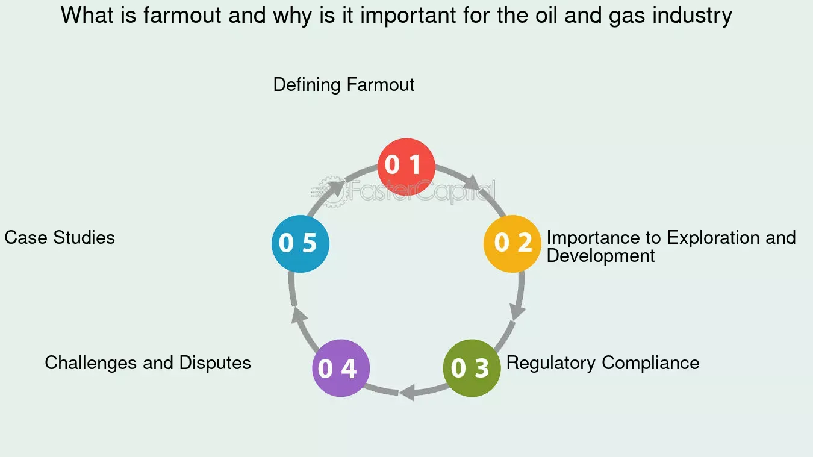

## Table of Contents

## What is a farmout agreement?

A farmout agreement is a deal between two companies in the oil and gas industry. One company, called the farmor, gives another company, called the farmee, the right to explore and develop a piece of land. In return, the farmee agrees to do the work and pay for it. This helps the farmor because they don't have to spend money on the project, and it helps the farmee because they get a chance to work on a new project.

These agreements are common in the oil and gas industry because exploring and developing new areas can be very expensive and risky. By using a farmout agreement, companies can share the costs and risks. The farmee usually gets a share of the profits from any oil or gas they find, while the farmor keeps some ownership of the land. This way, both companies can benefit from the project.

## Why are farmout agreements used in the oil and gas industry?

Farmout agreements are used in the oil and gas industry because exploring and developing new areas can be very expensive and risky. When a company finds a piece of land that might have oil or gas, they might not have enough money or want to take on all the risk by themselves. By using a farmout agreement, the company can share the costs and risks with another company. This helps them to explore and develop the land without spending too much money or taking on too much risk.

In a farmout agreement, the company that owns the land, called the farmor, gives another company, called the farmee, the right to work on the land. The farmee agrees to do the work and pay for it. This is good for the farmor because they don't have to spend their own money on the project. It's also good for the farmee because they get a chance to work on a new project and share in any profits from the oil or gas they find. This way, both companies can benefit from the project.

## What are the key components of a farmout agreement?

A farmout agreement has several important parts that both the farmor and the farmee need to agree on. One key part is the land or area that the agreement covers. The farmor gives the farmee the right to explore and develop this specific piece of land. Another important part is the work the farmee agrees to do. This can include drilling wells, doing surveys, or other tasks needed to find and produce oil or gas. The agreement also says who pays for this work, which is usually the farmee.

Another key part of a farmout agreement is how the profits are shared. The farmee usually gets a share of any oil or gas they find, while the farmor keeps some ownership of the land. This can be set up in different ways, like the farmee getting a certain percentage of the production or earning more ownership as they do more work. The agreement also needs to say how long it lasts and what happens if the farmee does not do the work they promised. These parts make sure both companies know what they are getting into and what they can expect from the deal.

## How does a farmout agreement differ from a joint venture?

A farmout agreement and a joint venture are two ways companies in the oil and gas industry can work together, but they are different. In a farmout agreement, one company, called the farmor, gives another company, called the farmee, the right to explore and develop a piece of land. The farmee agrees to do the work and pay for it. The farmor does not have to spend money on the project but keeps some ownership of the land. The farmee gets a share of any oil or gas they find. This way, the farmor shares the risk and costs with the farmee.

In a joint venture, two or more companies work together from the start. They share the costs, risks, and profits of a project right from the beginning. All the companies in the joint venture have a say in how the project is run. They all work together to make decisions and share the work. Unlike a farmout agreement, where one company does most of the work and pays for it, in a joint venture, everyone is involved and shares everything equally. This makes joint ventures different because they are more like a partnership from the start.

## What are the benefits of entering into a farmout agreement for the farmor?

For the farmor, entering into a farmout agreement has several benefits. One big benefit is that it helps the farmor save money. Exploring and developing new land can be very expensive, and by using a farmout agreement, the farmor does not have to pay for the work. Instead, the farmee pays for everything, which means the farmor can use their money for other projects or save it.

Another benefit for the farmor is that they can lower their risk. Exploring for oil and gas is risky because there's no guarantee that they will find anything. By letting the farmee do the work, the farmor can share the risk with them. If the project fails, the farmor has not lost their own money. But if the project succeeds, the farmor still gets a share of the profits and keeps some ownership of the land. This way, the farmor can benefit without taking on all the risk themselves.

## What are the benefits of entering into a farmout agreement for the farmee?

For the farmee, entering into a farmout agreement means they get a chance to work on a new project without having to buy the land. This is a big benefit because buying land can be very expensive. Instead, the farmee just has to pay for the work they do on the land. This makes it easier for the farmee to start exploring and developing new areas without spending too much money upfront.

Another benefit for the farmee is that they can earn a share of any oil or gas they find. This means if the project is successful, the farmee can make money from the oil and gas production. They also have the chance to earn more ownership of the land as they do more work. This can be a good way for the farmee to grow their business and increase their assets without taking on all the risk and cost of buying the land themselves.

## What are the typical steps involved in negotiating a farmout agreement?

Negotiating a farmout agreement usually starts with the farmor and farmee talking about what they want from the deal. The farmor will share details about the land, like where it is and what they think might be there. The farmee will say what kind of work they are willing to do and how much they can spend. They will also talk about how they want to share any oil or gas they find. Both sides need to agree on these things before they can move forward.

Once they have a basic idea of what they want, the farmor and farmee will start working on the details of the agreement. This includes writing down exactly what land the agreement covers, what work the farmee will do, and how much they will pay for it. They will also decide how to share the profits and what happens if the farmee does not do the work they promised. Lawyers will often help with this part to make sure everything is clear and legal. After all the details are worked out and both sides are happy, they will sign the agreement and start the project.

## What are the common challenges and risks associated with farmout agreements?

One common challenge with farmout agreements is making sure both the farmor and the farmee understand and agree on what work needs to be done. Sometimes, the farmee might not do the work they promised, which can cause problems. The farmor needs to make sure the agreement clearly says what will happen if the farmee does not do their job. Another challenge is deciding how to share any oil or gas that is found. Both sides need to agree on how to split the profits in a way that is fair.

There are also risks involved with farmout agreements. For the farmor, the biggest risk is that the farmee might not find any oil or gas. This means the farmor does not get any profits from the land, even though they still own it. For the farmee, the main risk is spending a lot of money on the work without finding anything valuable. They also have to be careful about how much they agree to spend because if the project costs more than they expected, they could lose money. Both sides need to think carefully about these risks before they sign the agreement.

## How is the financial arrangement structured in a farmout agreement?

In a farmout agreement, the financial arrangement is set up so that the farmee pays for all the work they do on the land. This includes the cost of drilling wells, doing surveys, and any other tasks needed to explore and develop the area. The farmor does not have to spend any money on the project, which is a big benefit for them. The farmee agrees to take on these costs in return for the chance to work on the land and share in any oil or gas they find.

The profits from any oil or gas that is found are shared between the farmor and the farmee. The exact way they share the profits is decided in the agreement. The farmee usually gets a certain percentage of the production, and they might also earn more ownership of the land as they do more work. The farmor keeps some ownership of the land and gets a share of the profits without having to pay for the work. This way, both the farmor and the farmee can benefit from the project, but they also share the financial risks.

## What legal considerations should be taken into account when drafting a farmout agreement?

When drafting a farmout agreement, it's important to think about the legal parts that protect both the farmor and the farmee. The agreement should clearly say what land is being farmed out and what work the farmee has to do. It should also say what happens if the farmee does not do the work they promised. This helps make sure the farmor is protected if the farmee does not keep their end of the deal. The agreement should also talk about how to share any oil or gas that is found. This needs to be clear so both sides know what they will get if the project is successful.

Another important legal part is to make sure the agreement follows the laws of the area where the land is. Different places might have different rules about how to explore and develop land, and the agreement needs to follow these rules. It's a good idea to have lawyers help with the agreement to make sure everything is legal and clear. This can help avoid problems later on and make sure both the farmor and the farmee are protected.

## How do farmout agreements impact the management and operation of oil and gas assets?

Farmout agreements change how oil and gas assets are managed and operated by sharing the work and costs between two companies. The farmor, who owns the land, gives the farmee the right to explore and develop it. The farmee takes on the job of doing the work, like drilling wells and doing surveys, and pays for it. This means the farmor does not have to manage the day-to-day operations of the project. Instead, the farmee handles everything, from planning the work to making sure it gets done right. This can help the farmor focus on other projects while still keeping some control over the land.

The farmee, on the other hand, gets to manage and operate the oil and gas assets on the land. They decide how to do the work and make sure it is done safely and efficiently. This gives the farmee a lot of control over the project, but they also have to follow the rules set out in the farmout agreement. The agreement might say things like how much money the farmee can spend and what they need to do to earn more ownership of the land. By managing and operating the assets well, the farmee can increase their chances of finding oil or gas and making a profit.

## Can you provide examples of successful farmout agreements and their outcomes?

One example of a successful farmout agreement happened in the Gulf of Mexico. A big oil company, let's call it Company A, owned some land but did not want to spend the money to explore it. So, they made a farmout agreement with a smaller company, Company B. Company B agreed to do all the work and pay for it. They found a big oil field and started producing oil. Company A did not have to spend any money but got a share of the profits. Company B got to work on a new project and made a lot of money from the oil they found.

Another example is from Canada, where a company called the farmor had some land in Alberta. They made a farmout agreement with another company, the farmee, who did the work and found natural gas. The farmee paid for everything and got a share of the gas they found. The farmor kept some ownership of the land and got part of the profits without spending any money. Both companies were happy because they shared the costs and risks, and both made money from the gas.

## References & Further Reading

[1]: Kramer, B. M., & Anderson, O. L. (2005). *The Law of Pooling and Unitization*. LexisNexis.

[2]: Smith, E. E., & Weaver, J. L. (2010). *Texas Law of Oil and Gas*. LexisNexis.

[3]: Bergstra, J., Bardenet, R., Bengio, Y., & Kégl, B. (2011). ["Algorithms for Hyper-Parameter Optimization."](https://dl.acm.org/doi/10.5555/2986459.2986743) Advances in Neural Information Processing Systems 24.

[4]: ["Advances in Financial Machine Learning"](https://www.amazon.com/Advances-Financial-Machine-Learning-Marcos/dp/1119482089) by Marcos Lopez de Prado

[5]: ["Evidence-Based Technical Analysis: Applying the Scientific Method and Statistical Inference to Trading Signals"](https://www.amazon.com/Evidence-Based-Technical-Analysis-Scientific-Statistical/dp/0470008741) by David Aronson

[6]: ["Machine Learning for Algorithmic Trading"](https://github.com/stefan-jansen/machine-learning-for-trading) by Stefan Jansen

[7]: ["Quantitative Trading: How to Build Your Own Algorithmic Trading Business"](https://www.wiley.com/en-us/exportProduct/pdf/9781119203377) by Ernest P. Chan