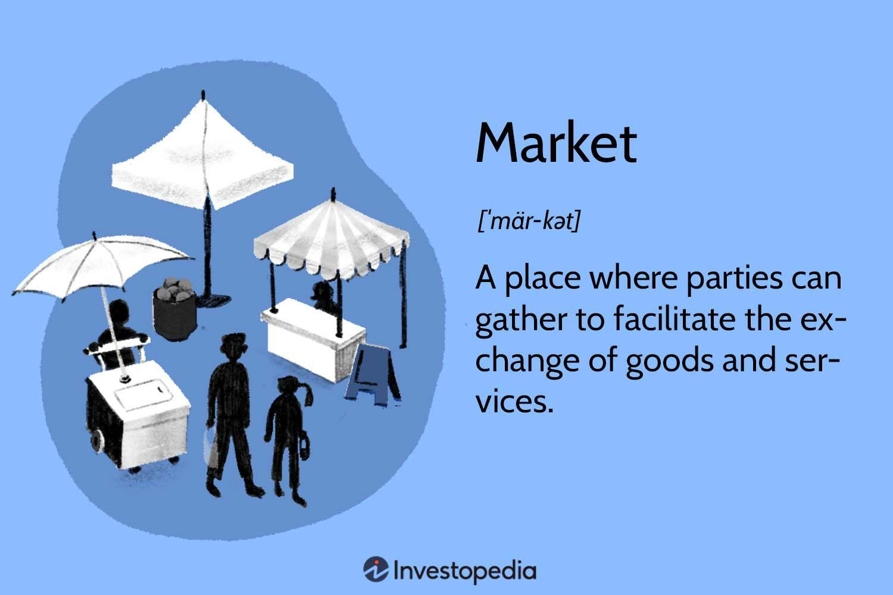

## Table of Contents

## What is a fast market?

A fast market is when trading happens very quickly in financial markets. It often happens when there is big news or events that make people want to buy or sell things fast. During a fast market, prices can change a lot in a short time, and it can be hard for traders to keep up with all the changes.

In a fast market, there might be more orders than usual, which can make it hard for the market to handle everything smoothly. This can lead to delays or mistakes in trading. Traders need to be careful and quick to make good decisions during these times. It's important for them to stay calm and watch the market closely to avoid big losses.

## How does a fast market differ from a normal market?

In a normal market, trading happens at a steady pace. Prices move up and down, but usually not too fast. Traders have time to think about their decisions and make trades without feeling rushed. The market can handle the number of orders coming in, and everything runs smoothly. It's like driving on a highway with normal traffic - you can go at a comfortable speed and change lanes when you need to.

A fast market is different because everything speeds up. Big news or events can cause a lot of people to want to buy or sell quickly, making prices jump around a lot in a short time. It's like suddenly being in heavy traffic with cars zooming past you. Traders have to make quick decisions and might find it hard to get their orders through because the market is so busy. This can lead to mistakes or delays, and traders need to stay alert to avoid big losses.

## What causes a market to become fast?

A market becomes fast when something big happens that makes a lot of people want to trade quickly. This could be news like a company doing better or worse than expected, or big events like elections or economic reports. When people hear this news, they rush to buy or sell, which makes the market move very fast.

When everyone is trying to trade at the same time, it can be hard for the market to keep up. There are so many orders coming in that it can cause delays or mistakes. Traders have to be quick and careful to make good decisions in this busy time, or they might lose money.

## What are the common characteristics of a fast market?

In a fast market, trading happens very quickly. Prices can go up and down a lot in a short time because a lot of people are trying to buy and sell at once. This often happens when there is big news or important events that make everyone want to trade. It's like a busy rush hour where everyone is in a hurry to get somewhere.

Because so many people are trading, the market can get overwhelmed. There might be more orders than the market can handle, which can cause delays or mistakes. Traders need to be quick and careful to make good decisions. If they're not, they might lose money. It's important for them to stay calm and keep a close eye on what's happening in the market.

## How do fast markets affect trading strategies?

In a fast market, traders need to change how they trade because things happen so quickly. They might use strategies that help them make decisions fast, like setting automatic orders to buy or sell when prices hit certain points. This way, they don't have to think too much and can keep up with the fast-moving market. They might also use tools that help them see what's happening in the market right away, so they can act before prices change too much.

Sticking to a plan is also important in a fast market. Traders need to decide ahead of time what they will do if the market gets busy. They might set limits on how much they will buy or sell, or decide to wait until the market calms down before making big moves. This helps them avoid making rash decisions that could lead to big losses. In a fast market, being ready and sticking to a plan can help traders do well even when things are moving quickly.

## What are the risks associated with trading in a fast market?

Trading in a fast market can be risky because everything moves so quickly. Prices can change a lot in a short time, and it's easy to make mistakes. If you're not fast enough, you might miss out on good chances to buy or sell. Also, if you make a quick decision without thinking it through, you could end up losing money. The market might be so busy that your orders don't go through right away, which can make things even harder.

Another risk is that you might get caught up in the excitement and make decisions based on emotions instead of a clear plan. When everyone is rushing to trade, it's easy to feel pressured to join in. But if you follow the crowd without thinking, you could end up buying high and selling low, which is not a good way to make money. It's important to stay calm and stick to your trading plan, even when the market is moving fast.

## How can traders identify a fast market?

Traders can tell a market is fast when they see prices moving up and down a lot in a short time. This usually happens when big news comes out or something important happens that makes a lot of people want to buy or sell at the same time. When everyone is rushing to trade, it can make the market feel very busy and hard to keep up with.

Another way to spot a fast market is by looking at how many orders are coming in. If there are way more orders than usual, it can mean the market is having a hard time handling everything. This can cause delays or mistakes, and traders need to be extra careful and quick to make good choices during these busy times.

## What tools or indicators are used to monitor fast markets?

Traders use special tools and indicators to keep an eye on fast markets. One common tool is a real-time price chart that shows how prices are moving second by second. This helps traders see big price jumps or drops right away. They also use [volume](/wiki/volume-trading-strategy) indicators, which show how many trades are happening. If the volume is much higher than usual, it's a sign that the market might be getting fast.

Another tool traders use is [order book](/wiki/order-book-trading-strategies) data, which shows all the buy and sell orders waiting to be filled. In a fast market, the order book can change very quickly, and traders need to watch it closely to make good decisions. Some traders also use [volatility](/wiki/volatility-trading-strategies) indicators, which measure how much prices are moving up and down. If volatility goes up a lot, it's another sign that the market is moving fast and traders need to be ready for quick changes.

## How do exchanges and regulatory bodies respond to fast markets?

Exchanges and regulatory bodies have ways to handle fast markets. They keep a close eye on trading to make sure everything is fair and working right. If the market gets too busy, they might use special rules to slow things down a bit. This can help stop the market from getting out of control and protect traders from big losses. They might also step in to make sure no one is cheating or doing anything wrong during the fast market.

Regulatory bodies also work to make sure traders have the right information. They might put out warnings or alerts to let everyone know the market is moving fast. This helps traders be ready and make smart choices. By keeping things fair and giving out good information, exchanges and regulatory bodies help make sure fast markets don't cause too many problems.

## What are some historical examples of fast markets and their outcomes?

One famous example of a fast market happened on October 19, 1987, known as Black Monday. On that day, the stock market in the United States crashed very quickly. The Dow Jones Industrial Average dropped by more than 22% in a single day. This fast market was caused by many people selling their stocks at the same time, which made prices fall very fast. It led to a lot of panic and big losses for many people. After Black Monday, rules were changed to try to stop such big, fast drops from happening again.

Another example is the Flash Crash of May 6, 2010. In just a few minutes, the Dow Jones Industrial Average dropped almost 1000 points. It happened so fast that many traders didn't know what was going on. The fast market was caused by a mix of high-frequency trading and a big sell order that started a chain reaction. Prices went back up quickly, but it showed how fast markets can move and how dangerous they can be. After the Flash Crash, new rules were made to try to keep the market safer and more stable during fast times.

## How can technology be leveraged to manage trading in fast markets?

Technology can help traders a lot when the market is moving fast. One way is by using special computer programs that can make trades very quickly. These programs can watch the market all the time and make decisions based on rules the trader sets up. This means traders don't have to be super fast themselves; the computer can do it for them. Another way technology helps is by giving traders real-time information. They can see what's happening in the market right away, which helps them make better choices even when things are moving quickly.

Also, technology can help keep the market safe during fast times. Exchanges use special systems to watch for anything strange or wrong happening. If they see something that could cause problems, they can step in and slow things down a bit. This helps stop the market from getting out of control. Plus, technology can help traders practice for fast markets. They can use simulators to try out their strategies in a safe way before using them for real. This way, they can be more ready when the market gets busy.

## What advanced strategies can be employed to capitalize on fast market conditions?

In fast markets, traders can use advanced strategies like high-frequency trading ([HFT](/wiki/high-frequency-trading-strategies)) to make the most of quick price changes. HFT uses powerful computers to buy and sell things very fast, often in milliseconds. Traders set up rules for their computers to follow, so they can make trades automatically without having to think about each one. This helps them take advantage of small price movements that happen in fast markets. Another strategy is using [algorithmic trading](/wiki/algorithmic-trading), where traders use math formulas to decide when to buy or sell. These formulas can help traders spot patterns in the market and make trades based on those patterns, even when things are moving quickly.

Another strategy is to use stop-loss and take-profit orders. These are automatic orders that tell the computer to sell if the price goes down to a certain point (stop-loss) or to sell if the price goes up to a certain point (take-profit). This helps traders manage their risk and make sure they don't lose too much money if the market moves against them. Also, some traders use market-making strategies, where they buy and sell the same thing at the same time to make a small profit from the difference in price. In a fast market, this can be a good way to make money from the quick changes in price.

## References & Further Reading

[1]: Bergstra, J., Bardenet, R., Bengio, Y., & Kégl, B. (2011). ["Algorithms for Hyper-Parameter Optimization."](https://dl.acm.org/doi/10.5555/2986459.2986743) Advances in Neural Information Processing Systems 24.

[2]: ["Advances in Financial Machine Learning"](https://www.amazon.com/Advances-Financial-Machine-Learning-Marcos/dp/1119482089) by Marcos Lopez de Prado

[3]: ["Evidence-Based Technical Analysis: Applying the Scientific Method and Statistical Inference to Trading Signals"](https://www.amazon.com/Evidence-Based-Technical-Analysis-Scientific-Statistical/dp/0470008741) by David Aronson

[4]: ["Machine Learning for Algorithmic Trading"](https://github.com/stefan-jansen/machine-learning-for-trading) by Stefan Jansen

[5]: ["Quantitative Trading: How to Build Your Own Algorithmic Trading Business"](https://www.amazon.com/Quantitative-Trading-Build-Algorithmic-Business/dp/1119800064) by Ernest P. Chan