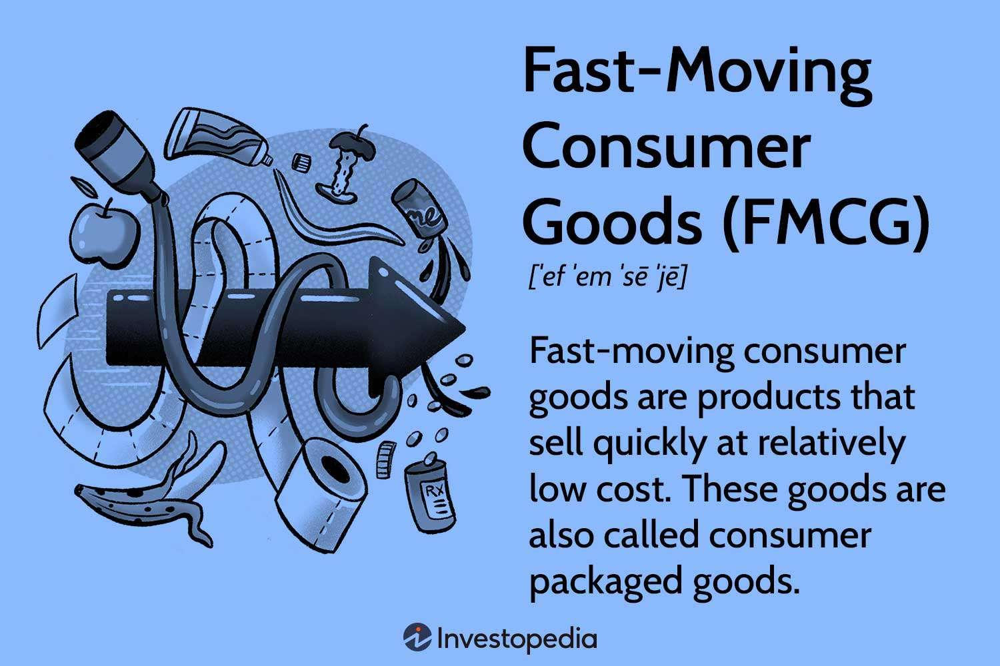

The Fast-Moving Consumer Goods (FMCG) industry plays a pivotal role in the global economy, accounting for a substantial portion of consumer spending worldwide. This sector includes essentials such as food, beverages, toiletries, and other household items that are quickly consumed and require frequent repurchase. The essence of the FMCG market lies in its ability to achieve high inventory turnover while maintaining low-profit margins per unit. This characteristic necessitates a strategic approach to operations, marketing, and supply chain management to drive profitability.

In recent years, the intersection of the FMCG industry with technological advancements, particularly algorithmic trading, has shaped new paradigms in how companies operate and investors approach the market. Algorithmic trading, defined as the use of computer algorithms to manage trading decisions and execute orders, has introduced sophisticated techniques to optimize and enhance financial performance. Initially popularized in stock and commodity markets, algorithmic trading has found its way into the FMCG sector as companies strive to harness data and analytics to forecast demand more accurately, manage inventory levels effectively, and respond swiftly to market signals.



The leveraging of algorithmic trading in the FMCG industry underscores its importance in maintaining competitiveness in an increasingly dynamic and consumer-driven market landscape. As companies gather vast amounts of data from consumer interactions, social media, and online transactions, the ability to analyze and act on this information becomes crucial. Algorithmic systems allow for nuanced and rapid responses to market trends, ultimately supporting the profitability and growth of FMCG brands.

This synthesis of traditional consumer goods strategies with modern algorithmic practices exemplifies the ongoing digital transformation within the sector. As a result, companies not only secure their market positions but also explore new avenues for value creation and cost efficiency. Consequently, the FMCG industry's adaptability in integrating such advancements contributes significantly to its prominence and resilience in the global market.

## Table of Contents

## Understanding the FMCG Industry

Fast-Moving Consumer Goods (FMCGs) are essential products that are sold quickly and at a relatively low cost. These include items such as non-durable household goods, packaged foods, beverages, toiletries, over-the-counter drugs, and other consumables. The defining characteristics of FMCGs are frequent purchase, low engagement, short shelf life, and low price. These goods are designed for mass consumption and are characterized by high inventory turnover and low profit margins per unit.

The profitability of FMCGs is largely derived from their high volume of sales rather than significant mark-up per item. The business model of FMCGs relies on economies of scale which reduces the per-unit cost of production as the scale of operations increases. The high inventory turnover in the FMCG sector ensures that goods are sold rapidly before their expiry date, which enhances cash flow and reduces storage costs. The calculation of inventory turnover can be represented by the formula:

$$

\text{Inventory Turnover} = \frac{\text{Cost of Goods Sold}}{\text{Average Inventory}}
$$

A higher inventory turnover ratio implies stronger sales and efficient inventory management.

Several major players in the FMCG industry exert significant influence on the global market. Companies such as Procter & Gamble, Nestlé, Unilever, and Coca-Cola dominate the sector with extensive product lines and widespread distribution networks. These corporations invest heavily in marketing and brand loyalty, which is crucial for maintaining market share in a highly competitive environment. For instance, Procter & Gamble boasts a diverse portfolio, ranging from personal care products to cleaning [agents](/wiki/agents), while Coca-Cola dominates the beverages segment with its flagship sparkling drink. Unilever’s diverse range of food, cleaning, and personal care products further illustrate the expansive reach and market influence these companies wield. 

The market influence of these organizations is amplified by their ability to adapt to consumer trends and technological advancements, maintaining competitive advantages and sustaining profitability amidst fluctuating market conditions. By leveraging brand strength and expansive distribution channels, major FMCG companies continue to secure their dominance in a sector that is indispensable to the global economy.

## Profitability in the FMCG Sector

Fast-Moving Consumer Goods (FMCGs) are characterized by their rapid turnover and low profit margins per unit, necessitating specific strategies to maintain profitability. Key factors contributing to the profitability of FMCGs include brand loyalty, scale of operations, and pricing strategies.

Brand loyalty is a crucial element in ensuring sustained revenue streams. FMCG companies invest significantly in advertising and customer relationship management to foster a sense of brand attachment. This loyalty mitigates the effect of competitors’ price cuts and encourages repeat purchases, which are vital for maintaining [volume](/wiki/volume-trading-strategy) in sales crucial for offsetting narrow margin products.

The scale of operations plays a vital role in profitability. Large FMCG companies benefit from economies of scale, reducing per-unit costs through bulk purchasing, streamlined logistics, and efficient production processes. This advantage allows them to offer competitive pricing while maintaining acceptable profit margins.

Pricing strategies are essential for balancing affordability with profitability. FMCG firms often employ strategies like value-based pricing, market penetration, and promotional discounts to attract and retain customers. Value-based pricing, which sets prices based on perceived product value rather than cost-plus pricing, is particularly common in distinguishing premium segments.

Recent trends have significantly influenced FMCG profitability. The rise of eCommerce has reshaped how FMCG products are marketed and sold. Companies leveraging online platforms can reduce overhead costs associated with physical stores, ultimately enhancing profit margins. This shift has also enabled FMCG firms to reach broader markets without traditional distribution constraints.

Moreover, changing consumer habits have prompted adjustments in FMCG strategies. Consumers are increasingly seeking convenience, health-oriented products, and sustainable options. This shift requires FMCG firms to innovate and offer new product lines to meet demand. Additionally, digital tools and data analytics assist companies in understanding consumer preferences and tailoring offerings, thus potentially increasing sales and profitability.

Overall, while the FMCG sector operates on tight margins, strategic brand management, large-scale operations, adaptive pricing, and the adoption of digital trends are essential for enhancing profitability. As consumer preferences and market environments evolve, FMCG companies must continually adapt to maintain their economic viability and competitive edge.

## An Introduction to Algorithmic Trading

Algorithmic trading refers to the use of computer algorithms to automate the trading process, executing orders at speeds and frequencies beyond human capability. These algorithms utilize pre-defined sets of criteria, which can range from timing, price, or quantity, to complex mathematical models that determine the optimal trades. In modern financial markets, [algorithmic trading](/wiki/algorithmic-trading) has become a dominant force due to its ability to process vast amounts of data swiftly and execute trades rapidly, reducing transaction costs and minimizing the impact of volatile market movements.

The core advantage of algorithmic trading lies in its efficiency and precision. By leveraging high-frequency trading, algorithms can capitalize on tiny price discrepancies that occur over very short timeframes, making it possible for investors to achieve greater returns. Additionally, automated trading systems reduce the likelihood of human error and can operate consistently according to predefined strategies, even in turbulent market conditions.

Fast-Moving Consumer Goods (FMCG) companies and investors are increasingly turning to algorithmic trading to enhance their trading strategies and improve profitability. For FMCG companies, algorithmic trading can be utilized to forecast demand and manage inventory levels more effectively. By analyzing historical sales data and current market trends, algorithms can predict future demand patterns, helping companies optimize their supply chains to prevent overproduction or stockouts.

Investors in the FMCG sector also benefit from algorithmic trading by using sophisticated data analytics techniques to evaluate the trading potential of FMCG stocks. Quantitative models can analyze various factors, such as consumer spending habits, brand loyalty metrics, and economic indicators, to identify investment opportunities in the sector. These models can also assess the impact of macroeconomic conditions, such as changes in consumer confidence or shifts in disposable income, on the FMCG market.

Through the integration of [machine learning](/wiki/machine-learning) and [artificial intelligence](/wiki/ai-artificial-intelligence), algorithmic trading further enhances its capability to adapt to changing market conditions. Machine learning algorithms can process new data inputs, recognize patterns, and update their trading strategies accordingly. This adaptability is particularly beneficial in the fast-paced FMCG sector, where consumer preferences and market dynamics are continually evolving.

In summary, algorithmic trading has become an essential tool in modern financial markets for its ability to leverage vast datasets to identify trading opportunities swiftly and accurately. Its implementation in the FMCG industry aids both companies and investors in optimizing trading strategies, managing risks, and enhancing returns by enabling informed decision-making processes based on real-time data analytics.

## The Intersection of Algorithmic Trading and FMCG Profitability

FMCG companies have increasingly turned to algorithmic trading as a means to enhance their profitability by optimizing operations such as demand forecasting and inventory management. Algorithmic trading, which utilizes complex mathematical models and pre-set instructions for making trading decisions, has become pivotal in allowing these companies to navigate the fast-paced and volatile consumer goods market.

Algorithmic trading systems are capable of analyzing vast datasets in real-time, offering FMCG companies precise insights into consumer demand patterns. By leveraging historical sales data, seasonal trends, and economic indicators, algorithms can predict future demand with greater accuracy. This allows companies to adjust their production schedules and stock levels proactively, thus minimizing the risk of overproduction or stockouts. For instance, machine learning models can be trained to recognize sales patterns and forecast demand spikes during specific periods, such as holidays, enabling firms to maintain optimal inventory levels.

The effectiveness of these algorithms largely depends on the extent and quality of the data fed into them. Companies regularly utilize data analytics to enhance their algorithmic models. This involves integrating structured data, like sales figures and financial metrics, with unstructured data, such as social media trends and customer reviews. Advanced analytics algorithms, including [deep learning](/wiki/deep-learning) and natural language processing, help make sense of this data, allowing for nuanced interpretations that drive more informed decision-making in investment strategies.

Investors in FMCG stocks also benefit from algorithmic trading by harnessing data analytics to assess market dynamics and stock performance. Techniques such as sentiment analysis on social media platforms can gauge public perception of FMCG brands, which may influence stock prices. Similarly, algorithms can be configured to track competitor moves and external market shocks, adjusting investment portfolios accordingly to mitigate risk and capitalize on favorable conditions.

Python, a popular language for implementing these algorithms, offers libraries like Pandas, NumPy, and Scikit-learn, which facilitate data manipulation and model building. For instance, a basic demand forecasting model could be constructed using Python as follows:

```python
import pandas as pd
from sklearn.ensemble import RandomForestRegressor
from sklearn.model_selection import train_test_split

# Load historical sales data
data = pd.read_csv('sales_data.csv')

# Prepare features and target variable
X = data.drop('sales', axis=1)
y = data['sales']

# Split data into training and test sets
X_train, X_test, y_train, y_test = train_test_split(X, y, test_size=0.2, random_state=42)

# Initialize and train the Random Forest model
model = RandomForestRegressor(n_estimators=100, random_state=42)
model.fit(X_train, y_train)

# Predict future sales
predictions = model.predict(X_test)
```

This algorithmic approach not only improves demand forecasting but also aligns with strategic inventory management practices, thus driving profitability for FMCG companies. Consequently, the fusion of algorithmic trading and data analytics has become an essential tool in the arsenal of financial and operational strategy within the FMCG sector.

## Challenges and Risks

Fast-Moving Consumer Goods (FMCG) companies face numerous challenges in maintaining profitability due to intense competition and the complexities of global supply chains. One primary challenge is the high level of competition, which compels companies to innovate continuously and maintain competitive pricing. This competition typically results in low profit margins. Firms are under constant pressure to improve operational efficiency and reduce costs without compromising product quality. Moreover, fluctuations in raw material prices can severely impact profit margins, posing additional financial risks.

Supply chain disruptions present another significant challenge for FMCG companies. These disruptions can result from various factors, including natural disasters, geopolitical tensions, and pandemics, as evidenced by the COVID-19 crisis. Such disruptions lead to delays and increased costs in logistics, production, and distribution, thereby affecting the availability of products and potentially diminishing consumer trust. The global nature of supply chains also means that a localized issue can have widespread repercussions across the industry.

Algorithmic trading introduces its own set of risks. One major concern is market [volatility](/wiki/volatility-trading-strategies), where rapid algorithmic trading can exacerbate price swings and contribute to market instability. For instance, the "Flash Crash" of 2010 highlighted how algorithmic trading could lead to dramatic and sudden market gyrations. Furthermore, technological failures pose significant risks. A software glitch or hardware failure can lead to unintended trading positions or market manipulation. Systemic risks may arise when these failures occur at scale, potentially affecting broader financial markets.

Moreover, algorithmic trading relies heavily on data accuracy and timely information. Inaccuracies or delays in data can lead to erroneous trading decisions, affecting profitability and potentially causing financial losses for companies and investors. As such, maintaining robust data management systems and investing in reliable technology infrastructure are essential for minimizing these risks.

To mitigate these operational challenges, FMCG companies are increasingly leveraging advanced technologies and predictive analytics to enhance supply chain resilience. By optimizing logistics and inventory management, companies aim to reduce vulnerability to disruptions. Additionally, the integration of machine learning and artificial intelligence in algorithmic trading can improve the accuracy of demand forecasting and trading decisions, providing a competitive edge in volatile markets.

## Future Outlook

The future of the Fast-Moving Consumer Goods (FMCG) industry is poised for transformation through the integration of artificial intelligence (AI), machine learning (ML), and algorithmic trading. As these technologies mature, they offer unparalleled opportunities for FMCG companies to enhance efficiency, meet evolving consumer demands, and maximize profitability.

AI and ML technologies are particularly pivotal for predicting consumer behavior and personalizing marketing strategies. By analyzing vast datasets encompassing customer preferences, purchasing patterns, and external factors like economic indicators, these technologies enable companies to forecast demand more accurately. For example, ML algorithms can segment consumer data to identify niche markets or predict the success of new product launches. Python libraries such as Scikit-learn can facilitate these analyses by providing tools for data processing and model training.

```python
from sklearn.model_selection import train_test_split
from sklearn.ensemble import RandomForestRegressor
import pandas as pd

# Example of training a model to predict product demand
data = pd.read_csv('consumer_data.csv')
X = data.drop('demand', axis=1)
y = data['demand']

X_train, X_test, y_train, y_test = train_test_split(X, y, test_size=0.2, random_state=42)
model = RandomForestRegressor(n_estimators=100, random_state=42)
model.fit(X_train, y_train)

# Predicting on test data
predictions = model.predict(X_test)
```

Algorithmic trading is another transformative force in the FMCG sector. By leveraging sophisticated algorithms, FMCG companies and investors can optimize stock trading strategies, reducing transaction costs and improving returns. Predictive analytics can be employed to evaluate market trends and execute trades automatically, minimizing human error and reacting swiftly to market changes. As trading platforms continue to evolve, companies may adopt more advanced algorithms capable of high-frequency trading and real-time data analysis.

The alignment of technological advancements with consumer demands is crucial. As consumers become more technologically adept, expectations for transparency, ethical sourcing, and sustainability will intensify. FMCG companies must balance these consumer trends with technological integrations. By utilizing AI to track supply chain sustainability and employing ML for optimizing resource allocation, companies can uphold their commitment to ethical practices while enhancing operational efficiency.

Future strategies should also encompass collaborative approaches, where companies integrate AI-driven technologies into all facets of their operations. This can include smart manufacturing processes that utilize the Internet of Things (IoT) to monitor production lines or employing blockchain to enhance traceability and trust within the supply chain.

The emergence of these technologies portends a future where the FMCG industry can respond more dynamically to market shifts. Companies that invest in AI, ML, and algorithmic trading while maintaining a consumer-centric approach will likely maintain a competitive edge. Continuous innovation and adaptation to technological capabilities will be vital for sustaining profitability in an ever-evolving marketplace.

## Conclusion

The integration of advanced trading technologies within the FMCG industry is crucial for sustaining profitability in an increasingly complex market environment. Algorithmic trading, with its automation capabilities and data-driven insights, provides FMCG companies and investors with the tools necessary to navigate the intricacies of global financial markets effectively. These technologies enable precise demand forecasting, inventory management, and portfolio optimization, which are vital for maintaining competitive advantages.

As the FMCG sector continues to face evolving consumer demands and rapid technological advancements, the ability to adapt swiftly is imperative. Leveraging artificial intelligence and machine learning can facilitate better understanding and prediction of market trends, consumer preferences, and supply chain dynamics. This necessitates a continuous investment in technology and human capital to remain agile and responsive to market fluctuations.

In conclusion, the successful integration of advanced trading technologies not only aids FMCG companies in enhancing their profitability but also ensures their long-term viability. By continuously adapting to market changes and consumer trends, these companies can uphold their positions as major players in the global economy, driving innovation and growth in the competitive landscape.

## References & Further Reading

[1]: Bergstra, J., Bardenet, R., Bengio, Y., & Kégl, B. (2011). ["Algorithms for Hyper-Parameter Optimization."](https://papers.nips.cc/paper/4443-algorithms-for-hyper-parameter-optimization) Advances in Neural Information Processing Systems 24.

[2]: ["Advances in Financial Machine Learning"](https://www.amazon.com/Advances-Financial-Machine-Learning-Marcos/dp/1119482089) by Marcos Lopez de Prado

[3]: ["Evidence-Based Technical Analysis: Applying the Scientific Method and Statistical Inference to Trading Signals"](https://www.amazon.com/Evidence-Based-Technical-Analysis-Scientific-Statistical/dp/0470008741) by David Aronson

[4]: ["Machine Learning for Algorithmic Trading"](https://github.com/stefan-jansen/machine-learning-for-trading) by Stefan Jansen

[5]: ["Quantitative Trading: How to Build Your Own Algorithmic Trading Business"](https://www.amazon.com/Quantitative-Trading-Build-Algorithmic-Business/dp/1119800064) by Ernest P. Chan