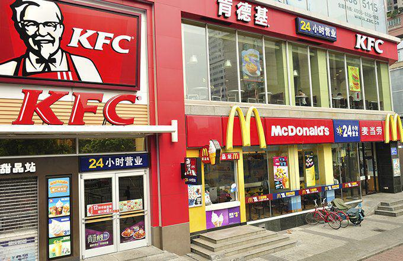

In an ever-changing world where dining experiences and technological advancements evolve rapidly, two sectors have emerged as pillars of substantial growth: restaurant chains in the United States and algorithmic trading platforms. The United States hospitality industry is experiencing a transformation as consumers increasingly seek gourmet and diverse dining options. Simultaneously, investors are turning to algorithmic trading platforms for smarter and more efficient trading solutions. This convergence of demand in dining and innovation in investment technology presents intriguing opportunities and challenges.

The restaurant industry in the U.S. is characterized by a dynamic expansion phase, with numerous chains rapidly scaling operations. This growth is driven by innovative menu offerings, enhanced dining experiences, and robust brand loyalty programs. Consumers are not just looking for meals but are in search of experiences that are both satisfying and align with their health and lifestyle preferences. This shift toward quality and diversity places certain restaurant chains at the forefront, positioning them as attractive prospects for investors.



In parallel, algorithmic trading has transformed the landscape of financial investments, allowing for data-driven decision-making processes that exceed traditional human capabilities. Capable of analyzing vast datasets, these platforms execute trades based on pre-defined rules, enhancing efficiency, and minimizing costs. The restaurant sector's growth potential, aligned with the precision of algorithmic trading, opens new avenues for investment strategies. Investors leveraging these platforms can swiftly assess real-time market conditions, consumer preferences, and operational performance of restaurant chains—allowing them to identify promising opportunities swiftly.

This article examines the dynamics that fuel the growth of both fast-expanding restaurant chains and sophisticated trading technologies. It will spotlight restaurant chains that are capturing consumer interest and demonstrate potential as lucrative investment ventures. As these two sectors continue to develop, understanding their interplay is crucial for stakeholders looking to capitalize on emerging trends in both dining and technology.

## Table of Contents

## The Rise of Fastest-Growing Restaurant Chains in the U.S.

U.S. restaurant chains have experienced robust expansion, characterized by the opening of new locations across the country. This growth can be attributed to several factors, including the creation of innovative menu offerings, commitment to enhancing customer experiences, and the cultivation of strong brand loyalty programs. 

A key driver of this expansion is the ability of these chains to continuously innovate their menus to meet evolving consumer preferences. As health consciousness grows among consumers, many chains have adjusted their offerings to include healthier options. Mod Pizza, for instance, has gained popularity by providing customizable, health-conscious pizza options, which cater to a variety of dietary preferences. First Watch has similarly made a mark by focusing on breakfast, brunch, and lunch items that emphasize fresh and wholesome ingredients, resonating with the modern consumer's desire for nutritious dining experiences.

The enhancement of customer experiences is another critical [factor](/wiki/factor-investing) behind the success and expansion of these chains. Many have embraced technology in their operations to streamline service and improve customer engagement. Digital ordering systems, loyalty apps, and personalized marketing strategies are examples of how technology is being leveraged to create a seamless and enjoyable dining experience.

Brand loyalty programs have played a significant role in retaining customers and encouraging repeat visits. By offering rewards and exclusive deals, restaurant chains are able to build a community of loyal patrons who are more likely to frequent their establishments regularly.

Some of the top ten fastest-growing restaurant chains engage in diverse strategies beyond menu innovation and customer experience enhancement. These strategies include exploring non-traditional location openings, such as within airports or universities, and strategically assessing demographics to identify new growth opportunities.

In summary, the rapid expansion of U.S. restaurant chains can be attributed to their ability to adapt to consumer demands through innovative menu offerings, enhanced customer experiences, and effective brand loyalty programs. Exemplified by chains such as Mod Pizza and First Watch, these strategies enable them to maintain strong growth trajectories in a competitive market.

## Understanding Algorithmic Trading

Algorithmic trading, commonly referred to as 'algo trading,' utilizes sophisticated computer algorithms to automate the process of executing trades. These algorithms are designed to follow a set of specified instructions, taking into account various market variables such as timing, price, quantity, or any mathematical model. The principal advantage of this approach lies in its ability to handle extensive datasets, conducting trades at velocities far beyond human capabilities.

Algo trading's increasing popularity is driven by several critical benefits. First, it enhances efficiency by removing human emotional biases from trading decisions, leading to more consistent outcomes. Second, the automation inherent in algo trading significantly reduces transaction costs. By executing high-frequency trades swiftly and precisely, it minimizes slippage, thereby capturing better prices and improving profit margins.

Moreover, algo trading can implement intricate trading strategies that rely on a multitude of data points. For instance, trading algorithms can be programmed to employ mean reversion, which exploits price inefficiencies to earn profits. The formula for a simple mean reversion model can be expressed as:

$$
\text{Price}_\text{Predicted} = \mu + \beta \cdot (\text{Price}_\text{Current} - \mu)
$$

where $\mu$ is the average historical price and $\beta$ is a coefficient that dictates the speed of reversion.

Additionally, algo trading allows for the application of statistical [arbitrage](/wiki/arbitrage) and quantitative models, further increasing trading accuracy and reliability. Investors can leverage these models to respond to minor price discrepancies across various markets or instruments.

Python is frequently used to build such trading algorithms due to its expansive libraries and ease of integration with financial data feeds. For example, a basic trading algorithm in Python might look like this:

```python
import numpy as np

# Simulated price data
prices = np.array([100, 102, 101, 105, 107])

# Calculating moving average
def moving_average(prices, window_size):
    return np.convolve(prices, np.ones(window_size), 'valid') / window_size

# Trading logic
window_size = 3
avg_prices = moving_average(prices, window_size)
if prices[-1] > avg_prices[-1]:
    print("Signal: Buy")
else:
    print("Signal: Sell")
```

In conclusion, [algorithmic trading](/wiki/algorithmic-trading) provides substantial improvements over traditional trading methods by maximizing efficiency, reducing costs, and enabling sophisticated trading strategies. Its utility extends across various sectors, driving a transformation in how investments are managed and executed.

## Impact of Algo Trading on Restaurant Investments

Algorithmic trading has revolutionized how investors evaluate and invest in restaurant chains. This approach allows investors to deploy sophisticated computer algorithms to assess vast amounts of data and execute trading strategies based on predefined criteria. By leveraging these capabilities, investors can gain insights into various aspects of the restaurant sector.

One of the core advantages of using algorithmic trading in restaurant investments is its ability to analyze trends in consumer preferences. For instance, as more consumers gravitate towards health-conscious dining options, algo trading can identify which chains are effectively capitalizing on these trends. By analyzing data from social media, customer reviews, and sales trends, algorithms can predict which restaurants will likely benefit from shifts in consumer sentiment. 

Moreover, algorithmic trading can efficiently handle real estate data, which is crucial in the restaurant industry. Choosing the right location is critical, influencing customer traffic and sales [volume](/wiki/volume-trading-strategy). Advanced algorithms can assess demographic data, foot traffic patterns, and competitive presence to determine optimal locations for new restaurant outlets. This data-driven approach helps investors prioritize chains with well-strategized expansion plans.

Financial performance metrics of restaurant chains are another critical component analyzed by algorithmic trading. These metrics include revenue growth, profit margins, and balance sheet health. Unlike traditional investment analysis, algorithmic trading can process these factors along with macroeconomic indicators and industry-specific benchmarks, providing investors with a comprehensive overview that supports informed decision-making.

The restaurant industry is also experiencing a shift towards more diverse menu offerings and an emphasis on health-focused dining options. Algo trading enables investors to spot these emerging opportunities by continuously monitoring innovation and adaptation within restaurant menus. Chains that efficiently align their offerings with current demand trends may present attractive investment opportunities, making them favorable targets for algorithm-driven strategies.

In summary, the integration of algorithmic trading into restaurant investments offers significant advantages. By analyzing consumer behavior, real estate dynamics, and financial health, algo trading facilitates the identification of emergent opportunities. As dining preferences continue to evolve, investors equipped with algorithmic insights are better positioned to capitalize on transformative trends in the restaurant industry.

## Case Studies: Successful Restaurant Chains and Algo Trading Integration

Shake Shack and Jersey Mike's Subs have emerged as notable examples of successful restaurant chains that have effectively integrated data-driven strategies, including algorithmic trading, into their growth frameworks. This integration allows them to harness technological insights to streamline operations, align with current investment trends, and strategically position themselves for continued expansion.

### Shake Shack

Shake Shack has successfully applied algorithmic tools to optimize its supply chain management. By leveraging data-driven insights, the company has been able to predict market demand and adjust inventory levels accordingly. This minimizes waste and ensures that supply meets consumer demand efficiently. Shake Shack uses algorithms to process large datasets, which include customer preferences, sales trends, and supplier performance metrics. The resulting analysis informs decision-making processes related to the selection and procurement of ingredients.

Python has been central to such analytic implementations, providing a versatile framework for developing the necessary algorithms. Using libraries such as Pandas for data manipulation and Sci-kit Learn for predictive modeling, Shake Shack can execute complex analyses that offer a competitive advantage. An example of a simplified predictive model in Python might look like this:

```python
import pandas as pd
from sklearn.model_selection import train_test_split
from sklearn.linear_model import LinearRegression

# Sample dataset loading
data = pd.read_csv('sales_data.csv')
features = data[['historical_sales', 'seasonal_factor', 'marketing_spend']]
sales = data['future_sales']

# Split into training and test sets
X_train, X_test, y_train, y_test = train_test_split(features, sales, test_size=0.2, random_state=42)

# Predictive model
model = LinearRegression()
model.fit(X_train, y_train)
predictions = model.predict(X_test)

# Output prediction for an example case
print(predictions[0])
```

### Jersey Mike's Subs

Jersey Mike's Subs also harnesses algorithmic trading principles, primarily in enhancing its marketing strategies. The company uses predictive analytics to tailor promotions and campaigns that resonate most with its target audience. By analyzing transaction data and customer feedback, Jersey Mike's can customize its outreach efforts, ensuring promotional content is relevant and effective.

In a similar Python environment, Jersey Mike's might employ natural language processing (NLP) techniques on customer reviews or feedback to gain insights into customer satisfaction and brand perception. Libraries like NLTK or SpaCy facilitate such analyses.

Moreover, algorithmic trading's data processing capabilities enable Jersey Mike's Subs to dynamically adjust marketing budgets across different geographic regions based on sales forecasts and consumer spending patterns. This approach lowers marketing costs while maximizing returns on investment.

Both Shake Shack and Jersey Mike's Subs exemplify how restaurant chains can use algorithmic insights to evolve and thrive in competitive markets. By adopting advanced data-driven methodologies, these companies not only align with current market trends but also pave the way for more informed and strategic future growth.

## Future Prospects: What Lies Ahead

The future landscape for restaurant chain growth and algorithmic trading appears promising, driven by rapid technological advancements and shifting consumer preferences. As these industries evolve, both restaurateurs and investors will need to leverage these changes to maximize efficiency and enhance their strategic decision-making.

One significant technological advancement impacting restaurant chains is the implementation of Artificial Intelligence (AI) and Machine Learning (ML) in operations. Algorithms can predict consumer trends by analyzing large datasets, such as transactional data and social media interactions. This allows chains to tailor their menus and marketing strategies to match consumer demands more closely, ultimately driving customer satisfaction and loyalty.

In the investment sphere, algorithmic trading offers enhanced tools for analyzing and investing in restaurant stocks. By processing vast amounts of data in real-time, investors can develop sophisticated models that account for various influences, such as seasonal dining trends and macroeconomic indicators. This level of insight can facilitate more accurate predictions of stock performance, helping to identify optimal entry and [exit](/wiki/exit-strategy) points in the market.

Moreover, the convergence of technology and finance is creating opportunities for more personalized dining experiences. For instance, data analytics can optimize supply chain logistics, reducing waste and lowering costs for restaurants. These efficiencies can translate into higher profit margins and more attractive investment prospects for stakeholders.

To remain competitive, both investors and restaurateurs must stay abreast of technological developments. Regularly updating their knowledge on AI, ML, and data analytics will be crucial in harnessing these tools effectively. Furthermore, collaborating with tech companies to integrate innovative solutions into their operations can position businesses to thrive in a rapidly evolving marketplace.

In conclusion, the intersection of technology and the restaurant industry promises to bring about smarter investments and innovative customer experiences. By embracing these advancements, stakeholders are well-equipped to navigate future challenges and opportunities in both sectors.

## Conclusion

As the fastest-growing restaurant chains in the U.S. expand to meet escalating consumer demands, algorithmic trading emerges as a potent tool for investors to leverage these opportunities. In recent years, the convergence of dining trends and advanced financial technology has reshaped investment strategies, providing a significant edge to those who understand this synergy.

Algorithmic trading platforms enable investors to process vast amounts of data, identifying patterns and trends that might be missed through traditional analysis. By integrating data on consumer preferences, market dynamics, and the financial performance of restaurant chains, these systems offer a comprehensive view of potential investment prospects. This data-driven approach allows investors to make informed decisions, aligning investment portfolios with current and emerging market trends.

The success of this strategy lies in embracing innovation and maintaining vigilance over both consumer behavior and industry developments. Investors who harness the capabilities of algorithmic trading will be better equipped to anticipate shifts in the dining landscape and capitalize on burgeoning opportunities. This technological edge can transform the way investments are managed, leading to enhanced portfolio performance and sustained growth in an ever-evolving market.

To remain competitive, both restaurateurs and investors must stay informed about technological advancements, continuously adapting to the rapidly changing environment. By doing so, they can ensure that they not only meet but exceed the expectations of an increasingly sophisticated consumer base. As such, the intersection of fast-growing restaurant chains and algorithmic trading represents a promising frontier for strategic investment and growth.

## References & Further Reading

[1]: ["Advances in Financial Machine Learning"](https://www.amazon.com/Advances-Financial-Machine-Learning-Marcos/dp/1119482089) by Marcos Lopez de Prado

[2]: ["Machine Learning for Algorithmic Trading"](https://github.com/stefan-jansen/machine-learning-for-trading) by Stefan Jansen

[3]: ["Quantitative Trading: How to Build Your Own Algorithmic Trading Business"](https://www.amazon.com/Quantitative-Trading-Build-Algorithmic-Business/dp/1119800064) by Ernest P. Chan

[4]: ["The Man Who Solved the Market: How Jim Simons Launched the Quant Revolution"](https://www.amazon.com/Man-Who-Solved-Market-Revolution/dp/073521798X) by Gregory Zuckerman

[5]: ["Evidence-Based Technical Analysis: Applying the Scientific Method and Statistical Inference to Trading Signals"](https://www.amazon.com/Evidence-Based-Technical-Analysis-Scientific-Statistical/dp/0470008741) by David Aronson

[6]: Bergstra, J., Bardenet, R., Bengio, Y., & Kégl, B. (2011). ["Algorithms for Hyper-Parameter Optimization."](https://dl.acm.org/doi/10.5555/2986459.2986743) Advances in Neural Information Processing Systems 24.