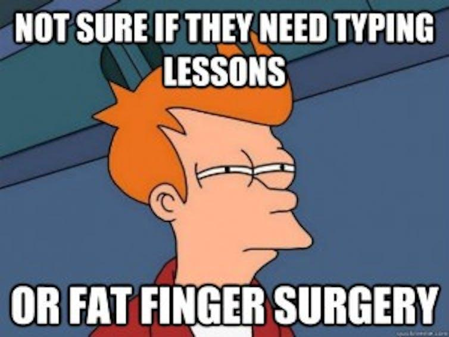

## Table of Contents

## What is a fat finger error?

A fat finger error happens when someone makes a mistake while typing on a keyboard or touching a screen. It's called a "fat finger" because it's like the person's finger is too big for the keys or buttons, causing them to press the wrong one. These errors are common on small devices like smartphones, where the buttons are close together.

These mistakes can cause big problems, especially in places like stock markets. For example, if someone types the wrong number when buying or selling stocks, it can lead to huge financial losses. But fat finger errors aren't just about money; they can also happen when texting or entering data, leading to funny or confusing messages. Being careful and double-checking what you type can help avoid these errors.

## How does a fat finger error occur?

A fat finger error happens when someone accidentally presses the wrong key or button on a keyboard or touchscreen. This mistake often occurs because the keys or buttons are small and close together, making it easy to hit the wrong one, especially on devices like smartphones. For example, if you're trying to type a message on your phone, you might accidentally hit a nearby letter and send a confusing text.

These errors can have big effects, especially in important situations. In stock trading, a fat finger error might mean someone enters the wrong number when buying or selling stocks, which can lead to big financial losses. But it's not just about money; fat finger errors can also happen when entering data or using a computer, leading to mistakes in documents or databases. Being careful and checking your work can help prevent these errors.

## Can you provide examples of fat finger errors in everyday life?

Fat finger errors can happen when you're texting on your phone. Imagine you want to tell your friend to meet you at the park at 3 PM, but you accidentally type "3 AM" instead. Your friend might show up at the wrong time, feeling confused and tired. These mistakes are easy to make because the buttons on a phone are small and close together, so it's simple to hit the wrong one.

Another everyday example is when you're entering a password. Let's say your password is "password123," but you accidentally type "password132" because your finger slips on the last two numbers. You might not be able to log into your account and have to reset your password, which can be annoying and time-consuming. Being careful and double-checking what you type can help avoid these common errors.

## What are the common causes of fat finger errors?

Fat finger errors happen when people accidentally press the wrong key or button. This often occurs because the keys or buttons on devices like smartphones are small and close together. It's easy to hit the wrong one, especially if you're in a hurry or not paying close attention. For example, if you're texting on your phone, you might accidentally type the wrong letter because your finger slips.

These errors can also happen because of the way we hold our devices. If you're holding your phone with one hand and trying to type with your thumb, it's harder to be accurate. Sometimes, the screen might be dirty or wet, making it even easier to make a mistake. Being careful and taking your time can help reduce these errors, but they can still happen to anyone.

## How can fat finger errors impact financial markets?

Fat finger errors can cause big problems in financial markets. Imagine someone is trying to sell a small number of stocks, but they accidentally type in a much bigger number. This mistake can make the stock price drop a lot very quickly. Other traders might see this and start selling their stocks too, thinking something bad is happening with the company. This can lead to a lot of confusion and big financial losses for many people.

To stop these errors from causing too much damage, financial markets have rules and systems in place. For example, if someone tries to make a very big trade that seems strange, the system might stop it and ask the trader to check it. But even with these rules, fat finger errors can still happen and cause trouble. It's important for traders to be very careful and double-check their orders before sending them.

## What are some historical examples of fat finger errors in trading?

In 2014, a big mistake happened at the Tokyo Stock Exchange. Someone accidentally sold a huge number of shares of a company called Toyomitsu. The person meant to sell 1 share, but they typed in 1 million shares by mistake. This made the stock price drop a lot very quickly. It took a while for the market to fix the problem, and it showed how a small error can cause big trouble in the stock market.

Another famous fat finger error happened in 2012 at the New York Stock Exchange. A trader at Knight Capital Group made a mistake when entering a trade. Instead of selling a small number of shares, they accidentally sold a lot more. This caused the stock price to change a lot and cost the company a lot of money. It was a big lesson for everyone about how important it is to be careful when trading.

## How can individuals prevent fat finger errors when typing or using devices?

To prevent fat finger errors, it's important to take your time when typing on any device. If you rush, you're more likely to hit the wrong key or button. Try to use both hands if you can, especially on a phone, because it's easier to be accurate with two hands. Also, make sure your screen is clean and dry, as dirt or water can make it harder to press the right buttons.

Another good way to avoid fat finger errors is to double-check what you type before you send it or hit enter. This is especially important for important things like passwords or financial transactions. If you're using a computer, consider using a larger keyboard if you find the small keys hard to use. By being careful and checking your work, you can reduce the chances of making a mistake.

## What technologies or tools exist to help mitigate fat finger errors?

There are some tools and technologies that can help stop fat finger errors. One common tool is called auto-correct. It's on many phones and computers and can fix small typing mistakes as you type. For example, if you type "teh" instead of "the," auto-correct will change it for you. Another tool is called a confirmation screen. This is often used in financial trading. When you make a trade, the screen will show what you typed and ask you to check it before you send it. This helps make sure you don't make a big mistake.

There are also special keyboards that can help. Some keyboards have bigger keys or keys that are spaced out more, which can make it easier to type without mistakes. On phones, you can use a feature called "key press feedback." This gives you a little vibration or sound when you press a key, so you know you hit the right one. By using these tools and technologies, you can make fewer fat finger errors and feel more confident when typing or using your devices.

## How do businesses and organizations manage the risks associated with fat finger errors?

Businesses and organizations use different ways to manage the risks of fat finger errors. They often use special systems that check big trades or important data entries before they happen. For example, if someone tries to make a very large trade, the system might stop it and ask the person to check it again. This helps make sure that mistakes don't cause big problems. Companies also train their employees to be careful and to double-check their work. They might have rules about how to enter data or make trades, so everyone knows what to do to avoid errors.

Another way businesses manage these risks is by using technology to help prevent errors. They might use auto-correct tools or confirmation screens that show what you typed and ask you to check it before you send it. This is important in places like banks or stock markets, where a small mistake can cost a lot of money. By using these tools and training their staff, businesses can reduce the chances of fat finger errors and keep things running smoothly.

## What is the psychological impact of committing a fat finger error?

When someone makes a fat finger error, they might feel embarrassed or frustrated. It can be upsetting to know that a small mistake caused a big problem, especially if it affects other people or costs money. This can make someone feel like they need to be more careful in the future, and they might worry about making the same mistake again.

Over time, if fat finger errors happen a lot, it can lead to stress or anxiety. People might start to feel nervous every time they have to type something important, like a password or a financial transaction. This can make them slow down and double-check their work, which is good, but it can also make them feel less confident in their abilities.

## How can software developers design systems to be more resistant to fat finger errors?

Software developers can design systems to be more resistant to fat finger errors by adding features like auto-correct and confirmation screens. Auto-correct can fix small mistakes as people type, like changing "teh" to "the." Confirmation screens show what someone typed and ask them to check it before sending it. This is really important for things like financial trades or entering important data, where mistakes can cause big problems. By using these tools, developers can help people avoid fat finger errors and feel more confident when using their software.

Another way developers can make systems more resistant to fat finger errors is by designing user-friendly interfaces. This means making buttons and keys bigger and easier to press, especially on small devices like phones. They can also add features like key press feedback, where the device gives a little vibration or sound when a key is pressed, so users know they hit the right one. By thinking about how people use their software and making it easier to use, developers can reduce the chances of fat finger errors happening.

## What are the legal and ethical implications of fat finger errors in professional settings?

When fat finger errors happen at work, they can cause legal problems. If someone makes a mistake that costs the company a lot of money, like in a stock trade, the company might take them to court. They could be blamed for being careless and might have to pay for the damage they caused. This is why it's important for workers to be very careful and follow the rules when they enter data or make trades.

Fat finger errors can also raise ethical questions. If someone knows they made a mistake but doesn't tell anyone, it's not right. They should be honest and let their boss know so the problem can be fixed. It's also important for companies to have good training and tools to help prevent these errors. This way, they can protect their workers and keep their business running smoothly.

## References & Further Reading

[1]: West, J., & Bhattacharya, M. (2016). ["A Survey of Privacy Issues in Machine Learning."](https://www.sciencedirect.com/science/article/pii/S0167404815001261) Journal of High Speed Networks.

[2]: [Hendershott, T., & Riordan, R. (2013). "High-Frequency Trading and Price Discovery."](https://academic.oup.com/rfs/article-abstract/27/8/2267/1582754) The Review of Financial Studies.

[3]: [Johnson, B., Carr, P., & Tse, Y. (2013). "Algorithmic Trading, Aggressive Orders, and the Resiliency of a Limit Order Book."](https://www.sciencedirect.com/science/article/pii/S002839322400277X) Journal of Financial Markets.

[4]: ["Advances in Financial Machine Learning"](https://www.amazon.com/Advances-Financial-Machine-Learning-Marcos/dp/1119482089) by Marcos Lopez de Prado

[5]: ["Quantitative Trading: How to Build Your Own Algorithmic Trading Business"](https://www.amazon.com/Quantitative-Trading-Build-Algorithmic-Business/dp/1119800064) by Ernest P. Chan