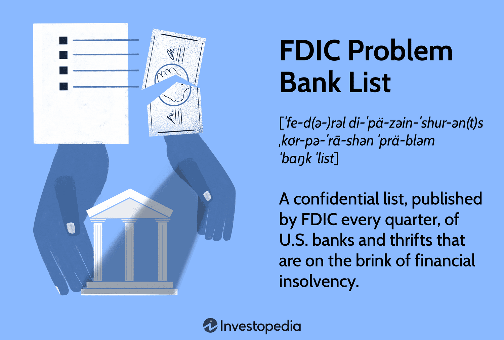

The world of banking is a multifaceted system where financial stability is paramount, and regulatory frameworks such as those provided by the Federal Deposit Insurance Corporation (FDIC) are essential for ensuring this stability. Established to instill public confidence in the financial system, the FDIC plays a crucial role in overseeing banking institutions and safeguarding the interests of depositors. A vital component of this regulatory structure is the FDIC Problem Bank List, which serves as an indicator of financial distress within banks. Understanding this list is crucial for recognizing the underlying issues that may affect the stability of banking institutions.

The FDIC Problem Bank List primarily involves banks that demonstrate a heightened risk of failure due to various operational, financial, or structural weaknesses. Banks are evaluated based on the CAMELS rating system, which assesses Capital adequacy, Asset quality, Management quality, Earnings, Liquidity, and Sensitivity to market risk. Inclusion on this list signifies that a bank requires close monitoring and, potentially, regulatory intervention to mitigate risks that could affect the bank's solvency and the wider financial system.

As the banking sector evolves, algorithmic trading emerges as a formidable force, introducing new challenges and opportunities, particularly for banks identified as 'problem banks'. Algorithmic trading, characterized by the use of computer programs to execute trades at high speed, offers increased efficiency and the reduction of human error. However, it also brings a unique set of regulatory challenges. For banks that are already struggling, the complexities introduced by algorithmic trading can amplify existing risks unless properly managed.

This article aims to explore the interconnectedness of FDIC regulations, including the Problem Bank List, with the burgeoning domain of algorithmic trading. By examining this relationship, the article will address how banks can navigate the dual pressures of regulatory compliance and technological advances, offering insights into potential policy adaptations that harmonize innovation with stability.

## Table of Contents

## Understanding the FDIC and its Role

The Federal Deposit Insurance Corporation (FDIC) was created in 1933 in response to widespread bank failures that disrupted public confidence in the financial system. The core mission of the FDIC is to promote stability and public confidence by insuring deposits, examining and supervising financial institutions for safety and soundness, and managing receiverships. The FDIC's insurance coverage protects depositors by guaranteeing deposits up to the legal limit, currently set at $250,000 per depositor per insured bank. This insurance mitigates the risk of losing one's savings in the event of a bank failure.

Structurally, the FDIC operates independently within the federal government, with governance provided by a Board of Directors. These directors are appointed by the President of the United States and confirmed by the Senate. The FDIC's funding does not rely on federal appropriations; instead, its revenue is primarily derived from premiums paid by banks and savings institutions for deposit insurance coverage and income from investments in U.S. government securities.

The FDIC's oversight role in the banking industry is crucial. It conducts regular examinations of banks, assessing their financial health and adherence to regulatory standards. The FDIC collaborates with other federal and state agencies to implement its supervisory mandate effectively, and it regulates more than 5,000 banks and savings institutions in the United States.

A significant component of the FDIC’s oversight is the Problem Bank List, a confidential document identifying banks with significant financial, managerial, operational, or compliance weaknesses. Banks on this list have a high probability of failing if corrective measures are not implemented. The inclusion on the Problem Bank List is based on the CAMELS rating system, which evaluates institutions on Capital adequacy, Asset quality, Management quality, Earnings, Liquidity, and Sensitivity to market risk. Institutions are scored from 1 to 5, with scores of 4 or 5 indicating problem status. Though the list itself remains confidential, the number of banks and trend data are publicly disclosed, reflecting the industry's health.

The FDIC’s regulatory measures significantly impact both banks and depositors. Banks subjected to increased scrutiny may face restrictions in their operations, effecting their growth strategies and market operations. For depositors, the FDIC ensures a basic level of security for their funds, fostering trust in keeping money within the banking system rather than outside regulated channels. Historical data indicate that an increase in the number of problem banks often precedes economic downturns, making the Problem Bank List a significant, though indirect, economic indicator.

Overall, through a combination of deposit insurance, supervision, and the management of troubled institutions, the FDIC plays a vital role in supporting the integrity and stability of the United States banking system.

## FDIC Problem Bank List: Criteria and Implications

The FDIC Problem Bank List is an essential tool for identifying financial instability within the banking sector. At the core of determining which banks are classified as "problem banks" is the CAMELS rating system. CAMELS is an acronym for Capital adequacy, Asset quality, Management quality, Earnings, Liquidity, and Sensitivity to market risk. These components are used by federal banking regulators to evaluate the health and soundness of financial institutions. Each bank is assigned a rating between 1 and 5 for each component, with 1 indicating the strongest performance and 5 the weakest. A composite CAMELS score of 4 or 5 typically results in a bank being placed on the Problem Bank List, signaling significant concern regarding its financial health.

The Problem Bank List is confidential, a measure designed to prevent further destabilization of banks already facing difficulties. This confidentiality protects banks from potential runs by depositors or loss of confidence among investors, which could exacerbate their precarious situations. However, this secrecy can have wider economic implications. While it shields individual banks, it also limits transparency in the financial system, potentially hindering market participants' ability to assess systemic risk accurately. Consequently, stakeholders must rely on aggregate data and public disclosures for insights into the banking sector's health.

Historically, trends in the number of banks on the Problem Bank List have correlated with economic downturns. For example, during the savings and loan crisis of the 1980s, the list expanded significantly, reflecting widespread instability within the sector. Similarly, the 2007-2008 financial crisis saw a substantial increase in the number of problem banks, highlighting the systemic risks associated with economic crises. These historical patterns underscore the importance of the Problem Bank List as an indicator of financial distress and its potential utility in forecasting broader economic challenges.

Understanding the criteria and implications of the FDIC Problem Bank List is crucial for stakeholders who must navigate the complexities of the banking system. As economic conditions fluctuate, the list serves as a barometer for potential instability, helping regulators and market participants alike to strategize and mitigate financial risks effectively.

## Algorithmic Trading and Modern Banking Challenges

Algorithmic trading, often referred to as algo trading, employs computer algorithms to execute a large number of orders in financial markets at speeds far surpassing human capability. These algorithms are programmed to follow a set of parameters—such as timing, price, or quantity—based on complex mathematical models. One of the fundamental advantages of [algorithmic trading](/wiki/algorithmic-trading) for banks is its ability to increase efficiency. By automating the trading process, banks can execute transactions faster and at a lower cost compared to traditional trading methods. This speed and efficiency also lead to improved market [liquidity](/wiki/liquidity-risk-premium).

Additionally, algorithmic trading minimizes human error, which can often lead to costly mistakes in the high-stakes environment of financial trading. The elimination of emotional biases through the use of algorithms ensures that trading decisions are purely data-driven, allowing for more consistent performance and risk management.

Despite these advantages, algorithmic trading introduces a series of regulatory challenges, especially for banks identified on the FDIC Problem Bank List. These banks, already under heightened scrutiny due to existing financial instability, face additional hurdles in implementing sophisticated trading technologies. The complexity of algorithms can obscure the traceability of trades, complicating audits and risk assessments. This opacity poses a risk of non-compliance with existing regulations if not managed properly.

Regulators, including the FDIC, are concerned that the proliferation of algorithmic trading might exacerbate systemic risks in the banking sector. These concerns stem from instances where algorithmic trading has significantly impacted market dynamics. For example, during the "Flash Crash" on May 6, 2010, the Dow Jones Industrial Average experienced a dramatic drop within minutes, attributed partly to high-frequency trading algorithms. Such events have prompted regulatory agencies to reconsider and adapt existing rules to address the unique challenges posed by algorithmic trading. Regulatory measures have since included requirements for better risk management protocols, improved transparency, and the implementation of circuit breakers to halt trading during extreme [volatility](/wiki/volatility-trading-strategies).

In conclusion, while algorithmic trading offers substantial benefits in terms of efficiency and reduced error, it necessitates rigorous regulatory oversight to prevent potential financial disruptions, particularly for banks that are already classified as problematic. Balancing these demands remains a critical focus area for regulators and financial institutions alike.

## The Intersection of FDIC Regulation and Algorithmic Trading

The integration of algorithmic trading into the financial operations of banks presents a unique set of challenges and opportunities, particularly under the oversight of the Federal Deposit Insurance Corporation (FDIC). The FDIC, tasked with ensuring the stability and integrity of financial institutions, plays a critical role in regulating banks that engage in these advanced trading strategies.

FDIC regulation affects banks involved in algorithmic trading by imposing stringent requirements to safeguard the financial system's stability. These requirements may include maintaining adequate capital reserves, ensuring effective risk management practices, and adhering to transparency standards. Banks must carefully navigate these regulations to mitigate risks associated with high-frequency and automated trading activities.

One of the primary challenges for banks is balancing the need to comply with FDIC standards while adopting new trading technologies. Algorithmic trading offers considerable advantages, such as increased transaction speed, improved market access, and reduced human error. However, these benefits come with increased systemic risk, particularly if algorithms execute erroneous trades or exacerbate market fluctuations. As such, banks face dual pressures: maintaining compliance with established regulatory frameworks and leveraging innovative trading systems to remain competitive.

The adoption of algorithmic trading necessitates potential policy adaptations to accommodate the technology's realities within the existing regulatory framework. Traditional regulations may not adequately address the unique aspects and risks posed by algorithmic trading, requiring regulatory bodies, including the FDIC, to consider new approaches. For example, the introduction of real-time monitoring systems could help detect and mitigate anomalous trading patterns quickly. Furthermore, establishing clear guidelines on algorithm development, testing, and implementation may help prevent market disruptions caused by faulty or inadequately tested algorithms.

To facilitate these adaptations, a collaborative approach involving regulators, financial institutions, and technology developers is crucial. By fostering open communication, stakeholders can identify best practices and develop comprehensive strategies that align technological developments with regulatory objectives. Ultimately, these adaptive measures aim to create a regulatory environment that supports both innovation in algorithmic trading and the safeguarding of the financial ecosystem, thus ensuring that banks can thrive while maintaining stability and public confidence.

## Case Studies of Problem Banks and Algo Trading

Analyzing the implications of algorithmic trading in banks on the FDIC Problem Bank List requires examining specific cases where these financial institutions have adopted advanced trading technologies. While the FDIC Problem Bank List itself is confidential, historical instances can provide insights into the challenges and opportunities faced by banks using algorithmic trading practices.

One of the most notable cases involved a mid-sized bank that became reliant on algorithmic trading to compensate for its traditional revenue streams, which were under pressure due to economic downturns. This bank, after several strategic missteps, was added to the Problem Bank List, highlighting its declining financial health. Despite its classification, the bank continued to pursue algorithmic trading strategies to stabilize its revenues. However, the results were mixed. The bank experienced short-term gains in trading profits, but the lack of robustness in its risk management system led to significant volatility in earnings.

The FDIC's role in this scenario was critical. Upon closely monitoring the bank, the FDIC facilitated regular audits and enforced stricter compliance requirements to ensure that the bank's algorithmic trading activities did not exacerbate its financial instability. The interventions were necessary to mitigate systemic risk and protect depositor funds, underscoring the FDIC's mandate to maintain public confidence in the financial system.

There have been industries where banks on the Problem Bank List utilized complex algorithmic trading models to hedge against traditional banking risks. These models often rely on market prediction algorithms and real-time data processing. However, incorrect model assumptions and inadequate testing led to significant financial losses. As a lesson from these experiences, it became evident that robust computational models, combined with comprehensive regulatory oversight, are paramount in ensuring that algorithmic trading does not become a liability for financially troubled banks.

A successful example of regulatory management is when the FDIC coordinated with federal and state authorities to provide a troubled bank with a framework to modify its trading algorithms. This framework included stress testing under various market conditions and incorporating compliance checks directly into the algorithmic trading systems. This initiative not only helped stabilize the bank in question but also served as a template for other institutions seeking to balance regulatory obligations with technological advancements.

In conclusion, the intersection of the FDIC's oversight and algorithmic trading activities within problem banks is a delicate balancing act. The FDIC plays a pivotal role in ensuring that while banks innovate and adapt in sophisticated trading arenas, they do not compromise on safety and soundness principles that could jeopardize the broader financial ecosystem. These case studies provide valuable insights into potential pitfalls and the necessity for ongoing cooperation between financial institutions and regulators.

## Future Perspectives

The future of banking regulation promises to be shaped significantly by the rapid advancements in technology, particularly with the integration of algorithmic trading. As financial systems become ever more complex, regulators like the FDIC must evolve in response to new challenges and opportunities.

**Banking Regulation Amid Technological Advancement**

As technology evolves, so does the need for regulatory frameworks that can accommodate these changes without stifling innovation. The digital transformation in banking, characterized by the rise of fintech, blockchain, and [artificial intelligence](/wiki/ai-artificial-intelligence), has already begun to recalibrate the sector's landscape. In this context, traditional regulatory processes must adapt to oversee increasingly automated and opaque financial transactions, essential for maintaining stability and public trust. Innovations such as digital currencies and decentralized finance platforms present unique challenges, and regulators may need to consider new risk assessment models and compliance strategies.

**Potential Reforms in FDIC Processes**

The current practices of the FDIC, while robust in addressing the needs of traditional banking systems, might require adjustments to better handle the dynamic nature of algorithmic trading. Reforms could include:

1. **Enhanced Monitoring Capabilities**: Developing sophisticated monitoring tools that leverage machine learning to identify irregular trading patterns could enhance the FDIC's ability to preemptively identify potential risks associated with algorithmic trading.

2. **Dynamic Stress Testing**: Moving beyond static stress tests, the FDIC could implement dynamic models that simulate a variety of scenarios involving algorithm-driven transactions, offering a more comprehensive view of potential vulnerabilities.

3. **Increased Transparency Requirements**: Ensuring transparency in algorithm design and implementation could be necessary, potentially requiring banks to disclose details about their algorithmic strategies and controls to regulators.

**Opportunities for Innovation**

Despite the heightened regulatory scrutiny, there are substantial opportunities for innovation within the banking sector. Regulators and banks can work collaboratively to harness the potential of new technologies while ensuring systemic safety. Innovations could include:

1. **Regulatory Sandboxes**: Establishing environments where novel financial instruments and models can be tested under regulator supervision, allowing for experimentation while managing risk.

2. **Collaboration with Tech Firms**: By partnering with technology companies, banks can integrate cutting-edge solutions that enhance efficiency and provide better services to consumers, all under the watchful eye of updated regulatory oversight.

3. **Advancements in Risk Management**: Utilizing big data and AI, banks can develop more sophisticated risk management strategies that preemptively address potential systemic threats while improving operational efficiency.

In conclusion, the future landscape of banking regulation in the face of technological advancements necessitates an agile and forward-thinking approach. The FDIC's role will be crucial in steering these innovations towards a more resilient and transparent financial system, capable of balancing innovation with robust oversight.

## Conclusion

The integration of FDIC regulations, problem banks, and algorithmic trading represents a complex interplay of financial oversight and innovation. FDIC regulations have historically provided critical stability to the banking system, acting as a safeguard for depositors and curbing financial instability. This stability is particularly crucial for banks on the Problem Bank List, which are subject to closer scrutiny and more stringent operational requirements due to identified weaknesses. The presence of these banks on the list highlights potential risks within the financial system and the necessity for regulatory prudence.

Algorithmic trading introduces additional layers of complexity and opportunity for banks, including those labeled as problem banks. On one hand, the automation and efficiency offered by algorithmic trading can help banks optimize operations, reduce costs, and potentially generate higher profits. On the other hand, the rapid decision-making processes enabled by algorithms can lead to significant market disruptions if not adequately regulated. The flash crash of 2010 serves as a pertinent example, where the high-speed interplay of algorithmic trades led to a sudden market drop, raising questions about the adequacy of existing regulations to cope with technological advancements.

The importance of adaptable regulatory frameworks cannot be overstated in this context. As algorithmic trading becomes an integral part of the financial ecosystem, regulatory bodies like the FDIC must evolve to accommodate these technological innovations without compromising the system's stability. This includes developing comprehensive regulations that balance the benefits of technological advancements with the need for financial security.

Looking ahead, the future of banking will depend on the ability of regulatory authorities to harmonize technology and regulation effectively. An adaptive regulatory approach will be critical, one that anticipates technological trends and incorporates dynamic policies that not only protect the financial system but also encourage innovation. Through collaboration between regulators, financial institutions, and technology developers, it is possible to foster a banking environment that leverages cutting-edge technology while maintaining robust protective measures. Ensuring this balance will be key to promoting a secure yet progressive banking landscape in the years to come.

## References & Further Reading

[1]: Eisenbeis, R. A., & Horvitz, P. M. (1994). ["The Role of Forbearance and its Costs in Handling Troubled Banks."](https://link.springer.com/chapter/10.1007/978-94-011-1404-2_4) Federal Reserve Bank of Atlanta Economic Review.

[2]: Lopez de Prado, M. (2018). ["Advances in Financial Machine Learning."](https://www.amazon.com/Advances-Financial-Machine-Learning-Marcos/dp/1119482089) John Wiley & Sons.

[3]: Akerlof, G. A., & Romer, P. M. (1993). ["Looting: The Economic Underworld of Bankruptcy for Profit."](https://www.brookings.edu/wp-content/uploads/1993/06/1993b_bpea_akerlof_romer_hall_mankiw.pdf) Brookings Papers on Economic Activity.

[4]: FDIC (2017). ["Crisis and Response: An FDIC History, 2008–2013."](https://www.fdic.gov/resources/publications/crisis-response/book/crisis-response.pdf) Federal Deposit Insurance Corporation.

[5]: Aldridge, I. (2013). ["High-Frequency Trading: A Practical Guide to Algorithmic Strategies and Trading Systems,"](https://www.amazon.com/High-Frequency-Trading-Practical-Algorithmic-Strategies/dp/1118343506) 2nd Edition. John Wiley & Sons.

[6]: Barth, J. R., Prabha, A., & Swagel, P. (2012). ["Just How Bad Was the Crisis?"](https://papers.ssrn.com/sol3/papers.cfm?abstract_id=2029131) The Milken Institute Review.