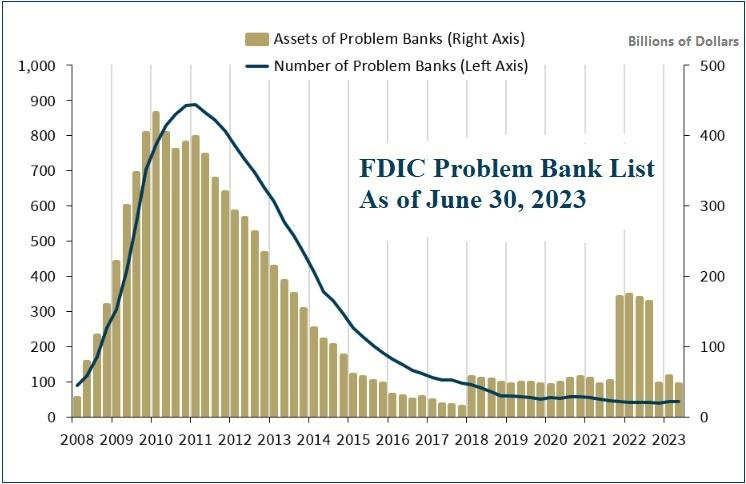

## Table of Contents

## What is the FDIC?

The FDIC, or Federal Deposit Insurance Corporation, is a government agency in the United States. It protects your money in banks. If a bank fails, the FDIC makes sure you get your money back, up to $250,000 per account. This helps people feel safe about keeping their money in banks.

The FDIC was created in 1933 during the Great Depression. Many banks were failing back then, and people were losing their savings. The government started the FDIC to stop this from happening again. Today, almost all banks in the U.S. are covered by the FDIC, so your money is safe.

## What is the FDIC Problem Bank List?

The FDIC Problem Bank List is a secret list that the FDIC keeps. It has the names of banks that are having big money problems. The FDIC watches these banks closely to make sure they don't fail and cause trouble for people who have money in them.

The list is not shared with the public because it could make people worried and take their money out of the banks. If too many people do this, it could make the bank's problems even worse. The FDIC works hard to fix the problems at these banks so that they can get better and stay open.

## How often is the FDIC Problem Bank List updated?

The FDIC updates the Problem Bank List every quarter. This means they check and change the list four times a year. They do this to keep track of which banks are having money problems and need more help.

The list is kept secret to avoid scaring people. If people knew which banks were on the list, they might take their money out of those banks. This could make the banks' problems even worse. So, the FDIC works quietly to help these banks get better without causing panic.

## Why is the FDIC Problem Bank List important for depositors?

The FDIC Problem Bank List is important for depositors because it helps the FDIC keep an eye on banks that are struggling. If a bank is on this list, it means the FDIC is watching it closely to make sure it doesn't fail. This is good for depositors because it means the FDIC is working to protect their money.

Even though depositors don't know which banks are on the list, they can feel safer knowing that the FDIC is always working to fix problems at banks. This helps prevent bank failures, which could cause people to lose their savings. So, while depositors don't see the list, it plays a big role in keeping their money safe.

## How does a bank end up on the FDIC Problem Bank List?

A bank ends up on the FDIC Problem Bank List when it starts having big money problems. This can happen if the bank makes bad loans that people can't pay back, or if it doesn't have enough money to cover what people want to take out. The FDIC looks at how well the bank is doing and decides if it needs to be watched more closely. If the bank's problems are serious, the FDIC puts it on the list.

Being on the list doesn't mean the bank will fail right away. It means the FDIC will work with the bank to fix its problems. The FDIC might tell the bank to get more money, stop making risky loans, or do other things to get better. The goal is to help the bank get off the list and become healthy again, so depositors' money stays safe.

## What criteria does the FDIC use to identify problem banks?

The FDIC uses several things to figure out if a bank should be on the Problem Bank List. They look at how much money the bank has and how much it owes. They also check if the bank is making too many risky loans that might not get paid back. If a bank doesn't have enough money to cover what people want to take out, or if it's losing money, the FDIC might put it on the list.

The FDIC also looks at how well the bank is being run. If the people in charge are not doing a good job, or if the bank is breaking rules, it could end up on the list. The FDIC wants to make sure that banks are safe and that people's money is protected. By watching these things closely, the FDIC can help banks fix their problems before they get too bad.

## What happens to banks on the FDIC Problem Bank List?

When a bank ends up on the FDIC Problem Bank List, it means the FDIC will watch it very closely. The FDIC will work with the bank to fix its money problems. They might tell the bank to get more money, stop making risky loans, or do other things to get better. The goal is to help the bank get off the list and become healthy again, so depositors' money stays safe.

If a bank on the list doesn't get better, the FDIC might have to take over the bank. This is called "resolving" the bank. The FDIC will make sure that depositors get their money back, up to $250,000 per account. They might also sell the bank to another, healthier bank. This way, the bank's problems don't hurt the people who have money in it.

## Can a bank recover from being on the FDIC Problem Bank List?

Yes, a bank can recover from being on the FDIC Problem Bank List. When a bank is on the list, the FDIC works closely with it to fix its problems. The FDIC might tell the bank to get more money, stop making risky loans, or do other things to get better. The goal is to help the bank become healthy again so it can get off the list.

Many banks do recover and get off the list. It takes hard work and following the FDIC's advice. If a bank does everything right, it can fix its money problems and go back to being a safe place for people to keep their money. This is good for everyone because it means the bank can keep serving its customers without causing worry.

## How does the FDIC Problem Bank List impact the financial system?

The FDIC Problem Bank List helps keep the financial system stable. When banks have big money problems, it can scare people and make them take their money out of banks. This can make the problems even worse and might cause other banks to have trouble too. By watching these problem banks closely, the FDIC can help fix their issues before they get too bad. This stops panic from spreading and keeps the whole financial system from falling apart.

The list also shows that the FDIC is always working to protect people's money. Even though the list is secret, knowing that the FDIC is looking out for problem banks makes people feel safer about keeping their money in banks. This trust is important for the financial system because it helps keep money flowing smoothly. When people trust banks, they are more likely to save and invest, which helps the economy grow.

## What historical trends can be observed from the FDIC Problem Bank List?

Over the years, the FDIC Problem Bank List has shown that more banks get into trouble during tough economic times. For example, during the Great Recession in 2008, the number of banks on the list went up a lot. This happened because many people and businesses couldn't pay back their loans, which made banks lose money. When the economy gets better, the number of banks on the list usually goes down. This shows that the health of banks is closely tied to how well the economy is doing.

Another trend we can see is that the FDIC has gotten better at helping banks fix their problems. In the past, more banks failed because they couldn't get off the list in time. But now, the FDIC works more closely with banks to help them recover. They give advice and make sure banks follow rules to get better. This has led to fewer bank failures over time, which is good for the whole financial system.

## How does the FDIC Problem Bank List compare to similar lists in other countries?

The FDIC Problem Bank List is like lists that other countries use to watch banks that are having money problems. In the United Kingdom, the Prudential Regulation Authority (PRA) keeps a list of banks that need extra watching. Just like the FDIC, the PRA works to help these banks get better and stay open. In Canada, the Office of the Superintendent of Financial Institutions (OSFI) also keeps an eye on banks that are struggling. They use a system called the "Watchlist" to make sure these banks don't fail and cause trouble for people who have money in them.

These lists in different countries all have the same goal: to keep the financial system safe and protect people's money. They are usually kept secret to avoid scaring people and causing them to take their money out of banks. This could make the banks' problems even worse. By watching these problem banks closely, the agencies in each country can help fix their issues before they get too bad. This helps stop panic from spreading and keeps the whole financial system from falling apart.

## What are the limitations and criticisms of the FDIC Problem Bank List?

The FDIC Problem Bank List has some problems. One big issue is that it's secret. People don't know which banks are on the list, so they can't make choices about where to keep their money based on this information. Some people think this secrecy is not fair because it might hide how bad a bank's problems are. Another problem is that the list only looks at certain things, like how much money a bank has and how well it's being run. It might miss other signs that a bank is in trouble, like changes in the economy or new risks that come up.

Critics also say that the FDIC might not put a bank on the list soon enough. If a bank's problems are not caught early, it could get worse and be harder to fix. This delay can make it tougher to protect people's money. Some people think the FDIC should be quicker to spot problems and add banks to the list. But, it's hard for the FDIC to balance watching banks closely and not scaring people by putting too many banks on the list. They have to be careful to keep trust in the financial system strong.

## References & Further Reading

[1]: Eisenbeis, R. A., & Horvitz, P. M. (1994). ["The Role of Forbearance and its Costs in Handling Troubled Banks."](https://link.springer.com/chapter/10.1007/978-94-011-1404-2_4) Federal Reserve Bank of Atlanta Economic Review.

[2]: Lopez de Prado, M. (2018). ["Advances in Financial Machine Learning."](https://www.amazon.com/Advances-Financial-Machine-Learning-Marcos/dp/1119482089) John Wiley & Sons.

[3]: Akerlof, G. A., & Romer, P. M. (1993). ["Looting: The Economic Underworld of Bankruptcy for Profit."](https://www.brookings.edu/wp-content/uploads/1993/06/1993b_bpea_akerlof_romer_hall_mankiw.pdf) Brookings Papers on Economic Activity.

[4]: FDIC (2017). ["Crisis and Response: An FDIC History, 2008–2013."](https://www.fdic.gov/resources/publications/crisis-response/book/crisis-response.pdf) Federal Deposit Insurance Corporation.

[5]: Aldridge, I. (2013). ["High-Frequency Trading: A Practical Guide to Algorithmic Strategies and Trading Systems,"](https://www.amazon.com/High-Frequency-Trading-Practical-Algorithmic-Strategies/dp/1118343506) 2nd Edition. John Wiley & Sons.

[6]: Barth, J. R., Prabha, A., & Swagel, P. (2012). ["Just How Bad Was the Crisis?"](https://papers.ssrn.com/sol3/papers.cfm?abstract_id=2029131) The Milken Institute Review.